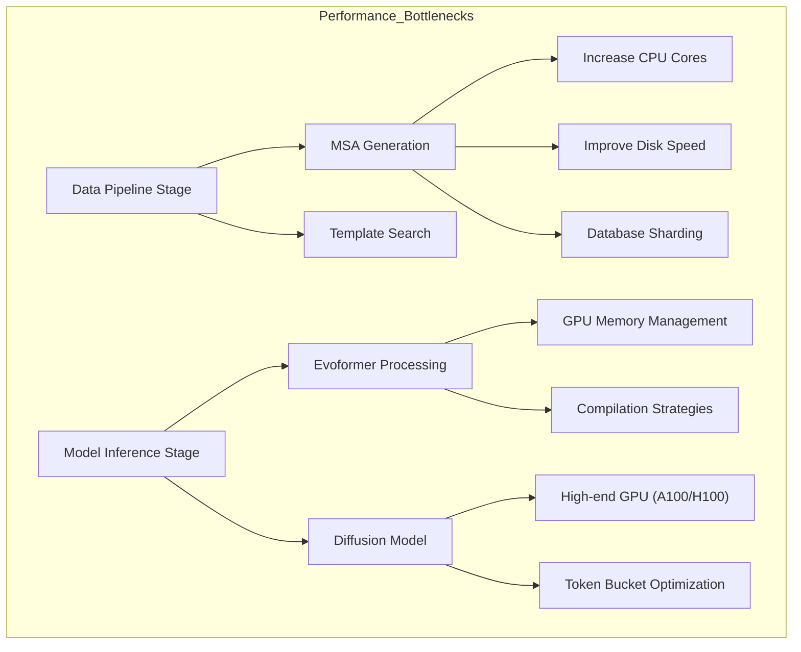
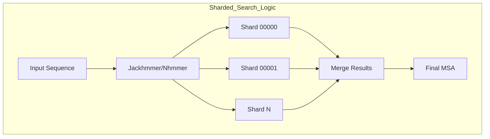
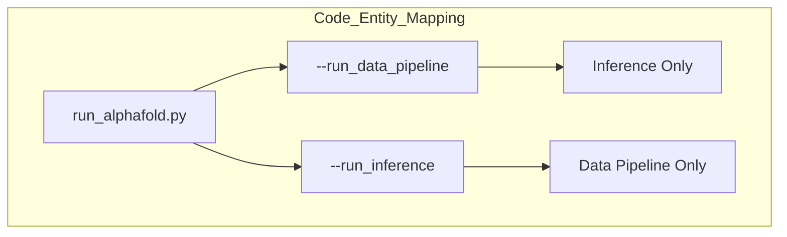

# Performance Optimization

> **Relevant source files**
> * [docs/known_issues.md](https://github.com/google-deepmind/alphafold3/blob/97639fff/docs/known_issues.md?plain=1)
> * [docs/performance.md](https://github.com/google-deepmind/alphafold3/blob/97639fff/docs/performance.md?plain=1)

This page focuses on performance considerations and optimization strategies for running AlphaFold 3. It covers hardware requirements, memory optimization, execution speed improvements, and configuration techniques to maximize throughput and efficiency.

For information about installation procedures, see [Installation Guide](/google-deepmind/alphafold3/2-installation-guide).

## Overview of Performance Considerations

AlphaFold 3 has distinct performance profiles for its two main computational phases:

1. **Data Pipeline** - CPU-intensive operations for Multiple Sequence Alignment (MSA) generation and template searching.
2. **Model Inference** - GPU-intensive structure prediction using the neural network and diffusion sampling.

### Performance Bottlenecks and Optimizations

Title: Performance Bottlenecks and Optimizations



Sources: [docs/performance.md L5-L17](https://github.com/google-deepmind/alphafold3/blob/97639fff/docs/performance.md?plain=1#L5-L17)

 [docs/performance.md L72-L83](https://github.com/google-deepmind/alphafold3/blob/97639fff/docs/performance.md?plain=1#L72-L83)

## Hardware Configuration

AlphaFold 3 is officially tested and optimized for high-end NVIDIA GPUs. Hardware choices significantly impact the maximum sequence length (tokens) that can be folded and the total runtime.

For details, see [Hardware Configuration](/google-deepmind/alphafold3/8.1-hardware-configuration).

| GPU Model | Memory | Max Tokens | Notes |
| --- | --- | --- | --- |
| NVIDIA A100 | 80 GB | 5,120 | Baseline performance |
| NVIDIA H100 | 80 GB | 5,120 | ~2x faster than A100 |
| NVIDIA A100 | 40 GB | 4,352 | Requires unified memory |
| NVIDIA V100 | 32 GB | 1,280 | Requires XLA flags modification |

### GPU-Specific Considerations

For CUDA Capability 7.x GPUs (such as NVIDIA V100), you must add specific XLA flags to prevent numerical issues:

```
XLA_FLAGS="--xla_disable_hlo_passes=custom-kernel-fusion-rewriter"
```

This flag is essential as these GPUs produce incorrect outputs without it, characterized by clashing residues and very low ranking scores (often -99 or lower). [docs/known_issues.md L3-L8](https://github.com/google-deepmind/alphafold3/blob/97639fff/docs/known_issues.md?plain=1#L3-L8)

Sources: [docs/known_issues.md L3-L8](https://github.com/google-deepmind/alphafold3/blob/97639fff/docs/known_issues.md?plain=1#L3-L8)

 [docs/performance.md L1044-L1049](https://github.com/google-deepmind/alphafold3/blob/97639fff/docs/performance.md?plain=1#L1044-L1049)

## Memory Management

AlphaFold 3 requires significant GPU memory for large biomolecular structures. Memory strategies vary depending on whether you are prioritizing speed (preallocation) or capacity (unified memory).

For details, see [Memory Management](/google-deepmind/alphafold3/8.2-memory-management).

### Unified Memory for Larger Inputs

To run structures exceeding 5,120 tokens or to use GPUs with less memory (e.g., A100 40GB), you can enable unified memory to spill from GPU VRAM to host RAM:

```markdown
XLA_PYTHON_CLIENT_PREALLOCATE=falseTF_FORCE_UNIFIED_MEMORY=trueXLA_CLIENT_MEM_FRACTION=4.0  # Adjust based on system RAM
```

Sources: [docs/performance.md L1120-L1138](https://github.com/google-deepmind/alphafold3/blob/97639fff/docs/performance.md?plain=1#L1120-L1138)

## Compilation and Execution

Optimization at the software level involves reducing JAX compilation overhead and maximizing CPU utilization during the data pipeline.

For details, see [Compilation and Execution](/google-deepmind/alphafold3/8.3-compilation-and-execution).

### Database Sharding

The runtime of genetic sequence searches (`Jackhmmer`/`Nhmmer`) can be reduced by 10–30× by sharding databases. This allows the system to utilize many CPU cores in parallel. This technique is also used by the AlphaFold Server to improve throughput. [docs/known_issues.md L23-L27](https://github.com/google-deepmind/alphafold3/blob/97639fff/docs/known_issues.md?plain=1#L23-L27)

Title: Sharded Search Logic



To use sharded databases, provide the file spec (e.g., `uniprot.fasta@3`) and the corresponding Z-values to scale E-values correctly. [docs/performance.md L103-L125](https://github.com/google-deepmind/alphafold3/blob/97639fff/docs/performance.md?plain=1#L103-L125)

Sources: [docs/performance.md L85-L125](https://github.com/google-deepmind/alphafold3/blob/97639fff/docs/performance.md?plain=1#L85-L125)

 [docs/known_issues.md L51-L58](https://github.com/google-deepmind/alphafold3/blob/97639fff/docs/known_issues.md?plain=1#L51-L58)

### Compilation Buckets

AlphaFold 3 uses compilation buckets to minimize JAX recompilation. The system pads inputs to the nearest bucket size. Default buckets range from 256 to 5120 tokens. [docs/performance.md L1053-L1065](https://github.com/google-deepmind/alphafold3/blob/97639fff/docs/performance.md?plain=1#L1053-L1065)

```markdown
# Bucket logic in run_alphafold.pybuckets = [256, 512, 768, 1024, 1280, 1536, 2048, 2560, 3072, 3584, 4096, 4608, 5120]
```

Sources: [docs/performance.md L1053-L1083](https://github.com/google-deepmind/alphafold3/blob/97639fff/docs/performance.md?plain=1#L1053-L1083)

## Pipeline Stage Optimization

The `run_alphafold.py` script can be executed in stages to optimize resource utilization. This is particularly useful for splitting CPU-only tasks from GPU tasks. [docs/performance.md L5-L9](https://github.com/google-deepmind/alphafold3/blob/97639fff/docs/performance.md?plain=1#L5-L9)

### Staged Execution Strategies

1. **Data Pipeline Only**: Launch with `--run_inference=false`. This generates MSAs and templates, saving them into a JSON file. This can be done on CPU-only clusters. [docs/performance.md L21-L25](https://github.com/google-deepmind/alphafold3/blob/97639fff/docs/performance.md?plain=1#L21-L25)
2. **Inference Only**: Launch with `--run_data_pipeline=false`. This uses the pre-computed MSAs/templates from the input JSON. [docs/performance.md L65-L69](https://github.com/google-deepmind/alphafold3/blob/97639fff/docs/performance.md?plain=1#L65-L69)
3. **Pre-computing Fixed Chains**: For screens where one chain is constant and others change, compute the fixed chain's MSA once and reuse it in multimer JSONs to avoid redundant searches. [docs/performance.md L27-L44](https://github.com/google-deepmind/alphafold3/blob/97639fff/docs/performance.md?plain=1#L27-L44)

Title: Code Entity Mapping for Staged Execution



Sources: [docs/performance.md L5-L25](https://github.com/google-deepmind/alphafold3/blob/97639fff/docs/performance.md?plain=1#L5-L25)

 [docs/performance.md L63-L69](https://github.com/google-deepmind/alphafold3/blob/97639fff/docs/performance.md?plain=1#L63-L69)

## Summary of Optimization Flags

| Flag | Purpose | Source |
| --- | --- | --- |
| `--run_inference=false` | Run only MSA/Template search (CPU) | [docs/performance.md L21](https://github.com/google-deepmind/alphafold3/blob/97639fff/docs/performance.md?plain=1#L21-L21) |
| `--run_data_pipeline=false` | Run only Model Inference (GPU) | [docs/performance.md L65](https://github.com/google-deepmind/alphafold3/blob/97639fff/docs/performance.md?plain=1#L65-L65) |
| `--jackhmmer_max_parallel_shards` | Parallelize search across DB shards | [docs/performance.md L145](https://github.com/google-deepmind/alphafold3/blob/97639fff/docs/performance.md?plain=1#L145-L145) |
| `--jax_compilation_cache_dir` | Persist compiled kernels to disk | [docs/performance.md L1139](https://github.com/google-deepmind/alphafold3/blob/97639fff/docs/performance.md?plain=1#L1139-L1139) |
| `--flash_attention_implementation` | Choose between `triton`, `cudnn`, or `xla` | [docs/performance.md L1151](https://github.com/google-deepmind/alphafold3/blob/97639fff/docs/performance.md?plain=1#L1151-L1151) |

Sources: [docs/performance.md L21-L145](https://github.com/google-deepmind/alphafold3/blob/97639fff/docs/performance.md?plain=1#L21-L145)

 [docs/performance.md L1139-L1151](https://github.com/google-deepmind/alphafold3/blob/97639fff/docs/performance.md?plain=1#L1139-L1151)