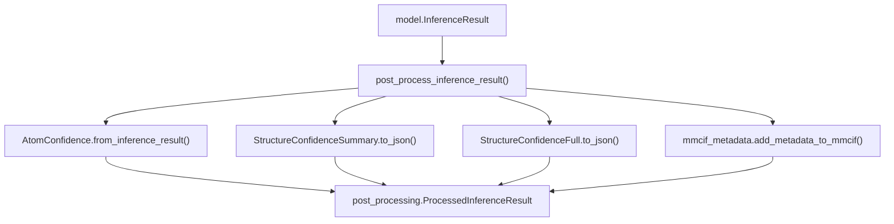
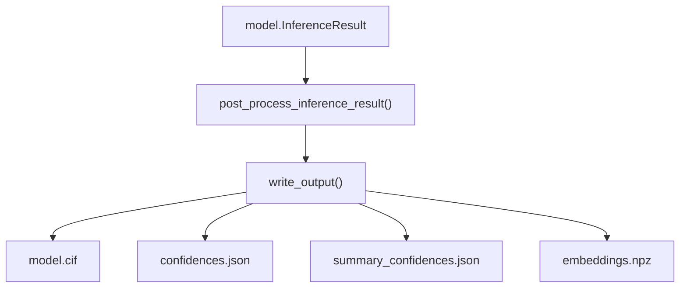

# Post-Processing

> **Relevant source files**
> * [src/alphafold3/data/templates.py](https://github.com/google-deepmind/alphafold3/blob/97639fff/src/alphafold3/data/templates.py)
> * [src/alphafold3/model/confidences.py](https://github.com/google-deepmind/alphafold3/blob/97639fff/src/alphafold3/model/confidences.py)
> * [src/alphafold3/model/mmcif_metadata.py](https://github.com/google-deepmind/alphafold3/blob/97639fff/src/alphafold3/model/mmcif_metadata.py)
> * [src/alphafold3/model/post_processing.py](https://github.com/google-deepmind/alphafold3/blob/97639fff/src/alphafold3/model/post_processing.py)
> * [src/alphafold3/model/scoring/scoring.py](https://github.com/google-deepmind/alphafold3/blob/97639fff/src/alphafold3/model/scoring/scoring.py)

Post-processing is the final stage of the AlphaFold 3 prediction pipeline that transforms raw model outputs into structured results. This stage extracts predicted structures from diffusion samples, computes confidence and quality metrics, ranks predictions across seeds and samples, and writes all outputs to disk in standardized formats.

For information about the preceding model inference stage, see [Model Inference](/google-deepmind/alphafold3/4.4-model-inference). For details about the output file formats, see [Output Format](/google-deepmind/alphafold3/3.3-output-format).

## Overview

Post-processing operates on the results produced by model inference for each seed and diffusion sample. The key responsibilities include:

1. **Result Extraction** - Converting raw model outputs into `InferenceResult` objects containing predicted structures, metadata, and optional embeddings.
2. **Confidence Calculation** - Computing confidence metrics like pTM, ipTM, PAE, and PDE that quantify prediction quality.
3. **Quality Assessment** - Detecting structural issues such as disorder and clashes.
4. **Ranking** - Calculating ranking scores to identify the best prediction across all seeds and samples.
5. **Output Writing** - Serializing results to mmCIF, JSON, and CSV files with appropriate organization.

Sources: [src/alphafold3/model/post_processing.py L11-L46](https://github.com/google-deepmind/alphafold3/blob/97639fff/src/alphafold3/model/post_processing.py#L11-L46)

 [src/alphafold3/model/confidences.py L11-L22](https://github.com/google-deepmind/alphafold3/blob/97639fff/src/alphafold3/model/confidences.py#L11-L22)

## Result Extraction Pipeline



**Figure 1: Result Extraction and Processing Flow**

The post-processing module converts raw `model.InferenceResult` objects into `ProcessedInferenceResult` containers ready for serialization.

**Structure Processing** - `post_process_inference_result` [src/alphafold3/model/post_processing.py L48-L87](https://github.com/google-deepmind/alphafold3/blob/97639fff/src/alphafold3/model/post_processing.py#L48-L87)

 performs the following:

* **Metadata Injection**: Calls `mmcif_metadata.add_metadata_to_mmcif` [src/alphafold3/model/mmcif_metadata.py L47-L185](https://github.com/google-deepmind/alphafold3/blob/97639fff/src/alphafold3/model/mmcif_metadata.py#L47-L185)  to append ModelCIF-conformant metadata, including paper citations, software versions, and global pLDDT.
* **Legal Comments**: Appends legal disclaimers and terms of use to the mmCIF string using `mmcif_metadata.add_legal_comment` [src/alphafold3/model/post_processing.py L60-L61](https://github.com/google-deepmind/alphafold3/blob/97639fff/src/alphafold3/model/post_processing.py#L60-L61)
* **Confidence Aggregation**: Extracts 1D atom confidences using `confidence_types.AtomConfidence.from_inference_result` and calculates the mean confidence [src/alphafold3/model/post_processing.py L62-L65](https://github.com/google-deepmind/alphafold3/blob/97639fff/src/alphafold3/model/post_processing.py#L62-L65)
* **JSON Serialization**: Generates two JSON payloads: a summary of confidences via `StructureConfidenceSummary` and a full confidence data object via `StructureConfidenceFull` [src/alphafold3/model/post_processing.py L66-L79](https://github.com/google-deepmind/alphafold3/blob/97639fff/src/alphafold3/model/post_processing.py#L66-L79)

Sources: [src/alphafold3/model/post_processing.py L26-L87](https://github.com/google-deepmind/alphafold3/blob/97639fff/src/alphafold3/model/post_processing.py#L26-L87)

 [src/alphafold3/model/mmcif_metadata.py L47-L185](https://github.com/google-deepmind/alphafold3/blob/97639fff/src/alphafold3/model/mmcif_metadata.py#L47-L185)

## Confidence Metrics

### Core Confidence Scores

AlphaFold 3 computes several complementary confidence metrics. The logic for these is primarily housed in `confidences.py`.

| Metric | Scope | Range | Implementation |
| --- | --- | --- | --- |
| **pTM** | Per-structure | [0, 1] | `predicted_tm_score` [src/alphafold3/model/confidences.py L570-L623](https://github.com/google-deepmind/alphafold3/blob/97639fff/src/alphafold3/model/confidences.py#L570-L623) |
| **ipTM** | Per-interface | [0, 1] | `predicted_tm_score(interface=True)` [src/alphafold3/model/confidences.py L570-L623](https://github.com/google-deepmind/alphafold3/blob/97639fff/src/alphafold3/model/confidences.py#L570-L623) |
| **PAE** | Per-token-pair | [0, 31.75] Å | `pae_metrics` [src/alphafold3/model/confidences.py L476-L552](https://github.com/google-deepmind/alphafold3/blob/97639fff/src/alphafold3/model/confidences.py#L476-L552) |
| **PDE** | Per-token-pair | [0, ∞) Å | `pde_metrics` [src/alphafold3/model/confidences.py L234-L288](https://github.com/google-deepmind/alphafold3/blob/97639fff/src/alphafold3/model/confidences.py#L234-L288) |

**Ranking Metric** - The `rank_metric` function [src/alphafold3/model/confidences.py L200-L228](https://github.com/google-deepmind/alphafold3/blob/97639fff/src/alphafold3/model/confidences.py#L200-L228)

 computes the primary scalar used to rank samples. It weights the Predicted Distance Error (PDE) by contact probabilities:
`ranking_metric = -sum(full_pde * contact_probs) / (sum(contact_probs) + epsilon)`.

Sources: [src/alphafold3/model/confidences.py L200-L228](https://github.com/google-deepmind/alphafold3/blob/97639fff/src/alphafold3/model/confidences.py#L200-L228)

 [src/alphafold3/model/confidences.py L570-L623](https://github.com/google-deepmind/alphafold3/blob/97639fff/src/alphafold3/model/confidences.py#L570-L623)

### Predicted Aligned Error (PAE) and PDE Aggregation

PAE and PDE are high-dimensional matrices (typically `[num_tokens, num_tokens]`) that are aggregated for interpretability:

* **Chain-Pair Aggregation**: `chain_pair_pae` [src/alphafold3/model/confidences.py L346-L411](https://github.com/google-deepmind/alphafold3/blob/97639fff/src/alphafold3/model/confidences.py#L346-L411)  and `chain_pair_pde` [src/alphafold3/model/confidences.py L290-L322](https://github.com/google-deepmind/alphafold3/blob/97639fff/src/alphafold3/model/confidences.py#L290-L322)  calculate the mean and minimum error values between all pairs of chains in the assembly.
* **1D Summaries**: `reduce_chain_pair` [src/alphafold3/model/confidences.py L413-L474](https://github.com/google-deepmind/alphafold3/blob/97639fff/src/alphafold3/model/confidences.py#L413-L474)  collapses the chain-pair matrices into 1D arrays (`ichain` for within-chain error, `xchain` for cross-chain error).

Sources: [src/alphafold3/model/confidences.py L290-L474](https://github.com/google-deepmind/alphafold3/blob/97639fff/src/alphafold3/model/confidences.py#L290-L474)

## Quality Assessment

### Disorder Detection (AlphaFold-RSA)

AlphaFold 3 uses the Relative Solvent Accessibility (RSA) of protein residues to predict disorder [src/alphafold3/model/confidences.py L53-L88](https://github.com/google-deepmind/alphafold3/blob/97639fff/src/alphafold3/model/confidences.py#L53-L88)

1. **DSSP Execution**: The `mkdssp` C++ wrapper is called via `mkdssp.get_dssp(cif, calculate_surface_accessibility=True)` [src/alphafold3/model/confidences.py L66](https://github.com/google-deepmind/alphafold3/blob/97639fff/src/alphafold3/model/confidences.py#L66-L66)
2. **Normalization**: Raw accessibility is divided by the `MAX_ACCESSIBLE_SURFACE_AREA` for the specific amino acid type [src/alphafold3/model/confidences.py L24-L45](https://github.com/google-deepmind/alphafold3/blob/97639fff/src/alphafold3/model/confidences.py#L24-L45)
3. **Smoothing**: A sliding window (default 25) averages the RASA values [src/alphafold3/model/confidences.py L84-L87](https://github.com/google-deepmind/alphafold3/blob/97639fff/src/alphafold3/model/confidences.py#L84-L87)
4. **Fraction Disordered**: `fraction_disordered` [src/alphafold3/model/confidences.py L90-L129](https://github.com/google-deepmind/alphafold3/blob/97639fff/src/alphafold3/model/confidences.py#L90-L129)  calculates the percentage of protein residues exceeding the `rasa_disorder_cutoff` (default 0.581).

Sources: [src/alphafold3/model/confidences.py L24-L129](https://github.com/google-deepmind/alphafold3/blob/97639fff/src/alphafold3/model/confidences.py#L24-L129)

 [src/alphafold3/cpp/mkdssp.py](https://github.com/google-deepmind/alphafold3/blob/97639fff/src/alphafold3/cpp/mkdssp.py)

### Clash Detection

The `has_clash` function [src/alphafold3/model/confidences.py L131-L183](https://github.com/google-deepmind/alphafold3/blob/97639fff/src/alphafold3/model/confidences.py#L131-L183)

 identifies physically impossible overlaps between polymer chains (Protein, RNA, DNA).

* **Spatial Query**: Uses `scipy.spatial.cKDTree` on atomic coordinates [src/alphafold3/model/confidences.py L158-L161](https://github.com/google-deepmind/alphafold3/blob/97639fff/src/alphafold3/model/confidences.py#L158-L161)
* **Clash Definition**: Atoms within `cutoff_radius` (1.1Å) are flagged as clashing if they are in different chains or separated by more than one residue in the same chain [src/alphafold3/model/confidences.py L163-L169](https://github.com/google-deepmind/alphafold3/blob/97639fff/src/alphafold3/model/confidences.py#L163-L169)
* **Chain-Level Threshold**: A chain is "clashing" if it has >100 clashing atoms or >50% of its atoms are clashing [src/alphafold3/model/confidences.py L177-L181](https://github.com/google-deepmind/alphafold3/blob/97639fff/src/alphafold3/model/confidences.py#L177-L181)

Sources: [src/alphafold3/model/confidences.py L131-L183](https://github.com/google-deepmind/alphafold3/blob/97639fff/src/alphafold3/model/confidences.py#L131-L183)

## Ranking Score

The final ranking of structures across different seeds and samples is determined by `get_ranking_score` [src/alphafold3/model/confidences.py L185-L198](https://github.com/google-deepmind/alphafold3/blob/97639fff/src/alphafold3/model/confidences.py#L185-L198)

:

```
ranking_score = (ptm_iptm_average                  + _FRACTION_DISORDERED_WEIGHT * fraction_disordered                  - _CLASH_PENALIZATION_WEIGHT * has_clash)
```

**Weights**:

* `_IPTM_WEIGHT = 0.8` [src/alphafold3/model/confidences.py L48](https://github.com/google-deepmind/alphafold3/blob/97639fff/src/alphafold3/model/confidences.py#L48-L48)
* `_FRACTION_DISORDERED_WEIGHT = 0.5` [src/alphafold3/model/confidences.py L49](https://github.com/google-deepmind/alphafold3/blob/97639fff/src/alphafold3/model/confidences.py#L49-L49)
* `_CLASH_PENALIZATION_WEIGHT = 100.0` [src/alphafold3/model/confidences.py L50](https://github.com/google-deepmind/alphafold3/blob/97639fff/src/alphafold3/model/confidences.py#L50-L50)

The large penalty for clashes ensures that clashing models are ranked lower than any non-clashing model.

Sources: [src/alphafold3/model/confidences.py L48-L51](https://github.com/google-deepmind/alphafold3/blob/97639fff/src/alphafold3/model/confidences.py#L48-L51)

 [src/alphafold3/model/confidences.py L185-L198](https://github.com/google-deepmind/alphafold3/blob/97639fff/src/alphafold3/model/confidences.py#L185-L198)

## Output Writing

The `write_output` function [src/alphafold3/model/post_processing.py L90-L127](https://github.com/google-deepmind/alphafold3/blob/97639fff/src/alphafold3/model/post_processing.py#L90-L127)

 manages the serialization of results to the filesystem.



**Figure 2: Output Serialization Architecture**

* **Compression**: Supports `zstandard` compression for mmCIF and JSON files if enabled [src/alphafold3/model/post_processing.py L102-L104](https://github.com/google-deepmind/alphafold3/blob/97639fff/src/alphafold3/model/post_processing.py#L102-L104)
* **File Naming**: Uses a standard naming convention: `{prefix}model.cif`, `{prefix}confidences.json`, and `{prefix}summary_confidences.json` [src/alphafold3/model/post_processing.py L109-L121](https://github.com/google-deepmind/alphafold3/blob/97639fff/src/alphafold3/model/post_processing.py#L109-L121)
* **Embeddings**: `write_embeddings` [src/alphafold3/model/post_processing.py L128-L138](https://github.com/google-deepmind/alphafold3/blob/97639fff/src/alphafold3/model/post_processing.py#L128-L138)  saves the single and pair representations as a compressed NumPy `.npz` file.

Sources: [src/alphafold3/model/post_processing.py L90-L138](https://github.com/google-deepmind/alphafold3/blob/97639fff/src/alphafold3/model/post_processing.py#L90-L138)