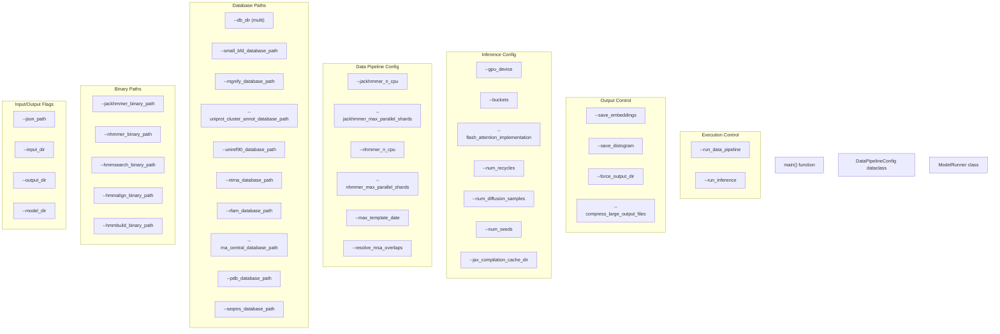
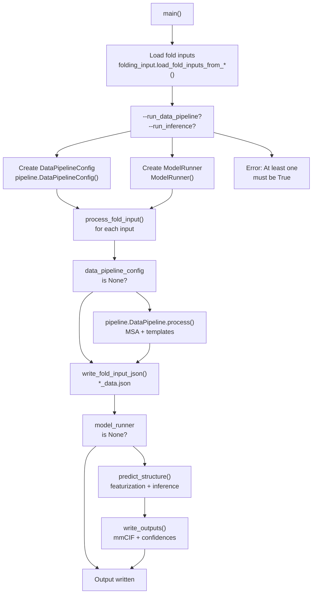

# Running AlphaFold 3

> **Relevant source files**
> * [docs/known_issues.md](https://github.com/google-deepmind/alphafold3/blob/97639fff/docs/known_issues.md?plain=1)
> * [docs/performance.md](https://github.com/google-deepmind/alphafold3/blob/97639fff/docs/performance.md?plain=1)
> * [run_alphafold.py](https://github.com/google-deepmind/alphafold3/blob/97639fff/run_alphafold.py)

## Purpose and Scope

This page provides a step-by-step guide for executing AlphaFold 3 predictions using the `run_alphafold.py` script. It covers command-line flags, staged execution modes, configuration options, and execution workflow.

For input file format details, see [Input Format](/google-deepmind/alphafold3/3.1-input-format). For output format details, see [Output Format](/google-deepmind/alphafold3/3.3-output-format). For installation instructions, see [Installation Guide](/google-deepmind/alphafold3/2-installation-guide). For performance optimization strategies, see [Performance Optimization](/google-deepmind/alphafold3/8-performance-optimization).

---

## Basic Execution

AlphaFold 3 is executed via the `run_alphafold.py` script, which requires specifying input JSON files, output directory, model parameters, and database paths.

### Docker Execution

```
docker run -it \    --volume $HOME/af_input:/root/af_input \    --volume $HOME/af_output:/root/af_output \    --volume <MODEL_PARAMETERS_DIR>:/root/models \    --volume <DB_DIR>:/root/public_databases \    --gpus all \    alphafold3 \    python run_alphafold.py \    --json_path=/root/af_input/fold_input.json \    --model_dir=/root/models \    --db_dir=/root/public_databases \    --output_dir=/root/af_output
```

### Singularity Execution

```
singularity exec \    --nv \    --bind $HOME/af_input:/root/af_input \    --bind $HOME/af_output:/root/af_output \    --bind <MODEL_PARAMETERS_DIR>:/root/models \    --bind <DB_DIR>:/root/public_databases \    alphafold3.sif \    python run_alphafold.py \    --json_path=/root/af_input/fold_input.json \    --model_dir=/root/models \    --db_dir=/root/public_databases \    --output_dir=/root/af_output
```

### Multiple Database Directories

When databases are split across multiple locations (e.g., fast SSD and slower disk), specify multiple `--db_dir` flags. The system searches directories in order [run_alphafold.py L124-L129](https://github.com/google-deepmind/alphafold3/blob/97639fff/run_alphafold.py#L124-L129)

```
python run_alphafold.py \    --json_path=/root/af_input/fold_input.json \    --db_dir=/root/public_databases \    --db_dir=/root/public_databases_fallback \    --output_dir=/root/af_output
```

**Sources:** [run_alphafold.py L62-L130](https://github.com/google-deepmind/alphafold3/blob/97639fff/run_alphafold.py#L62-L130)

 [run_alphafold.py L124-L129](https://github.com/google-deepmind/alphafold3/blob/97639fff/run_alphafold.py#L124-L129)

---

## Command-Line Flags

The `run_alphafold.py` script accepts numerous flags organized into several categories. Use `--help` to see all available options.

### Input and Output Flags

| Flag | Type | Default | Description |
| --- | --- | --- | --- |
| `--json_path` | string | None | Path to a single input JSON file [run_alphafold.py L63-L67](https://github.com/google-deepmind/alphafold3/blob/97639fff/run_alphafold.py#L63-L67) |
| `--input_dir` | string | None | Path to a directory containing input JSON files [run_alphafold.py L68-L72](https://github.com/google-deepmind/alphafold3/blob/97639fff/run_alphafold.py#L68-L72) |
| `--output_dir` | string | **Required** | Path to the output directory [run_alphafold.py L73-L77](https://github.com/google-deepmind/alphafold3/blob/97639fff/run_alphafold.py#L73-L77) |
| `--model_dir` | string | `$HOME/models` | Path to the model parameters directory [run_alphafold.py L78-L82](https://github.com/google-deepmind/alphafold3/blob/97639fff/run_alphafold.py#L78-L82) |

**Note:** Exactly one of `--json_path` or `--input_dir` must be specified [run_alphafold.py L838-L842](https://github.com/google-deepmind/alphafold3/blob/97639fff/run_alphafold.py#L838-L842)

### Execution Control Flags

| Flag | Type | Default | Description |
| --- | --- | --- | --- |
| `--run_data_pipeline` | bool | True | Whether to run MSA generation and template search [run_alphafold.py L85-L89](https://github.com/google-deepmind/alphafold3/blob/97639fff/run_alphafold.py#L85-L89) |
| `--run_inference` | bool | True | Whether to run model inference [run_alphafold.py L90-L94](https://github.com/google-deepmind/alphafold3/blob/97639fff/run_alphafold.py#L90-L94) |

### Binary Paths

The script uses `shutil.which` to auto-detect HMMER binaries by default [run_alphafold.py L97-L121](https://github.com/google-deepmind/alphafold3/blob/97639fff/run_alphafold.py#L97-L121)

| Flag | Type | Default | Description |
| --- | --- | --- | --- |
| `--jackhmmer_binary_path` | string | Auto-detected | Path to Jackhmmer binary |
| `--nhmmer_binary_path` | string | Auto-detected | Path to Nhmmer binary |
| `--hmmalign_binary_path` | string | Auto-detected | Path to Hmmalign binary |
| `--hmmsearch_binary_path` | string | Auto-detected | Path to Hmmsearch binary |
| `--hmmbuild_binary_path` | string | Auto-detected | Path to Hmmbuild binary |

### Database Paths

| Flag | Type | Default | Description |
| --- | --- | --- | --- |
| `--db_dir` | multi_string | `$HOME/public_databases` | Database directory [run_alphafold.py L124-L129](https://github.com/google-deepmind/alphafold3/blob/97639fff/run_alphafold.py#L124-L129) |
| `--small_bfd_database_path` | string | `${DB_DIR}/bfd...` | Small BFD database path [run_alphafold.py L131-L135](https://github.com/google-deepmind/alphafold3/blob/97639fff/run_alphafold.py#L131-L135) |
| `--mgnify_database_path` | string | `${DB_DIR}/mgy...` | Mgnify database path [run_alphafold.py L143-L147](https://github.com/google-deepmind/alphafold3/blob/97639fff/run_alphafold.py#L143-L147) |
| `--uniprot_cluster_annot_database_path` | string | `${DB_DIR}/uniprot...` | UniProt database path [run_alphafold.py L155-L159](https://github.com/google-deepmind/alphafold3/blob/97639fff/run_alphafold.py#L155-L159) |
| `--uniref90_database_path` | string | `${DB_DIR}/uniref90...` | UniRef90 database path [run_alphafold.py L167-L172](https://github.com/google-deepmind/alphafold3/blob/97639fff/run_alphafold.py#L167-L172) |
| `--ntrna_database_path` | string | `${DB_DIR}/nt_rna...` | NT-RNA database path [run_alphafold.py L180-L184](https://github.com/google-deepmind/alphafold3/blob/97639fff/run_alphafold.py#L180-L184) |
| `--rfam_database_path` | string | `${DB_DIR}/rfam...` | Rfam database path [run_alphafold.py L192-L196](https://github.com/google-deepmind/alphafold3/blob/97639fff/run_alphafold.py#L192-L196) |
| `--rna_central_database_path` | string | `${DB_DIR}/rnacentral...` | RNAcentral database path [run_alphafold.py L204-L208](https://github.com/google-deepmind/alphafold3/blob/97639fff/run_alphafold.py#L204-L208) |
| `--pdb_database_path` | string | `${DB_DIR}/mmcif_files` | PDB mmCIF files directory [run_alphafold.py L216-L220](https://github.com/google-deepmind/alphafold3/blob/97639fff/run_alphafold.py#L216-L220) |
| `--seqres_database_path` | string | `${DB_DIR}/pdb_seqres...` | PDB seqres database path [run_alphafold.py L221-L226](https://github.com/google-deepmind/alphafold3/blob/97639fff/run_alphafold.py#L221-L226) |

**Note:** The `${DB_DIR}` placeholder is automatically replaced using the `--db_dir` values via the `replace_db_dir()` function [run_alphafold.py L670-L688](https://github.com/google-deepmind/alphafold3/blob/97639fff/run_alphafold.py#L670-L688)

**Sources:** [run_alphafold.py L62-L226](https://github.com/google-deepmind/alphafold3/blob/97639fff/run_alphafold.py#L62-L226)

 [run_alphafold.py L670-L688](https://github.com/google-deepmind/alphafold3/blob/97639fff/run_alphafold.py#L670-L688)

---

## Diagram: Command-Line Flag Categories



**Sources:** [run_alphafold.py L62-L379](https://github.com/google-deepmind/alphafold3/blob/97639fff/run_alphafold.py#L62-L379)

 [run_alphafold.py L832-L998](https://github.com/google-deepmind/alphafold3/blob/97639fff/run_alphafold.py#L832-L998)

---

## Staged Execution

AlphaFold 3 can be run in stages to optimize resource utilization [docs/performance.md L3-L6](https://github.com/google-deepmind/alphafold3/blob/97639fff/docs/performance.md?plain=1#L3-L6)

1. **Data Pipeline**: CPU-intensive MSA generation and template search.
2. **Model Inference**: GPU-intensive featurization and structure prediction.

### Full Pipeline (Default)

By default, both stages run sequentially [run_alphafold.py L85-L94](https://github.com/google-deepmind/alphafold3/blob/97639fff/run_alphafold.py#L85-L94)

:

```
python run_alphafold.py \    --json_path=/root/af_input/fold_input.json \    --output_dir=/root/af_output
```

### Data Pipeline Only

Run only MSA generation and template search, skipping inference [docs/performance.md L19-L25](https://github.com/google-deepmind/alphafold3/blob/97639fff/docs/performance.md?plain=1#L19-L25)

:

```
python run_alphafold.py \    --json_path=/root/af_input/fold_input.json \    --output_dir=/root/af_output \    --run_inference=false
```

**Output:** JSON file augmented with MSAs and templates in `<output_dir>/<job_name>_data.json` [run_alphafold.py L802](https://github.com/google-deepmind/alphafold3/blob/97639fff/run_alphafold.py#L802-L802)

### Inference Only

Run only featurization and model inference using pre-computed MSAs and templates [docs/performance.md L63-L69](https://github.com/google-deepmind/alphafold3/blob/97639fff/docs/performance.md?plain=1#L63-L69)

:

```
python run_alphafold.py \    --json_path=/root/af_input/fold_input_with_msa.json \    --output_dir=/root/af_output \    --run_data_pipeline=false
```

**Requirement:** Input JSON must contain pre-computed MSAs and templates [docs/performance.md L66-L68](https://github.com/google-deepmind/alphafold3/blob/97639fff/docs/performance.md?plain=1#L66-L68)

**Sources:** [run_alphafold.py L85-L94](https://github.com/google-deepmind/alphafold3/blob/97639fff/run_alphafold.py#L85-L94)

 [docs/performance.md L3-L69](https://github.com/google-deepmind/alphafold3/blob/97639fff/docs/performance.md?plain=1#L3-L69)

---

## Diagram: Staged Execution Flow



**Sources:** [run_alphafold.py L724-L829](https://github.com/google-deepmind/alphafold3/blob/97639fff/run_alphafold.py#L724-L829)

 [run_alphafold.py L832-L993](https://github.com/google-deepmind/alphafold3/blob/97639fff/run_alphafold.py#L832-L993)

---

## Data Pipeline Configuration

### CPU Parallelization

Control the number of CPUs used for MSA tools [run_alphafold.py L227-L238](https://github.com/google-deepmind/alphafold3/blob/97639fff/run_alphafold.py#L227-L238)

```
python run_alphafold.py \    --jackhmmer_n_cpu=8 \    --nhmmer_n_cpu=8
```

**Default:** `min(cpu_count, 8)` [run_alphafold.py L231-L237](https://github.com/google-deepmind/alphafold3/blob/97639fff/run_alphafold.py#L231-L237)

### Sharded Database Parallelization

For sharded databases, control parallel shard processing to take advantage of multi-core systems and fast SSDs [docs/performance.md L85-L91](https://github.com/google-deepmind/alphafold3/blob/97639fff/docs/performance.md?plain=1#L85-L91)

```
python run_alphafold.py \    --small_bfd_database_path="bfd-first_non_consensus_sequences.fasta@64" \    --small_bfd_z_value=65984053 \    --jackhmmer_max_parallel_shards=16 \    --nhmmer_max_parallel_shards=16
```

**Note:** For sharded databases, Z-values representing the database size must be specified manually to correctly scale E-values [run_alphafold.py L136-L215](https://github.com/google-deepmind/alphafold3/blob/97639fff/run_alphafold.py#L136-L215)

 [docs/performance.md L118-L120](https://github.com/google-deepmind/alphafold3/blob/97639fff/docs/performance.md?plain=1#L118-L120)

### Template and MSA Options

| Flag | Type | Default | Description |
| --- | --- | --- | --- |
| `--max_template_date` | string | `2021-09-30` | Max template release date [run_alphafold.py L269-L273](https://github.com/google-deepmind/alphafold3/blob/97639fff/run_alphafold.py#L269-L273) |
| `--resolve_msa_overlaps` | bool | True | Deduplicate unpaired vs paired MSA [run_alphafold.py L274-L278](https://github.com/google-deepmind/alphafold3/blob/97639fff/run_alphafold.py#L274-L278) |
| `--conformer_max_iterations` | int | None | RDKit conformer iterations [run_alphafold.py L284-L288](https://github.com/google-deepmind/alphafold3/blob/97639fff/run_alphafold.py#L284-L288) |

**Sources:** [run_alphafold.py L227-L288](https://github.com/google-deepmind/alphafold3/blob/97639fff/run_alphafold.py#L227-L288)

 [docs/performance.md L70-L163](https://github.com/google-deepmind/alphafold3/blob/97639fff/docs/performance.md?plain=1#L70-L163)

---

## Model Inference Configuration

### GPU Selection

Specify which GPU to use (zero-indexed) [run_alphafold.py L289-L293](https://github.com/google-deepmind/alphafold3/blob/97639fff/run_alphafold.py#L289-L293)

```
python run_alphafold.py \    --gpu_device=0
```

### Compilation Buckets

AlphaFold 3 uses compilation buckets to avoid recompiling for each input size, which significantly improves throughput for batches of varying sizes [run_alphafold.py L302-L311](https://github.com/google-deepmind/alphafold3/blob/97639fff/run_alphafold.py#L302-L311)

```
python run_alphafold.py \    --buckets=256,512,1024,2048,4096
```

### Flash Attention Implementation

Choose the flash attention implementation [run_alphafold.py L312-L321](https://github.com/google-deepmind/alphafold3/blob/97639fff/run_alphafold.py#L312-L321)

```
python run_alphafold.py \    --flash_attention_implementation=triton
```

**Options:** `triton` (default), `cudnn`, `xla` (required for CUDA 7.x) [docs/known_issues.md L7-L8](https://github.com/google-deepmind/alphafold3/blob/97639fff/docs/known_issues.md?plain=1#L7-L8)

### Model Hyperparameters

| Flag | Type | Default | Description |
| --- | --- | --- | --- |
| `--num_recycles` | int | 10 | Number of recycling iterations [run_alphafold.py L322-L326](https://github.com/google-deepmind/alphafold3/blob/97639fff/run_alphafold.py#L322-L326) |
| `--num_diffusion_samples` | int | 5 | Diffusion samples per seed [run_alphafold.py L327-L331](https://github.com/google-deepmind/alphafold3/blob/97639fff/run_alphafold.py#L327-L331) |
| `--num_seeds` | int | None | Auto-generate N seeds from input seed [run_alphafold.py L332-L337](https://github.com/google-deepmind/alphafold3/blob/97639fff/run_alphafold.py#L332-L337) |

### JAX Compilation Cache

Enable persistent compilation cache to avoid recompilation overhead in subsequent runs [run_alphafold.py L346-L350](https://github.com/google-deepmind/alphafold3/blob/97639fff/run_alphafold.py#L346-L350)

```
python run_alphafold.py \    --jax_compilation_cache_dir=/root/jax_cache
```

**Sources:** [run_alphafold.py L289-L350](https://github.com/google-deepmind/alphafold3/blob/97639fff/run_alphafold.py#L289-L350)

 [docs/known_issues.md L1-L8](https://github.com/google-deepmind/alphafold3/blob/97639fff/docs/known_issues.md?plain=1#L1-L8)

 [docs/performance.md L259-L293](https://github.com/google-deepmind/alphafold3/blob/97639fff/docs/performance.md?plain=1#L259-L293)

---

## Output Control

### Embeddings and Distogram

Save optional large outputs such as token embeddings or the predicted distogram [run_alphafold.py L351-L360](https://github.com/google-deepmind/alphafold3/blob/97639fff/run_alphafold.py#L351-L360)

```
python run_alphafold.py \    --save_embeddings=true \    --save_distogram=true
```

### Output Directory Behavior

Control output directory creation [run_alphafold.py L366-L373](https://github.com/google-deepmind/alphafold3/blob/97639fff/run_alphafold.py#L366-L373)

```
python run_alphafold.py \    --force_output_dir=true
```

**Default behavior:** If the directory exists and is non-empty, AlphaFold 3 creates a timestamped directory instead to prevent overwriting results [run_alphafold.py L780-L794](https://github.com/google-deepmind/alphafold3/blob/97639fff/run_alphafold.py#L780-L794)

### Compression

Compress large output files (e.g., embeddings) to save disk space [run_alphafold.py L374-L378](https://github.com/google-deepmind/alphafold3/blob/97639fff/run_alphafold.py#L374-L378)

```
python run_alphafold.py \    --compress_large_output_files=true
```

**Sources:** [run_alphafold.py L351-L378](https://github.com/google-deepmind/alphafold3/blob/97639fff/run_alphafold.py#L351-L378)

 [run_alphafold.py L780-L794](https://github.com/google-deepmind/alphafold3/blob/97639fff/run_alphafold.py#L780-L794)

---

## Diagram: Execution Flow with Key Functions

```mermaid
flowchart TD

main["main(argv)<br>[run_alphafold.py:832]"]
parse_flags["Parse command-line flags<br>absl.flags"]
validate["Validate flags<br>[run_alphafold.py:838-847]"]
load["Load fold inputs<br>folding_input.load_fold_inputs_from_dir()<br>or load_fold_inputs_from_path()"]
check_gpu["--run_inference?"]
validate_gpu["Validate GPU capability<br>[run_alphafold.py:871-895]"]
create_config["--run_data_pipeline?"]
data_config["Create DataPipelineConfig<br>[run_alphafold.py:913-942]"]
create_runner["--run_inference?"]
model_runner["Create ModelRunner<br>[run_alphafold.py:954-970]"]
load_params["Load model params<br>model_runner.model_params<br>[run_alphafold.py:415-417]"]
loop_inputs["For each fold_input"]
expand_seeds["--num_seeds set?"]
expand["fold_input.with_multiple_seeds()<br>[run_alphafold.py:978]"]
process["process_fold_input()<br>[run_alphafold.py:724]"]
check_data_pipe["data_pipeline_config?"]
run_pipeline["DataPipeline.process()<br>[run_alphafold.py:800]"]
write_json["write_fold_input_json()<br>[run_alphafold.py:802]"]
check_inference["model_runner?"]
predict["predict_structure()<br>[run_alphafold.py:513]"]
featurize["featurisation.featurise_input()<br>[run_alphafold.py:526-534]"]
inference["model_runner.run_inference()<br>[run_alphafold.py:433]"]
extract["model_runner.extract_inference_results()<br>[run_alphafold.py:455]"]
write_out["write_outputs()<br>[run_alphafold.py:600]"]
done["Fold job complete"]

main --> parse_flags
parse_flags --> validate
validate --> load
load --> check_gpu
check_gpu --> validate_gpu
check_gpu --> create_config
validate_gpu --> create_config
create_config --> data_config
create_config --> create_runner
data_config --> create_runner
create_runner --> model_runner
create_runner --> loop_inputs
model_runner --> load_params
load_params --> loop_inputs
loop_inputs --> expand_seeds
expand_seeds --> expand
expand_seeds --> process
expand --> process
process --> check_data_pipe
check_data_pipe --> run_pipeline
check_data_pipe --> write_json
run_pipeline --> write_json
write_json --> check_inference
check_inference --> predict
check_inference --> done
predict --> featurize
featurize --> inference
inference --> extract
extract --> write_out
write_out --> done
```



**Sources:** [run_alphafold.py L832-L998](https://github.com/google-deepmind/alphafold3/blob/97639fff/run_alphafold.py#L832-L998)

 [run_alphafold.py L724-L829](https://github.com/google-deepmind/alphafold3/blob/97639fff/run_alphafold.py#L724-L829)

 [run_alphafold.py L513-L585](https://github.com/google-deepmind/alphafold3/blob/97639fff/run_alphafold.py#L513-L585)

---

## Pre-computing MSAs and Templates

For efficient handling of multiple predictions with overlapping chains, pre-compute MSAs and templates separately and reuse them to save significant CPU/RAM resources [docs/performance.md L27-L32](https://github.com/google-deepmind/alphafold3/blob/97639fff/docs/performance.md?plain=1#L27-L32)

### Workflow

1. **Run data pipeline for individual chains** (e.g., monomers) with `--run_inference=false` [docs/performance.md L34-L36](https://github.com/google-deepmind/alphafold3/blob/97639fff/docs/performance.md?plain=1#L34-L36)
2. **Construct multimer JSON files** by copying `unpairedMsa`, `pairedMsa`, and `templates` fields from the pre-computed `*_data.json` files into the multimer input [docs/performance.md L37-L44](https://github.com/google-deepmind/alphafold3/blob/97639fff/docs/performance.md?plain=1#L37-L44)
3. **Run inference only** with `--run_data_pipeline=false` [docs/performance.md L56-L57](https://github.com/google-deepmind/alphafold3/blob/97639fff/docs/performance.md?plain=1#L56-L57)

**Sources:** [docs/performance.md L27-L61](https://github.com/google-deepmind/alphafold3/blob/97639fff/docs/performance.md?plain=1#L27-L61)

---

## GPU Compatibility and Workarounds

### CUDA Capability Requirements

AlphaFold 3 requires GPUs with compute capability 6.0 or greater. The script checks for this requirement and will raise an error if the GPU is incompatible [run_alphafold.py L871-L876](https://github.com/google-deepmind/alphafold3/blob/97639fff/run_alphafold.py#L871-L876)

### CUDA Capability 7.x GPUs (e.g., V100)

All CUDA Capability 7.x GPUs produce poor quality output (clashing residues) unless specific workarounds are applied [docs/known_issues.md L3-L9](https://github.com/google-deepmind/alphafold3/blob/97639fff/docs/known_issues.md?plain=1#L3-L9)

**Required XLA flag:**

```javascript
export XLA_FLAGS="--xla_disable_hlo_passes=custom-kernel-fusion-rewriter"
```

**Required flash attention:**

```
python run_alphafold.py --flash_attention_implementation=xla
```

**Sources:** [run_alphafold.py L869-L895](https://github.com/google-deepmind/alphafold3/blob/97639fff/run_alphafold.py#L869-L895)

 [docs/known_issues.md L1-L8](https://github.com/google-deepmind/alphafold3/blob/97639fff/docs/known_issues.md?plain=1#L1-L8)

---

## Multiple Input Files

Process multiple JSON files in a single execution to leverage JAX compilation caching and improve overall throughput [run_alphafold.py L68-L72](https://github.com/google-deepmind/alphafold3/blob/97639fff/run_alphafold.py#L68-L72)

```
python run_alphafold.py \    --input_dir=/root/af_input \    --output_dir=/root/af_output
```

**Behavior:**

* Loads all JSON files from `--input_dir` [run_alphafold.py L858-L860](https://github.com/google-deepmind/alphafold3/blob/97639fff/run_alphafold.py#L858-L860)
* Creates separate subdirectories for each input within the `--output_dir` [run_alphafold.py L985](https://github.com/google-deepmind/alphafold3/blob/97639fff/run_alphafold.py#L985-L985)
* Processes each input sequentially within a loop [run_alphafold.py L974-L991](https://github.com/google-deepmind/alphafold3/blob/97639fff/run_alphafold.py#L974-L991)

**Sources:** [run_alphafold.py L68-L77](https://github.com/google-deepmind/alphafold3/blob/97639fff/run_alphafold.py#L68-L77)

 [run_alphafold.py L849-L860](https://github.com/google-deepmind/alphafold3/blob/97639fff/run_alphafold.py#L849-L860)

 [run_alphafold.py L974-L991](https://github.com/google-deepmind/alphafold3/blob/97639fff/run_alphafold.py#L974-L991)