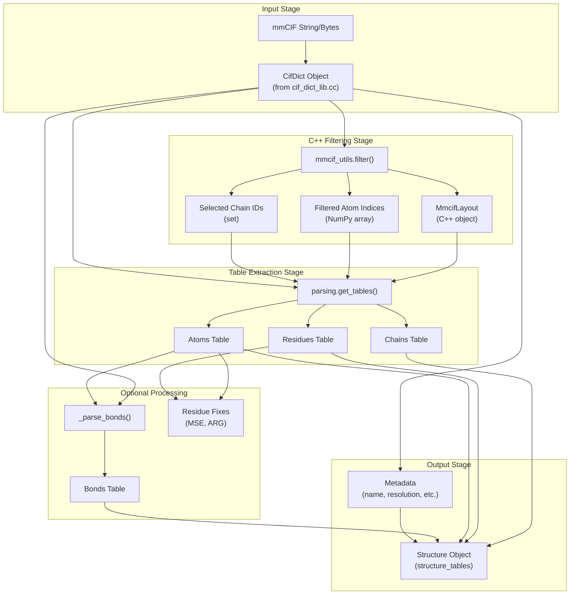
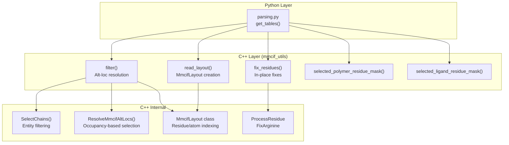
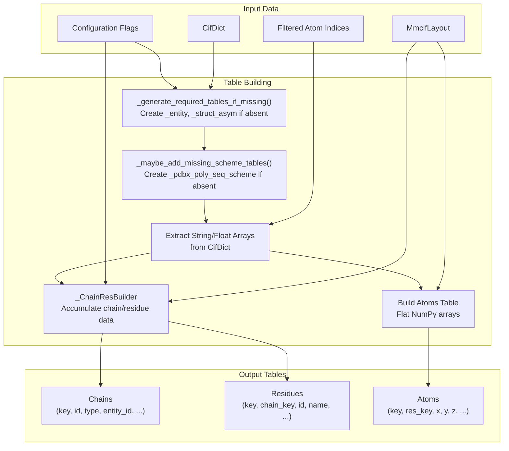
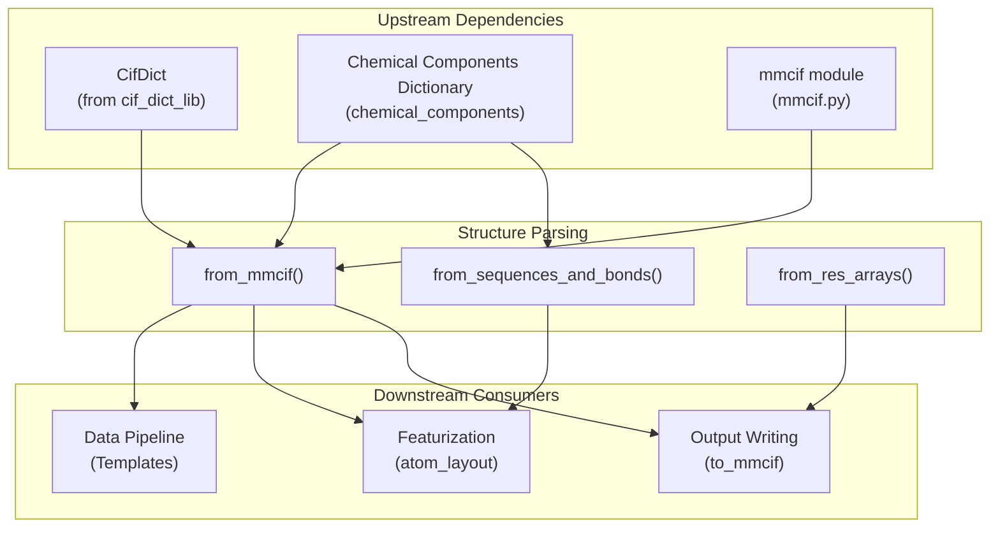

# Structure Parsing

> **Relevant source files**
> * [docs/output.md](https://github.com/google-deepmind/alphafold3/blob/97639fff/docs/output.md?plain=1)
> * [src/alphafold3/data/tools/rdkit_utils.py](https://github.com/google-deepmind/alphafold3/blob/97639fff/src/alphafold3/data/tools/rdkit_utils.py)
> * [src/alphafold3/model/scoring/chirality.py](https://github.com/google-deepmind/alphafold3/blob/97639fff/src/alphafold3/model/scoring/chirality.py)
> * [src/alphafold3/structure/cpp/mmcif_layout.h](https://github.com/google-deepmind/alphafold3/blob/97639fff/src/alphafold3/structure/cpp/mmcif_layout.h)
> * [src/alphafold3/structure/cpp/mmcif_utils.pyi](https://github.com/google-deepmind/alphafold3/blob/97639fff/src/alphafold3/structure/cpp/mmcif_utils.pyi)
> * [src/alphafold3/structure/cpp/mmcif_utils_pybind.cc](https://github.com/google-deepmind/alphafold3/blob/97639fff/src/alphafold3/structure/cpp/mmcif_utils_pybind.cc)
> * [src/alphafold3/structure/cpp/mmcif_utils_pybind.h](https://github.com/google-deepmind/alphafold3/blob/97639fff/src/alphafold3/structure/cpp/mmcif_utils_pybind.h)
> * [src/alphafold3/structure/mmcif.py](https://github.com/google-deepmind/alphafold3/blob/97639fff/src/alphafold3/structure/mmcif.py)
> * [src/alphafold3/structure/parsing.py](https://github.com/google-deepmind/alphafold3/blob/97639fff/src/alphafold3/structure/parsing.py)

## Overview

Structure Parsing provides the conversion layer between mmCIF file format and the internal `Structure` representation used throughout AlphaFold 3. This module takes parsed mmCIF data (as `CifDict` objects, see [mmCIF Format](/google-deepmind/alphafold3/10.1-mmcif-format)) and produces `Structure` objects containing chains, residues, atoms, and optionally bonds in a table-based format optimized for downstream processing.

The primary implementation is in [src/alphafold3/structure/parsing.py](https://github.com/google-deepmind/alphafold3/blob/97639fff/src/alphafold3/structure/parsing.py)

 with performance-critical operations delegated to the C++ `mmcif_utils` module exposed via [src/alphafold3/structure/cpp/mmcif_utils_pybind.cc](https://github.com/google-deepmind/alphafold3/blob/97639fff/src/alphafold3/structure/cpp/mmcif_utils_pybind.cc)

 For information about the underlying `Structure` data representation, see [Structure Representation](/google-deepmind/alphafold3/5.2-structure-representation).

**Sources:** [src/alphafold3/structure/parsing.py L11](https://github.com/google-deepmind/alphafold3/blob/97639fff/src/alphafold3/structure/parsing.py#L11-L11)

 [src/alphafold3/structure/parsing.py L24-L31](https://github.com/google-deepmind/alphafold3/blob/97639fff/src/alphafold3/structure/parsing.py#L24-L31)

## Conversion Pipeline

The structure parsing pipeline transforms raw mmCIF data through multiple stages to produce a validated `Structure` object:

Title: Structure Parsing Pipeline

**Pipeline Stages:**

1. **Input Stage**: mmCIF string parsed into `CifDict` using C++ tokenizer.
2. **C++ Filtering Stage**: `mmcif_utils.filter()` performs alt-loc resolution, chain selection, and generates layout metadata [src/alphafold3/structure/cpp/mmcif_utils_pybind.cc L358-L427](https://github.com/google-deepmind/alphafold3/blob/97639fff/src/alphafold3/structure/cpp/mmcif_utils_pybind.cc#L358-L427)
3. **Table Extraction Stage**: Python code extracts and organizes data into table structures via `get_tables()` [src/alphafold3/structure/parsing.py L1301-L1398](https://github.com/google-deepmind/alphafold3/blob/97639fff/src/alphafold3/structure/parsing.py#L1301-L1398)
4. **Optional Processing**: Bonds parsed if requested [src/alphafold3/structure/parsing.py L202-L253](https://github.com/google-deepmind/alphafold3/blob/97639fff/src/alphafold3/structure/parsing.py#L202-L253)  residue fixes applied [src/alphafold3/structure/cpp/mmcif_utils_pybind.cc L429-L472](https://github.com/google-deepmind/alphafold3/blob/97639fff/src/alphafold3/structure/cpp/mmcif_utils_pybind.cc#L429-L472)
5. **Output Stage**: Tables combined with metadata to create final `Structure` [src/alphafold3/structure/parsing.py L307-L396](https://github.com/google-deepmind/alphafold3/blob/97639fff/src/alphafold3/structure/parsing.py#L307-L396)

**Sources:** [src/alphafold3/structure/parsing.py L307-L453](https://github.com/google-deepmind/alphafold3/blob/97639fff/src/alphafold3/structure/parsing.py#L307-L453)

 [src/alphafold3/structure/cpp/mmcif_utils_pybind.cc L358-L427](https://github.com/google-deepmind/alphafold3/blob/97639fff/src/alphafold3/structure/cpp/mmcif_utils_pybind.cc#L358-L427)

 [src/alphafold3/structure/parsing.py L1301-L1398](https://github.com/google-deepmind/alphafold3/blob/97639fff/src/alphafold3/structure/parsing.py#L1301-L1398)

## Main Entry Points

### from_mmcif()

Primary function for parsing mmCIF strings directly into `Structure` objects [src/alphafold3/structure/parsing.py L399-L453](https://github.com/google-deepmind/alphafold3/blob/97639fff/src/alphafold3/structure/parsing.py#L399-L453)

**Parameters:**

* `mmcif_string`: Raw mmCIF file content.
* `fix_mse_residues`: Convert selenomethionine (MSE) to methionine (MET) by changing SE to SD.
* `fix_arginines`: Ensure NH1 is closer to CD than NH2 in arginine residues.
* `fix_unknown_dna`: Replace residue name `N` with `DN` in DNA chains.
* `include_water`: Include HOH molecules in parsing.
* `include_other`: Include non-standard entity types.
* `include_bonds`: Parse `_struct_conn` table for bond information.
* `model_id`: Which model to parse - `ModelID.FIRST`, `ModelID.ALL`, or integer ID.

**Sources:** [src/alphafold3/structure/parsing.py L399-L453](https://github.com/google-deepmind/alphafold3/blob/97639fff/src/alphafold3/structure/parsing.py#L399-L453)

### from_parsed_mmcif()

Optimized variant that accepts an already-parsed `Mmcif` object [src/alphafold3/structure/parsing.py L307-L396](https://github.com/google-deepmind/alphafold3/blob/97639fff/src/alphafold3/structure/parsing.py#L307-L396)

 This function is called internally by `from_mmcif()` but can be used directly when the mmCIF has already been parsed for other purposes (e.g., extracting metadata).

**Sources:** [src/alphafold3/structure/parsing.py L307-L396](https://github.com/google-deepmind/alphafold3/blob/97639fff/src/alphafold3/structure/parsing.py#L307-L396)

### Model Selection

The `model_id` parameter supports three modes via the `ModelID` enum:

| Value | Behavior | Coordinates Shape |
| --- | --- | --- |
| `ModelID.FIRST` | Parse only the first model | `(num_atoms, 3)` |
| `ModelID.ALL` | Parse all models | `(num_models, num_atoms, 3)` |
| `int` | Parse specific model by ID | `(num_atoms, 3)` |

The `_get_str_model_id()` helper converts these values to string model IDs used internally [src/alphafold3/structure/parsing.py L169-L199](https://github.com/google-deepmind/alphafold3/blob/97639fff/src/alphafold3/structure/parsing.py#L169-L199)

**Sources:** [src/alphafold3/structure/parsing.py L54-L59](https://github.com/google-deepmind/alphafold3/blob/97639fff/src/alphafold3/structure/parsing.py#L54-L59)

 [src/alphafold3/structure/parsing.py L169-L199](https://github.com/google-deepmind/alphafold3/blob/97639fff/src/alphafold3/structure/parsing.py#L169-L199)

## C++ Performance Layer

Performance-critical operations are implemented in C++ and exposed via the `mmcif_utils` module. This layer handles alt-loc resolution, filtering, and layout computation.

Title: C++ Performance Layer Architecture

**Sources:** [src/alphafold3/structure/cpp/mmcif_utils_pybind.cc L45-L787](https://github.com/google-deepmind/alphafold3/blob/97639fff/src/alphafold3/structure/cpp/mmcif_utils_pybind.cc#L45-L787)

 [src/alphafold3/structure/cpp/mmcif_utils.pyi L19-L72](https://github.com/google-deepmind/alphafold3/blob/97639fff/src/alphafold3/structure/cpp/mmcif_utils.pyi#L19-L72)

### mmcif_utils.filter()

The core filtering function returns atom indices to keep after alt-loc resolution and chain selection [src/alphafold3/structure/cpp/mmcif_utils_pybind.cc L358-L427](https://github.com/google-deepmind/alphafold3/blob/97639fff/src/alphafold3/structure/cpp/mmcif_utils_pybind.cc#L358-L427)

**Returns:**

* NumPy array of shape `(num_models, num_atoms)` containing atom indices.
* Set of selected chain IDs.
* `MmcifLayout` object encoding residue boundaries and model structure.

**Alt-loc Resolution Logic:**
Alt-locs (alternate locations) are resolved by the C++ logic inside `mmcif_utils.filter()` which utilizes `ResolveMmcifAltLocs` [src/alphafold3/structure/cpp/mmcif_utils_pybind.cc L35](https://github.com/google-deepmind/alphafold3/blob/97639fff/src/alphafold3/structure/cpp/mmcif_utils_pybind.cc#L35-L35)

 This groups atoms by ID and selects the highest occupancy alt-loc.

**Sources:** [src/alphafold3/structure/cpp/mmcif_utils_pybind.cc L358-L427](https://github.com/google-deepmind/alphafold3/blob/97639fff/src/alphafold3/structure/cpp/mmcif_utils_pybind.cc#L358-L427)

 [src/alphafold3/structure/cpp/mmcif_utils.pyi L19-L26](https://github.com/google-deepmind/alphafold3/blob/97639fff/src/alphafold3/structure/cpp/mmcif_utils.pyi#L19-L26)

### MmcifLayout Class

C++ class that encodes the hierarchical structure of the `_atom_site` table [src/alphafold3/structure/cpp/mmcif_layout.h L28-L140](https://github.com/google-deepmind/alphafold3/blob/97639fff/src/alphafold3/structure/cpp/mmcif_layout.h#L28-L140)

:

* `num_models()`: Number of models in the layout.
* `num_chains()`: Total number of chains.
* `num_residues()`: Total number of residues (excluding unresolved).
* `num_atoms()`: Total number of atoms.
* `atom_site_from_residue_index(residue_idx)`: Maps residue index to starting atom index.
* `atom_range(residue_idx)`: Returns `(start, end)` atom indices for a residue.

**Sources:** [src/alphafold3/structure/cpp/mmcif_layout.h L28-L140](https://github.com/google-deepmind/alphafold3/blob/97639fff/src/alphafold3/structure/cpp/mmcif_layout.h#L28-L140)

### mmcif_utils.fix_residues()

Performs in-place fixes on residue data, currently supporting arginine atom reordering [src/alphafold3/structure/cpp/mmcif_utils_pybind.cc L429-L472](https://github.com/google-deepmind/alphafold3/blob/97639fff/src/alphafold3/structure/cpp/mmcif_utils_pybind.cc#L429-L472)

 For arginine residues, it ensures NH1/NH2 are ordered correctly relative to CD.

**Sources:** [src/alphafold3/structure/cpp/mmcif_utils_pybind.cc L429-L472](https://github.com/google-deepmind/alphafold3/blob/97639fff/src/alphafold3/structure/cpp/mmcif_utils_pybind.cc#L429-L472)

 [src/alphafold3/structure/cpp/mmcif_utils.pyi L29-L37](https://github.com/google-deepmind/alphafold3/blob/97639fff/src/alphafold3/structure/cpp/mmcif_utils.pyi#L29-L37)

## Table Construction

The `get_tables()` function orchestrates conversion from filtered mmCIF data to table structures [src/alphafold3/structure/parsing.py L1301-L1398](https://github.com/google-deepmind/alphafold3/blob/97639fff/src/alphafold3/structure/parsing.py#L1301-L1398)

:

Title: Table Construction Data Flow

**Sources:** [src/alphafold3/structure/parsing.py L1301-L1398](https://github.com/google-deepmind/alphafold3/blob/97639fff/src/alphafold3/structure/parsing.py#L1301-L1398)

### Missing Table Generation

The `_generate_required_tables_if_missing()` function infers missing mmCIF tables from available data [src/alphafold3/structure/parsing.py L1010-L1102](https://github.com/google-deepmind/alphafold3/blob/97639fff/src/alphafold3/structure/parsing.py#L1010-L1102)

**Table Inference Logic:**

| Missing Table | Inferred From | Strategy |
| --- | --- | --- |
| `_struct_asym` | `_atom_site.label_asym_id`, `_atom_site.label_entity_id` | Deduplicate (entity_id, asym_id) pairs [src/alphafold3/structure/parsing.py L1020-L1044](https://github.com/google-deepmind/alphafold3/blob/97639fff/src/alphafold3/structure/parsing.py#L1020-L1044) |
| `_entity` | `_atom_site` residues + `group_PDB` | Guess entity type via `_guess_entity_type()` [src/alphafold3/structure/parsing.py L1046-L1081](https://github.com/google-deepmind/alphafold3/blob/97639fff/src/alphafold3/structure/parsing.py#L1046-L1081) |
| `_entity_poly` | `_entity` + residue names | Guess polymer type (protein/DNA/RNA) [src/alphafold3/structure/parsing.py L1083-L1102](https://github.com/google-deepmind/alphafold3/blob/97639fff/src/alphafold3/structure/parsing.py#L1083-L1102) |

**Sources:** [src/alphafold3/structure/parsing.py L1010-L1102](https://github.com/google-deepmind/alphafold3/blob/97639fff/src/alphafold3/structure/parsing.py#L1010-L1102)

### Scheme Table Generation

The `_maybe_add_missing_scheme_tables()` function creates residue numbering scheme tables [src/alphafold3/structure/parsing.py L1105-L1269](https://github.com/google-deepmind/alphafold3/blob/97639fff/src/alphafold3/structure/parsing.py#L1105-L1269)

 These tables (`_pdbx_poly_seq_scheme`, `_pdbx_nonpoly_scheme`, `_pdbx_branch_scheme`) are essential for handling structures with non-sequential residue numbering or insertion codes.

**Sources:** [src/alphafold3/structure/parsing.py L1105-L1269](https://github.com/google-deepmind/alphafold3/blob/97639fff/src/alphafold3/structure/parsing.py#L1105-L1269)

### _ChainResBuilder

Helper class that incrementally builds chain and residue tables by accumulating data during iteration over atoms [src/alphafold3/structure/parsing.py L842-L1000](https://github.com/google-deepmind/alphafold3/blob/97639fff/src/alphafold3/structure/parsing.py#L842-L1000)

 It deduplicates chains and applies fixes (MSE→MET, N→DN) before creating final tables.

**Sources:** [src/alphafold3/structure/parsing.py L842-L1000](https://github.com/google-deepmind/alphafold3/blob/97639fff/src/alphafold3/structure/parsing.py#L842-L1000)

## Bond Parsing

When `include_bonds=True`, the `_parse_bonds()` function extracts covalent bond information from the `_struct_conn` table [src/alphafold3/structure/parsing.py L202-L253](https://github.com/google-deepmind/alphafold3/blob/97639fff/src/alphafold3/structure/parsing.py#L202-L253)

**Bond Filtering:**

* Removes bonds with symmetry operators other than `1_555` [src/alphafold3/structure/parsing.py L228](https://github.com/google-deepmind/alphafold3/blob/97639fff/src/alphafold3/structure/parsing.py#L228-L228)
* Removes bonds referencing atoms filtered out.
* Preserves all standard bond types: `covale`, `disulf`, `metalc`, `hydrog` [src/alphafold3/structure/parsing.py L229](https://github.com/google-deepmind/alphafold3/blob/97639fff/src/alphafold3/structure/parsing.py#L229-L229)

**Sources:** [src/alphafold3/structure/parsing.py L202-L253](https://github.com/google-deepmind/alphafold3/blob/97639fff/src/alphafold3/structure/parsing.py#L202-L253)

 [src/alphafold3/structure/mmcif.py L122-L151](https://github.com/google-deepmind/alphafold3/blob/97639fff/src/alphafold3/structure/mmcif.py#L122-L151)

## Alternative Construction Methods

### from_sequences_and_bonds()

Creates minimal structures from sequence strings and bonded atom pairs [src/alphafold3/structure/parsing.py L628-L839](https://github.com/google-deepmind/alphafold3/blob/97639fff/src/alphafold3/structure/parsing.py#L628-L839)

**Sequence Formats:**

* `FASTA`: Single-letter amino acid or nucleotide codes [src/alphafold3/structure/parsing.py L65](https://github.com/google-deepmind/alphafold3/blob/97639fff/src/alphafold3/structure/parsing.py#L65-L65)
* `CCD_CODES`: Multiple-letter chemical components dictionary ids [src/alphafold3/structure/parsing.py L66](https://github.com/google-deepmind/alphafold3/blob/97639fff/src/alphafold3/structure/parsing.py#L66-L66)
* `LIGAND_SMILES`: SMILES string defining a molecule [src/alphafold3/structure/parsing.py L67](https://github.com/google-deepmind/alphafold3/blob/97639fff/src/alphafold3/structure/parsing.py#L67-L67)

**Sources:** [src/alphafold3/structure/parsing.py L62-L68](https://github.com/google-deepmind/alphafold3/blob/97639fff/src/alphafold3/structure/parsing.py#L62-L68)

 [src/alphafold3/structure/parsing.py L628-L839](https://github.com/google-deepmind/alphafold3/blob/97639fff/src/alphafold3/structure/parsing.py#L628-L839)

### from_res_arrays()

Constructs structures from residue-shaped NumPy arrays [src/alphafold3/structure/parsing.py L456-L588](https://github.com/google-deepmind/alphafold3/blob/97639fff/src/alphafold3/structure/parsing.py#L456-L588)

 This is used to convert model outputs back to `Structure` objects by flattening atom arrays based on an `atom_mask`.

**Sources:** [src/alphafold3/structure/parsing.py L456-L588](https://github.com/google-deepmind/alphafold3/blob/97639fff/src/alphafold3/structure/parsing.py#L456-L588)

## Special Data Handling

### Insertion Code Remapping

Insertion codes use a specific remapping to normalize values [src/alphafold3/structure/parsing.py L40](https://github.com/google-deepmind/alphafold3/blob/97639fff/src/alphafold3/structure/parsing.py#L40-L40)

:
`_INSERTION_CODE_REMAP: Mapping[str, str] = {'.': '?'}`.

**Sources:** [src/alphafold3/structure/parsing.py L40](https://github.com/google-deepmind/alphafold3/blob/97639fff/src/alphafold3/structure/parsing.py#L40-L40)

### Chain Key Ordering

The `_get_chain_key_by_chain_id()` function ensures chain keys respect both `_struct_asym` table order and actual resolution order in `_atom_site` [src/alphafold3/structure/parsing.py L1272-L1298](https://github.com/google-deepmind/alphafold3/blob/97639fff/src/alphafold3/structure/parsing.py#L1272-L1298)

**Sources:** [src/alphafold3/structure/parsing.py L1272-L1298](https://github.com/google-deepmind/alphafold3/blob/97639fff/src/alphafold3/structure/parsing.py#L1272-L1298)

### Error Handling

The module defines specific exceptions for parsing failures:

| Exception | Raised When |
| --- | --- |
| `NoAtomsError` | mmCIF has no atoms or `_atom_site.pdbx_PDB_model_num` missing [src/alphafold3/structure/parsing.py L43-L44](https://github.com/google-deepmind/alphafold3/blob/97639fff/src/alphafold3/structure/parsing.py#L43-L44) |
| `ValueError` | Invalid sequences, mismatched chain IDs, duplicate keys [src/alphafold3/structure/parsing.py L185-L188](https://github.com/google-deepmind/alphafold3/blob/97639fff/src/alphafold3/structure/parsing.py#L185-L188) |

**Sources:** [src/alphafold3/structure/parsing.py L43-L44](https://github.com/google-deepmind/alphafold3/blob/97639fff/src/alphafold3/structure/parsing.py#L43-L44)

 [src/alphafold3/structure/parsing.py L185-L188](https://github.com/google-deepmind/alphafold3/blob/97639fff/src/alphafold3/structure/parsing.py#L185-L188)

## Integration Points

Structure Parsing integrates with other AlphaFold 3 subsystems:

Title: Structure Parsing Integration

**Sources:** [src/alphafold3/structure/parsing.py L11-L32](https://github.com/google-deepmind/alphafold3/blob/97639fff/src/alphafold3/structure/parsing.py#L11-L32)