# Test Data and Validation

> **Relevant source files**
> * [run_alphafold_test.py](https://github.com/google-deepmind/alphafold3/blob/97639fff/run_alphafold_test.py)
> * [src/alphafold3/test_data/alphafold_run_outputs/run_alphafold_test_output_bucket_1024.pkl](https://github.com/google-deepmind/alphafold3/blob/97639fff/src/alphafold3/test_data/alphafold_run_outputs/run_alphafold_test_output_bucket_1024.pkl)
> * [src/alphafold3/test_data/alphafold_run_outputs/run_alphafold_test_output_bucket_default.pkl](https://github.com/google-deepmind/alphafold3/blob/97639fff/src/alphafold3/test_data/alphafold_run_outputs/run_alphafold_test_output_bucket_default.pkl)
> * [src/alphafold3/test_data/featurised_example.pkl](https://github.com/google-deepmind/alphafold3/blob/97639fff/src/alphafold3/test_data/featurised_example.pkl)
> * [src/alphafold3/test_data/miniature_databases/pdb_mmcif/5y2e.cif](https://github.com/google-deepmind/alphafold3/blob/97639fff/src/alphafold3/test_data/miniature_databases/pdb_mmcif/5y2e.cif)
> * [src/alphafold3/test_data/miniature_databases/pdb_mmcif/6s61.cif](https://github.com/google-deepmind/alphafold3/blob/97639fff/src/alphafold3/test_data/miniature_databases/pdb_mmcif/6s61.cif)
> * [src/alphafold3/test_data/miniature_databases/pdb_mmcif/6ydw.cif](https://github.com/google-deepmind/alphafold3/blob/97639fff/src/alphafold3/test_data/miniature_databases/pdb_mmcif/6ydw.cif)
> * [src/alphafold3/test_data/miniature_databases/pdb_mmcif/7rye.cif](https://github.com/google-deepmind/alphafold3/blob/97639fff/src/alphafold3/test_data/miniature_databases/pdb_mmcif/7rye.cif)

This document describes the test data infrastructure and validation strategies used to ensure correctness of AlphaFold 3 predictions. It covers the organization of test data files, the use of miniature databases for testing, golden output storage, and the RMSD-based validation approach for regression testing.

For information about the test infrastructure and CI/CD pipeline, see [Test Infrastructure](/google-deepmind/alphafold3/7.1-test-infrastructure).

## Purpose and Scope

The testing framework uses a combination of miniature genetic databases and pre-computed golden outputs to validate end-to-end inference results. The primary test case exercises the complete prediction pipeline using a protein-ligand complex (PDB ID: 5tgy), validating both the structural predictions and confidence metrics against expected values.

Sources: [run_alphafold_test.py L11-L66](https://github.com/google-deepmind/alphafold3/blob/97639fff/run_alphafold_test.py#L11-L66)

## Test Data Organization

The test data is organized into three main categories: miniature databases for MSA and template searches, featurized examples for model inference testing, and golden outputs for regression validation.

```mermaid
flowchart TD

MiniatureDB["miniature_databases/"]
Featurized["featurised_example.pkl"]
GoldenOutputs["alphafold_run_outputs/"]
BFD["bfd-first_non_consensus_sequences__subsampled_1000.fasta"]
MGnify["mgy_clusters__subsampled_1000.fa"]
UniProt["uniprot_all__subsampled_1000.fasta"]
UniRef90["uniref90__subsampled_1000.fasta"]
NTRNA["nt_rna_2023_02_23_clust_seq_id_90_cov_80_rep_seq__subsampled_1000.fasta"]
Rfam["rfam_14_4_clustered_rep_seq__subsampled_1000.fasta"]
RNACentral["rnacentral_active_seq_id_90_cov_80_linclust__subsampled_1000.fasta"]
PDB["pdb_mmcif/"]
Seqres["pdb_seqres_2022_09_28__subsampled_1000.fasta"]
DefaultBucket["run_alphafold_test_output_bucket_default.pkl"]
Bucket1024["run_alphafold_test_output_bucket_1024.pkl"]

MiniatureDB --> BFD
MiniatureDB --> MGnify
MiniatureDB --> UniProt
MiniatureDB --> UniRef90
MiniatureDB --> NTRNA
MiniatureDB --> Rfam
MiniatureDB --> RNACentral
MiniatureDB --> PDB
MiniatureDB --> Seqres
GoldenOutputs --> DefaultBucket
GoldenOutputs --> Bucket1024

subgraph Golden ["alphafold_run_outputs/"]
    DefaultBucket
    Bucket1024
end

subgraph Databases ["miniature_databases/"]
    BFD
    MGnify
    UniProt
    UniRef90
    NTRNA
    Rfam
    RNACentral
    PDB
    Seqres
end

subgraph TestData ["test_data/"]
    MiniatureDB
    Featurized
    GoldenOutputs
end
```

**Test Data Directory Structure**

All test data is accessed through the `testing_data.Data` interface, which resolves paths relative to `resources.ROOT`.

Sources: [run_alphafold_test.py L69-L106](https://github.com/google-deepmind/alphafold3/blob/97639fff/run_alphafold_test.py#L69-L106)

 [run_alphafold_test.py L28](https://github.com/google-deepmind/alphafold3/blob/97639fff/run_alphafold_test.py#L28-L28)

## Miniature Databases

### Database Configuration

The test suite uses miniature versions of the full genetic databases, each subsampled to 1,000 sequences. This enables fast test execution while maintaining realistic data pipeline behavior.

| Database | Purpose | File Pattern | Template Date |
| --- | --- | --- | --- |
| Small BFD | Protein MSA | `bfd-first_non_consensus_sequences__subsampled_1000.fasta` | - |
| MGnify | Protein MSA | `mgy_clusters__subsampled_1000.fa` | - |
| UniProt | Protein MSA | `uniprot_all__subsampled_1000.fasta` | - |
| UniRef90 | Protein MSA | `uniref90__subsampled_1000.fasta` | - |
| NT RNA | RNA MSA | `nt_rna_2023_02_23_clust_seq_id_90_cov_80_rep_seq__subsampled_1000.fasta` | - |
| Rfam | RNA MSA | `rfam_14_4_clustered_rep_seq__subsampled_1000.fasta` | - |
| RNACentral | RNA MSA | `rnacentral_active_seq_id_90_cov_80_linclust__subsampled_1000.fasta` | - |
| PDB mmCIF | Templates | `pdb_mmcif/` | 2021-09-30 |
| PDB Seqres | Templates | `pdb_seqres_2022_09_28__subsampled_1000.fasta` | 2021-09-30 |

### DataPipelineConfig Initialization

The test setup creates a `DataPipelineConfig` with paths to all miniature databases and HMMER tool binaries:

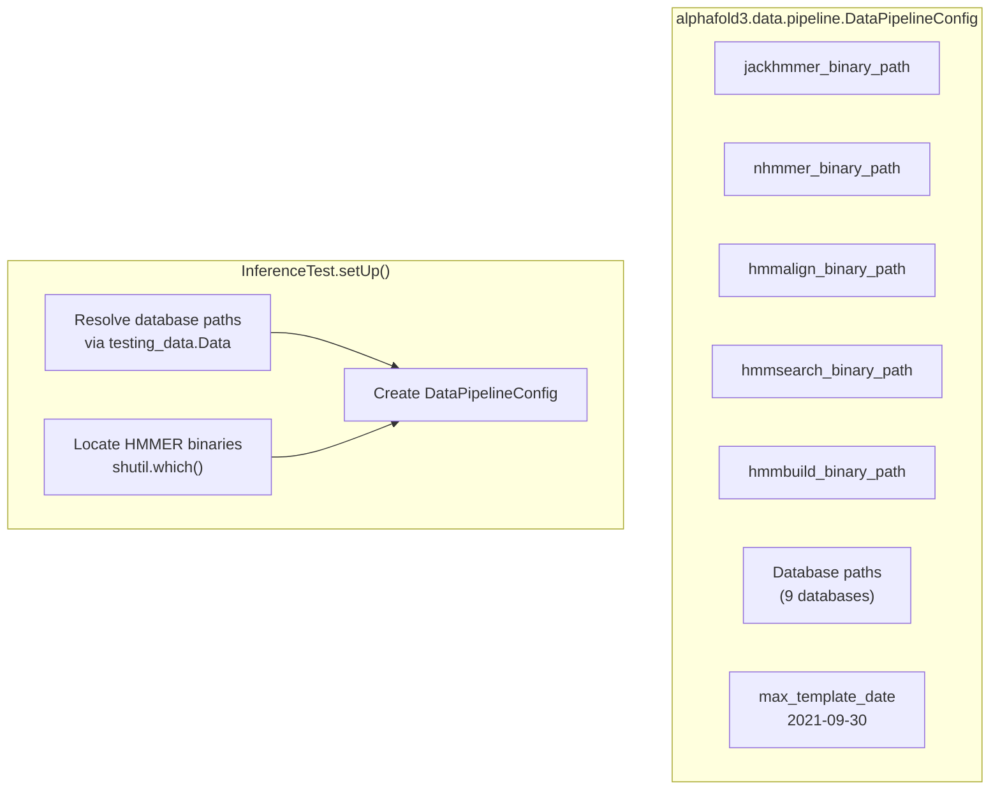

**DataPipelineConfig Initialization for Tests**

Sources: [run_alphafold_test.py L69-L123](https://github.com/google-deepmind/alphafold3/blob/97639fff/run_alphafold_test.py#L69-L123)

 [run_alphafold_test.py L107-L123](https://github.com/google-deepmind/alphafold3/blob/97639fff/run_alphafold_test.py#L107-L123)

## Test Input Specification

### 5tgy Test Case

The primary test case uses PDB structure 5tgy, a protein-ligand complex consisting of a 110-residue protein chain and a ligand (7BU, 7-tert-butyl-3-methylbenzo[c][1,2,5]thiadiazole).

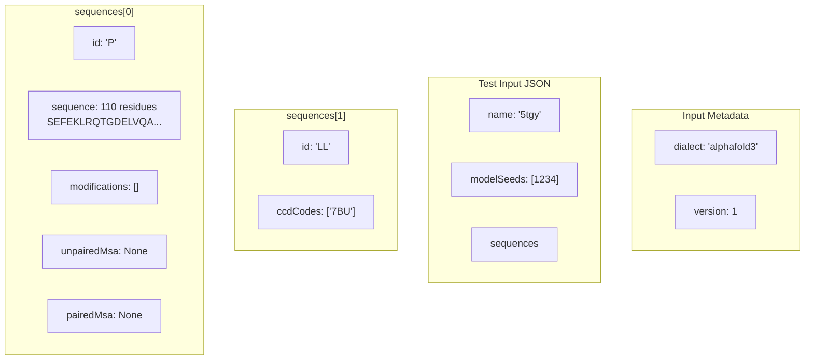

**Test Input JSON Structure for 5tgy**

The test input is initially provided without MSAs or templates (set to `None`). The data pipeline fills these in during execution, and the enriched input is validated in the output.

Sources: [run_alphafold_test.py L124-L144](https://github.com/google-deepmind/alphafold3/blob/97639fff/run_alphafold_test.py#L124-L144)

## Golden Outputs and Pickle Format

### Storage Strategy

Golden outputs are stored as pickled Python dictionaries containing the complete inference results. Each golden output file corresponds to a specific test configuration (bucket size, seed).

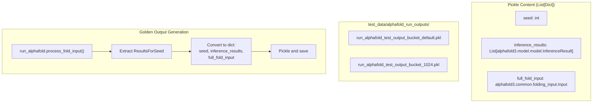

**Golden Output Pickle Format**

Each pickle file contains a list of dictionaries with three keys:

* `seed`: The random seed used for inference.
* `inference_results`: List of `InferenceResult` objects (one per sample).
* `full_fold_input`: The enriched `Input` object with MSAs and templates.

Sources: [run_alphafold_test.py L351-L361](https://github.com/google-deepmind/alphafold3/blob/97639fff/run_alphafold_test.py#L351-L361)

 [run_alphafold_test.py L366-L377](https://github.com/google-deepmind/alphafold3/blob/97639fff/run_alphafold_test.py#L366-L377)

 [src/alphafold3/test_data/alphafold_run_outputs/run_alphafold_test_output_bucket_default.pkl L1](https://github.com/google-deepmind/alphafold3/blob/97639fff/src/alphafold3/test_data/alphafold_run_outputs/run_alphafold_test_output_bucket_default.pkl#L1-L1)

## Validation Pipeline

### End-to-End Test Flow

The validation pipeline runs the complete prediction workflow and compares outputs against golden references using multiple validation criteria.

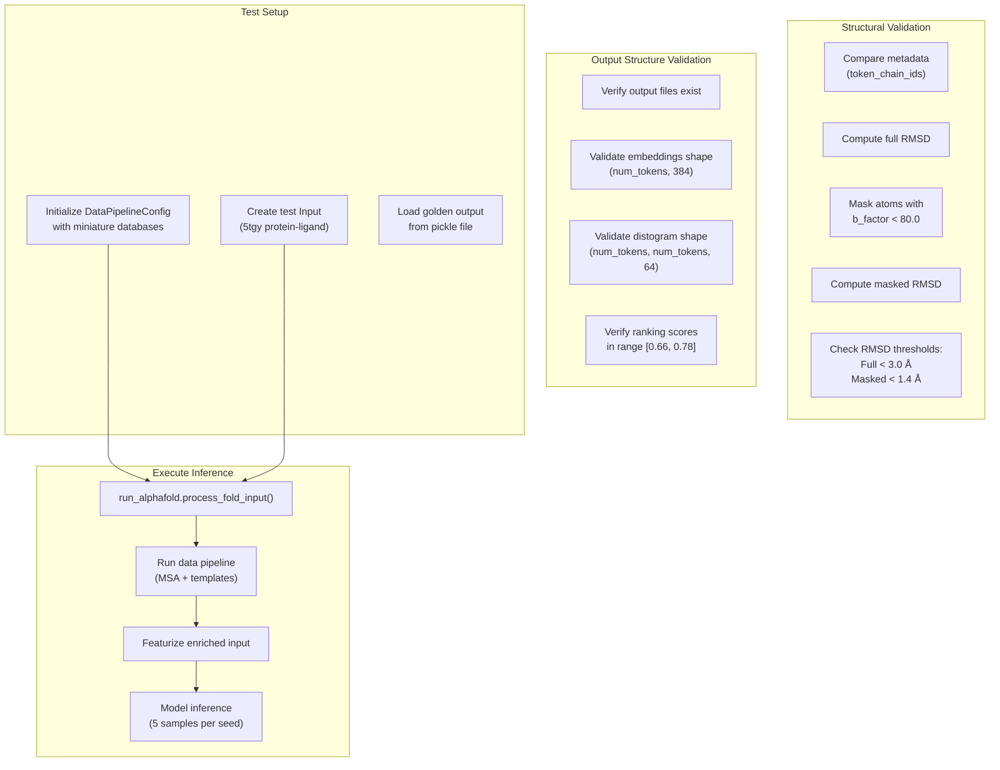

**Complete Validation Pipeline Flow**

Sources: [run_alphafold_test.py L188-L427](https://github.com/google-deepmind/alphafold3/blob/97639fff/run_alphafold_test.py#L188-L427)

## RMSD-Based Validation

### Coordinate Comparison Strategy

The test suite employs a two-tier RMSD validation approach: full structure comparison and masked comparison focusing on high-confidence regions.

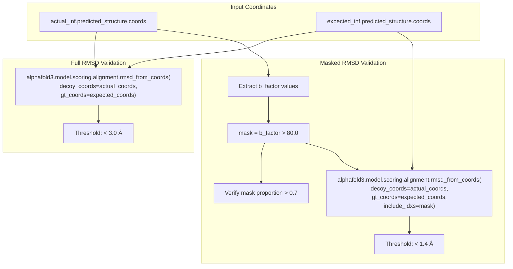

**Two-Tier RMSD Validation Strategy**

### Validation Thresholds

| Metric | Threshold | Purpose |
| --- | --- | --- |
| Full RMSD | < 3.0 Å | Ensures overall structural similarity across all atoms |
| Masked RMSD | < 1.4 Å | Validates high-confidence regions (b-factor > 80.0) |
| Mask Proportion | > 70% | Ensures sufficient high-confidence predictions |
| Ranking Score | [0.66, 0.78] | Validates confidence metrics are in expected range |

The 5tgy test case is chosen because it produces stable predictions with low RMSD variance across different seeds, bucket sizes, and device types.

Sources: [run_alphafold_test.py L379-L426](https://github.com/google-deepmind/alphafold3/blob/97639fff/run_alphafold_test.py#L379-L426)

 [run_alphafold_test.py L30](https://github.com/google-deepmind/alphafold3/blob/97639fff/run_alphafold_test.py#L30-L30)

## Output Structure Validation

### File and Directory Organization

The test validates the complete output directory structure, ensuring all expected files and subdirectories are present.

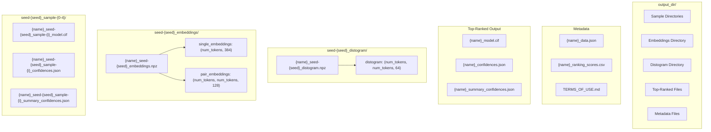

**Expected Output Directory Structure**

### Validation Checks

The test performs the following structural validations:

1. **Directory Structure**: Verifies 5 sample directories, 1 embeddings directory, and 1 distogram directory exist.
2. **File Presence**: Checks each sample directory contains CIF, confidences JSON, and summary JSON files.
3. **Embeddings**: Validates shape `(num_tokens, 384)` for single and `(num_tokens, num_tokens, 128)` for pair embeddings, with `float16` dtype.
4. **Distogram**: Validates shape `(num_tokens, num_tokens, 64)` with `float16` dtype.
5. **Ranking CSV**: Verifies 5 rows with correct seed and sample indices.
6. **Data JSON**: Confirms MSAs, templates, and input sequences are properly saved.

Sources: [run_alphafold_test.py L220-L346](https://github.com/google-deepmind/alphafold3/blob/97639fff/run_alphafold_test.py#L220-L346)

## Regression Testing Approach

### Parameterized Test Matrix

The test suite uses parameterized testing to validate consistency across different execution configurations:

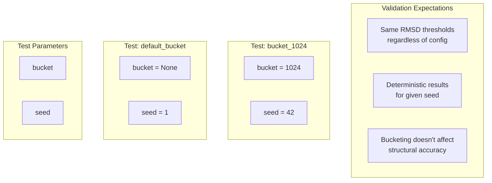

**Parameterized Test Configuration Matrix**

### Golden Output Updates

When code changes affect numerical results, golden outputs must be regenerated:

1. Run the test with output generation enabled (writes to `absltest.TEST_TMPDIR`).
2. The test automatically serializes `ResultsForSeed` objects to pickle format.
3. Copy the generated pickle file to `test_data/alphafold_run_outputs/`.
4. The test will now validate against the new golden outputs.

This approach enables:

* **Regression detection**: Any unintended changes to predictions are catchable.
* **Intentional updates**: Improvements to the model can be validated and accepted by updating golden outputs.
* **Cross-platform consistency**: Ensures predictions are reproducible across different hardware and configurations.

Sources: [run_alphafold_test.py L188-L199](https://github.com/google-deepmind/alphafold3/blob/97639fff/run_alphafold_test.py#L188-L199)

 [run_alphafold_test.py L348-L361](https://github.com/google-deepmind/alphafold3/blob/97639fff/run_alphafold_test.py#L348-L361)

## Metadata Validation

### Token Chain ID Verification

The test validates that predicted structures maintain correct chain assignments throughout the prediction pipeline:

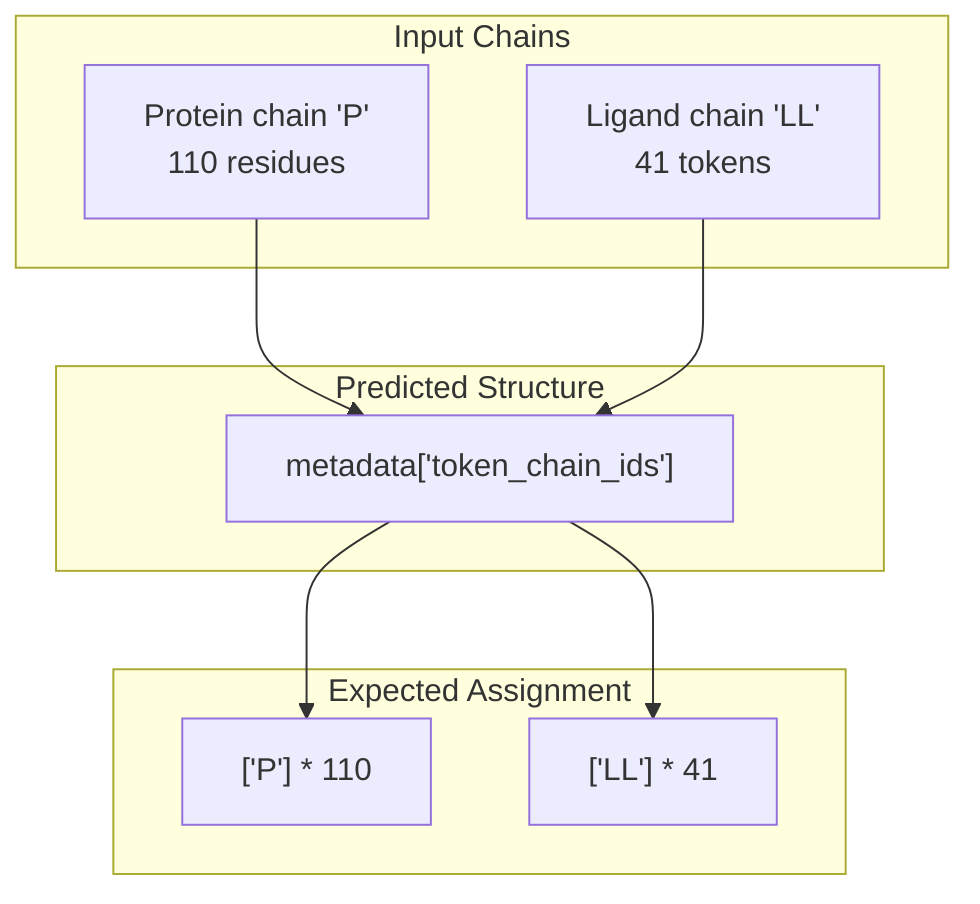

**Token Chain ID Validation**

The test also verifies:

* **Atom Occupancy**: All atoms have occupancy value of 1.0.
* **Data JSON Enrichment**: The output `_data.json` file contains populated MSAs, templates, and sequences.
* **Terms of Use**: The `TERMS_OF_USE.md` file is correctly generated.

Sources: [run_alphafold_test.py L388-L396](https://github.com/google-deepmind/alphafold3/blob/97639fff/run_alphafold_test.py#L388-L396)

## Featurized Example Testing

### Model-Only Inference

A separate test validates model inference without running the full data pipeline, using pre-computed featurized inputs:

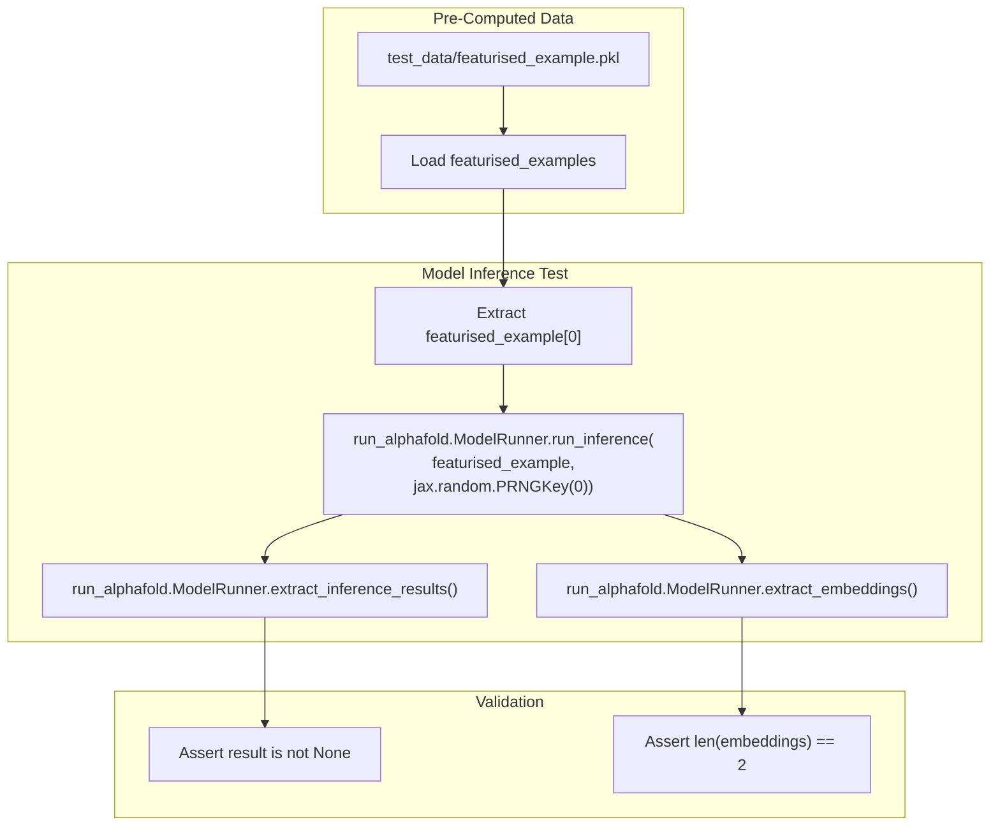

**Featurized Example Testing Flow**

This test validates:

* Model can load and process pre-featurized inputs.
* Inference produces valid results.
* Embeddings are correctly extracted (returns 2 arrays: single and pair).

This enables faster iteration when debugging model-specific issues without re-running the expensive data pipeline.

Sources: [run_alphafold_test.py L156-L176](https://github.com/google-deepmind/alphafold3/blob/97639fff/run_alphafold_test.py#L156-L176)

 [src/alphafold3/test_data/featurised_example.pkl L1](https://github.com/google-deepmind/alphafold3/blob/97639fff/src/alphafold3/test_data/featurised_example.pkl#L1-L1)

## Staged Execution Testing

### Data Pipeline vs. Inference Separation

The test framework validates that the system correctly handles staged execution, where data pipeline and inference can be run separately:

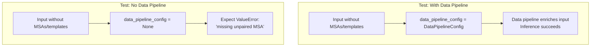

**Staged Execution Validation**

This test ensures the system properly validates inputs and fails fast when MSAs are missing but no data pipeline is configured to generate them.

Sources: [run_alphafold_test.py L177-L186](https://github.com/google-deepmind/alphafold3/blob/97639fff/run_alphafold_test.py#L177-L186)