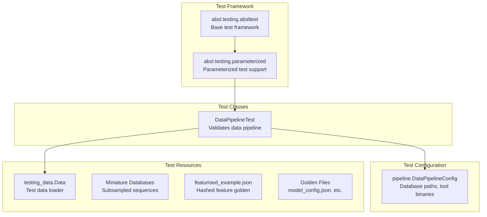
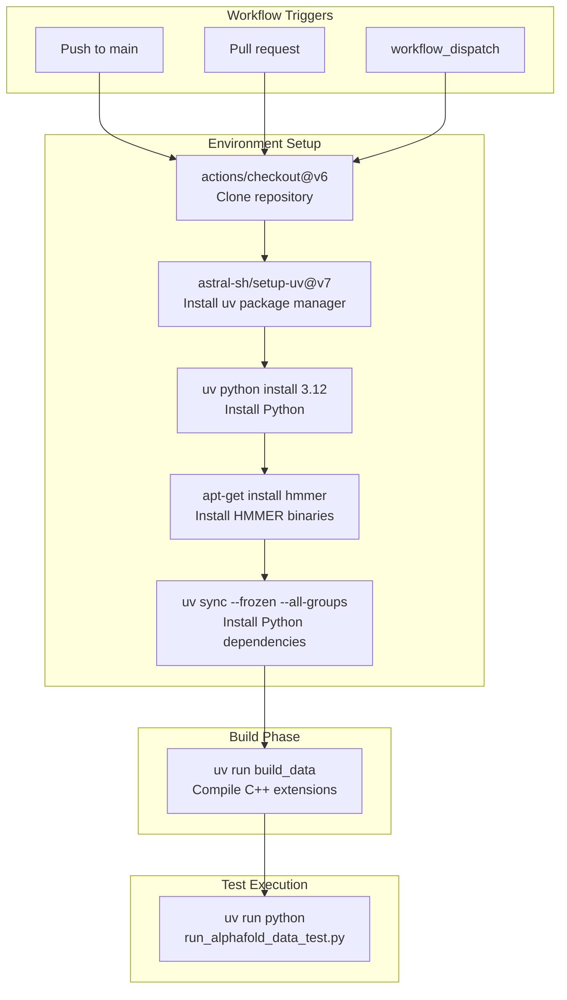
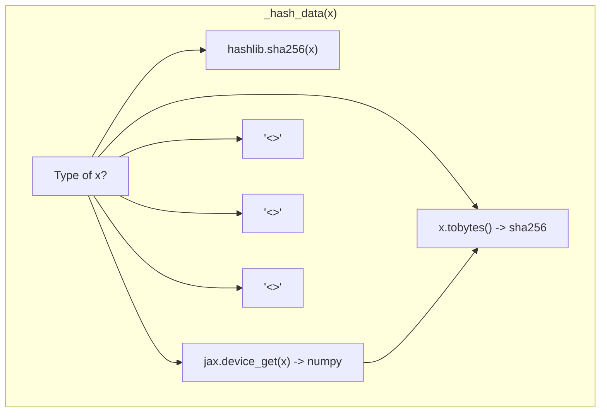

# Test Infrastructure

> **Relevant source files**
> * [.github/workflows/ci.yaml](https://github.com/google-deepmind/alphafold3/blob/97639fff/.github/workflows/ci.yaml)
> * [CONTRIBUTING.md](https://github.com/google-deepmind/alphafold3/blob/97639fff/CONTRIBUTING.md?plain=1)
> * [run_alphafold_data_test.py](https://github.com/google-deepmind/alphafold3/blob/97639fff/run_alphafold_data_test.py)
> * [src/alphafold3/test_data/featurised_example.json](https://github.com/google-deepmind/alphafold3/blob/97639fff/src/alphafold3/test_data/featurised_example.json)

## Purpose and Scope

This document describes the testing infrastructure for AlphaFold 3, including test organization, CI/CD pipeline configuration, and test execution mechanisms. This covers the structural aspects of how tests are organized and executed, including data pipeline validation and model inference testing.

## Test Organization

The AlphaFold 3 test suite is organized around integration tests that validate both the data pipeline and the model inference stages. The primary test file for the data pipeline is `run_alphafold_data_test.py` [run_alphafold_data_test.py L1-L45](https://github.com/google-deepmind/alphafold3/blob/97639fff/run_alphafold_data_test.py#L1-L45)

### Test Class Structure

**Test Class Hierarchy**

The `DataPipelineTest` class [run_alphafold_data_test.py L100-L207](https://github.com/google-deepmind/alphafold3/blob/97639fff/run_alphafold_data_test.py#L100-L207)

 extends `parameterized.TestCase`, providing support for parameterized execution of data processing stages. It initializes configurations for HMMER binaries and miniature genetic databases.

Sources: [run_alphafold_data_test.py L24-L25](https://github.com/google-deepmind/alphafold3/blob/97639fff/run_alphafold_data_test.py#L24-L25)

 [run_alphafold_data_test.py L100-L157](https://github.com/google-deepmind/alphafold3/blob/97639fff/run_alphafold_data_test.py#L100-L157)

### Test Methods and Validation

| Test Method | Purpose | Implementation Detail |
| --- | --- | --- |
| `test_config` | Validates model configuration generation | Compares generated JSON against `model_config.json` golden [run_alphafold_data_test.py L194-L201](https://github.com/google-deepmind/alphafold3/blob/97639fff/run_alphafold_data_test.py#L194-L201) |
| `test_featurisation` | Validates data pipeline and featurization | Hashes features and compares against `featurised_example.json` [run_alphafold_data_test.py L203-L207](https://github.com/google-deepmind/alphafold3/blob/97639fff/run_alphafold_data_test.py#L203-L207) |
| `compare_golden` | General utility for file comparison | Uses `difflib.unified_diff` to assert equality with golden files [run_alphafold_data_test.py L180-L192](https://github.com/google-deepmind/alphafold3/blob/97639fff/run_alphafold_data_test.py#L180-L192) |

Sources: [run_alphafold_data_test.py L15-L16](https://github.com/google-deepmind/alphafold3/blob/97639fff/run_alphafold_data_test.py#L15-L16)

 [run_alphafold_data_test.py L180-L207](https://github.com/google-deepmind/alphafold3/blob/97639fff/run_alphafold_data_test.py#L180-L207)

## CI/CD Pipeline

The continuous integration pipeline is defined in GitHub Actions and orchestrates automated testing on every push and pull request to the `main` branch.

**Pipeline Configuration**

The CI workflow [.github/workflows/ci.yaml L1-L45](https://github.com/google-deepmind/alphafold3/blob/97639fff/.github/workflows/ci.yaml#L1-L45)

 runs on `ubuntu-latest` with Python 3.12. Key features include:

* **Dependency Caching**: The `setup-uv` action caches dependencies based on `uv.lock` [.github/workflows/ci.yaml L25-L30](https://github.com/google-deepmind/alphafold3/blob/97639fff/.github/workflows/ci.yaml#L25-L30)
* **System Dependencies**: The HMMER suite (jackhmmer, nhmmer, etc.) is installed via `apt-get` [.github/workflows/ci.yaml L34-L35](https://github.com/google-deepmind/alphafold3/blob/97639fff/.github/workflows/ci.yaml#L34-L35)
* **Frozen Dependencies**: `uv sync --frozen` ensures reproducible environments [.github/workflows/ci.yaml L37-L38](https://github.com/google-deepmind/alphafold3/blob/97639fff/.github/workflows/ci.yaml#L37-L38)
* **Build Step**: The `build_data` command compiles necessary C++ extensions (like mmcif parsing) before tests run [.github/workflows/ci.yaml L40-L41](https://github.com/google-deepmind/alphafold3/blob/97639fff/.github/workflows/ci.yaml#L40-L41)
* **Execution**: The pipeline currently executes `run_alphafold_data_test.py` as a CPU-only validation step [.github/workflows/ci.yaml L43-L44](https://github.com/google-deepmind/alphafold3/blob/97639fff/.github/workflows/ci.yaml#L43-L44)

Sources: [.github/workflows/ci.yaml L1-L45](https://github.com/google-deepmind/alphafold3/blob/97639fff/.github/workflows/ci.yaml#L1-L45)

## Data Pipeline Validation

The testing infrastructure employs a hashing strategy to validate complex feature tensors without storing massive binary blobs in the repository.

### Feature Hashing Mechanism

Because the output of the data pipeline contains large JAX and NumPy arrays, `run_alphafold_data_test.py` uses a single-dispatch hashing function `_hash_data` [run_alphafold_data_test.py L54-L86](https://github.com/google-deepmind/alphafold3/blob/97639fff/run_alphafold_data_test.py#L54-L86)

This mechanism allows the system to verify that the `pipeline.DataPipeline.process` [run_alphafold_data_test.py L207](https://github.com/google-deepmind/alphafold3/blob/97639fff/run_alphafold_data_test.py#L207-L207)

 output remains consistent by comparing SHA-256 hashes of the resulting tensors against a golden JSON file `featurised_example.json` [src/alphafold3/test_data/featurised_example.json L1-L67](https://github.com/google-deepmind/alphafold3/blob/97639fff/src/alphafold3/test_data/featurised_example.json#L1-L67)

Sources: [run_alphafold_data_test.py L54-L86](https://github.com/google-deepmind/alphafold3/blob/97639fff/run_alphafold_data_test.py#L54-L86)

 [src/alphafold3/test_data/featurised_example.json L1-L67](https://github.com/google-deepmind/alphafold3/blob/97639fff/src/alphafold3/test_data/featurised_example.json#L1-L67)

### Miniature Database Configuration

The `DataPipelineTest.setUp` method [run_alphafold_data_test.py L103-L157](https://github.com/google-deepmind/alphafold3/blob/97639fff/run_alphafold_data_test.py#L103-L157)

 configures the pipeline to use subsampled "miniature" databases. This allows the full data pipeline (including MSA search) to run in a CI environment.

| Database | Source File (Subsampled) |
| --- | --- |
| BFD | `bfd-first_non_consensus_sequences__subsampled_1000.fasta` [run_alphafold_data_test.py L105-L108](https://github.com/google-deepmind/alphafold3/blob/97639fff/run_alphafold_data_test.py#L105-L108) |
| MGnify | `mgy_clusters__subsampled_1000.fa` [run_alphafold_data_test.py L109-L112](https://github.com/google-deepmind/alphafold3/blob/97639fff/run_alphafold_data_test.py#L109-L112) |
| UniProt | `uniprot_all__subsampled_1000.fasta` [run_alphafold_data_test.py L113-L116](https://github.com/google-deepmind/alphafold3/blob/97639fff/run_alphafold_data_test.py#L113-L116) |
| UniRef90 | `uniref90__subsampled_1000.fasta` [run_alphafold_data_test.py L117-L120](https://github.com/google-deepmind/alphafold3/blob/97639fff/run_alphafold_data_test.py#L117-L120) |
| RNA Central | `rnacentral_active_seq_id_90_cov_80_linclust__subsampled_1000.fasta` [run_alphafold_data_test.py L129-L132](https://github.com/google-deepmind/alphafold3/blob/97639fff/run_alphafold_data_test.py#L129-L132) |

Sources: [run_alphafold_data_test.py L105-L140](https://github.com/google-deepmind/alphafold3/blob/97639fff/run_alphafold_data_test.py#L105-L140)

## External Tool Integration

The test infrastructure integrates with external biological search tools by locating them in the system path and passing their locations to the `pipeline.DataPipelineConfig` [run_alphafold_data_test.py L141-L157](https://github.com/google-deepmind/alphafold3/blob/97639fff/run_alphafold_data_test.py#L141-L157)

| Variable | Tool | Code Reference |
| --- | --- | --- |
| `_JACKHMMER_BINARY_PATH` | jackhmmer | [run_alphafold_data_test.py L41](https://github.com/google-deepmind/alphafold3/blob/97639fff/run_alphafold_data_test.py#L41-L41) |
| `_NHMMER_BINARY_PATH` | nhmmer | [run_alphafold_data_test.py L42](https://github.com/google-deepmind/alphafold3/blob/97639fff/run_alphafold_data_test.py#L42-L42) |
| `_HMMSEARCH_BINARY_PATH` | hmmsearch | [run_alphafold_data_test.py L44](https://github.com/google-deepmind/alphafold3/blob/97639fff/run_alphafold_data_test.py#L44-L44) |
| `_HMMBUILD_BINARY_PATH` | hmmbuild | [run_alphafold_data_test.py L45](https://github.com/google-deepmind/alphafold3/blob/97639fff/run_alphafold_data_test.py#L45-L45) |

These paths are resolved using `shutil.which` [run_alphafold_data_test.py L41-L45](https://github.com/google-deepmind/alphafold3/blob/97639fff/run_alphafold_data_test.py#L41-L45)

 ensuring compatibility with both local development environments and the CI container where `hmmer` is installed via `apt` [.github/workflows/ci.yaml L35](https://github.com/google-deepmind/alphafold3/blob/97639fff/.github/workflows/ci.yaml#L35-L35)

Sources: [run_alphafold_data_test.py L38-L46](https://github.com/google-deepmind/alphafold3/blob/97639fff/run_alphafold_data_test.py#L38-L46)

 [.github/workflows/ci.yaml L35](https://github.com/google-deepmind/alphafold3/blob/97639fff/.github/workflows/ci.yaml#L35-L35)

## Development Workflow

As per the `CONTRIBUTING.md` guidelines, all changes must be manually tested and verified against the existing test suite [CONTRIBUTING.md L14-L15](https://github.com/google-deepmind/alphafold3/blob/97639fff/CONTRIBUTING.md?plain=1#L14-L15)

1. **Local Execution**: Developers run tests using `uv run python run_alphafold_data_test.py`.
2. **Golden Updates**: If changes to the pipeline are intentional, golden files (like `featurised_example.json` [src/alphafold3/test_data/featurised_example.json L1-L67](https://github.com/google-deepmind/alphafold3/blob/97639fff/src/alphafold3/test_data/featurised_example.json#L1-L67) ) must be updated to match the new hashes.
3. **CI Validation**: GitHub Actions verify that the PR doesn't break the data pipeline or configuration generation on a clean Ubuntu environment [.github/workflows/ci.yaml L12-L45](https://github.com/google-deepmind/alphafold3/blob/97639fff/.github/workflows/ci.yaml#L12-L45)

Sources: [CONTRIBUTING.md L1-L37](https://github.com/google-deepmind/alphafold3/blob/97639fff/CONTRIBUTING.md?plain=1#L1-L37)

 [.github/workflows/ci.yaml L1-L45](https://github.com/google-deepmind/alphafold3/blob/97639fff/.github/workflows/ci.yaml#L1-L45)