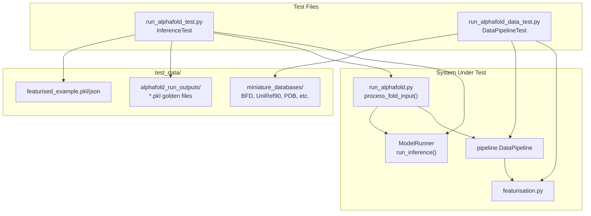
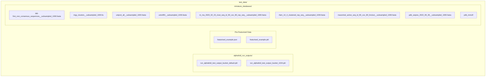
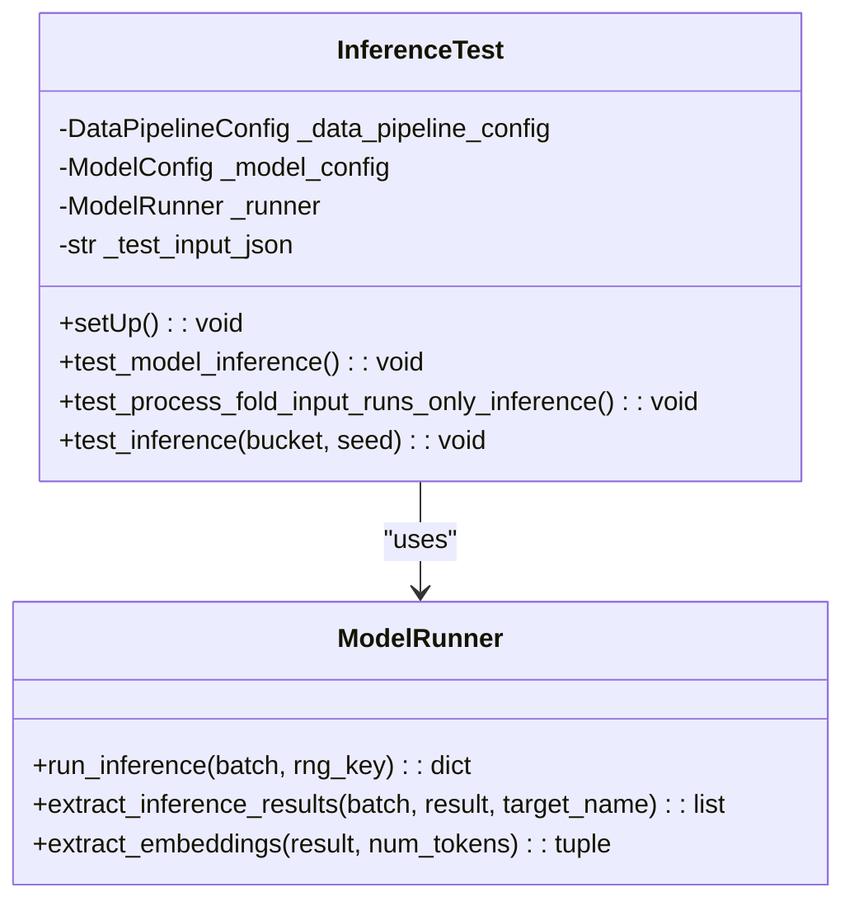
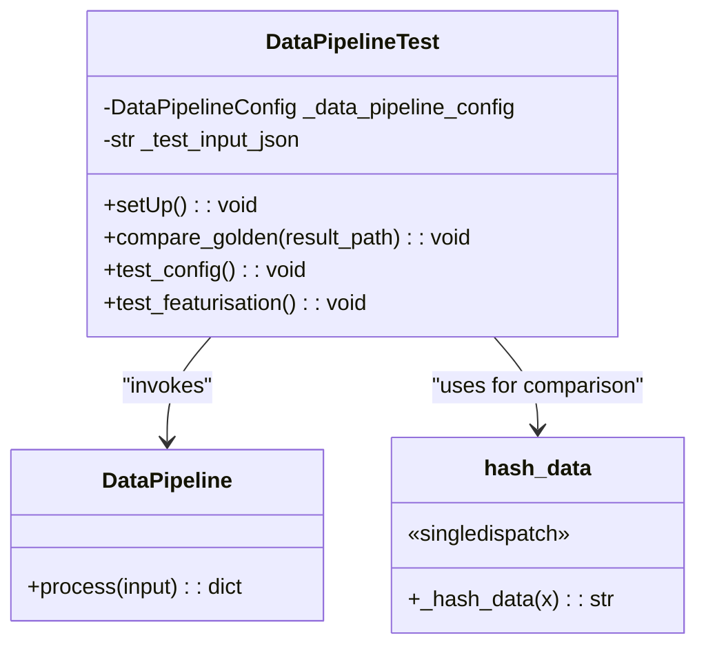
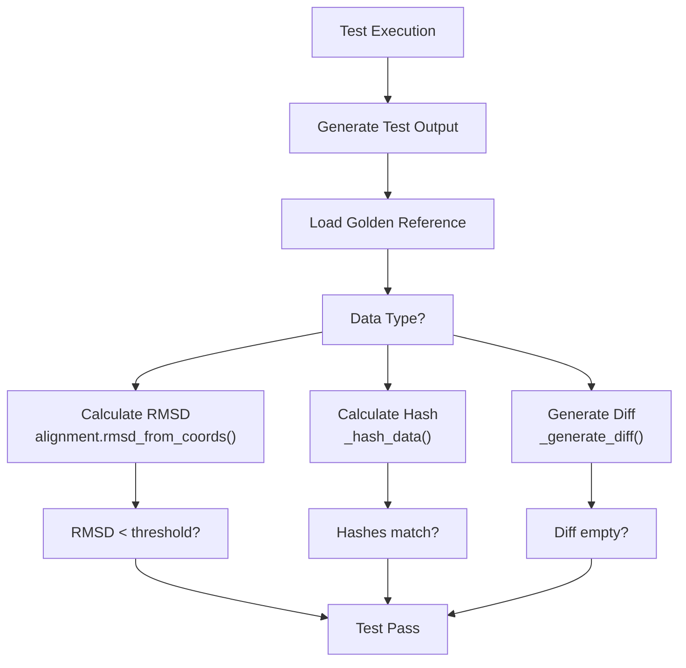
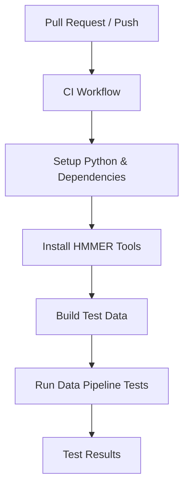

# Testing Framework

> **Relevant source files**
> * [.github/workflows/ci.yaml](https://github.com/google-deepmind/alphafold3/blob/97639fff/.github/workflows/ci.yaml)
> * [run_alphafold_data_test.py](https://github.com/google-deepmind/alphafold3/blob/97639fff/run_alphafold_data_test.py)
> * [run_alphafold_test.py](https://github.com/google-deepmind/alphafold3/blob/97639fff/run_alphafold_test.py)
> * [src/alphafold3/test_data/featurised_example.json](https://github.com/google-deepmind/alphafold3/blob/97639fff/src/alphafold3/test_data/featurised_example.json)

This document provides an overview of the testing infrastructure used in AlphaFold 3. The testing framework ensures correctness and reliability by verifying both end-to-end functionality and individual components through automated tests with golden reference data. For detailed information on test organization and CI/CD, see [Test Infrastructure](/google-deepmind/alphafold3/7.1-test-infrastructure). For validation approaches, see [Test Data and Validation](/google-deepmind/alphafold3/7.2-test-data-and-validation).

## Overview

The AlphaFold 3 testing framework consists of two primary test suites implemented in Python using the `absltest` framework:

1. **End-to-End Inference Tests** (`run_alphafold_test.py`) - Validates complete pipeline execution from input to structure prediction [run_alphafold_test.py L11](https://github.com/google-deepmind/alphafold3/blob/97639fff/run_alphafold_test.py#L11-L11)
2. **Data Pipeline Tests** (`run_alphafold_data_test.py`) - Verifies MSA generation, template search, and featurization [run_alphafold_data_test.py L11](https://github.com/google-deepmind/alphafold3/blob/97639fff/run_alphafold_data_test.py#L11-L11)

Tests compare outputs against golden reference data using RMSD calculations, hash verification, and text diffs.

**Test Suite Architecture**



Sources: [run_alphafold_test.py L66-L154](https://github.com/google-deepmind/alphafold3/blob/97639fff/run_alphafold_test.py#L66-L154)

 [run_alphafold_data_test.py L100-L207](https://github.com/google-deepmind/alphafold3/blob/97639fff/run_alphafold_data_test.py#L100-L207)

## Test Data Organization

Test data is located in `test_data/` and includes miniature databases (subsampled to ~1000 sequences each), pre-featurized examples, and golden outputs for regression testing. The miniature databases enable fast test execution while maintaining coverage of key functionality [run_alphafold_test.py L71-L105](https://github.com/google-deepmind/alphafold3/blob/97639fff/run_alphafold_test.py#L71-L105)

**Test Data Structure**



Sources: [run_alphafold_test.py L71-L105](https://github.com/google-deepmind/alphafold3/blob/97639fff/run_alphafold_test.py#L71-L105)

 [run_alphafold_data_test.py L106-L140](https://github.com/google-deepmind/alphafold3/blob/97639fff/run_alphafold_data_test.py#L106-L140)

 [src/alphafold3/test_data/featurised_example.json L1-L67](https://github.com/google-deepmind/alphafold3/blob/97639fff/src/alphafold3/test_data/featurised_example.json#L1-L67)

## End-to-End Inference Testing

The `InferenceTest` class in `run_alphafold_test.py` validates the complete pipeline from input to predicted structures. Tests use a sample input (PDB ID 5tgy with ligand 7BU) and verify outputs against golden reference data stored as pickled `InferenceResult` objects [run_alphafold_test.py L124-L144](https://github.com/google-deepmind/alphafold3/blob/97639fff/run_alphafold_test.py#L124-L144)

**InferenceTest Class Structure**



**Test Coverage**

The test suite includes:

* **`test_model_inference()`**: Validates `ModelRunner.run_inference()` [run_alphafold.py](https://github.com/google-deepmind/alphafold3/blob/97639fff/run_alphafold.py)  on pre-featurized inputs and checks embeddings extraction [run_alphafold_test.py L156-L175](https://github.com/google-deepmind/alphafold3/blob/97639fff/run_alphafold_test.py#L156-L175)
* **`test_process_fold_input_runs_only_inference()`**: Verifies error handling when MSAs are missing if the data pipeline is not configured [run_alphafold_test.py L177-L186](https://github.com/google-deepmind/alphafold3/blob/97639fff/run_alphafold_test.py#L177-L186)
* **`test_inference()`**: Full end-to-end test with parameterized bucket sizes (default, 1024), validates results against expected values [run_alphafold_test.py L188-L200](https://github.com/google-deepmind/alphafold3/blob/97639fff/run_alphafold_test.py#L188-L200)

Sources: [run_alphafold_test.py L66-L200](https://github.com/google-deepmind/alphafold3/blob/97639fff/run_alphafold_test.py#L66-L200)

## Data Pipeline Testing

The `DataPipelineTest` class validates MSA generation, template search, and featurization without requiring GPU resources. Tests use hash-based comparison of complex nested data structures to detect regressions [run_alphafold_data_test.py L55-L86](https://github.com/google-deepmind/alphafold3/blob/97639fff/run_alphafold_data_test.py#L55-L86)

**DataPipelineTest Class Structure**



**Test Coverage**

* **`test_config()`**: Validates `make_model_config()` generates correct configuration [run_alphafold_data_test.py L194-L201](https://github.com/google-deepmind/alphafold3/blob/97639fff/run_alphafold_data_test.py#L194-L201)
* **`test_featurisation()`**: Tests `pipeline.DataPipeline.process()` and compares featurized output hashes against golden references [run_alphafold_data_test.py L203-L207](https://github.com/google-deepmind/alphafold3/blob/97639fff/run_alphafold_data_test.py#L203-L207)

Sources: [run_alphafold_data_test.py L100-L207](https://github.com/google-deepmind/alphafold3/blob/97639fff/run_alphafold_data_test.py#L100-L207)

## Validation Strategies

The testing framework employs multiple validation strategies depending on the data type:

**Validation Methods**

| Method | Used For | Implementation | Tolerance |
| --- | --- | --- | --- |
| RMSD Comparison | Predicted structures | `alignment.rmsd_from_coords()` | < 3.0Å (full), < 1.4Å (high confidence) |
| Hash Verification | Featurized data | `_hash_data()` singledispatch | Exact match |
| Text Diff | JSON/config files | `difflib.unified_diff()` | Exact match |

**Regression Detection Workflow**



Sources: [run_alphafold_test.py L54-L63](https://github.com/google-deepmind/alphafold3/blob/97639fff/run_alphafold_test.py#L54-L63)

 [run_alphafold_data_test.py L55-L98](https://github.com/google-deepmind/alphafold3/blob/97639fff/run_alphafold_data_test.py#L55-L98)

 [run_alphafold_data_test.py L180-L192](https://github.com/google-deepmind/alphafold3/blob/97639fff/run_alphafold_data_test.py#L180-L192)

## Test Execution

Tests can be run locally or via CI. Local execution requires HMMER binaries and test data:

```markdown
# Run data pipeline tests (CPU only, CI-compatible)uv run python run_alphafold_data_test.py # Run inference tests (requires GPU and model parameters)uv run python run_alphafold_test.py
```

The CI pipeline (`.github/workflows/ci.yaml`) automatically runs `run_alphafold_data_test.py` on push/PR to verify data pipeline functionality [.github/workflows/ci.yaml L43-L44](https://github.com/google-deepmind/alphafold3/blob/97639fff/ .github/workflows/ci.yaml#L43-L44)

**Test Configuration Parameters**

| Parameter | Test File | Purpose | Example Value |
| --- | --- | --- | --- |
| `jackhmmer_binary_path` | Both | Path to jackhmmer executable | `shutil.which('jackhmmer')` |
| `model_dir` | InferenceTest | Directory containing model parameters | `run_alphafold.MODEL_DIR.value` |
| `flash_attention_implementation` | Both | Flash attention backend | `'triton'` |

Sources: [run_alphafold_test.py L38-L42](https://github.com/google-deepmind/alphafold3/blob/97639fff/run_alphafold_test.py#L38-L42)

 [run_alphafold_test.py L145-L154](https://github.com/google-deepmind/alphafold3/blob/97639fff/run_alphafold_test.py#L145-L154)

 [run_alphafold_data_test.py L141-L157](https://github.com/google-deepmind/alphafold3/blob/97639fff/run_alphafold_data_test.py#L141-L157)

 [.github/workflows/ci.yaml L34-L44](https://github.com/google-deepmind/alphafold3/blob/97639fff/.github/workflows/ci.yaml#L34-L44)

## Continuous Integration

The AlphaFold 3 testing framework is integrated with a CI pipeline that automatically runs the data pipeline tests on code changes:



The CI workflow currently runs `run_alphafold_data_test.py` to verify data pipeline functionality without requiring GPUs, making it suitable for standard CI environments [.github/workflows/ci.yaml L43-L44](https://github.com/google-deepmind/alphafold3/blob/97639fff/.github/workflows/ci.yaml#L43-L44)

Sources: [.github/workflows/ci.yaml L1-L45](https://github.com/google-deepmind/alphafold3/blob/97639fff/.github/workflows/ci.yaml#L1-L45)

## Implementation Details

### Hash-Based Verification

For complex data structures that are difficult to compare directly, the test framework implements a hash-based verification approach using `functools.singledispatch` [run_alphafold_data_test.py L54-L55](https://github.com/google-deepmind/alphafold3/blob/97639fff/run_alphafold_data_test.py#L54-L55)

 This handles various types including `jax.Array`, `np.ndarray`, and custom objects like `Structure` [run_alphafold_data_test.py L61-L86](https://github.com/google-deepmind/alphafold3/blob/97639fff/run_alphafold_data_test.py#L61-L86)

### Diff Generation

The framework uses `difflib.unified_diff` to highlight differences between expected and actual outputs [run_alphafold_test.py L54-L63](https://github.com/google-deepmind/alphafold3/blob/97639fff/run_alphafold_test.py#L54-L63)

 [run_alphafold_data_test.py L88-L97](https://github.com/google-deepmind/alphafold3/blob/97639fff/run_alphafold_data_test.py#L88-L97)

## Related Pages

* [Test Infrastructure](/google-deepmind/alphafold3/7.1-test-infrastructure) — Detailed documentation of CI/CD and execution.
* [Test Data and Validation](/google-deepmind/alphafold3/7.2-test-data-and-validation) — Deep dive into RMSD validation and golden files.
* [Data Pipeline](/google-deepmind/alphafold3/4.2-data-pipeline) — Details on the pipeline components being tested.
* [Featurization](/google-deepmind/alphafold3/4.3-featurization) — Information about the featurization process verified in tests.
* [Model Inference](/google-deepmind/alphafold3/4.4-model-inference) — Details on the inference process validated by the test framework.