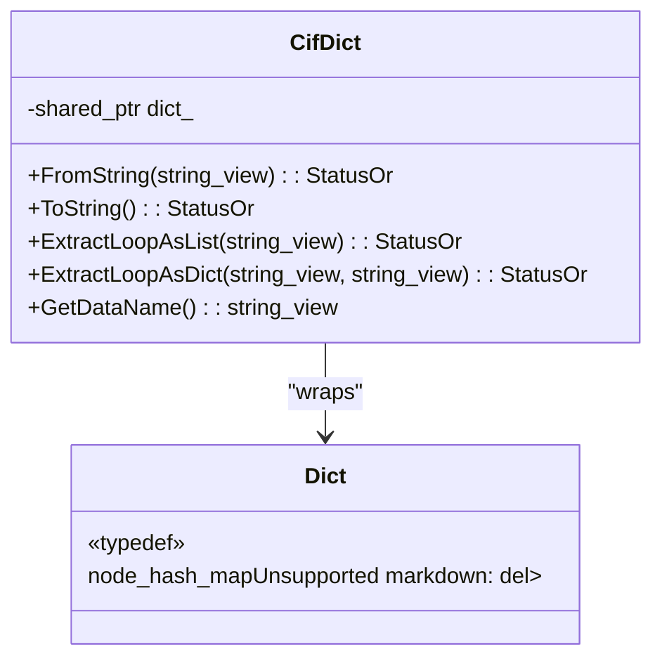
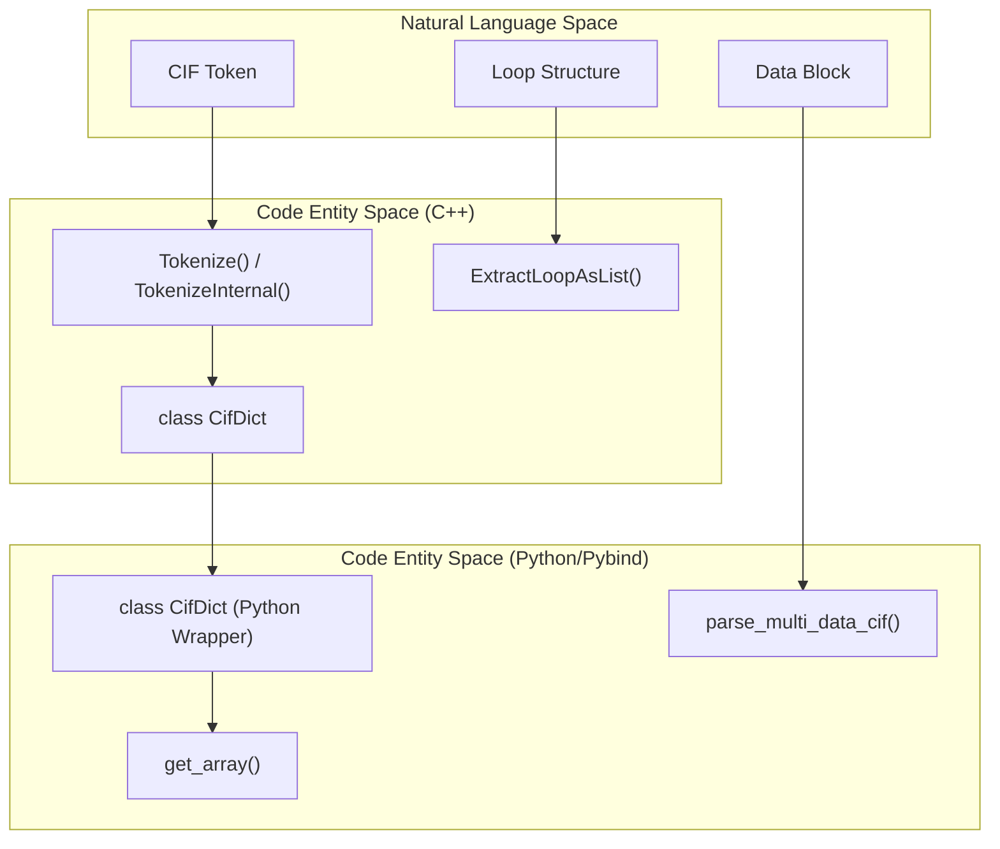
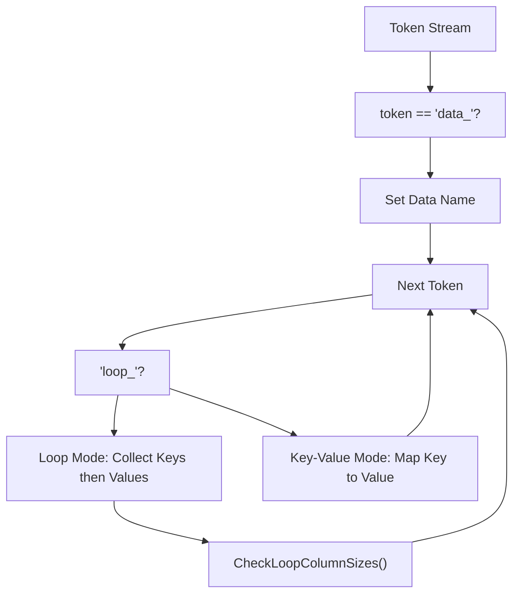

# mmCIF Format

> **Relevant source files**
> * [src/alphafold3/constants/chemical_components.py](https://github.com/google-deepmind/alphafold3/blob/97639fff/src/alphafold3/constants/chemical_components.py)
> * [src/alphafold3/constants/converters/ccd_pickle_gen.py](https://github.com/google-deepmind/alphafold3/blob/97639fff/src/alphafold3/constants/converters/ccd_pickle_gen.py)
> * [src/alphafold3/parsers/cpp/cif_dict.pyi](https://github.com/google-deepmind/alphafold3/blob/97639fff/src/alphafold3/parsers/cpp/cif_dict.pyi)
> * [src/alphafold3/parsers/cpp/cif_dict_lib.cc](https://github.com/google-deepmind/alphafold3/blob/97639fff/src/alphafold3/parsers/cpp/cif_dict_lib.cc)
> * [src/alphafold3/parsers/cpp/cif_dict_lib.h](https://github.com/google-deepmind/alphafold3/blob/97639fff/src/alphafold3/parsers/cpp/cif_dict_lib.h)
> * [src/alphafold3/parsers/cpp/cif_dict_pybind.cc](https://github.com/google-deepmind/alphafold3/blob/97639fff/src/alphafold3/parsers/cpp/cif_dict_pybind.cc)
> * [src/alphafold3/parsers/cpp/cif_dict_pybind.h](https://github.com/google-deepmind/alphafold3/blob/97639fff/src/alphafold3/parsers/cpp/cif_dict_pybind.h)

## Purpose and Scope

This document describes the low-level mmCIF (macromolecular Crystallographic Information File) parsing and serialization implemented in the `CifDict` library. The library provides a C++-based parser that converts mmCIF text into a dictionary-like structure and back. This page covers tokenization rules, loop structures, serialization logic, and the Python interface.

For details on converting these parsed dictionaries into high-level structural models, see [Structure Parsing](/google-deepmind/alphafold3/10.2-structure-parsing).

## Overview

AlphaFold 3 utilizes a custom C++ parser implemented in `cif_dict_lib.cc` to handle the CIF v1.1 specification. The parser is exposed to Python via `pybind11` in `cif_dict_pybind.cc`. This implementation is optimized for the large datasets typical of the Protein Data Bank (PDB), such as the Chemical Component Dictionary (CCD).

**Sources:** [src/alphafold3/parsers/cpp/cif_dict_lib.cc L11-L40](https://github.com/google-deepmind/alphafold3/blob/97639fff/src/alphafold3/parsers/cpp/cif_dict_lib.cc#L11-L40)

 [src/alphafold3/parsers/cpp/cif_dict_pybind.cc L34-L41](https://github.com/google-deepmind/alphafold3/blob/97639fff/src/alphafold3/parsers/cpp/cif_dict_pybind.cc#L34-L41)

## CifDict Architecture

### Core Data Structure

The `CifDict` class manages a shared dictionary (`Dict`) mapping string keys to vectors of string values.

Title: CifDict Class Structure

**Sources:** [src/alphafold3/parsers/cpp/cif_dict_lib.h L30-L120](https://github.com/google-deepmind/alphafold3/blob/97639fff/src/alphafold3/parsers/cpp/cif_dict_lib.h#L30-L120)

 [src/alphafold3/parsers/cpp/cif_dict_lib.cc L358-L478](https://github.com/google-deepmind/alphafold3/blob/97639fff/src/alphafold3/parsers/cpp/cif_dict_lib.cc#L358-L478)

### Code Entity Mapping

This diagram bridges the natural language concepts of mmCIF parsing to the specific C++ and Python entities.

Title: mmCIF Concept to Code Mapping

**Sources:** [src/alphafold3/parsers/cpp/cif_dict_lib.h L42-L143](https://github.com/google-deepmind/alphafold3/blob/97639fff/src/alphafold3/parsers/cpp/cif_dict_lib.h#L42-L143)

 [src/alphafold3/parsers/cpp/cif_dict_pybind.cc L415-L520](https://github.com/google-deepmind/alphafold3/blob/97639fff/src/alphafold3/parsers/cpp/cif_dict_pybind.cc#L415-L520)

 [src/alphafold3/parsers/cpp/cif_dict.pyi L17-L127](https://github.com/google-deepmind/alphafold3/blob/97639fff/src/alphafold3/parsers/cpp/cif_dict.pyi#L17-L127)

## Tokenization Process

### Tokenization Pipeline

The tokenizer handles whitespace, comments, and complex quoting rules. It uses `string_view` to point into the original buffer whenever possible to minimize copies.

| Token Category | Identification Rule | Implementation |
| --- | --- | --- |
| **Inline** | Separated by whitespace or tabs. | `SplitLineInline` [src/alphafold3/parsers/cpp/cif_dict_lib.cc L47-L105](https://github.com/google-deepmind/alphafold3/blob/97639fff/src/alphafold3/parsers/cpp/cif_dict_lib.cc#L47-L105) |
| **Quoted** | Enclosed in `'` or `"` at token boundaries. | `IsQuote` [src/alphafold3/parsers/cpp/cif_dict_lib.cc L43](https://github.com/google-deepmind/alphafold3/blob/97639fff/src/alphafold3/parsers/cpp/cif_dict_lib.cc#L43-L43) |
| **Multiline** | Starts with `;` at the beginning of a line. | `TokenizeInternal` [src/alphafold3/parsers/cpp/cif_dict_lib.cc L125-L145](https://github.com/google-deepmind/alphafold3/blob/97639fff/src/alphafold3/parsers/cpp/cif_dict_lib.cc#L125-L145) |
| **Comments** | Starts with `#`; ignored until end of line. | `SplitLineInline` [src/alphafold3/parsers/cpp/cif_dict_lib.cc L63-L65](https://github.com/google-deepmind/alphafold3/blob/97639fff/src/alphafold3/parsers/cpp/cif_dict_lib.cc#L63-L65) |

**Sources:** [src/alphafold3/parsers/cpp/cif_dict_lib.cc L42-L154](https://github.com/google-deepmind/alphafold3/blob/97639fff/src/alphafold3/parsers/cpp/cif_dict_lib.cc#L42-L154)

### Quoting Rules for Serialization

When converting back to string (`ToString`), the library applies specific quoting logic:

1. **Trivial Tokens**: No quotes if characters are `[A-Za-z0-9.?-]`. [src/alphafold3/parsers/cpp/cif_dict_lib.cc L158-L166](https://github.com/google-deepmind/alphafold3/blob/97639fff/src/alphafold3/parsers/cpp/cif_dict_lib.cc#L158-L166)
2. **Reserved Keywords**: Tokens starting with `data_`, `loop_`, `save_`, `stop_`, or `global_` must be quoted. [src/alphafold3/parsers/cpp/cif_dict_lib.cc L192-L198](https://github.com/google-deepmind/alphafold3/blob/97639fff/src/alphafold3/parsers/cpp/cif_dict_lib.cc#L192-L198)
3. **Special Characters**: Tokens starting with `_`, `#`, `$`, `[`, `]`, or `;` must be quoted. [src/alphafold3/parsers/cpp/cif_dict_lib.cc L201-L205](https://github.com/google-deepmind/alphafold3/blob/97639fff/src/alphafold3/parsers/cpp/cif_dict_lib.cc#L201-L205)
4. **Multiline**: If a token contains a newline or both quote types, it is written as a multiline block starting with `;`. [src/alphafold3/parsers/cpp/cif_dict_lib.cc L170-L183](https://github.com/google-deepmind/alphafold3/blob/97639fff/src/alphafold3/parsers/cpp/cif_dict_lib.cc#L170-L183)

**Sources:** [src/alphafold3/parsers/cpp/cif_dict_lib.cc L158-L229](https://github.com/google-deepmind/alphafold3/blob/97639fff/src/alphafold3/parsers/cpp/cif_dict_lib.cc#L158-L229)

## Parsing and Loop Structures

### Main Parsing Logic

The parser iterates through tokens, switching between single-key and loop modes.

Title: mmCIF Parsing State Machine

**Sources:** [src/alphafold3/parsers/cpp/cif_dict_lib.cc L358-L478](https://github.com/google-deepmind/alphafold3/blob/97639fff/src/alphafold3/parsers/cpp/cif_dict_lib.cc#L358-L478)

### Loop Extraction

The `CifDict` provides specialized methods to convert tabular loop data into structured formats:

* **`ExtractLoopAsList(prefix)`**: Returns a list of dictionaries, where each dictionary represents one row. [src/alphafold3/parsers/cpp/cif_dict_lib.cc L614-L645](https://github.com/google-deepmind/alphafold3/blob/97639fff/src/alphafold3/parsers/cpp/cif_dict_lib.cc#L614-L645)
* **`ExtractLoopAsDict(prefix, index)`**: Returns a nested dictionary indexed by a specific column (e.g., atom ID). [src/alphafold3/parsers/cpp/cif_dict_lib.cc L647-L680](https://github.com/google-deepmind/alphafold3/blob/97639fff/src/alphafold3/parsers/cpp/cif_dict_lib.cc#L647-L680)

**Sources:** [src/alphafold3/parsers/cpp/cif_dict_lib.h L47-L74](https://github.com/google-deepmind/alphafold3/blob/97639fff/src/alphafold3/parsers/cpp/cif_dict_lib.h#L47-L74)

## Python Integration and NumPy Support

The `CifDict` is highly optimized for Python via `cif_dict_pybind.cc`. A key feature is `get_array()`, which allows direct conversion of mmCIF columns into NumPy arrays with specific dtypes.

### NumPy Array Conversion (get_array)

The implementation uses `GatherArray` to efficiently map string values to numerical or object arrays.

| Feature | Implementation Detail |
| --- | --- |
| **Dtypes** | Supports `int16/32/64`, `uint16/32/64`, `float32/64`, and `object`. |
| **String Interning** | `ConvertStrings` ensures identical strings reference the same Python object. |
| **Missing Values** | Treat `.` or `?` as `NaN` for float arrays. |
| **Gathering** | Supports slices or index arrays to extract subsets of data. |

**Sources:** [src/alphafold3/parsers/cpp/cif_dict_pybind.cc L46-L188](https://github.com/google-deepmind/alphafold3/blob/97639fff/src/alphafold3/parsers/cpp/cif_dict_pybind.cc#L46-L188)

 [src/alphafold3/parsers/cpp/cif_dict_pybind.cc L192-L233](https://github.com/google-deepmind/alphafold3/blob/97639fff/src/alphafold3/parsers/cpp/cif_dict_pybind.cc#L192-L233)

 [src/alphafold3/parsers/cpp/cif_dict.pyi L83-L106](https://github.com/google-deepmind/alphafold3/blob/97639fff/src/alphafold3/parsers/cpp/cif_dict.pyi#L83-L106)

## Chemical Components (CCD) Handling

AlphaFold 3 uses the `CifDict` library to parse the PDB Chemical Component Dictionary.

1. **Pickle Generation**: `ccd_pickle_gen.py` reads the large `components.cif` file, parses it using `parse_multi_data_cif`, and saves it as a high-speed pickle. [src/alphafold3/constants/converters/ccd_pickle_gen.py L22-L47](https://github.com/google-deepmind/alphafold3/blob/97639fff/src/alphafold3/constants/converters/ccd_pickle_gen.py#L22-L47)
2. **Ccd Class**: A Python wrapper that provides read-only access to the CCD data. It supports overriding entries with a `user_ccd` string. [src/alphafold3/constants/chemical_components.py L37-L73](https://github.com/google-deepmind/alphafold3/blob/97639fff/src/alphafold3/constants/chemical_components.py#L37-L73)
3. **Component Info**: The `mmcif_to_info` function converts the raw `CifDict` mappings into a structured `ComponentInfo` dataclass, extracting fields like SMILES and standard parent IDs. [src/alphafold3/constants/chemical_components.py L117-L168](https://github.com/google-deepmind/alphafold3/blob/97639fff/src/alphafold3/constants/chemical_components.py#L117-L168)

**Sources:** [src/alphafold3/constants/chemical_components.py L11-L168](https://github.com/google-deepmind/alphafold3/blob/97639fff/src/alphafold3/constants/chemical_components.py#L11-L168)

 [src/alphafold3/constants/converters/ccd_pickle_gen.py L11-L50](https://github.com/google-deepmind/alphafold3/blob/97639fff/src/alphafold3/constants/converters/ccd_pickle_gen.py#L11-L50)