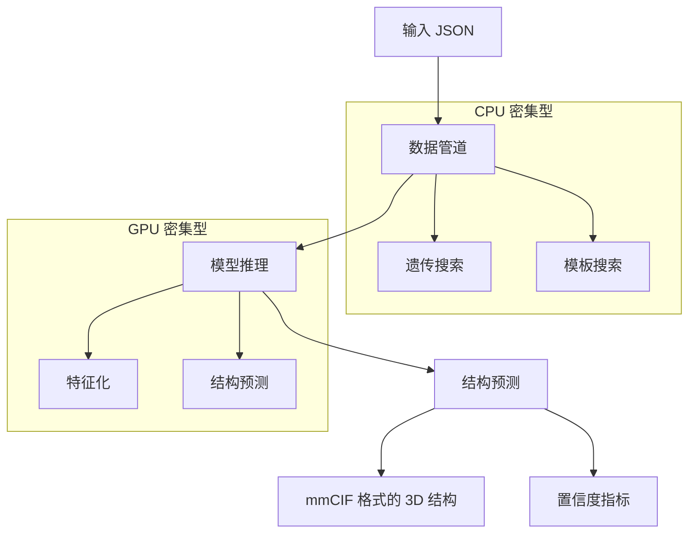

---
slug:1-overview
blog_type:normal
---

AlphaFold 3 是谷歌 DeepMind 开发的用于生物分子结构预测的最新 AI 系统。这一革命性工具在计算结构生物学领域取得了重大突破，使研究人员能够以前所未有的精度预测复杂生物分子的三维结构及其相互作用。本概述将向您介绍 AlphaFold 3 的功能、工作流程和需求。

## 什么是 AlphaFold 3？

AlphaFold 3 是一个深度学习系统，旨在根据生物分子复合物的序列预测其三维结构。它在 AlphaFold 2 的基础上进行了扩展，极大地增加了其可以建模的分子和相互作用的范围。

与之前的版本不同，AlphaFold 3 不仅可以预测蛋白质结构，还可以预测 RNA 和 DNA 结构、配体结合、翻译后修饰以及多个链和分子之间的复杂相互作用。这一能力使研究人员能够以前所未有的细节水平研究生物过程，从而可能加速从基础科学到药物设计等领域的发现。

## 关键特性与能力

### 多样化的生物分子预测

AlphaFold 3 可以准确预测以下类型的结构：

| 生物分子类型 | 特性 |
|--------------|------|
| 蛋白质 | 天然序列，翻译后修饰 |
| RNA | 天然序列，修饰碱基 |
| DNA | 天然序列，修饰碱基 |
| 配体 | CCD 码，SMILES 字符串，自定义定义 |
| 复合物 | 具有定义相互作用的多个链 |

AlphaFold 3 支持指定实体之间的共价键，使得建模复杂结构（如糖基化蛋白质或共价结合的药物分子）成为可能。

### 灵活的输入选项

系统接受自定义 JSON 输入格式，提供了对预测过程的广泛控制：

- 指定蛋白质、RNA 和 DNA 链，包括修饰残基
- 使用化学成分字典码或 SMILES 表示法定义配体
- 提供自定义多序列比对（MSA）或结构模板
- 在实体之间创建共价键
- 定义具有多个链和相互作用的复杂结构

<CgxTip>
对于大多数用例，您只需在 JSON 文件中提供生物分子的序列，AlphaFold 3 将处理其余部分。高级选项（如自定义 MSA 和模板）适用于希望对预测过程有更多控制的专家用户。
</CgxTip>

### 全面输出

AlphaFold 3 生成详细的输出，包括：

- mmCIF 格式的 3D 结构预测
- 整个结构和特定相互作用的置信度指标
- 详细的原子和残基置信度评分
- 可选的距阵图和嵌入，用于进一步分析

置信度指标帮助研究人员评估预测结构中哪些部分最为可靠，从而指导实验验证和解释。

## AlphaFold 3 的工作原理

AlphaFold 3 的工作流程包括两个主要阶段：

1. **数据管道（CPU 密集型）**
   - 执行遗传搜索以构建多序列比对（MSA）
   - 搜索蛋白质的结构模板
   - 可以在仅支持 CPU 的机器上单独运行

2. **模型推理（GPU 密集型）**
   - 处理特征以预测 3D 结构
   - 生成预测的置信度指标
   - 需要兼容的 NVIDIA GPU

这些阶段可以一起运行，也可以单独运行，从而在不同的计算环境中实现灵活部署。

## 系统需求

### 硬件

AlphaFold 3 有显著的硬件需求：

- **GPU**：NVIDIA GPU，计算能力 8.0 或更高（推荐 A100 或 H100）
- **内存**：至少 64GB RAM 用于数据管道
- **存储**：最多 1TB 用于遗传数据库（推荐 SSD 以提高性能）
- **操作系统**：Linux（不支持其他操作系统）

为了获得最佳性能，推荐使用 NVIDIA A100（80GB）或 H100（80GB），可以处理最多 5,120 个标记的输入。对于更大的输入或内存较小的 GPU，需要额外的配置。

### 软件 & 数据

- **容器运行时**：Docker 或 Singularity
- **遗传数据库**：需要多个数据库（BFD、MGnify、PDB 等）
- **模型参数**：通过请求表单获得批准后访问
- **CUDA 驱动程序**：与安装的 GPU 兼容

数据库的总下载大小约为 252GB，解压后扩展到 630GB。

## 实际考虑

### 性能

AlphaFold 3 的性能根据输入大小而变化：

| 标记数 | A100 80GB（秒） | H100 80GB（秒） |
|--------|-----------------|-----------------|
| 1024   | 62              | 34              |
| 2048   | 275             | 144             |
| 3072   | 703             | 367             |
| 4096   | 1434            | 774             |
| 5120   | 2547            | 1416            |

数据管道的运行时间取决于输入大小、找到的同源序列数量和硬件能力。为了获得最佳性能，推荐使用 SSD 或 RAM 支持的文件系统。

### 模型参数访问

要使用 AlphaFold 3，您必须通过谷歌 DeepMind 提供的表单请求访问模型参数。访问权限由谷歌 DeepMind 自行决定，模型参数的使用受特定条款和条件的约束。

## 下一步？

现在您已经对 AlphaFold 3 有了高层次的了解，您可以：

1. 按照快速入门指南运行您的首次预测
2. 了解详细的安装步骤
3. 设置所需的数据库
4. 了解如何准备输入文件

对于希望深入了解的开发者，可以探索架构概述和模型组件及算法部分。