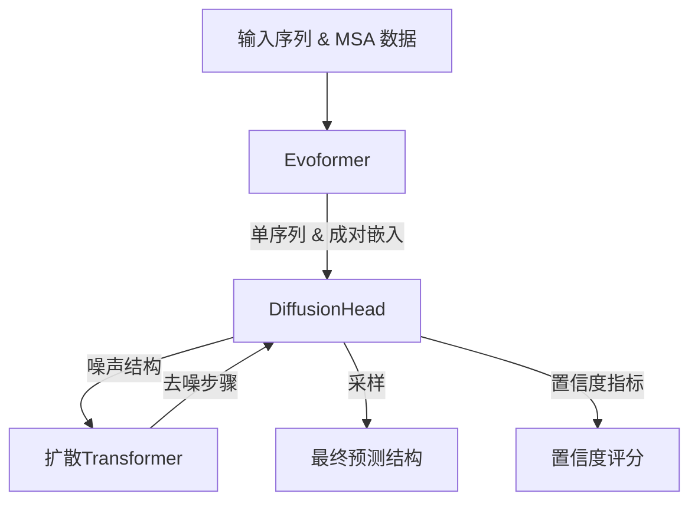
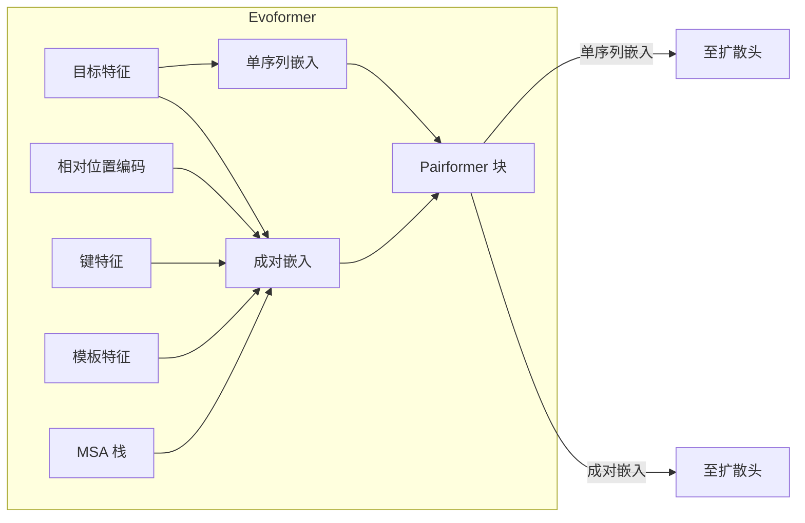
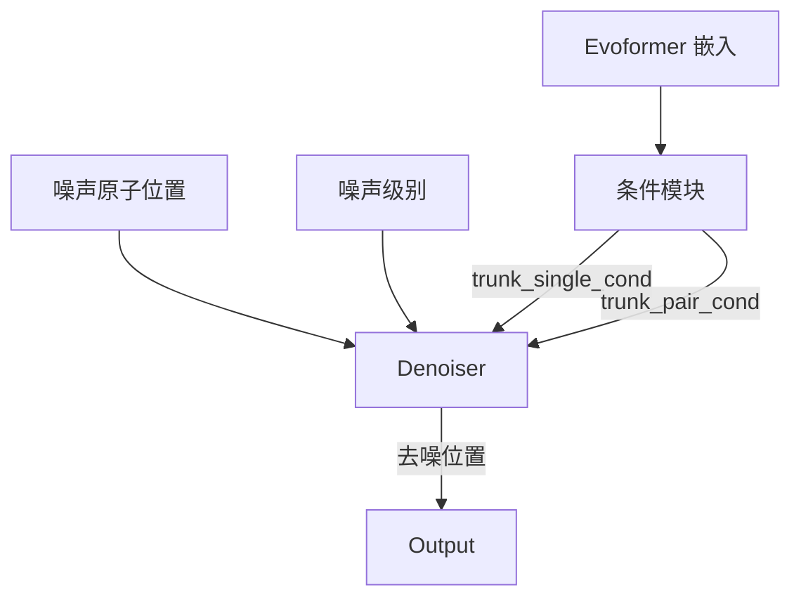
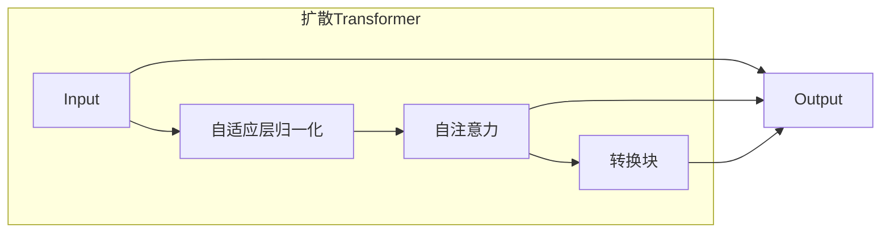
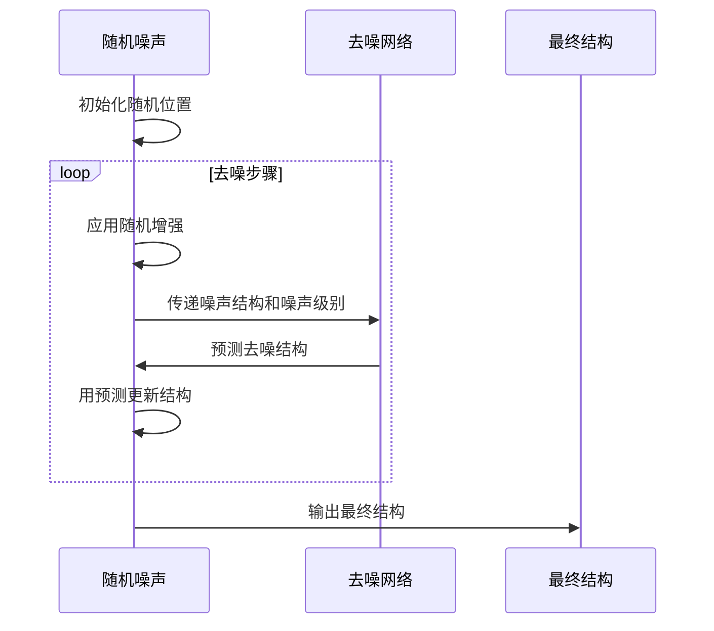

---
slug:10-model-components-and-algorithms
blog_type:normal
---


AlphaFold 3 通过其新颖的架构，结合进化信息处理和去噪扩散模型，在蛋白质结构预测方面取得了显著进展。本文档详细介绍了模型的核心组件和支撑其预测的算法。

## 架构概述

AlphaFold 3 使用基于扩散的架构生成高质量的3D蛋白质结构。该模型处理输入序列和可选的进化信息，以创建指导去噪扩散过程的表示。



来源：[model.py](src/alphafold3/model/model.py)

## 核心组件

### Evoformer

Evoformer 从序列和进化数据中创建信息丰富的嵌入。它处理输入序列、MSA、模板和共价键信息，生成两种主要类型的嵌入：

- **单序列嵌入**：标记级别（残基级别）的表示
- **成对嵌入**：标记之间的成对关系



Evoformer 的关键特性：

1. **序列成对嵌入**：从序列中创建初始成对嵌入。
2. **相对位置编码**：使用相对位置编码添加位置信息。
3. **键特征嵌入**：整合标记之间的共价键信息。
4. **模板嵌入**：在可用时整合模板信息。
5. **MSA 处理**：处理多序列比对以获取进化信息。
6. **Pairformer 块**：通过注意力机制迭代优化表示。

来源：[evoformer.py](src/alphafold3/model/network/evoformer.py)

### 扩散头

扩散头负责实现生成3D蛋白质结构的去噪扩散过程。它使用一个条件扩散模型，其中条件来自 Evoformer 的嵌入。



关键组件：

1. **条件模块**：处理 Evoformer 嵌入以创建去噪网络的条件信号。
2. **原子交叉注意力**：在标记级别特征和原子级别结构之间实现注意力机制。
3. **去噪网络**：给定噪声输入和噪声级别，预测去噪结构。

来源：[diffusion_head.py](src/alphafold3/model/network/diffusion_head.py)

### 扩散Transformer

扩散Transformer在去噪步骤中处理信息。它由专门用于扩散过程的Transformer块组成：



关键组件：

1. **自适应层归一化**：条件感知归一化。
2. **自注意力**：带可选成对信息的多头注意力机制。
3. **转换块**：带有swish激活和门控线性单元的非线性变换。

来源：[diffusion_transformer.py](src/alphafold3/model/network/diffusion_transformer.py)

## 扩散过程

AlphaFold 3 使用条件去噪扩散模型生成蛋白质结构。该过程包括：

### 噪声调度

模型使用精心设计的噪声调度来控制扩散过程：

```python
def noise_schedule(t, smin=0.0004, smax=160.0, p=7):
  return (
      SIGMA_DATA
      * (smax ** (1 / p) + t * (smin ** (1 / p) - smax ** (1 / p))) ** p
  )
```

该调度逐渐将噪声从最大值（`smax`）减少到最小值（`smin`），随着采样的进行。

来源：[diffusion_head.py](src/alphafold3/model/network/diffusion_head.py)

### 采样过程

采样过程迭代去噪蛋白质结构：

1. **初始化**：从随机噪声开始
2. **迭代去噪**：应用去噪网络逐步去除噪声
3. **随机增强**：在去噪过程中应用旋转和平移以保持不变性
4. **噪声添加**：在采样过程中添加受控噪声以改进探索



来源：[diffusion_head.py](src/alphafold3/model/network/diffusion_head.py)

## 置信度度量

AlphaFold 3 提供多种置信度指标以评估预测质量：

1. **pTM（预测TM评分）**：预测模型的TM评分，评估整体结构质量。
2. **ipTM（接口预测TM评分）**：专注于多链复合物中的接口质量。
3. **pDME（预测距离误差）**：预测每个残基的预期距离误差。
4. **PAE（预测对齐误差）**：估计残基对之间定位的错误。

<CgxTip>
在使用AlphaFold 3的置信度指标时，ranking_confidence评分（结合多个指标）通常是评估整体预测质量的最佳单一指标。
</CgxTip>

来源：[model.py](src/alphafold3/model/model.py), [confidences.py](src/alphafold3/model/confidences.py)

## 关键创新

### 原子级交叉注意力

AlphaFold 3 使用原子级交叉注意力机制来模拟蛋白质结构中原子之间的相互作用：

```python
def atom_cross_att_encoder(
    token_atoms_act, trunk_single_cond, trunk_pair_cond,
    config, global_config, batch, name
)
```

这使模型能够在保持标记级别表示的同时推理原子间的相互作用。

来源：[atom_cross_attention.py](src/alphafold3/model/network/atom_cross_attention.py)

### AdaLN-Zero条件化

模型采用自适应层归一化与零初始化（AdaLN-Zero）以实现有效条件化：

```python
def adaptive_zero_init(
    x, num_channels, single_cond, global_config, name
):
  if single_cond is None:
    output = hm.Linear(
        num_channels,
        initializer=global_config.final_init,
        name=f'{name}transition2',
    )(x)
  else:
    output = hm.Linear(num_channels, name=f'{name}transition2')(x)
    cond = hm.Linear(
        output.shape[-1],
        initializer='zeros',
        use_bias=True,
        bias_init=-2.0,
        name=f'{name}adaptive_zero_cond',
    )(single_cond)
    output = jax.nn.sigmoid(cond) * output
  return output
```

这种方法为条件信息通过模型提供了一个信号控制的路径。

来源：[diffusion_transformer.py](src/alphafold3/model/network/diffusion_transformer.py)

## 模型训练与推理

### 训练过程

虽然训练代码不包含在此存储库中，但模型架构表明AlphaFold 3是通过以下方式训练的：

1. 结合去噪评分匹配和变分扩散目标
2. 随机增强（旋转和平移）以实现旋转/平移不变性
3. 条件dropout以在输入信息不同水平下进行灵活推理

### 推理流程

在推理过程中，模型：

1. 通过Evoformer处理输入序列和可选MSA数据
2. 运行多次循环以优化嵌入
3. 使用扩散过程采样蛋白质结构
4. 计算预测结构的置信度指标

```python
def __call__(self, batch: features.BatchDict, key: jax.Array | None = None) -> ModelResult:
    # 通过Evoformer处理批次
    embedding_module = evoformer_network.Evoformer(self.config.evoformer, self.global_config)
    target_feat = create_target_feat_embedding(batch=batch, config=embedding_module.config, global_config=self.global_config)
    
    # 运行循环
    num_iter = self.config.num_recycles + 1
    embeddings, _ = hk.fori_loop(0, num_iter, recycle_body, (embeddings, key))
    
    # 从扩散模型采样
    samples = self._sample_diffusion(batch, embeddings, sample_config=self.config.heads.diffusion.eval)
    
    # 计算置信度指标
    confidence_output = mapping.sharded_map(...)(samples['atom_positions'])
```

来源：[model.py](src/alphafold3/model/model.py)

## 结论

AlphaFold 3的架构结合了进化信息处理和去噪扩散模型，以生成准确的蛋白质结构预测。模型的关键创新包括：

1. 通过Evoformer实现标记级别和成对嵌入
2. 条件去噪扩散用于结构生成
3. 原子级交叉注意力机制
4. 用于预测质量评估的高级置信度指标

这一架构使AlphaFold 3能够处理广泛的蛋白质结构预测任务，包括多链复合物，且具有高准确性。