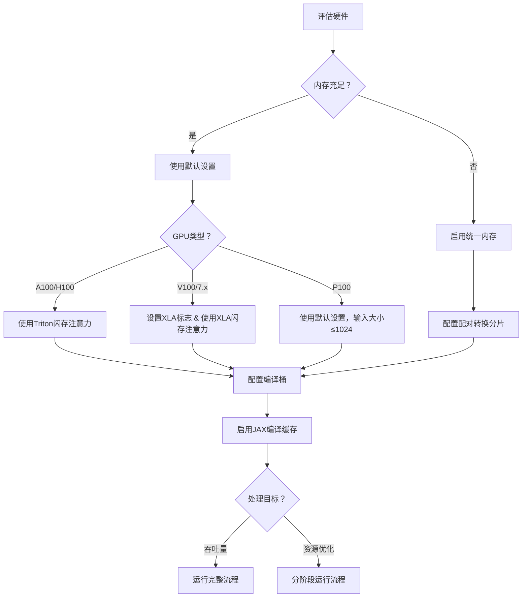

---
slug:11-performance-benchmarks
blog_type:normal
---


本指南提供了运行AlphaFold3的详细性能基准和优化策略。涵盖了硬件要求、推理时间、内存优化以及在不同设置下实现最佳性能的配置建议。

## 硬件性能比较

AlphaFold3已在特定的GPU配置上进行了广泛测试，以确保数值准确性和吞吐量效率。以下是不同硬件设置的基准测试结果比较。

### 官方硬件支持

AlphaFold3官方支持并已彻底测试以下配置：

| GPU配置 | 内存 | 最大令牌数 | 特殊要求 |
|----------|------|------------|----------|
| NVIDIA A100 | 80 GB | 5,120 | 无 |
| NVIDIA H100 | 80 GB | 5,120 | 无 |

来源：[performance.md#L61-L67](docs/performance.md#L61-L67)

### 推理时间比较

在比较A100和H100的单GPU性能时：

| 令牌数 | 1 A100 80 GB（秒） | 1 H100 80 GB（秒） | 加速（H100 vs A100） |
|--------|-------------------|-------------------|----------------------|
| 1024   | 62                | 34                | 1.82x                |
| 2048   | 275               | 144               | 1.91x                |
| 3072   | 703               | 367               | 1.92x                |
| 4096   | 1434              | 774               | 1.85x                |
| 5120   | 2547              | 1416              | 1.80x                |

H100在所有输入大小上始终提供约**1.8-1.9倍的更快推理**。

来源：[performance.md#L68-L77](docs/performance.md#L68-L77)

### 分布式与单GPU效率

存储库中的单A100（80GB）实现比AlphaFold3论文中描述的16x A100（40GB）设置显著更高效，以总GPU计算时间衡量：

| 令牌数 | 1 A100 80 GB（GPU秒） | 16 A100 40 GB（GPU秒） | 改进 |
|--------|----------------------|------------------------|------|
| 1024   | 62                   | 352                    | 5.7× |
| 2048   | 275                  | 1136                   | 4.1× |
| 3072   | 703                  | 2016                   | 2.9× |
| 4096   | 1434                 | 3648                   | 2.5× |
| 5120   | 2547                 | 5552                   | 2.2× |

这展示了**单GPU实现的高效率**，总GPU秒数减少了2.2-5.7倍。

来源：[performance.md#L15-L33](docs/performance.md#L15-L33)

## 硬件要求与配置

### 不同GPU类型的内存要求

不同GPU类型可以处理不同的最大输入大小：

| GPU类型 | 内存 | 最大令牌数 | 所需配置 |
|---------|------|------------|----------|
| A100    | 80 GB | 5,120     | 默认设置 |
| H100    | 80 GB | 5,120     | 默认设置 |
| A100    | 40 GB | 4,352     | 统一内存 + 分片配置 |
| V100    | 任意  | 1,280     | 统一内存 + XLA标志 |
| P100    | 任意  | 1,024     | 默认设置 |

来源：[performance.md#L79-L127](docs/performance.md#L79-L127)

### CUDA能力要求

AlphaFold3要求GPU具有**计算能力6.0或更高**。已知CUDA能力7.x设备存在数值问题，需要特定解决方法：

```sh
ENV XLA_FLAGS="--xla_disable_hlo_passes=custom-kernel-fusion-rewriter"
```

此解决方法对NVIDIA V100等设备至关重要。此外，对于7.x设备，闪存注意力实现必须设置为"xla"。

来源：[run_alphafold.py#L783-L802](run_alphafold.py#L783-L802), [performance.md#L127-L131](docs/performance.md#L127-L131)

<CgxTip>
在使用V100 GPU或其他CUDA能力7.x设备时，始终设置适当的XLA标志并使用'xla'闪存注意力实现以避免数值问题。例如：`XLA_FLAGS="--xla_disable_hlo_passes=custom-kernel-fusion-rewriter" python run_alphafold.py --flash_attention_implementation=xla`
</CgxTip>

## 内存优化技术

### 默认GPU内存配置

处理高达5,120令牌的A100（80 GB）或H100（80 GB）的默认内存设置（在Dockerfile中设置）：

```sh
ENV XLA_PYTHON_CLIENT_PREALLOCATE=true
ENV XLA_CLIENT_MEM_FRACTION=0.95
```

来源：[Dockerfile#L75-L77](docker/Dockerfile#L75-L77)

### 大输入或小GPU的统一内存

要在更大的输入（超过5,120令牌）或内存较小的GPU（如40GB的A100）上运行AlphaFold3，启用统一内存，使用以下设置：

```sh
ENV XLA_PYTHON_CLIENT_PREALLOCATE=false
ENV TF_FORCE_UNIFIED_MEMORY=true
ENV XLA_CLIENT_MEM_FRACTION=3.2
```

这允许GPU内存溢出到主机内存，防止OOM错误，但可能会减慢推理速度。

来源：[performance.md#L202-L219](docs/performance.md#L202-L219)

### 减少内存的配对转换分片

对于内存受限的GPU（如40 GB的A100），可以调整`model_config.py`中的`pair_transition_shard_spec`：

```python
pair_transition_shard_spec: Sequence[_Shape2DType] = (
    (2048, None),
    (3072, 1024),
    (None, 512),
)
```

格式为`(num_tokens_upper_bound, shard_size)`，其中：
- 对于高达2,048令牌的序列：不分片
- 对于高达3,072令牌的序列：以1,024块分片
- 对于更大的序列：以512块分片

来源：[performance.md#L86-L105](docs/performance.md#L86-L105), [model_config.py#L25-L29](src/alphafold3/model/model_config.py#L25-L29)

## 计算优化策略

### 减少重新编译的编译桶

AlphaFold3实现编译桶以避免模型的过度重新编译。处理输入时，将其填充到能包含它的最小桶中。

默认桶大小：
```
[256, 512, 768, 1024, 1280, 1536, 2048, 2560, 3072, 3584, 4096, 4608, 5120]
```

例如，如果处理大小为5132、5280和5342令牌的输入，向命令添加`--buckets 5376`将确保只进行一次编译，而不是三次单独的编译。

来源：[performance.md#L134-L166](docs/performance.md#L134-L166), [run_alphafold.py#L234-L243](run_alphafold.py#L234-L243)

### 闪存注意力实现选项

AlphaFold3支持三种闪存注意力实现，可通过`--flash_attention_implementation`标志配置：

| 实现 | 描述 | 要求 | 最适合 |
|------|------|------|--------|
| `triton` | Triton闪存注意力 | Ampere GPU或更高 | 最快，经过良好测试 |
| `cudnn` | cuDNN闪存注意力 | Ampere GPU或更高 | Triton的替代方案 |
| `xla` | XLA注意力（无闪存） | 任意GPU | CUDA 7.x设备，兼容性 |

默认的Triton实现在现代GPU上提供最佳性能。全局模型配置使用此设置：

```python
# model_config.py
flash_attention_implementation: attention.Implementation = 'triton'
```

来源：[run_alphafold.py#L244-L256](run_alphafold.py#L244-L256), [model_config.py#L31](src/alphafold3/model/model_config.py#L31)

### JAX持久编译缓存

为避免运行间不必要的重新编译，启用JAX持久编译缓存：

```
--jax_compilation_cache_dir <YOUR_DIRECTORY>
```

这在运行多个相似输入大小的推理作业时特别有用。对于云部署（如Google Cloud Storage），需要在默认AlphaFold3依赖项之外安装`etils`。

来源：[performance.md#L221-L235](docs/performance.md#L221-L235), [run_alphafold.py#L222-L226](run_alphafold.py#L222-L226)

## 流程优化

### 分阶段运行流程

AlphaFold3流程可以分阶段执行，以优化资源利用：

1. **仅数据流程**：生成MSA和模板，不运行推理
   ```
   python run_alphafold.py --norun_inference
   ```

2. **仅推理**：跳过数据流程，仅运行特征化和推理
   ```
   python run_alphafold.py --norun_data_pipeline
   ```

这种方法适用于：
- 将CPU密集型操作（数据流程）与GPU密集型操作（推理）分开
- 缓存MSA/模板搜索结果以在多个推理运行中重用
- 通过在适当硬件上运行资源密集型部分来优化成本

来源：[performance.md#L35-L58](docs/performance.md#L35-L58), [run_alphafold.py#L84-L93](run_alphafold.py#L84-L93)

### 数据流程性能因素

数据流程（遗传序列搜索和模板搜索）的运行时间显著受以下因素影响：

1. **输入大小**：较大序列需要更多处理时间
2. **同源序列数量**：更多匹配意味着更长的处理时间
3. **硬件**：
   - 磁盘速度严重影响遗传搜索性能
   - CPU数量影响并行化能力
   - 超过推荐64GB的可用RAM对于具有深层MSA的序列是必要的

为提高数据流程性能：
- 使用RAM支持的文件系统以加快磁盘访问
- 增加可用CPU核心
- 添加更多并行化
- 确保为具有深层MSA的序列提供足够的RAM

来源：[performance.md#L2-L11](docs/performance.md#L2-L11)

## 性能调优工作流

基于基准测试和优化技术，以下是性能调优的推荐工作流：



此工作流帮助您根据硬件能力和处理目标导航各种性能优化选项。

## 性能推荐总结

1. **最大化性能**：
   - 使用NVIDIA H100（80GB）GPU
   - 配置Triton闪存注意力实现
   - 使用JAX编译缓存
   - 设置适当的桶大小

2. **内存有限**：
   - 启用统一内存
   - 配置配对转换分片
   - 考虑使用更小的批量大小或更少的样本运行

3. **成本优化**：
   - 分阶段运行数据流程和推理
   - 使用CPU优化实例进行数据流程
   - 仅使用GPU实例进行推理
   - 缓存并重用MSA/模板搜索结果

4. **大输入**（超过5,120令牌）：
   - 启用统一内存
   - 配置自定义更大的桶大小
   - 调整配对转换分片

通过遵循这些基准测试和优化策略，您可以在各种硬件配置和使用案例中实现AlphaFold3的最佳性能。