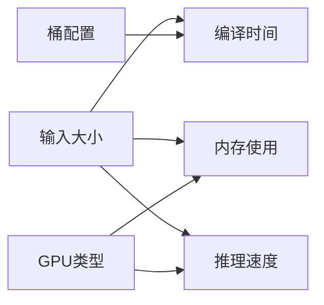

---
slug:12-known-limitations
blog_type:normal
---


本文档概述了AlphaFold3当前已知的局限性。了解这些限制将帮助您合理规划计算实验并解决常见问题。

## 硬件要求与限制

AlphaFold3有特定的硬件要求，必须满足以下条件才能正常运行：

- **操作系统**：仅支持Linux - 其他操作系统未获官方支持
- **内存要求**：建议最低64GB RAM，特别是对于具有深层MSA的序列，Jackhmmer/Nhmmer可能需要远超此阈值的内存
- **存储要求**：遗传数据库可能需要高达1TB的磁盘空间（强烈推荐使用SSD）
- **GPU兼容性与大小限制**：

| GPU类型 | 最大输入大小 | 备注 |
|--------|--------------|------|
| A100 80GB / H100 80GB | 5,120 tokens | 官方支持并经过广泛测试 |
| A100 40GB | 4,352 tokens | 需要统一内存和配置更改 |
| V100 | 1,280 tokens | 需要统一内存和XLA标志 |
| P100 | 1,024 tokens | 无需配置更改 |

<CgxTip>
对于CUDA能力7.x的GPU（例如V100），您必须设置环境变量XLA_FLAGS，包含`--xla_disable_hlo_passes=custom-kernel-fusion-rewriter`，以避免数值问题，这些问题会导致输出明显的错误结果，如残基冲突。
</CgxTip>

## 输入限制

### 大小与复杂性限制

- **最大输入大小**：在A100 80GB/H100 80GB GPU上为5,120 tokens
- **糖基**：无法将AlphaFold服务器格式中指定的糖基转换为AlphaFold3格式

### 配体指定限制

- **SMILES配体问题**：
  - 在提交[f8df1c7](https://github.com/google-deepmind/alphafold3/commit/f8df1c7)和[4e4023c](https://github.com/google-deepmind/alphafold3/commit/4e4023c)之间，SMILES字符串中的双字母原子（例如Cl, Br）处理不正确
  - 由于缺乏原子命名，SMILES配体不支持与其他实体的共价键
  - 对于某些配体和随机种子，RDKit可能无法生成构象

- **共价键限制**：
  - 共价键只能在非聚合物实体之间或内部指定
  - 目前不支持在聚合物实体之间或内部定义共价键

### 格式限制

- **JSON格式转换**：从AlphaFold服务器转换为AlphaFold3格式时：
  - 不支持糖基规格转换
  - 如果未指定modelSeeds，将自动分配种子

## 性能与资源限制

### 数据管道性能

数据管道（遗传序列和模板搜索）的运行时间可能因以下因素而有显著差异：

- 输入大小
- 找到的同源序列数量
- 可用硬件（尤其是磁盘速度）

可以通过以下方式提高性能：
- 使用SSD存储，特别是RAM支持的文件系统
- 增加可用CPU核心和并行化
- 将仅CPU的数据管道与GPU所需的推理步骤分开

### 模型推理性能



- **编译桶**：AlphaFold3使用编译桶以避免过度重编译，但存在重编译次数减少与填充增加之间的权衡
- **默认最大桶大小**：5,120 tokens - 较大的输入将触发新的编译

## 模型行为限制

- **数值问题**：除非设置特定的XLA标志，否则CUDA能力7.x设备存在已知的数值问题
- **小结构置信度**：对于少于20 tokens的结构或链，pTM评分非常严格，分配的值小于0.05
- **编译时间**：已知的XLA问题会导致编译时间大幅增加，除非设置环境变量`XLA_FLAGS="--xla_gpu_enable_triton_gemm=false"`

## 输出限制

- **格式限制**：仅提供mmCIF格式的预测（不提供PDB格式）
- **手性问题**：配体预测可能包含手性错误，需要额外验证
- **构象生成失败**：如果构象生成失败且无理想坐标：
  - 所有构象坐标均设置为零
  - 模型将为配体输出NaN（输出JSON中的null）置信度

## 法律与使用限制

- **模型参数**：仅当直接从Google获得时，方可使用AlphaFold3模型参数
- **许可证**：AlphaFold3源代码根据CC-BY-NC-SA 4.0许可证授权
- **临床使用**：AlphaFold3及其输出不适用于、未验证或未批准用于临床使用

## 常见问题排查

### 大规模结构预测

处理大于默认限制的结构时：

1. 通过设置启用统一内存：
   ```sh
   XLA_PYTHON_CLIENT_PREALLOCATE=false
   TF_FORCE_UNIFIED_MEMORY=true
   XLA_CLIENT_MEM_FRACTION=3.2
   ```

2. 考虑针对您的特定硬件优化模型配置中的`pair_transition_shard_spec`

### 构象生成失败

当RDKit无法为配体生成构象时：

1. 使用以下方式增加RDKit构象迭代次数：
   ```
   --conformer_max_iterations=<更高值>
   ```

2. 使用用户提供的CCD格式为配体提供参考结构