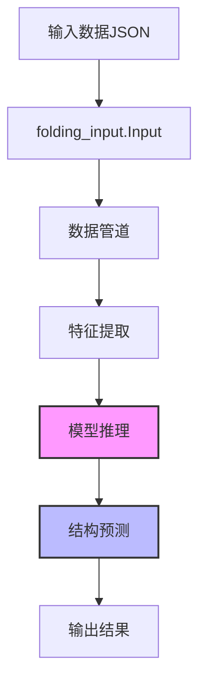

---
slug:13-api-reference
blog_type:normal
---


本文档为使用AlphaFold3 API的开发人员提供了全面的参考。它涵盖了用于配置、运行和解释AlphaFold3结构预测结果的核心类和函数。

## 核心API组件

AlphaFold3的API围绕几个关键组件设计，这些组件处理蛋白质结构预测流程的不同部分。主要组件如下图所示：



来源：[run_alphafold.py](run_alphafold.py)

## 输入处理

### folding_input.Input

AlphaFold3预测的主要输入数据结构。

```python
# 加载折叠输入的示例
fold_inputs = folding_input.load_fold_inputs_from_path(pathlib.Path("input.json"))
# 或从包含多个输入的目录加载
fold_inputs = folding_input.load_fold_inputs_from_dir(pathlib.Path("input_dir"))
```

**关键方法：**

| 方法 | 描述 |
|------|------|
| `to_json()` | 将输入转换为JSON字符串以便存储或检查 |
| `sanitised_name()` | 返回适合文件路径的名称的清理版本 |
| `with_multiple_seeds(num_seeds)` | 创建具有多个随机种子的输入副本 |

来源：[run_alphafold.py#L757-L767](run_alphafold.py#L757-L767)

## 数据管道

数据管道将原始输入数据处理为模型的特征。

### pipeline.DataPipeline

```python
data_pipeline_config = pipeline.DataPipelineConfig(
    jackhmmer_binary_path="path/to/jackhmmer",
    nhmmer_binary_path="path/to/nhmmer",
    hmmalign_binary_path="path/to/hmmalign",
    hmmsearch_binary_path="path/to/hmmsearch",
    hmmbuild_binary_path="path/to/hmmbuild",
    small_bfd_database_path="path/to/small_bfd.fasta",
    mgnify_database_path="path/to/mgy_clusters.fa",
    # 其他数据库路径...
)

data_pipeline = pipeline.DataPipeline(data_pipeline_config)
processed_fold_input = data_pipeline.process(fold_input)
```

数据管道执行几个关键步骤：
- 多序列比对（MSA）生成
- 模板检测和处理
- 神经网络特征提取

来源：[run_alphafold.py#L820-L840](run_alphafold.py#L820-L840)

## 模型配置

### make_model_config

使用特定参数创建模型配置。

```python
config = make_model_config(
    flash_attention_implementation="triton",
    num_diffusion_samples=5,
    num_recycles=10,
    return_embeddings=False,
    return_distogram=False,
)
```

**参数：**

| 参数 | 类型 | 描述 |
|------|------|------|
| flash_attention_implementation | str | 要使用的闪光注意力实现（"triton"、"cudnn"或"xla"） |
| num_diffusion_samples | int | 要生成的扩散样本数量 |
| num_recycles | int | 推理期间要使用的回收迭代次数 |
| return_embeddings | bool | 是否返回主干嵌入 |
| return_distogram | bool | 是否返回预测的距离图 |

来源：[run_alphafold.py#L304-L321](run_alphafold.py#L304-L321)

### Model.Config

AlphaFold3模型的主要配置类。

```python
config = model.Model.Config()
config.global_config.flash_attention_implementation = "triton"
config.heads.diffusion.eval.num_samples = 5
config.num_recycles = 10
```

**关键属性：**

| 属性 | 描述 |
|------|------|
| evoformer | Evoformer模块的配置 |
| global_config | 全局配置设置 |
| heads | 模型预测头的配置 |
| num_recycles | 要执行的回收迭代次数 |
| return_embeddings | 是否返回嵌入 |
| return_distogram | 是否返回距离图 |

来源：[model.py#L221-L227](src/alphafold3/model/model.py#L221-L227)

## 模型推理

### ModelRunner

管理结构预测推理的辅助类。

```python
model_runner = ModelRunner(
    config=model_config,
    device=jax.devices("gpu")[0],
    model_dir=pathlib.Path("path/to/model_weights"),
)

# 运行推理
result = model_runner.run_inference(featurised_example, rng_key)

# 提取推理结果
inference_results = model_runner.extract_inference_results(
    batch=featurised_example, 
    result=result, 
    target_name="protein_name"
)
```

**关键方法：**

| 方法 | 描述 |
|------|------|
| `run_inference(featurised_example, rng_key)` | 在提供的特征上运行模型推理 |
| `extract_inference_results(batch, result, target_name)` | 从模型输出中提取结构预测 |
| `extract_embeddings(result, num_tokens)` | 从模型结果中提取嵌入 |
| `extract_distogram(result, num_tokens)` | 从模型结果中提取距离图 |

来源：[run_alphafold.py#L324-L414](run_alphafold.py#L324-L414)

### Model

实现AlphaFold3架构的核心模型类。

```python
model_instance = model.Model(config)
result = model_instance(batch, key)
```

**关键方法：**

| 方法 | 描述 |
|------|------|
| `__call__(batch, key)` | 运行模型的前向传递 |
| `_sample_diffusion(batch, embeddings, sample_config)` | 运行扩散采样过程 |

来源：[model.py#L213-L235](src/alphafold3/model/model.py#L213-L235), [model.py#L260-L265](src/alphafold3/model/model.py#L260-L265)

## 结构预测

### predict_structure

运行完整预测流程的主要函数。

```python
results = predict_structure(
    fold_input=fold_input,
    model_runner=model_runner,
    buckets=[256, 512, 1024, 2048],
    ref_max_modified_date=datetime.date.fromisoformat("2021-09-30"),
    conformer_max_iterations=None,
    resolve_msa_overlaps=True,
)
```

**参数：**

| 参数 | 类型 | 描述 |
|------|------|------|
| fold_input | folding_input.Input | 预测的输入数据 |
| model_runner | ModelRunner | 用于推理的ModelRunner实例 |
| buckets | Sequence[int] 或 None | 用于缓存编译的令牌大小 |
| ref_max_modified_date | datetime.date 或 None | 模板最大发布日期 |
| conformer_max_iterations | int 或 None | RDKit构象搜索的最大迭代次数 |
| resolve_msa_overlaps | bool | 是否对未配对的MSA进行去重以配对MSA |

**返回：**

包含每个种子预测的`ResultsForSeed`对象序列。

来源：[run_alphafold.py#L436-L508](run_alphafold.py#L436-L508)

### get_predicted_structure

从模型输出创建预测结构。

```python
structure = get_predicted_structure(result, batch)
```

**参数：**

| 参数 | 类型 | 描述 |
|------|------|------|
| result | ModelResult | 模型特定布局的模型输出 |
| batch | feat_batch.Batch | 模型输入批次 |

**返回：**

表示预测蛋白质结构的`structure.Structure`对象。

来源：[model.py#L67-L138](src/alphafold3/model/model.py#L67-L138)

## 输出处理

### InferenceResult

表示模型推理的后期处理结果。

```python
@dataclasses.dataclass(frozen=True)
class InferenceResult:
    predicted_structure: structure.Structure
    numerical_data: dict = dataclasses.field(default_factory=dict)
    metadata: dict = dataclasses.field(default_factory=dict)
    debug_outputs: dict = dataclasses.field(default_factory=dict)
    model_id: bytes = b''
```

**属性：**

| 属性 | 描述 |
|------|------|
| predicted_structure | 预测的蛋白质结构 |
| numerical_data | 数值数据（标量或数组） |
| metadata | 推理元数据的较小数值数据 |
| debug_outputs | 用于调试的附加数据 |
| model_id | 模型标识符 |

来源：[model.py#L45-L64](src/alphafold3/model/model.py#L45-L64)

### ResultsForSeed

存储单个随机种子的推理结果。

```python
@dataclasses.dataclass(frozen=True, slots=True, kw_only=True)
class ResultsForSeed:
    seed: int
    inference_results: Sequence[model.InferenceResult]
    full_fold_input: folding_input.Input
    embeddings: dict[str, np.ndarray] | None = None
    distogram: np.ndarray | None = None
```

**属性：**

| 属性 | 描述 |
|------|------|
| seed | 用于预测的随机种子 |
| inference_results | 推理结果列表（每个扩散样本一个） |
| full_fold_input | 包括MSA和模板的完整折叠输入 |
| embeddings | 最终主干嵌入（可选） |
| distogram | 预测的距离直方图（可选） |

来源：[run_alphafold.py#L416-L434](run_alphafold.py#L416-L434)

### write_outputs

将预测输出写入指定目录。

```python
write_outputs(
    all_inference_results=results,
    output_dir="output_path",
    job_name="job_name",
)
```

**参数：**

| 参数 | 类型 | 描述 |
|------|------|------|
| all_inference_results | Sequence[ResultsForSeed] | 要写入的结果 |
| output_dir | str 或 PathLike | 输出目录路径 |
| job_name | str | 作业名称 |

来源：[run_alphafold.py#L523-L588](run_alphafold.py#L523-L588)

## 完整预测工作流程

整个预测工作流程可以通过`process_fold_input`函数执行，该函数处理数据管道执行和模型推理：

```python
results = process_fold_input(
    fold_input=fold_input,
    data_pipeline_config=data_pipeline_config,
    model_runner=model_runner,
    output_dir="output_path",
    buckets=[256, 512, 1024, 2048],
    ref_max_modified_date=max_template_date,
    conformer_max_iterations=None,
    resolve_msa_overlaps=True,
    force_output_dir=False,
)
```

<CgxTip>
**提示：** 若只想运行数据管道或仅进行模型推理，将`data_pipeline_config`或`model_runner`设置为`None`。这允许你将计算分成独立步骤，这在计算资源有限时非常有用。
</CgxTip>

来源：[run_alphafold.py#L636-L736](run_alphafold.py#L636-L736)

## 命令行界面

AlphaFold3可以直接从命令行运行，使用`run_alphafold.py`。关键标志包括：

```bash
python run_alphafold.py \
  --json_path=input.json \
  --output_dir=output \
  --model_dir=models \
  --num_recycles=10 \
  --num_diffusion_samples=5
```

有关命令行选项的完整列表，请参阅[run_alphafold.py](run_alphafold.py)顶部定义的标志。

来源：[run_alphafold.py#L61-L301](run_alphafold.py#L61-L301)

## 结论

本API参考涵盖了使用AlphaFold3进行程序化工作的关键组件。有关特定组件的更多详细信息，请参阅存储库中的源代码和伴随文档。

请记住，AlphaFold3模型参数受特定使用条款的约束，在使用此API时应遵守这些条款。