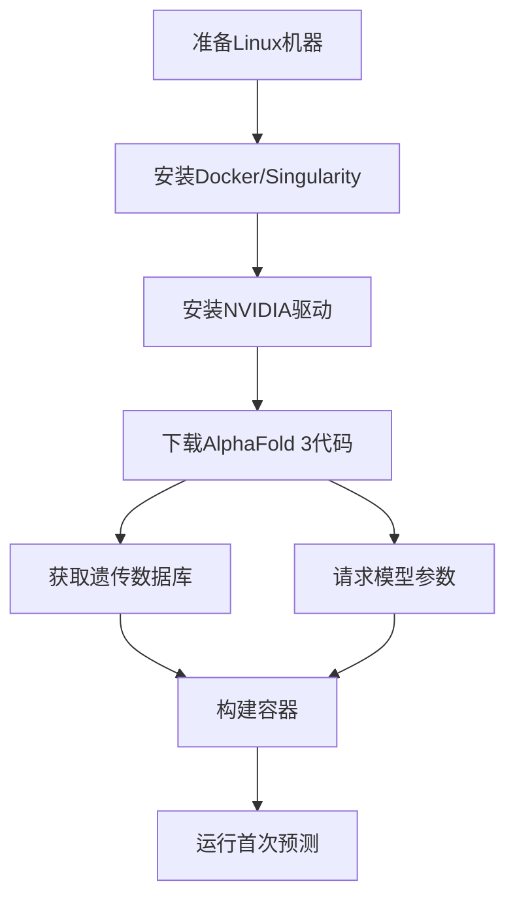

---
slug:3-installation
blog_type:normal
---


本指南将指导您安装和设置AlphaFold 3，DeepMind的强大蛋白质结构预测系统。我们将涵盖系统要求、安装选项以及如何运行您的首次预测。

## 系统要求

在开始安装之前，请确保您的系统满足以下要求：

| 组件 | 最低要求 | 推荐配置 |
|------|----------|----------|
| 操作系统 | Linux（已验证Ubuntu 22.04 LTS） | Linux（Ubuntu 22.04 LTS） |
| 存储 | 1 TB用于数据库 | 1 TB SSD以提高性能 |
| GPU | NVIDIA，计算能力8.0+ | NVIDIA A100 80GB或H100 80GB |
| 内存（RAM） | 64 GB | 170 GB用于大型结构 |
| CUDA | 12.6 | 12.6 |

<CgxTip>
AlphaFold 3已验证，最多包含5,120个token的输入可以在单个NVIDIA A100 80GB或H100 80GB GPU上运行。更大内存的GPU可以预测更大的蛋白质结构。
</CgxTip>

## 安装选项

您可以使用以下两种容器选项之一来安装AlphaFold 3：

1. **Docker**（主要方法） - 对大多数用户来说最简单
2. **Singularity** - 在不适合使用Docker的环境中作为替代

本指南将涵盖这两种方法的逐步说明。

## 安装概述

完整的安装过程涉及几个关键步骤：



让我们详细讲解每个步骤。

## 步骤1：准备机器

如果您需要设置新机器，可以使用Google Cloud、AWS或Azure等云服务提供商，并选择Ubuntu 22.04 LTS。

对于Google Cloud，文档建议：

```sh
gcloud compute instances create alphafold3 \
    --machine-type a2-ultragpu-1g \
    --zone us-central1-a \
    --image-family ubuntu-2204-lts \
    --image-project ubuntu-os-cloud \
    --maintenance-policy TERMINATE \
    --boot-disk-size 1000 \
    --boot-disk-type pd-balanced
```

这将创建一个A2 Ultra机器，配备12个CPU、170 GB RAM、1 TB磁盘和NVIDIA A100 80GB GPU。

## 步骤2：安装Docker

AlphaFold 3使用Docker容器来管理其依赖项。以下是在Ubuntu 22.04上安装Docker的方法：

1. 添加Docker的官方GPG密钥：
   ```sh
   sudo apt-get update
   sudo apt-get install ca-certificates curl
   sudo install -m 0755 -d /etc/apt/keyrings
   sudo curl -fsSL https://download.docker.com/linux/ubuntu/gpg -o /etc/apt/keyrings/docker.asc
   sudo chmod a+r /etc/apt/keyrings/docker.asc
   ```

2. 添加Docker仓库并安装Docker：
   ```sh
   echo \
     "deb [arch=$(dpkg --print-architecture) signed-by=/etc/apt/keyrings/docker.asc] https://download.docker.com/linux/ubuntu \
     $(. /etc/os-release && echo "$VERSION_CODENAME") stable" | \
     sudo tee /etc/apt/sources.list.d/docker.list > /dev/null
   sudo apt-get update
   sudo apt-get install -y docker-ce docker-ce-cli containerd.io docker-buildx-plugin docker-compose-plugin
   sudo docker run hello-world
   ```

3. 启用无根Docker（可选但推荐）：
   ```sh
   sudo apt-get install -y uidmap systemd-container
   
   sudo machinectl shell $(whoami)@ /bin/bash -c 'dockerd-rootless-setuptool.sh install && sudo loginctl enable-linger $(whoami) && DOCKER_HOST=unix:///run/user/1001/docker.sock docker context use rootless'
   ```

## 步骤3：安装GPU支持

要使用Docker中的GPU，您需要安装NVIDIA驱动并配置Docker以访问GPU：

1. 安装NVIDIA驱动：
   ```sh
   sudo apt-get -y install alsa-utils ubuntu-drivers-common
   sudo ubuntu-drivers install
   
   sudo nvidia-smi --gpu-reset
   
   nvidia-smi  # 检查驱动是否已安装。
   ```

   如果`nvidia-smi`因通信错误失败，请使用`sudo reboot now`重启机器。

2. 为Docker安装NVIDIA支持：
   ```sh
   curl -fsSL https://nvidia.github.io/libnvidia-container/gpgkey | sudo gpg --dearmor -o /usr/share/keyrings/nvidia-container-toolkit-keyring.gpg \
     && curl -s -L https://nvidia.github.io/libnvidia-container/stable/deb/nvidia-container-toolkit.list | \
       sed 's#deb https://#deb [signed-by=/usr/share/keyrings/nvidia-container-toolkit-keyring.gpg] https://#g' | \
       sudo tee /etc/apt/sources.list.d/nvidia-container-toolkit.list
   sudo apt-get update
   sudo apt-get install -y nvidia-container-toolkit
   nvidia-ctk runtime configure --runtime=docker --config=$HOME/.config/docker/daemon.json
   systemctl --user restart docker
   sudo nvidia-ctk config --set nvidia-container-cli.no-cgroups --in-place
   ```

3. 验证Docker对GPU的访问：
   ```sh
   docker run --rm --gpus all nvidia/cuda:12.6.0-base-ubuntu22.04 nvidia-smi
   ```

您应该看到输出中显示您的GPU信息。

## 步骤4：下载AlphaFold 3代码

从GitHub克隆AlphaFold 3仓库：

```sh
git clone https://github.com/google-deepmind/alphafold3.git
```

## 步骤5：获取遗传数据库

AlphaFold 3需要多个遗传数据库来进行预测。您需要大约**252 GB**的下载带宽和**630 GB**的存储空间来存放未压缩的数据库。

1. 安装必备软件：
   ```sh
   sudo apt install wget zstd
   ```

2. 运行提供的脚本以下载所有数据库：
   ```sh
   cd alphafold3  # 导航到克隆的仓库
   ./fetch_databases.sh [<DB_DIR>]
   ```

   如果未指定`<DB_DIR>`，数据库将下载到`$HOME/public_databases`。

<CgxTip>
**重要提示：** 不要将数据库放置在AlphaFold 3仓库的子目录中，因为这会使Docker构建非常缓慢。同时，确保数据库目录具有适当的权限，使用`sudo chmod 755 --recursive <DB_DIR>`。

下载完成后，您的数据库目录中应包含以下文件：
```
mmcif_files/  # 包含PDB mmCIF文件的目录
bfd-first_non_consensus_sequences.fasta
mgy_clusters_2022_05.fa
nt_rna_2023_02_23_clust_seq_id_90_cov_80_rep_seq.fasta
pdb_seqres_2022_09_28.fasta
rfam_14_9_clust_seq_id_90_cov_80_rep_seq.fasta
rnacentral_active_seq_id_90_cov_80_linclust.fasta
uniprot_all_2021_04.fa
uniref90_2022_05.fa
```

为了提高性能，您可以使用提供的脚本将数据库移动到SSD：
- `src/scripts/gcp_mount_ssd.sh [<SSD_MOUNT_PATH>]` - 挂载并格式化GCP SSD
- `src/scripts/copy_to_ssd.sh [<DB_DIR>] [<SSD_DB_DIR>]` - 将数据库复制到SSD

## 步骤6：获取模型参数

AlphaFold 3的模型参数需要特殊访问权限：

1. 完成[此表单](https://forms.gle/svvpY4u2jsHEwWYS6)以请求访问权限
2. 等待批准（通常需要2-3个工作日）
3. 一旦批准，将参数下载到您选择的目录（`<MODEL_PARAMETERS_DIR>`）

<CgxTip>
模型参数**不应**放置在AlphaFold 3仓库的子目录中。使用需遵守[使用条款](https://github.com/google-deepmind/alphafold3/blob/main/WEIGHTS_TERMS_OF_USE.md)。

## 步骤7：构建AlphaFold 3容器

### 选项A：Docker容器（推荐）

构建包含所有必需依赖项的Docker容器：

```sh
cd alphafold3  # 如果您不在仓库目录中
docker build -t alphafold3 -f docker/Dockerfile .
```

这将构建一个基于Ubuntu 24.04、CUDA 12.6.3、Python 3.12以及所有必要工具（包括用于序列搜索的HMMER）的容器。构建过程自动：

1. 设置Python环境
2. 下载并构建带有序列限制补丁的HMMER
3. 安装所有Python依赖项
4. 配置内存设置以优化性能

### 选项B：Singularity容器

如果您更喜欢使用Singularity而不是Docker，请按照以下步骤操作：

1. 安装Singularity：
   ```sh
   wget https://github.com/sylabs/singularity/releases/download/v4.2.1/singularity-ce_4.2.1-jammy_amd64.deb
   sudo dpkg --install singularity-ce_4.2.1-jammy_amd64.deb
   sudo apt-get install -f
   ```

2. 如上所述构建Docker容器，然后创建本地Docker注册表：
   ```sh
   docker run -d -p 5000:5000 --restart=always --name registry registry:2
   docker tag alphafold3 localhost:5000/alphafold3
   docker push localhost:5000/alphafold3
   ```

3. 构建Singularity容器：
   ```sh
   SINGULARITY_NOHTTPS=1 singularity build alphafold3.sif docker://localhost:5000/alphafold3:latest
   ```

4. 验证构建：
   ```sh
   singularity exec --nv alphafold3.sif sh -c 'nvidia-smi'
   ```

## 运行您的首次预测

现在AlphaFold 3已安装，您可以运行您的首次预测：

1. 创建输入目录并准备输入JSON文件：
   ```sh
   mkdir -p $HOME/af_input
   mkdir -p $HOME/af_output
   chmod 755 $HOME/af_input $HOME/af_output
   ```

2. 在`$HOME/af_input/fold_input.json`中创建输入JSON文件，使用README中的示例或遵循[输入文档](https://github.com/google-deepmind/alphafold3/blob/main/docs/input.md)。

3. 使用Docker运行AlphaFold 3：

   ```sh
   docker run -it \
       --volume $HOME/af_input:/root/af_input \
       --volume $HOME/af_output:/root/af_output \
       --volume <MODEL_PARAMETERS_DIR>:/root/models \
       --volume <DB_DIR>:/root/public_databases \
       --gpus all \
       alphafold3 \
       python run_alphafold.py \
       --json_path=/root/af_input/fold_input.json \
       --model_dir=/root/models \
       --output_dir=/root/af_output
   ```

   或者如果使用Singularity：

   ```sh
   singularity exec \
        --nv \
        --bind $HOME/af_input:/root/af_input \
        --bind $HOME/af_output:/root/af_output \
        --bind <MODEL_PARAMETERS_DIR>:/root/models \
        --bind <DB_DIR>:/root/public_databases \
        alphafold3.sif \
        python run_alphafold.py \
        --json_path=/root/af_input/fold_input.json \
        --model_dir=/root/models \
        --db_dir=/root/public_databases \
        --output_dir=/root/af_output
   ```

4. 为了提高数据库部分在SSD上的性能：

   ```sh
   docker run -it \
       --volume $HOME/af_input:/root/af_input \
       --volume $HOME/af_output:/root/af_output \
       --volume <MODEL_PARAMETERS_DIR>:/root/models \
       --volume <SSD_DB_DIR>:/root/public_databases \
       --volume <DB_DIR>:/root/public_databases_fallback \
       --gpus all \
       alphafold3 \
       python run_alphafold.py \
       --json_path=/root/af_input/fold_input.json \
       --model_dir=/root/models \
       --db_dir=/root/public_databases \
       --db_dir=/root/public_databases_fallback \
       --output_dir=/root/af_output
   ```

5. 查看所有可用选项：

   ```sh
   docker run alphafold3 python run_alphafold.py --help
   ```

## 故障排除

- **挂载源路径错误**：如果看到“权限拒绝”之类的错误，请确保模型和数据库目录存在并具有适当的权限。
- **NVIDIA驱动问题**：如果安装后`nvidia-smi`失败，尝试使用`sudo reboot now`重启。
- **缺失数据库文件**：仔细检查所有数据库文件是否已成功下载，并确保在Docker/Singularity命令中使用正确的路径。
- **内存问题**：对于大型蛋白质结构，通过修改Docker容器中的环境变量或通过`run_alphafold.py`的命令行参数调整内存设置。