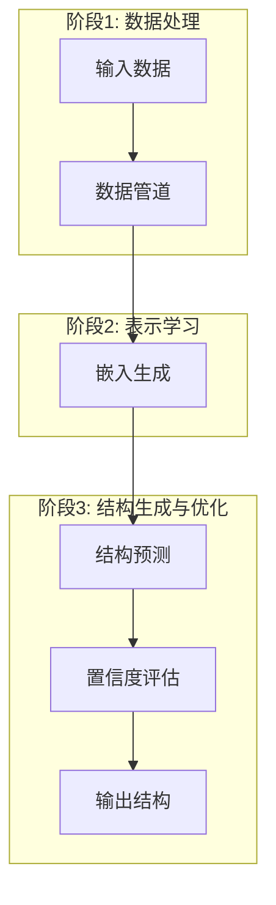
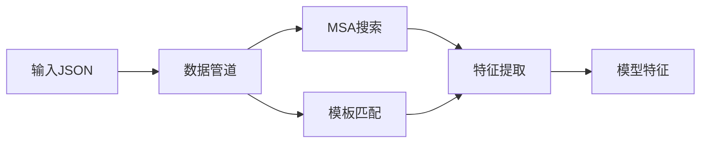
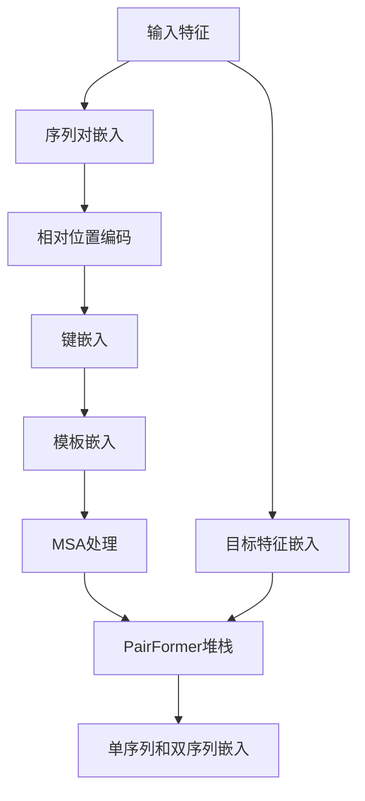
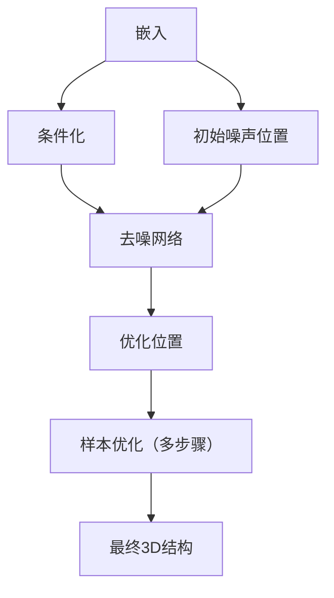
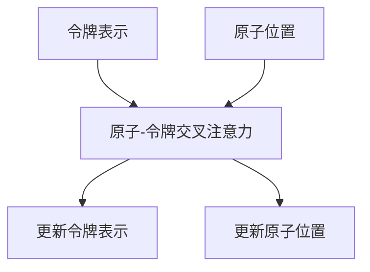

---
slug:9-architecture-overview
blog_type:normal
---

AlphaFold3在蛋白质结构预测方面取得了显著进展，其功能超越了前代产品，能够处理更广泛的生物分子及其复合物。本文档提供了AlphaFold3架构的全面技术概述，解释了其各个组件如何协同工作以生成准确的3D结构预测。

## 系统架构概览

AlphaFold3采用模块化架构，其数据处理、表示学习和结构生成组件清晰分离。系统可分为三个主要阶段：

来源：[run_alphafold.py](run_alphafold.py), [model.py](src/alphafold3/model/model.py)

## 核心组件

### 数据管道

数据管道处理输入序列和结构，执行MSA生成、模板匹配和特征提取等基本操作。其负责将原始输入数据转换为模型可处理的特征。

管道包含多个关键组件：
- **MSA搜索**：使用Jackhmmer和Nhmmer等工具在UniRef90、MGnify和BFD等数据库中查找进化相关的序列
- **模板匹配**：从PDB数据库中识别结构模板
- **特征提取**：将原始数据转换为模型的数值特征

来源：[run_alphafold.py#L704-L708](run_alphafold.py), [pipeline.py](src/alphafold3/data/pipeline.py)

### 使用Evoformer进行表示学习

Evoformer模块是AlphaFold3表示学习系统的核心。它处理序列和进化信息，创建丰富的嵌入，捕捉局部和全局关系。

Evoformer的关键组件包括：
- **序列嵌入**：将序列信息转换为初始表示
- **MSA处理**：从多序列比对中提取进化信息
- **模板整合**：在可用时纳入结构模板
- **PairFormer**：通过多次基于注意力的迭代优化表示

Evoformer模块通过多次循环迭代（默认：10次），逐步优化每一步的表示。

来源：[evoformer.py](src/alphafold3/model/network/evoformer.py), [model.py#L267-L306](src/alphafold3/model/model.py)

### 基于扩散的结构生成

AlphaFold3使用扩散模型生成3D原子坐标。这种方法与之前版本有显著不同，能够更准确地预测多种分子类型的结构。

扩散过程包括：
- **条件化**：为去噪网络准备嵌入
- **噪声调度**：控制逐步去噪过程
- **基于Transformer的去噪**：根据当前噪声位置预测结构更新
- **迭代优化**：通过多次去噪步骤逐步优化结构

默认情况下，AlphaFold3生成**5个扩散样本**，每个样本进行**200步去噪**，根据置信度指标选择最佳样本。

来源：[diffusion_head.py](src/alphafold3/model/network/diffusion_head.py), [model.py#L308-L313](src/alphafold3/model/model.py)

### 置信度评估

AlphaFold3包含全面的置信度指标，评估预测质量：

- **预测TM分数（pTM）**：估计与天然结构的相似度
- **预测界面TM分数（ipTM）**：关注链间界面区域
- **预测对齐误差（PAE）**：估计残基对间的位置误差
- **预测距离误差（PDE）**：估计原子间距离误差
- **排名分数**：结合多个指标选择最佳样本

这些置信度指标帮助用户解读预测可靠性，是样本选择的关键。

来源：[confidences.py](src/alphafold3/model/confidences.py), [model.py#L377-L408](src/alphafold3/model/model.py)

## 组件间交互

### 循环机制

AlphaFold3采用循环机制，将一次迭代的输出嵌入作为下一次迭代的输入。这允许模型通过多次步骤优化其预测：

循环次数可配置（默认：10次），更多循环可能提高预测质量，但会增加计算时间。

来源：[model.py#L276-L306](src/alphafold3/model/model.py)

### 多模态注意力

AlphaFold3的一个重要创新是原子-令牌交叉注意力机制，使序列（令牌）和结构（原子）表示之间的信息流动成为可能：

这种多模态注意力使模型能够联合推理序列和结构，提高预测准确性，尤其在复杂分子系统中。

来源：[atom_cross_attention.py](src/alphafold3/model/network/atom_cross_attention.py), [diffusion_head.py#L228-L236](src/alphafold3/model/network/diffusion_head.py)

## 模型执行流程

AlphaFold3的执行流程可总结如下：

1. **输入处理**：
   - 解析输入JSON文件
   - 运行数据管道生成MSA并查找模板
   - 为模型消费特征化输入

2. **模型初始化**：
   - 加载模型参数
   - 配置模型设置（循环次数、扩散样本等）

3. **前向传播**：
   - 运行Evoformer进行多次循环迭代
   - 为扩散过程生成嵌入

4. **结构生成**：
   - 采样初始噪声结构
   - 运行扩散过程去噪和优化结构
   - 为每个输入生成多个样本

5. **置信度评估和输出**：
   - 计算每个样本的置信度指标
   - 根据排名分数选择最佳样本
   - 输出预测结构和置信度指标

来源：[run_alphafold.py#L436-L508](run_alphafold.py)

## 技术实现细节

### 性能优化

AlphaFold3包含多项优化以提高推理性能：

- **Flash注意力**：优化注意力实现，提高GPU利用率
- **令牌分桶**：按大小分组输入，减少重新编译开销
- **Bfloat16支持**：可选使用低精度以加快计算
- **JAX编译缓存**：缓存编译函数，加速重复运行

这些优化对于使模型适用于实际应用场景至关重要。

来源：[run_alphafold.py#L222-L256](run_alphafold.py)

### GPU要求

AlphaFold3有显著的计算需求：
- 需要支持CUDA的GPU，至少具备计算能力6.0
- 对计算能力7.x设备进行特殊处理
- 使用Flash注意力时优化于Ampere或更新型号的GPU

来源：[run_alphafold.py#L776-L802](run_alphafold.py)

## 与前代架构的改进

AlphaFold3引入了多项关键架构改进：

1. **基于扩散的结构生成**：用扩散方法替换前代的结构模块，以更准确地预测坐标
2. **扩展分子支持**：架构设计用于处理蛋白质、核酸和小分子及其组合
3. **令牌-原子表示**：统一的表示系统能处理不同分子实体
4. **多模态注意力**：增强序列和结构空间之间的交叉注意力机制
5. **改进的置信度评估**：更全面的置信度指标，以更好地评估模型输出

这些改进共同使AlphaFold3能够更准确地解决更广泛的生物结构预测问题。

## 结论

AlphaFold3的架构代表了序列处理、进化信息分析和基于扩散的结构生成的复杂集成。系统的模块化设计，清晰划分数据处理、表示学习和结构生成，允许灵活配置和未来改进。

通过多次循环、多模态注意力和基于扩散的采样，AlphaFold3在预测多种生物分子及其复合物的结构方面实现了业界领先性能。