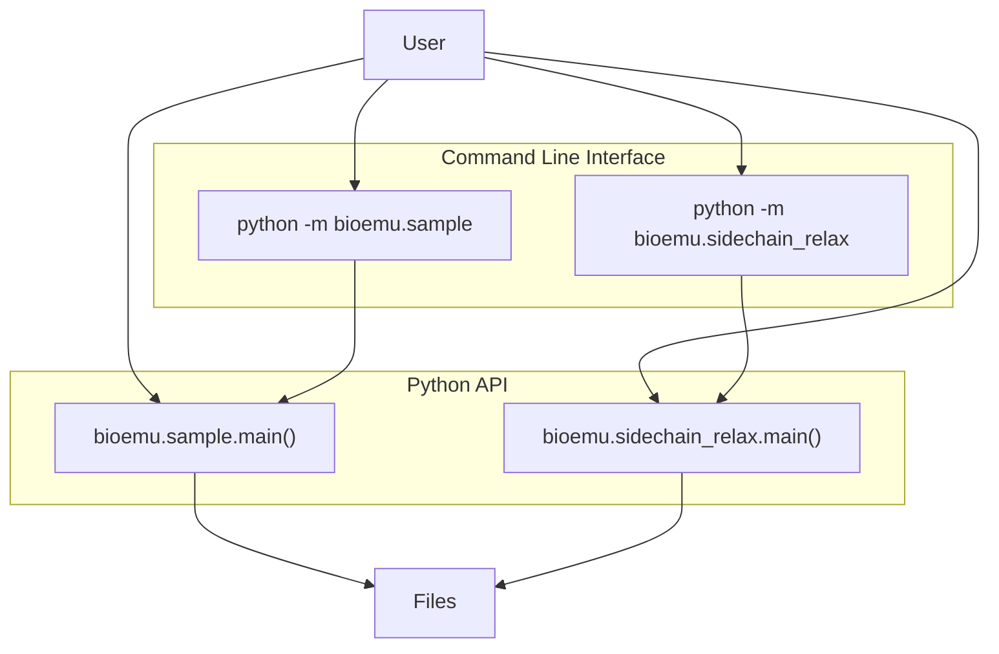
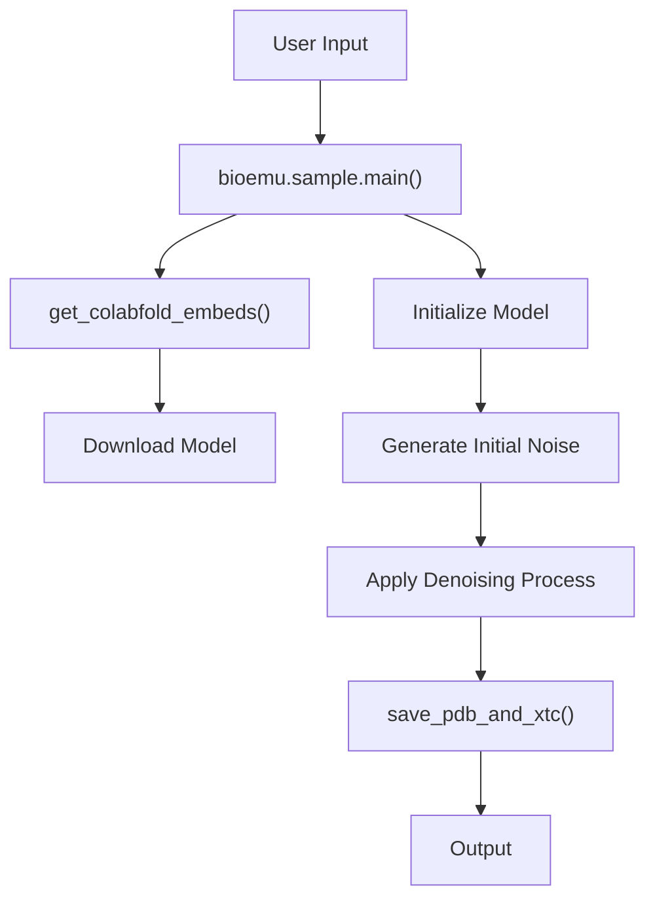
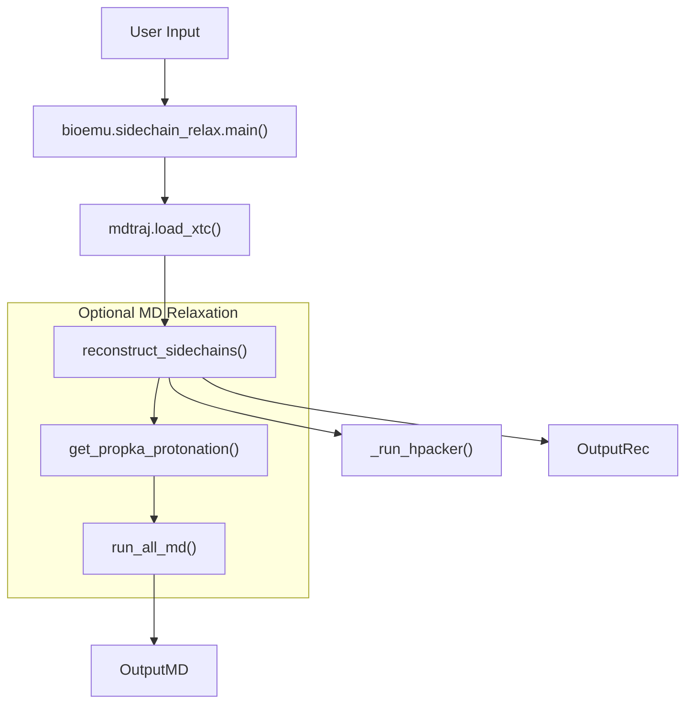
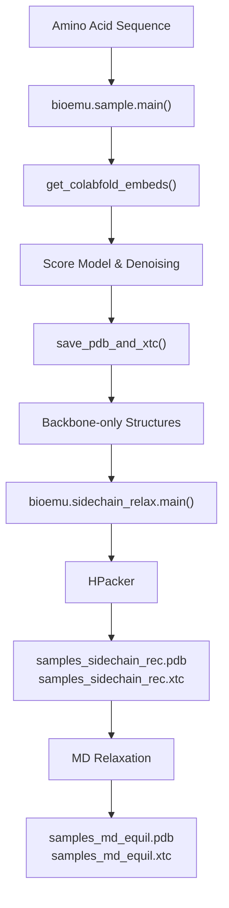

# API Reference

> **Relevant source files**
> * [README.md](https://github.com/microsoft/bioemu/blob/6ff0ddd1/README.md?plain=1)
> * [src/bioemu/convert_chemgraph.py](https://github.com/microsoft/bioemu/blob/6ff0ddd1/src/bioemu/convert_chemgraph.py)
> * [src/bioemu/sample.py](https://github.com/microsoft/bioemu/blob/6ff0ddd1/src/bioemu/sample.py)
> * [src/bioemu/sidechain_relax.py](https://github.com/microsoft/bioemu/blob/6ff0ddd1/src/bioemu/sidechain_relax.py)

This page documents the primary interfaces for using BioEmu. It covers both the Python API and command-line interface that allow users to generate protein structure ensembles from amino acid sequences. For information about the underlying model architecture, see [Model Architecture](/microsoft/bioemu/5-model-architecture).

## API Components Overview



Sources: [src/bioemu/sample.py](https://github.com/microsoft/bioemu/blob/6ff0ddd1/src/bioemu/sample.py)

 [src/bioemu/sidechain_relax.py](https://github.com/microsoft/bioemu/blob/6ff0ddd1/src/bioemu/sidechain_relax.py)

 [README.md](https://github.com/microsoft/bioemu/blob/6ff0ddd1/README.md?plain=1)

## Sample Module

The Sample module is the primary entry point for generating protein structure ensembles from amino acid sequences.

### Python API

```javascript
from bioemu.sample import main as sample sample(    sequence='GYDPETGTWG',    num_samples=10,    output_dir='~/test_chignolin')
```

#### Function: main()



Sources: [src/bioemu/sample.py L66-L200](https://github.com/microsoft/bioemu/blob/6ff0ddd1/src/bioemu/sample.py#L66-L200)

**Parameters:**

| Parameter | Type | Description | Default |
| --- | --- | --- | --- |
| `sequence` | `str` or `Path` | Amino acid sequence, path to .fasta file, or path to .a3m file with MSAs | Required |
| `num_samples` | `int` | Number of samples to generate | Required |
| `output_dir` | `str` or `Path` | Directory to save samples | Required |
| `batch_size_100` | `int` | Batch size for a sequence of length 100 | 10 |
| `model_name` | `str` or `None` | Name of pretrained model to use | "bioemu-v1.0" |
| `ckpt_path` | `str` or `Path` or `None` | Path to model checkpoint | None |
| `model_config_path` | `str` or `Path` or `None` | Path to model config | None |
| `denoiser_type` | `Literal["dpm", "heun"]` or `None` | Denoiser type | "dpm" |
| `denoiser_config_path` | `str` or `Path` or `None` | Path to denoiser config | None |
| `cache_embeds_dir` | `str` or `Path` or `None` | Directory to cache MSA embeddings | None |
| `msa_host_url` | `str` or `None` | MSA server URL | None |
| `filter_samples` | `bool` | Filter out unphysical samples | True |

**Return Value:** None

**Description:**
Generates protein structure samples for the specified sequence using a trained model. The function performs the following steps:

1. Downloads model weights if needed
2. Generates or loads cached MSA embeddings using ColabFold
3. Initializes the scoring model and denoiser
4. Generates structure samples in batches
5. Saves the results as PDB and XTC files

Sources: [src/bioemu/sample.py L66-L200](https://github.com/microsoft/bioemu/blob/6ff0ddd1/src/bioemu/sample.py#L66-L200)

### Command Line Interface

```
python -m bioemu.sample --sequence GYDPETGTWG --num_samples 10 --output_dir ~/test-chignolin
```

The command-line interface accepts the same parameters as the Python API function with equivalent names.

Sources: [src/bioemu/sample.py L280-L287](https://github.com/microsoft/bioemu/blob/6ff0ddd1/src/bioemu/sample.py#L280-L287)

 [README.md L39-L40](https://github.com/microsoft/bioemu/blob/6ff0ddd1/README.md?plain=1#L39-L40)

## Sidechain Reconstruction and MD Relaxation Module

This module allows users to reconstruct sidechains for backbone-only protein structures and optionally perform molecular dynamics relaxation.

### Python API

```javascript
from bioemu.sidechain_relax import main as sidechain_relax sidechain_relax(    pdb_path='topology.pdb',    xtc_path='samples.xtc',    md_equil=True,    md_protocol='local_minimization',    outpath='.',    prefix='samples')
```

#### Function: main()



Sources: [src/bioemu/sidechain_relax.py L206-L242](https://github.com/microsoft/bioemu/blob/6ff0ddd1/src/bioemu/sidechain_relax.py#L206-L242)

**Parameters:**

| Parameter | Type | Description | Default |
| --- | --- | --- | --- |
| `pdb_path` | `str` | Path to PDB file containing topology | Required |
| `xtc_path` | `str` | Path to XTC file containing samples | Required |
| `md_equil` | `bool` | Run MD equilibration | True |
| `md_protocol` | `MDProtocol` | MD protocol | "local_minimization" |
| `outpath` | `str` | Directory to save output files | "." |
| `prefix` | `str` | Prefix for output filenames | "samples" |

**Return Value:** None

**Description:**
Reconstructs sidechains for backbone-only protein structures and optionally performs molecular dynamics relaxation. The function performs the following steps:

1. Loads the trajectory from XTC and PDB files
2. Reconstructs sidechains using HPacker
3. If MD equilibration is enabled, assigns protonation states and runs MD simulation
4. Saves the results as PDB and XTC files

Sources: [src/bioemu/sidechain_relax.py L206-L242](https://github.com/microsoft/bioemu/blob/6ff0ddd1/src/bioemu/sidechain_relax.py#L206-L242)

### Command Line Interface

```
python -m bioemu.sidechain_relax --pdb-path topology.pdb --xtc-path samples.xtc
```

The command-line interface accepts the same parameters as the Python API function with equivalent names.

Sources: [src/bioemu/sidechain_relax.py L245-L246](https://github.com/microsoft/bioemu/blob/6ff0ddd1/src/bioemu/sidechain_relax.py#L245-L246)

 [README.md L84-L85](https://github.com/microsoft/bioemu/blob/6ff0ddd1/README.md?plain=1#L84-L85)

## Additional Options

### MD Protocol Options

The `md_protocol` parameter in the sidechain_relax function supports two options:

| Option | Description |
| --- | --- |
| `local_minimization` | Only runs a local energy minimizer, which is fast but only resolves local issues like clashes |
| `nvt_equil` | Runs local energy minimizer followed by a short constrained MD equilibration, which is slower but might resolve more severe issues |

Sources: [src/bioemu/sidechain_relax.py L31-L34](https://github.com/microsoft/bioemu/blob/6ff0ddd1/src/bioemu/sidechain_relax.py#L31-L34)

 [README.md L94-L97](https://github.com/microsoft/bioemu/blob/6ff0ddd1/README.md?plain=1#L94-L97)

## Data Flow and Processing



Sources: [src/bioemu/sample.py](https://github.com/microsoft/bioemu/blob/6ff0ddd1/src/bioemu/sample.py)

 [src/bioemu/sidechain_relax.py](https://github.com/microsoft/bioemu/blob/6ff0ddd1/src/bioemu/sidechain_relax.py)

 [src/bioemu/convert_chemgraph.py](https://github.com/microsoft/bioemu/blob/6ff0ddd1/src/bioemu/convert_chemgraph.py)

## Output Files

BioEmu generates several output files during the sampling and sidechain reconstruction processes:

| File | Description |
| --- | --- |
| `topology.pdb` | PDB file containing the topology of the first sampled structure (backbone-only) |
| `samples.xtc` | XTC file containing all sampled structures (backbone-only) |
| `samples_sidechain_rec.pdb` | PDB file containing the topology of the first structure with reconstructed sidechains |
| `samples_sidechain_rec.xtc` | XTC file containing all structures with reconstructed sidechains |
| `samples_md_equil.pdb` | PDB file containing the topology of the first structure after MD equilibration |
| `samples_md_equil.xtc` | XTC file containing all structures after MD equilibration |

Sources: [src/bioemu/sample.py L193-L198](https://github.com/microsoft/bioemu/blob/6ff0ddd1/src/bioemu/sample.py#L193-L198)

 [src/bioemu/sidechain_relax.py L232-L242](https://github.com/microsoft/bioemu/blob/6ff0ddd1/src/bioemu/sidechain_relax.py#L232-L242)

 [README.md L100](https://github.com/microsoft/bioemu/blob/6ff0ddd1/README.md?plain=1#L100-L100)

## Helper Functions

### Filtering Unphysical Structures

The `filter_unphysical_traj` function in the `convert_chemgraph` module filters out unphysical structures based on several criteria:

| Parameter | Default Value | Description |
| --- | --- | --- |
| `max_ca_seq_distance` | 4.5 Å | Maximum carbon alpha distance between any two contiguous residues |
| `max_cn_seq_distance` | 2.0 Å | Maximum carbon-nitrogen distance between any two contiguous residues |
| `clash_distance` | 1.0 Å | Minimum distance between any two atoms belonging to different residues |

This filtering is enabled by default but can be disabled with the `filter_samples=False` parameter.

Sources: [src/bioemu/convert_chemgraph.py L371-L395](https://github.com/microsoft/bioemu/blob/6ff0ddd1/src/bioemu/convert_chemgraph.py#L371-L395)

 [src/bioemu/sample.py L193-L198](https://github.com/microsoft/bioemu/blob/6ff0ddd1/src/bioemu/sample.py#L193-L198)

## MSA and Embedding Generation

By default, BioEmu uses ColabFold to generate Multiple Sequence Alignments (MSAs) and embeddings for the input sequence. The first time BioEmu is used, it will set up ColabFold in a separate virtual environment.

Users can also provide their own MSA file in A3M format instead of using ColabFold by passing the path to the A3M file to the `sequence` parameter.

Sources: [src/bioemu/sample.py L230-L235](https://github.com/microsoft/bioemu/blob/6ff0ddd1/src/bioemu/sample.py#L230-L235)

 [README.md L33-L34](https://github.com/microsoft/bioemu/blob/6ff0ddd1/README.md?plain=1#L33-L34)

 [README.md L60-L61](https://github.com/microsoft/bioemu/blob/6ff0ddd1/README.md?plain=1#L60-L61)