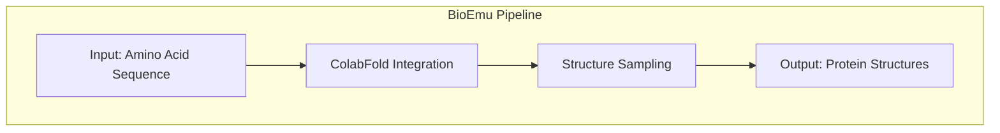
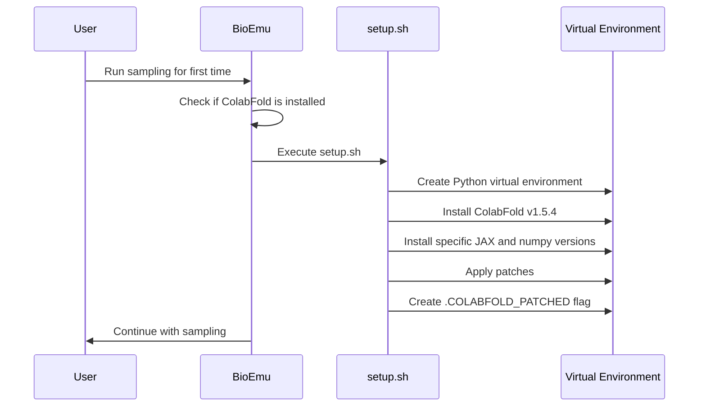
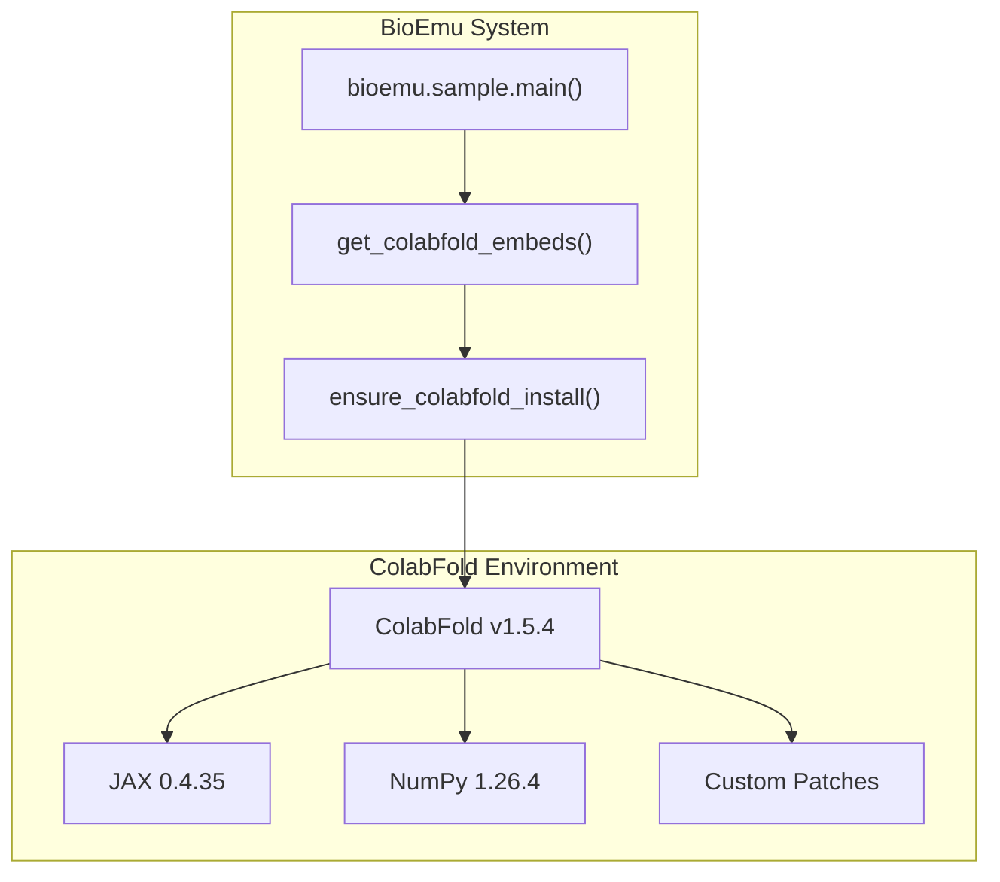
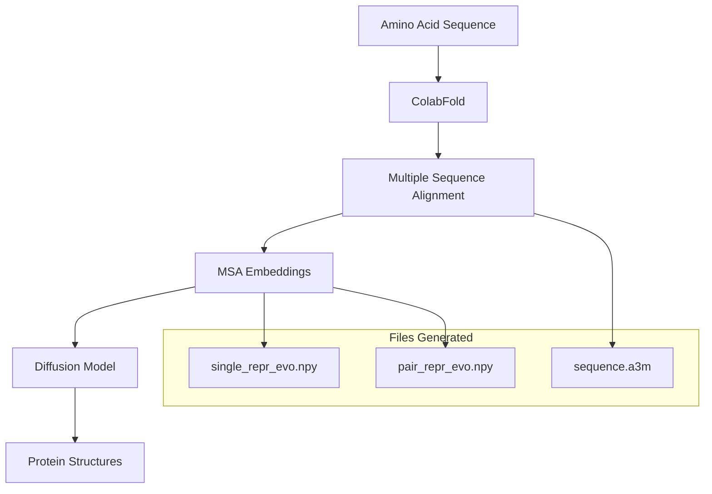

# ColabFold Setup

> **Relevant source files**
> * [README.md](https://github.com/microsoft/bioemu/blob/6ff0ddd1/README.md?plain=1)
> * [src/bioemu/colabfold_setup/batch.patch](https://github.com/microsoft/bioemu/blob/6ff0ddd1/src/bioemu/colabfold_setup/batch.patch)
> * [src/bioemu/colabfold_setup/setup.sh](https://github.com/microsoft/bioemu/blob/6ff0ddd1/src/bioemu/colabfold_setup/setup.sh)

## Purpose and Scope

This document provides detailed instructions on how ColabFold is set up and used within BioEmu. ColabFold is a critical dependency that generates Multiple Sequence Alignments (MSAs) and embeddings required for protein structure prediction. This page covers the automatic installation process, configuration options, and technical details of the ColabFold integration. For information about using HPacker for sidechain reconstruction, see [HPacker Setup](/microsoft/bioemu/2.2-hpacker-setup).

Sources: [README.md L33-L35](https://github.com/microsoft/bioemu/blob/6ff0ddd1/README.md?plain=1#L33-L35)

 [README.md L59-L61](https://github.com/microsoft/bioemu/blob/6ff0ddd1/README.md?plain=1#L59-L61)

## Overview

ColabFold serves as the frontend for generating protein embeddings in BioEmu. It provides essential evolutionary information that the diffusion model uses to generate protein structure samples.



Sources: [README.md L34](https://github.com/microsoft/bioemu/blob/6ff0ddd1/README.md?plain=1#L34-L34)

## Automatic Installation Process

BioEmu automatically sets up ColabFold the first time you run the sampling functionality. The system follows these steps:



The setup script performs these specific actions:

1. Creates a Python virtual environment in the designated directory
2. Installs ColabFold v1.5.4 with 'alphafold-minus-jax' configuration
3. Forces reinstallation of specific JAX and numpy versions
4. Applies custom patches to the ColabFold installation
5. Marks the installation as complete

Sources: [src/bioemu/colabfold_setup/setup.sh L1-L23](https://github.com/microsoft/bioemu/blob/6ff0ddd1/src/bioemu/colabfold_setup/setup.sh#L1-L23)

 [README.md L33-L35](https://github.com/microsoft/bioemu/blob/6ff0ddd1/README.md?plain=1#L33-L35)

## Configuration Options

By default, BioEmu installs ColabFold in the `~/.bioemu_colabfold` directory. You can customize this location by setting the `BIOEMU_COLABFOLD_DIR` environment variable before running BioEmu for the first time.

```javascript
# Example of customizing the ColabFold installation directoryexport BIOEMU_COLABFOLD_DIR=/path/to/custom/colabfoldpython -m bioemu.sample --sequence GYDPETGTWG --num_samples 10 --output_dir ~/test-output
```

Sources: [README.md L33-L35](https://github.com/microsoft/bioemu/blob/6ff0ddd1/README.md?plain=1#L33-L35)

## Technical Implementation

### Integration with BioEmu

ColabFold is used as a separate tool that BioEmu interfaces with through a dedicated environment. This separation helps manage dependencies and ensures ColabFold's specific requirements don't conflict with BioEmu's.



Sources: [src/bioemu/colabfold_setup/setup.sh L5-L13](https://github.com/microsoft/bioemu/blob/6ff0ddd1/src/bioemu/colabfold_setup/setup.sh#L5-L13)

### Custom Patches

BioEmu applies two patches to ColabFold to enhance its functionality:

1. `modules.patch`: Modifies the AlphaFold modules implementation
2. `batch.patch`: Adds functionality to save single and pair representation evolutionary data

The batch.patch specifically adds code to save the evolutionary representations, which are crucial for BioEmu's structure sampling:

```
np.save(files.get("single_repr_evo", "npy"), result["representations_evo"]["single"])
np.save(files.get("pair_repr_evo", "npy"), result["representations_evo"]["pair"])
```

Sources: [src/bioemu/colabfold_setup/setup.sh L15-L22](https://github.com/microsoft/bioemu/blob/6ff0ddd1/src/bioemu/colabfold_setup/setup.sh#L15-L22)

 [src/bioemu/colabfold_setup/batch.patch L1-L5](https://github.com/microsoft/bioemu/blob/6ff0ddd1/src/bioemu/colabfold_setup/batch.patch#L1-L5)

## Using Custom MSA Files

If you prefer to use your own generated MSA instead of the ones retrieved via ColabFold, you can:

1. Pass an A3M file containing the query sequence as the first row to the `sequence` argument
2. Use the `msa_host_url` argument to override the default ColabFold MSA query server

Example:

```markdown
# Using a custom MSA filepython -m bioemu.sample --sequence path/to/custom.a3m --output_dir ~/output
```

Sources: [README.md L59-L61](https://github.com/microsoft/bioemu/blob/6ff0ddd1/README.md?plain=1#L59-L61)

## Data Flow with ColabFold

The following diagram illustrates how data flows through ColabFold within the BioEmu system:



Sources: [README.md L38-L41](https://github.com/microsoft/bioemu/blob/6ff0ddd1/README.md?plain=1#L38-L41)

 [src/bioemu/colabfold_setup/batch.patch L1-L5](https://github.com/microsoft/bioemu/blob/6ff0ddd1/src/bioemu/colabfold_setup/batch.patch#L1-L5)

## Troubleshooting and Common Issues

If you encounter issues with ColabFold setup, consider these steps:

1. Check if the virtual environment was created properly in your specified directory
2. Ensure you have sufficient disk space for ColabFold dependencies
3. If you see any CUDA-related errors, verify that your CUDA installation is compatible with the JAX version being installed (CUDA 12 is used by default)
4. If necessary, you can manually trigger a reinstallation by removing the directory and running BioEmu again

Sources: [src/bioemu/colabfold_setup/setup.sh L5-L23](https://github.com/microsoft/bioemu/blob/6ff0ddd1/src/bioemu/colabfold_setup/setup.sh#L5-L23)