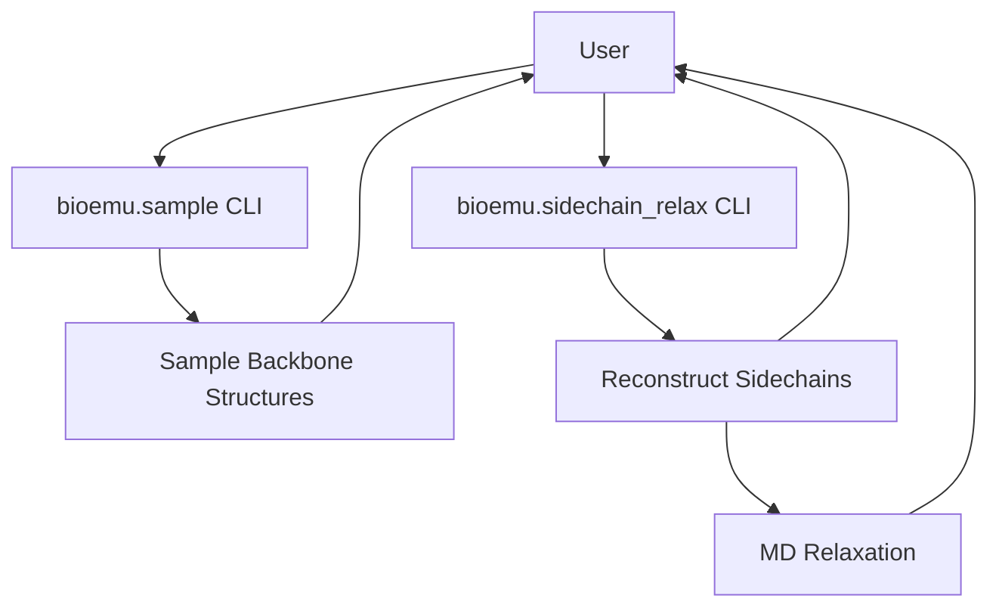
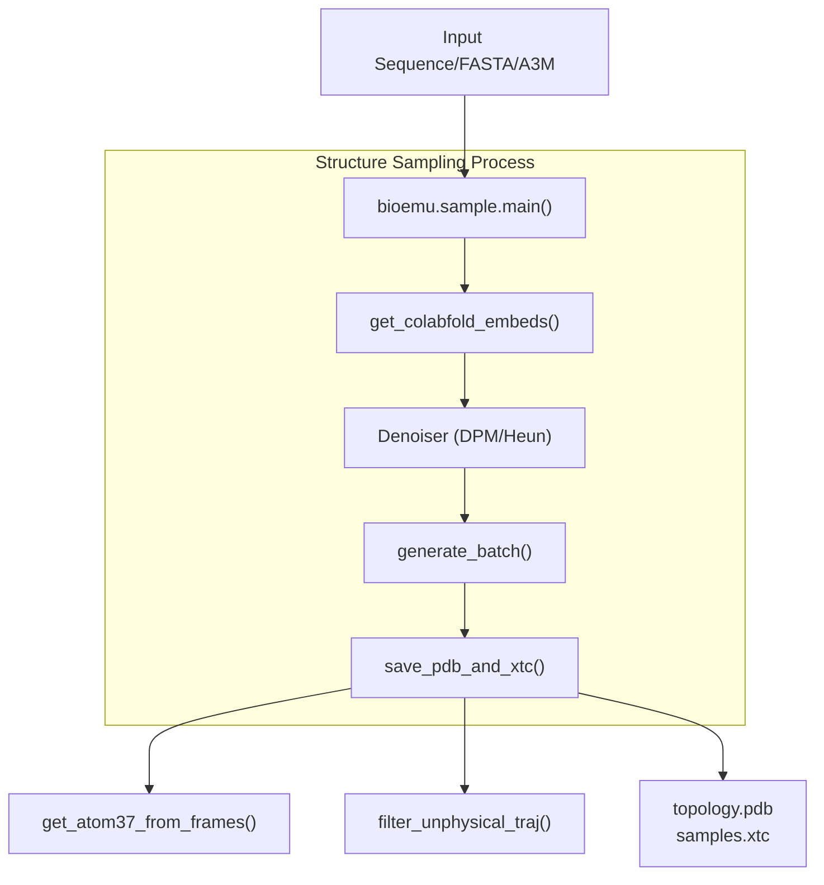
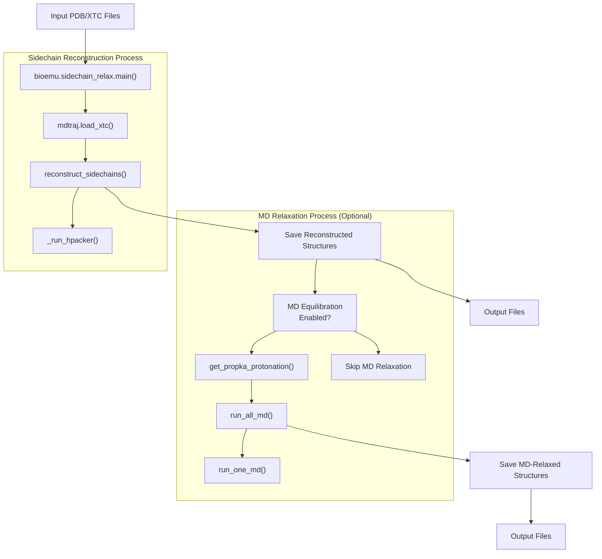
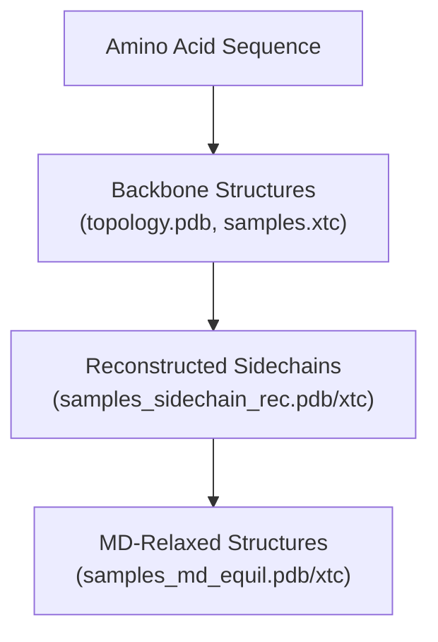

# Command Line Interface

> **Relevant source files**
> * [README.md](https://github.com/microsoft/bioemu/blob/6ff0ddd1/README.md?plain=1)
> * [src/bioemu/convert_chemgraph.py](https://github.com/microsoft/bioemu/blob/6ff0ddd1/src/bioemu/convert_chemgraph.py)
> * [src/bioemu/sample.py](https://github.com/microsoft/bioemu/blob/6ff0ddd1/src/bioemu/sample.py)
> * [src/bioemu/sidechain_relax.py](https://github.com/microsoft/bioemu/blob/6ff0ddd1/src/bioemu/sidechain_relax.py)

This document describes the command-line interfaces (CLIs) provided by BioEmu for generating protein structure ensembles from amino acid sequences. BioEmu offers two primary command-line tools:

1. `bioemu.sample` - For generating protein backbone structure samples from amino acid sequences
2. `bioemu.sidechain_relax` - For reconstructing sidechains and optionally performing molecular dynamics relaxation on backbone samples

For information about the equivalent Python API, see [Python API](/microsoft/bioemu/4.2-python-api).

## Overview



Sources: [src/bioemu/sample.py L66-L200](https://github.com/microsoft/bioemu/blob/6ff0ddd1/src/bioemu/sample.py#L66-L200)

 [src/bioemu/sidechain_relax.py L206-L243](https://github.com/microsoft/bioemu/blob/6ff0ddd1/src/bioemu/sidechain_relax.py#L206-L243)

## Structure Sampling CLI

The `bioemu.sample` module provides the primary interface for generating protein structure samples from amino acid sequences.

### Usage

```
python -m bioemu.sample --sequence SEQUENCE --num_samples NUM_SAMPLES --output_dir OUTPUT_DIR [OPTIONS]
```

### Parameters

| Parameter | Type | Description | Default |
| --- | --- | --- | --- |
| `--sequence` | str | Amino acid sequence, path to FASTA file, or path to A3M file with MSAs | Required |
| `--num_samples` | int | Number of samples to generate | Required |
| `--output_dir` | str | Directory to save samples | Required |
| `--batch_size_100` | int | Batch size for a sequence of length 100 (scales with sequence length) | 10 |
| `--model_name` | str | Name of pretrained model to use from Hugging Face | "bioemu-v1.0" |
| `--ckpt_path` | str | Path to model checkpoint (overrides `model_name`) | None |
| `--model_config_path` | str | Path to model config (required if `ckpt_path` is set) | None |
| `--denoiser_type` | str | Denoiser type ("dpm" or "heun") | "dpm" |
| `--denoiser_config_path` | str | Path to denoiser config | None |
| `--cache_embeds_dir` | str | Directory to cache MSA embeddings | None |
| `--msa_host_url` | str | MSA server URL for ColabFold | None |
| `--filter_samples` | bool | Filter out unphysical samples | True |

Sources: [src/bioemu/sample.py L66-L200](https://github.com/microsoft/bioemu/blob/6ff0ddd1/src/bioemu/sample.py#L66-L200)

### Output Files

The sampling CLI produces the following files in the specified output directory:

| File | Description |
| --- | --- |
| `sequence.fasta` | The input sequence in FASTA format |
| `topology.pdb` | PDB file containing the topology for the generated ensemble |
| `samples.xtc` | XTC trajectory file containing all generated samples |
| `batch_*.npz` | Intermediate files containing batches of samples (preserved for debugging) |

Sources: [src/bioemu/sample.py L147-L199](https://github.com/microsoft/bioemu/blob/6ff0ddd1/src/bioemu/sample.py#L147-L199)

 [src/bioemu/convert_chemgraph.py L398-L458](https://github.com/microsoft/bioemu/blob/6ff0ddd1/src/bioemu/convert_chemgraph.py#L398-L458)

### Examples

Basic usage with a short peptide sequence:

```
python -m bioemu.sample --sequence GYDPETGTWG --num_samples 10 --output_dir ~/test-chignolin
```

Using a FASTA file as input:

```
python -m bioemu.sample --sequence path/to/protein.fasta --num_samples 100 --output_dir ~/protein_samples
```

Using a custom MSA file:

```
python -m bioemu.sample --sequence path/to/custom.a3m --num_samples 50 --output_dir ~/custom_msa_samples
```

Using a different model checkpoint and configuration:

```
python -m bioemu.sample --sequence SEQUENCE --num_samples 10 --output_dir output \    --ckpt_path path/to/checkpoint.ckpt --model_config_path path/to/config.yaml
```

Sources: [README.md L37-L62](https://github.com/microsoft/bioemu/blob/6ff0ddd1/README.md?plain=1#L37-L62)

## Workflow Details



Sources: [src/bioemu/sample.py L147-L201](https://github.com/microsoft/bioemu/blob/6ff0ddd1/src/bioemu/sample.py#L147-L201)

 [src/bioemu/convert_chemgraph.py L398-L458](https://github.com/microsoft/bioemu/blob/6ff0ddd1/src/bioemu/convert_chemgraph.py#L398-L458)

### Generation Process

1. **Input Parsing**: The amino acid sequence is parsed from a string, FASTA file, or A3M file.
2. **Embedding Generation**: MSA embeddings are generated using ColabFold.
3. **Batch Generation**: Samples are generated in batches, with batch size scaled according to sequence length.
4. **Structure Conversion**: Sampled structures are converted from the internal ChemGraph representation to backbone atom positions.
5. **Sample Filtering**: Unphysical samples with issues like unrealistic bond distances or steric clashes are filtered out.
6. **Output Writing**: The final structures are saved as PDB and XTC files.

Sources: [src/bioemu/sample.py L66-L200](https://github.com/microsoft/bioemu/blob/6ff0ddd1/src/bioemu/sample.py#L66-L200)

 [src/bioemu/convert_chemgraph.py L398-L458](https://github.com/microsoft/bioemu/blob/6ff0ddd1/src/bioemu/convert_chemgraph.py#L398-L458)

## Sidechain Reconstruction and MD Relaxation CLI

The `bioemu.sidechain_relax` module provides functionality for reconstructing sidechains from backbone-only structures and optionally performing molecular dynamics relaxation.

### Prerequisites

This module requires additional dependencies:

* A conda-based package manager available in the system PATH
* Optional dependencies installed via `pip install bioemu[md]`

The first time this module is invoked, it will attempt to install HPacker and its dependencies into a separate conda environment.

Sources: [README.md L70-L96](https://github.com/microsoft/bioemu/blob/6ff0ddd1/README.md?plain=1#L70-L96)

### Usage

```
python -m bioemu.sidechain_relax --pdb-path PDB_PATH --xtc-path XTC_PATH [OPTIONS]
```

### Parameters

| Parameter | Type | Description | Default |
| --- | --- | --- | --- |
| `--pdb-path` | str | Path to PDB file containing topology | Required |
| `--xtc-path` | str | Path to XTC file containing samples | Required |
| `--md-equil` | bool | Run MD equilibration | True |
| `--md-protocol` | str | MD protocol ("local_minimization" or "nvt_equil") | "local_minimization" |
| `--outpath` | str | Path to write output files | "." (current directory) |
| `--prefix` | str | Prefix for output filenames | "samples" |
| `--no-md-equil` | flag | Skip MD equilibration (shorthand for `--md-equil=False`) | False |

Sources: [src/bioemu/sidechain_relax.py L206-L243](https://github.com/microsoft/bioemu/blob/6ff0ddd1/src/bioemu/sidechain_relax.py#L206-L243)

### Output Files

The sidechain reconstruction and relaxation CLI produces the following files:

| File | Description |
| --- | --- |
| `{prefix}_sidechain_rec.pdb` | PDB file with reconstructed sidechains |
| `{prefix}_sidechain_rec.xtc` | XTC trajectory file with reconstructed sidechains |
| `{prefix}_md_equil.pdb` | PDB file with MD-equilibrated structures (if MD equilibration is enabled) |
| `{prefix}_md_equil.xtc` | XTC trajectory file with MD-equilibrated structures (if MD equilibration is enabled) |

Sources: [src/bioemu/sidechain_relax.py L229-L242](https://github.com/microsoft/bioemu/blob/6ff0ddd1/src/bioemu/sidechain_relax.py#L229-L242)

### MD Protocols

Two MD protocols are available:

1. **Local Minimization** (`local_minimization`): Only performs energy minimization without full MD integration. This is faster but only resolves local issues like steric clashes.
2. **NVT Equilibration** (`nvt_equil`): Performs energy minimization followed by a short constrained MD equilibration. This is slower but can resolve more severe structural issues.

Sources: [src/bioemu/sidechain_relax.py L31-L34](https://github.com/microsoft/bioemu/blob/6ff0ddd1/src/bioemu/sidechain_relax.py#L31-L34)

 [src/bioemu/sidechain_relax.py L108-L165](https://github.com/microsoft/bioemu/blob/6ff0ddd1/src/bioemu/sidechain_relax.py#L108-L165)

### Examples

Basic usage with default options (includes MD local minimization):

```
python -m bioemu.sidechain_relax --pdb-path topology.pdb --xtc-path samples.xtc
```

Reconstruct sidechains without MD equilibration:

```
python -m bioemu.sidechain_relax --pdb-path topology.pdb --xtc-path samples.xtc --no-md-equil
```

Run full NVT equilibration:

```
python -m bioemu.sidechain_relax --pdb-path topology.pdb --xtc-path samples.xtc --md-protocol nvt_equil
```

Custom output location and file prefix:

```
python -m bioemu.sidechain_relax --pdb-path topology.pdb --xtc-path samples.xtc --outpath results --prefix protein_1
```

Sources: [README.md L82-L100](https://github.com/microsoft/bioemu/blob/6ff0ddd1/README.md?plain=1#L82-L100)

## Workflow Details



Sources: [src/bioemu/sidechain_relax.py L206-L243](https://github.com/microsoft/bioemu/blob/6ff0ddd1/src/bioemu/sidechain_relax.py#L206-L243)

 [src/bioemu/sidechain_relax.py L63-L105](https://github.com/microsoft/bioemu/blob/6ff0ddd1/src/bioemu/sidechain_relax.py#L63-L105)

 [src/bioemu/sidechain_relax.py L168-L203](https://github.com/microsoft/bioemu/blob/6ff0ddd1/src/bioemu/sidechain_relax.py#L168-L203)

### Sidechain Reconstruction Process

1. **Load Trajectory**: The input PDB and XTC files are loaded using MDTraj.
2. **Extract Backbone**: The backbone atoms are extracted from the input structures.
3. **Run HPacker**: For each frame, HPacker is run to reconstruct sidechains based on the backbone structure.
4. **Combine Results**: The reconstructed structures are combined into a single trajectory.
5. **Save Output**: The reconstructed structures are saved as PDB and XTC files.

Sources: [src/bioemu/sidechain_relax.py L63-L105](https://github.com/microsoft/bioemu/blob/6ff0ddd1/src/bioemu/sidechain_relax.py#L63-L105)

### MD Relaxation Process (Optional)

If MD equilibration is enabled:

1. **Protonation**: Protonation states are determined using propKa at pH 7.0.
2. **System Setup**: The system is set up with explicit solvent (TIP3P water model) and the AMBER99SB force field.
3. **Force Application**: Constraint forces are applied to backbone atoms to maintain the predicted structure.
4. **Minimization**: Energy minimization is performed to resolve steric clashes.
5. **Integration**: For NVT equilibration, molecular dynamics integration is performed for 0.1 ns.
6. **Save Output**: The MD-relaxed structures are saved as PDB and XTC files.

Sources: [src/bioemu/sidechain_relax.py L108-L165](https://github.com/microsoft/bioemu/blob/6ff0ddd1/src/bioemu/sidechain_relax.py#L108-L165)

 [src/bioemu/sidechain_relax.py L168-L203](https://github.com/microsoft/bioemu/blob/6ff0ddd1/src/bioemu/sidechain_relax.py#L168-L203)

## Common Workflows

### Complete Pipeline: From Sequence to Relaxed Structures



Example complete workflow:

```markdown
# Step 1: Generate backbone samplespython -m bioemu.sample --sequence GYDPETGTWG --num_samples 10 --output_dir ~/test-protein # Step 2: Reconstruct sidechains and perform MD relaxationpython -m bioemu.sidechain_relax --pdb-path ~/test-protein/topology.pdb --xtc-path ~/test-protein/samples.xtc --md-protocol nvt_equil
```

Sources: [README.md L37-L100](https://github.com/microsoft/bioemu/blob/6ff0ddd1/README.md?plain=1#L37-L100)

### Working with Subsets of Samples

For large proteins, it may be beneficial to work with a subset of samples, especially for sidechain reconstruction and MD relaxation which can be computationally expensive:

```markdown
# Generate a large number of backbone samplespython -m bioemu.sample --sequence path/to/sequence.fasta --num_samples 1000 --output_dir ~/large-protein # Extract a subset of frames using external tools (e.g., MDTraj)# Then run sidechain reconstruction on the subsetpython -m bioemu.sidechain_relax --pdb-path ~/large-protein/subset_topology.pdb --xtc-path ~/large-protein/subset_samples.xtc
```

Sources: [README.md L93-L96](https://github.com/microsoft/bioemu/blob/6ff0ddd1/README.md?plain=1#L93-L96)

### Troubleshooting

If you encounter issues with HPacker installation:

* Ensure a conda-based package manager is in your PATH.
* Set the `HPACKER_ENVNAME` environment variable before first use to specify a different location for the HPacker conda environment.

If you need to use your own MSA instead of those generated by ColabFold:

* Prepare an A3M file with your custom MSA (the query sequence must be the first row).
* Pass the A3M file path to the `--sequence` argument.

Sources: [README.md L60-L61](https://github.com/microsoft/bioemu/blob/6ff0ddd1/README.md?plain=1#L60-L61)

 [README.md L88-L89](https://github.com/microsoft/bioemu/blob/6ff0ddd1/README.md?plain=1#L88-L89)