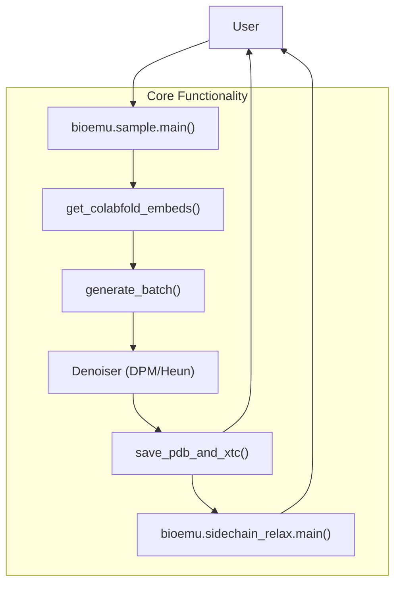
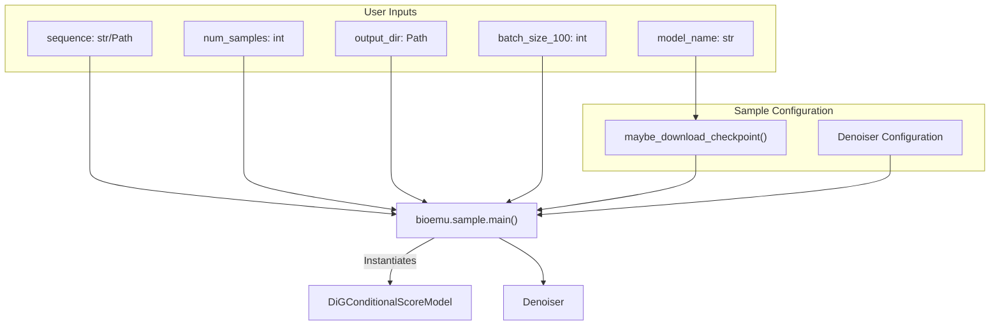
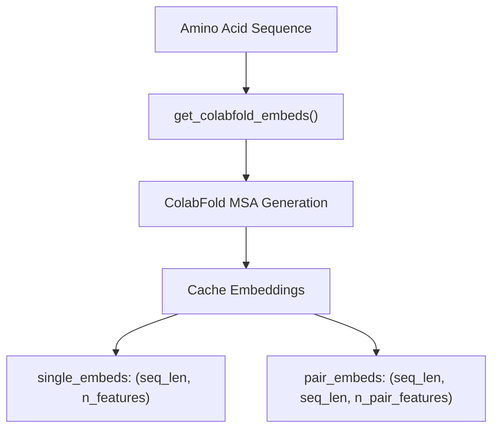
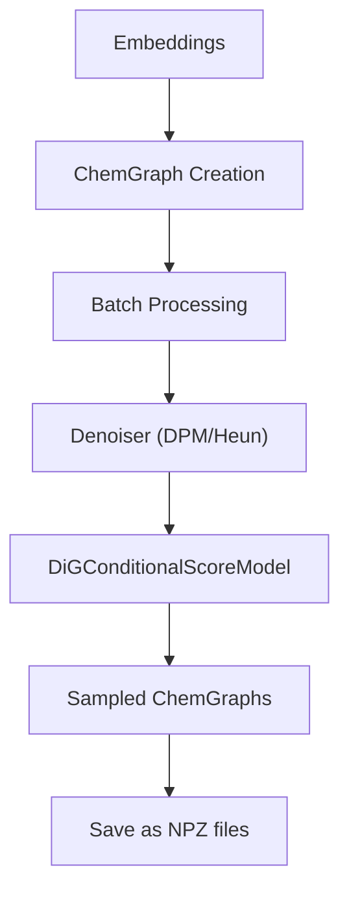
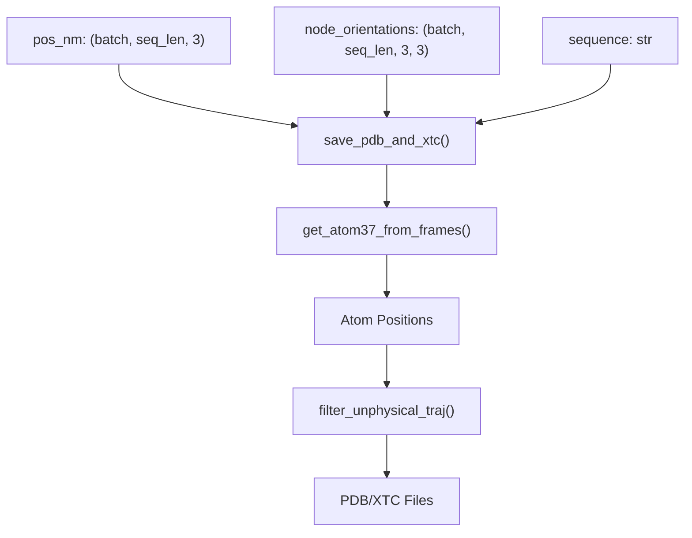
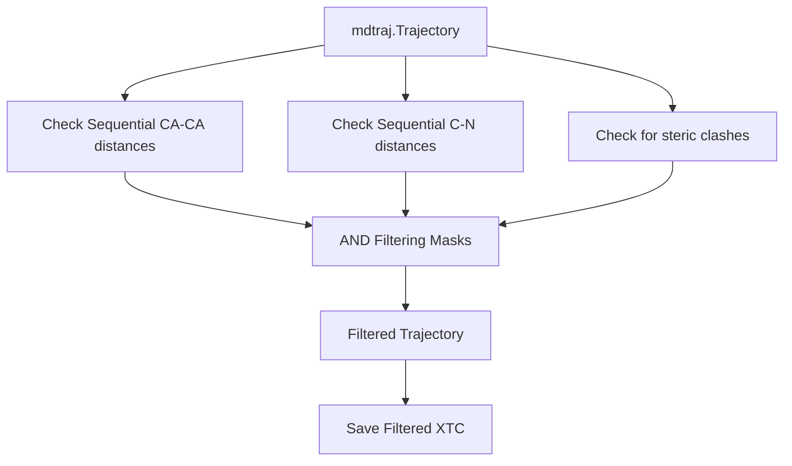
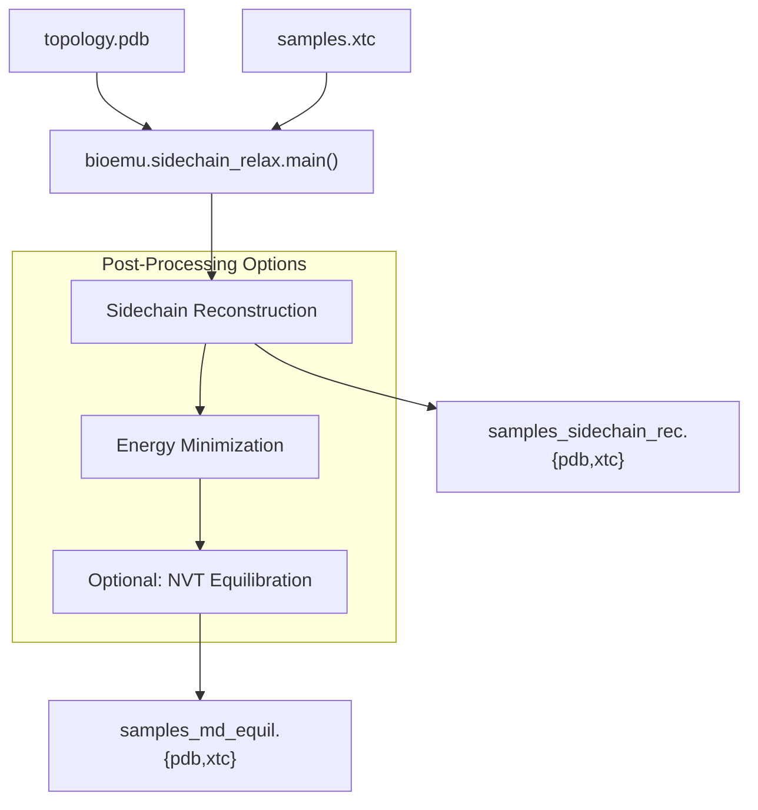
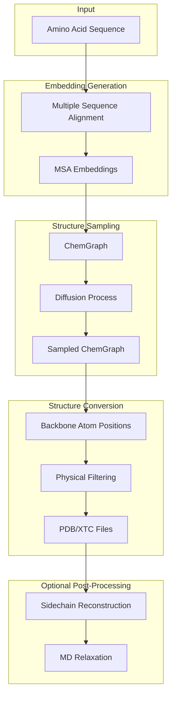

# Core Functionality

> **Relevant source files**
> * [README.md](https://github.com/microsoft/bioemu/blob/6ff0ddd1/README.md?plain=1)
> * [src/bioemu/convert_chemgraph.py](https://github.com/microsoft/bioemu/blob/6ff0ddd1/src/bioemu/convert_chemgraph.py)
> * [src/bioemu/sample.py](https://github.com/microsoft/bioemu/blob/6ff0ddd1/src/bioemu/sample.py)

This document provides a comprehensive overview of BioEmu's core functionality - the essential processes that enable the system to generate protein structure ensembles from amino acid sequences. BioEmu combines machine learning techniques with molecular modeling to produce physically realistic protein conformations that approximate the equilibrium distribution of structures.

For installation instructions, see [Installation and Setup](/microsoft/bioemu/2-installation-and-setup). For details about the underlying model architecture, see [Model Architecture](/microsoft/bioemu/5-model-architecture).

## 1. Main Workflow

BioEmu's core functionality consists of three main processes:

1. **Structure Sampling**: Generates backbone-only protein structures from an amino acid sequence
2. **Format Conversion**: Converts the internal representation to standard molecular formats (PDB, XTC)
3. **Post-Processing** (optional): Reconstructs sidechains and performs MD relaxation

The following diagram illustrates this workflow:



Sources: [src/bioemu/sample.py L66-L201](https://github.com/microsoft/bioemu/blob/6ff0ddd1/src/bioemu/sample.py#L66-L201)

 [README.md L37-L43](https://github.com/microsoft/bioemu/blob/6ff0ddd1/README.md?plain=1#L37-L43)

## 2. Structure Sampling

The structure sampling process begins with an amino acid sequence and produces a set of probable backbone conformations using a diffusion model.

### 2.1 Entry Point and Configuration

The main entry point for sampling is the `main()` function in `bioemu.sample`, which accepts:

* An amino acid sequence or FASTA file
* The number of samples to generate
* Output directory and other configuration parameters



Sources: [src/bioemu/sample.py L66-L101](https://github.com/microsoft/bioemu/blob/6ff0ddd1/src/bioemu/sample.py#L66-L101)

### 2.2 Embedding Generation

For each sequence, BioEmu generates embeddings using ColabFold:

1. The sequence is passed to `get_colabfold_embeds()`
2. ColabFold creates a Multiple Sequence Alignment (MSA)
3. The MSA is converted to single-residue and pair-residue embeddings
4. Embeddings are cached for future use



Sources: [src/bioemu/sample.py L229-L246](https://github.com/microsoft/bioemu/blob/6ff0ddd1/src/bioemu/sample.py#L229-L246)

### 2.3 Structure Generation

With embeddings in hand, BioEmu generates structures through:

1. Creating a `ChemGraph` representation with the embeddings
2. Running a diffusion model to sample protein backbones
3. Processing batches of samples with appropriate batch sizes based on sequence length



Sources: [src/bioemu/sample.py L203-L277](https://github.com/microsoft/bioemu/blob/6ff0ddd1/src/bioemu/sample.py#L203-L277)

## 3. Structure Conversion

After generating samples, BioEmu converts them to standard molecular formats:

### 3.1 ChemGraph to Backbone Atoms

The `ChemGraph` representation is converted to backbone atom positions:

1. Positions and orientations are extracted from sampled ChemGraphs
2. These are processed to generate 3D coordinates for N, CA, C, O, and CB backbone atoms
3. The backbone atom positions are saved in Angstroms



Sources: [src/bioemu/convert_chemgraph.py L398-L458](https://github.com/microsoft/bioemu/blob/6ff0ddd1/src/bioemu/convert_chemgraph.py#L398-L458)

### 3.2 Filtering Unphysical Structures

By default, BioEmu filters generated structures based on physical criteria:

1. Maximum CA-CA distance between sequential residues (< 4.5 Å)
2. Maximum C-N distance between sequential residues (< 2.0 Å)
3. Minimum distance between non-bonded atoms (> 1.0 Å)

Only structures that satisfy these criteria are included in the final output.



Sources: [src/bioemu/convert_chemgraph.py L296-L395](https://github.com/microsoft/bioemu/blob/6ff0ddd1/src/bioemu/convert_chemgraph.py#L296-L395)

## 4. Optional Post-Processing

BioEmu offers optional post-processing to enhance the generated structures:

### 4.1 Sidechain Reconstruction

After backbone generation, sidechains can be reconstructed using HPacker:

1. Takes the backbone-only PDB and XTC files as input
2. Uses HPacker to add sidechain heavy atoms
3. Outputs reconstructed all-heavy-atom structures

### 4.2 MD Relaxation

Optionally, structures can undergo molecular dynamics (MD) relaxation:

1. Energy minimization to resolve local clashes
2. Short NVT equilibration (if specified)
3. Outputs MD-equilibrated structures



Sources: [README.md L70-L100](https://github.com/microsoft/bioemu/blob/6ff0ddd1/README.md?plain=1#L70-L100)

## 5. Data Flow Summary

The following diagram summarizes the data transformations that occur throughout BioEmu's core functionality:



Sources: [src/bioemu/sample.py](https://github.com/microsoft/bioemu/blob/6ff0ddd1/src/bioemu/sample.py)

 [src/bioemu/convert_chemgraph.py](https://github.com/microsoft/bioemu/blob/6ff0ddd1/src/bioemu/convert_chemgraph.py)

 [README.md L70-L100](https://github.com/microsoft/bioemu/blob/6ff0ddd1/README.md?plain=1#L70-L100)

## 6. Usage Examples

### Command Line Interface

```
python -m bioemu.sample --sequence GYDPETGTWG --num_samples 10 --output_dir ~/test-chignolin
```

### Python API

```javascript
from bioemu.sample import main as samplesample(sequence='GYDPETGTWG', num_samples=10, output_dir='~/test_chignolin')
```

For sidechain reconstruction and MD relaxation:

```
python -m bioemu.sidechain_relax --pdb-path path/to/topology.pdb --xtc-path path/to/samples.xtc
```

Sources: [README.md L38-L96](https://github.com/microsoft/bioemu/blob/6ff0ddd1/README.md?plain=1#L38-L96)

## 7. Performance Considerations

The sampling time depends on sequence length and available hardware. For reference, on an A100 GPU with 80GB VRAM:

| Sequence Length | Time (minutes) for 1000 samples |
| --- | --- |
| 100 | 4 |
| 300 | 40 |
| 600 | 150 |

Sources: [README.md L52-L58](https://github.com/microsoft/bioemu/blob/6ff0ddd1/README.md?plain=1#L52-L58)