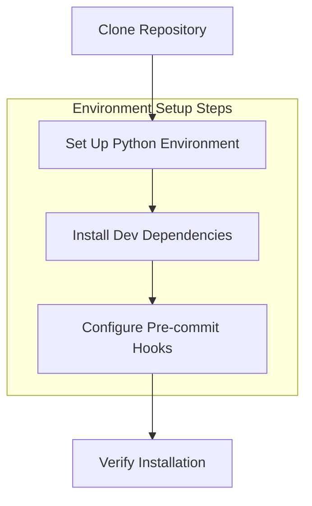
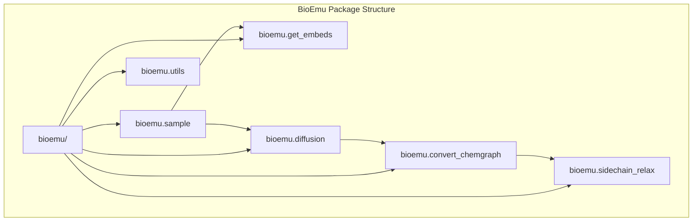
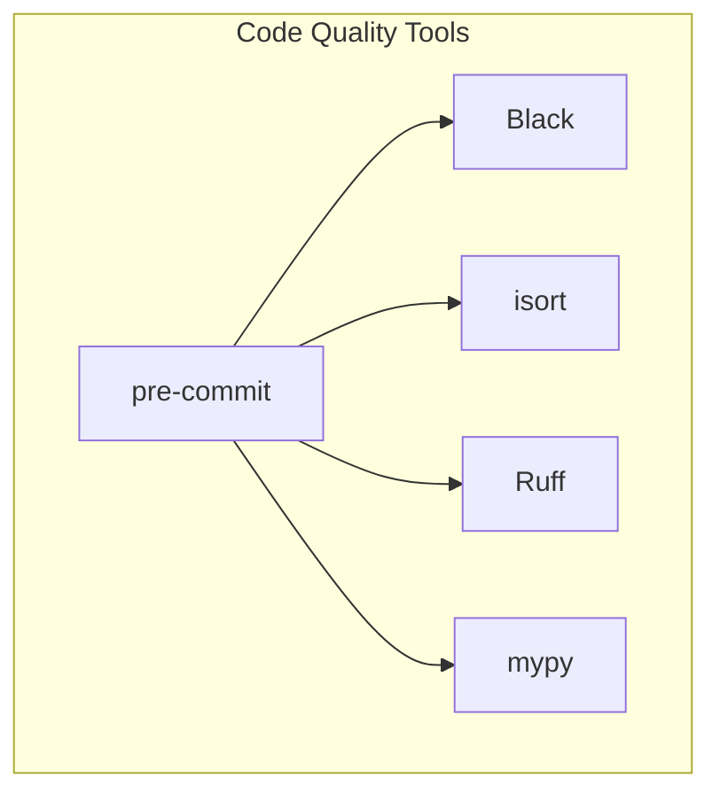
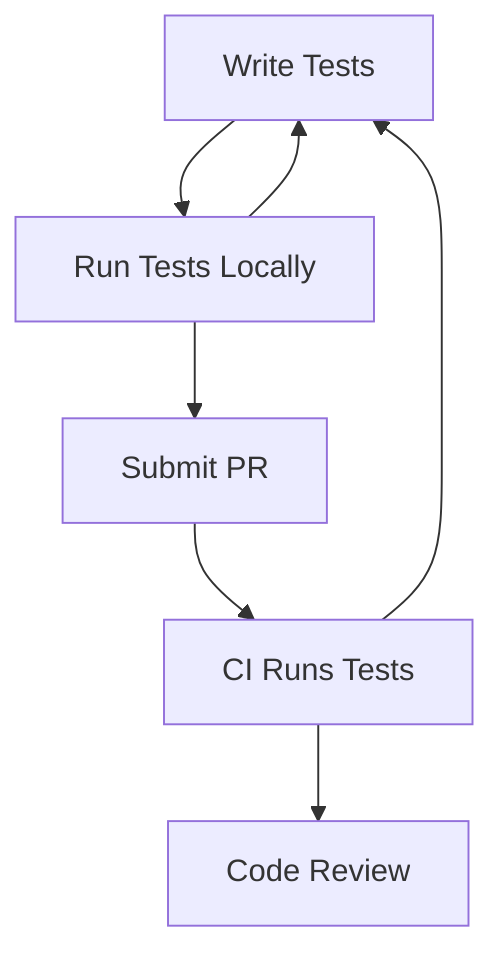
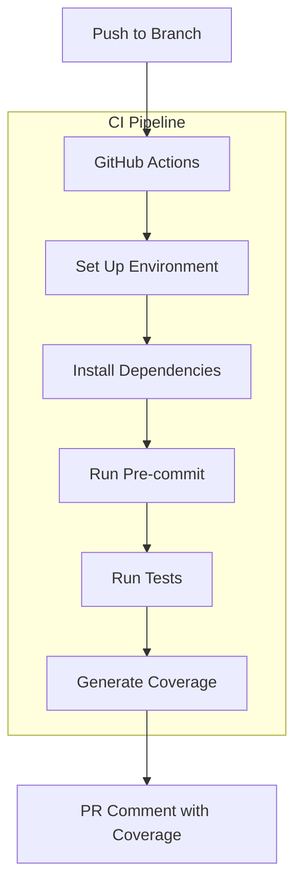
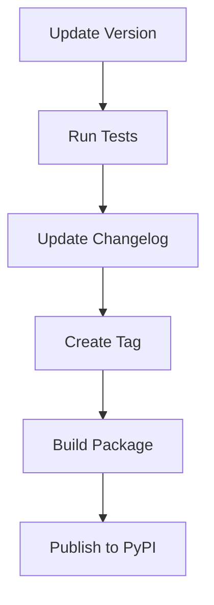
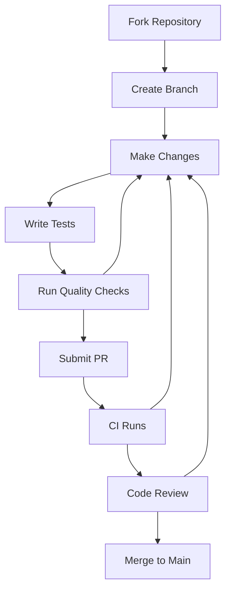

# Development Guide

> **Relevant source files**
> * [.github/workflows/ci.yml](https://github.com/microsoft/bioemu/blob/6ff0ddd1/.github/workflows/ci.yml)
> * [.github/workflows/codeql.yml](https://github.com/microsoft/bioemu/blob/6ff0ddd1/.github/workflows/codeql.yml)
> * [pyproject.toml](https://github.com/microsoft/bioemu/blob/6ff0ddd1/pyproject.toml)

This guide provides information for developers who want to contribute to BioEmu. It covers development environment setup, coding standards, testing procedures, and the release workflow. For information about using BioEmu as an end-user, see [Core Functionality](/microsoft/bioemu/3-core-functionality).

## Development Environment Setup

Setting up a development environment for BioEmu requires a few steps to ensure all dependencies are properly installed and configured.



### Prerequisites

* Python 3.10 or newer
* Git
* Conda or Mamba (recommended for environment management)

### Step 1: Clone the Repository

```
git clone https://github.com/microsoft/bioemucd bioemu
```

### Step 2: Set Up Python Environment

Using conda/mamba (recommended):

```sql
conda create -n bioemu python=3.10conda activate bioemu
```

### Step 3: Install Development Dependencies

Install BioEmu with development dependencies:

```
pip install -e ".[dev,md]"
```

This installs BioEmu in development mode with all dev dependencies including:

* pytest and pytest-cov for testing
* pre-commit for code quality checks
* openmm and other MD-related packages

### Step 4: Set Up Pre-commit Hooks

Initialize pre-commit hooks to ensure code quality checks run automatically before each commit:

```
pre-commit install
```

Sources: [pyproject.toml L27-L36](https://github.com/microsoft/bioemu/blob/6ff0ddd1/pyproject.toml#L27-L36)

 [.github/workflows/ci.yml L32-L46](https://github.com/microsoft/bioemu/blob/6ff0ddd1/.github/workflows/ci.yml#L32-L46)

## Code Structure

BioEmu's codebase is organized into several key modules that work together to generate protein structure ensembles.



Sources: System architecture diagrams provided

## Coding Standards and Quality

BioEmu uses several tools to maintain code quality and consistency.



### Code Formatting

* **Black**: Automatically formats Python code to a consistent style * Line length is set to 100 characters * Configuration in `pyproject.toml`
* **isort**: Sorts imports automatically * Configured to be compatible with Black * Groups imports into first-party (bioemu) and third-party

### Linting and Type Checking

* **Ruff**: Fast Python linter that enforces style and catches common errors * Configured to enforce various rules including: * pycodestyle (E, W) * Pyflakes (F) * pyupgrade (UP) * pylint error rules (PLE)
* **mypy**: Optional static type checker * Various third-party modules are configured to ignore missing imports

### Using Pre-commit

Pre-commit runs all quality checks before allowing commits:

```markdown
# Run on all filespre-commit run --all-files # Run automatically on staged files during commitgit commit -m "Your commit message"
```

Sources: [pyproject.toml L38-L160](https://github.com/microsoft/bioemu/blob/6ff0ddd1/pyproject.toml#L38-L160)

## Testing Framework

BioEmu uses pytest for testing. The test suite validates functionality and ensures changes don't break existing features.



### Running Tests

To run the test suite:

```markdown
# Run all testspytest tests/ # Run with coveragecoverage run --source=bioemu -m pytest tests/coverage report
```

### Coverage Reports

Generate coverage reports to identify untested code:

```markdown
# Generate HTML reportcoverage html # Generate XML reportcoverage xml
```

Sources: [.github/workflows/ci.yml L47-L55](https://github.com/microsoft/bioemu/blob/6ff0ddd1/.github/workflows/ci.yml#L47-L55)

## Continuous Integration

BioEmu uses GitHub Actions for continuous integration to automatically test changes and enforce code quality.



### CI Workflow

The CI pipeline runs the following steps:

1. Sets up a Python 3.10 environment using conda
2. Installs BioEmu with development dependencies
3. Runs pre-commit checks on all files
4. Runs the test suite with coverage
5. Generates coverage reports
6. Posts coverage summary as a PR comment (for PRs from internal branches)

### CodeQL Analysis

A separate workflow runs CodeQL analysis to identify security vulnerabilities and code quality issues.

Sources: [.github/workflows/ci.yml L14-L72](https://github.com/microsoft/bioemu/blob/6ff0ddd1/.github/workflows/ci.yml#L14-L72)

 [.github/workflows/codeql.yml L1-L96](https://github.com/microsoft/bioemu/blob/6ff0ddd1/.github/workflows/codeql.yml#L1-L96)

## Release Process

The release process for BioEmu involves several steps to ensure proper versioning and packaging.



### Version Management

Version numbers are maintained in `pyproject.toml`. When preparing a release:

1. Update the version number following semantic versioning principles (MAJOR.MINOR.PATCH)
2. Ensure all tests pass with the updated version
3. Create a git tag matching the version number
4. Build the package using `python -m build`
5. Publish to PyPI (when applicable)

The current version scheme uses semver format as seen in `pyproject.toml`: 0.1.6

Sources: [pyproject.toml L6-L7](https://github.com/microsoft/bioemu/blob/6ff0ddd1/pyproject.toml#L6-L7)

## Contributing Guidelines

When contributing to BioEmu, follow these general guidelines:

1. **Create a branch**: Create a branch from `main` for your changes
2. **Make targeted changes**: Keep changes focused on a single feature or bug fix
3. **Write tests**: Add tests for new functionality
4. **Ensure code quality**: Run pre-commit checks before submitting
5. **Submit a PR**: Create a pull request with a clear description of changes
6. **Address feedback**: Be responsive to code review feedback

### Pull Request Process



## Advanced Development Tasks

### Adding Dependencies

To add new dependencies to BioEmu:

1. Add the dependency to the appropriate section in `pyproject.toml`: * Main dependencies in the `dependencies` list * Development dependencies in the `dev` optional group * MD-related dependencies in the `md` optional group
2. Update your local environment: ``` pip install -e ".[dev,md]" ```
3. Update the CI configuration if needed

Sources: [pyproject.toml L12-L36](https://github.com/microsoft/bioemu/blob/6ff0ddd1/pyproject.toml#L12-L36)

### Environment Management

For development with conda/mamba, use the following commands for environment management:

```go
# Create environmentconda create -n bioemu python=3.10 # Activate environmentconda activate bioemu # Install package with dev dependenciespip install -e ".[dev,md]"
```

This development setup matches the CI environment and ensures consistent behavior between local and CI testing.

Sources: [.github/workflows/ci.yml L32-L40](https://github.com/microsoft/bioemu/blob/6ff0ddd1/.github/workflows/ci.yml#L32-L40)