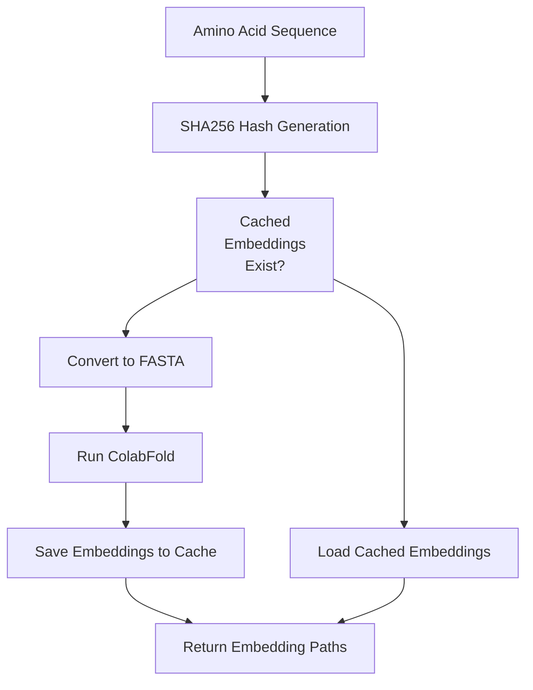
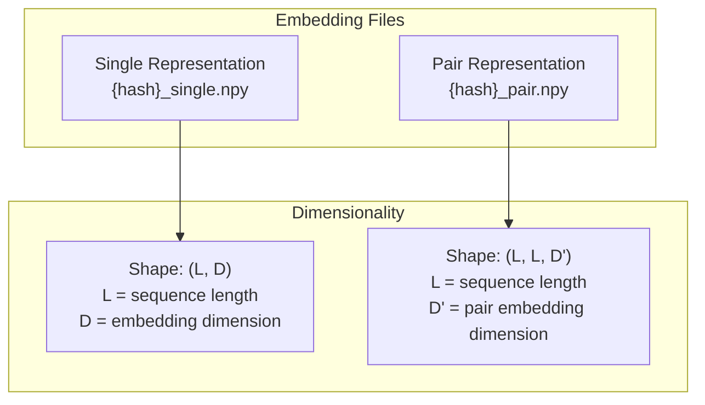
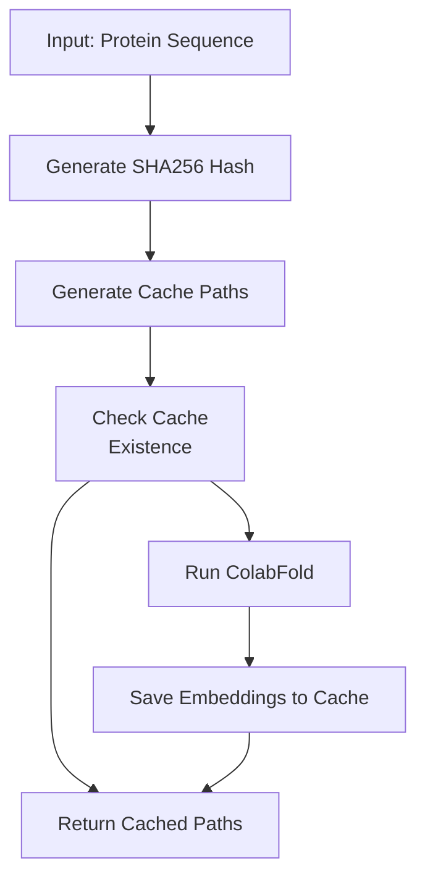
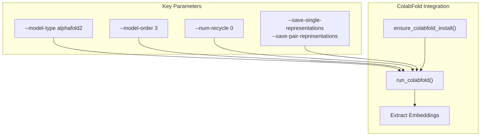
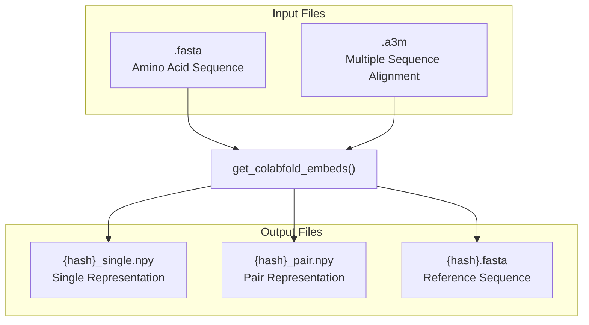
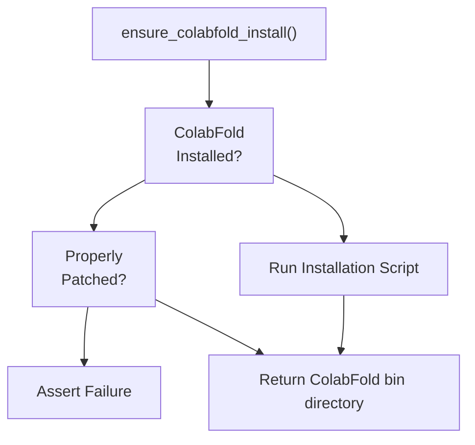

# Embedding Generation

> **Relevant source files**
> * [src/bioemu/get_embeds.py](https://github.com/microsoft/bioemu/blob/6ff0ddd1/src/bioemu/get_embeds.py)
> * [tests/test_embeds.py](https://github.com/microsoft/bioemu/blob/6ff0ddd1/tests/test_embeds.py)

## Purpose and Overview

This document describes how BioEmu generates and manages protein sequence embeddings, which are critical representations that capture evolutionary information needed for accurate protein structure prediction. The embedding generation process leverages ColabFold to create both single (per-residue) and pair (residue-residue interaction) representations from input amino acid sequences.

For information about how these embeddings are used in structure sampling, see [Protein Structure Sampling](/microsoft/bioemu/3.1-protein-structure-sampling).

## Embedding Generation Process

The embedding generation workflow consists of several steps, from receiving an input sequence to outputting numerical representations that can be used by the diffusion model.



Sources: [src/bioemu/get_embeds.py L127-L203](https://github.com/microsoft/bioemu/blob/6ff0ddd1/src/bioemu/get_embeds.py#L127-L203)

 [src/bioemu/get_embeds.py L28-L30](https://github.com/microsoft/bioemu/blob/6ff0ddd1/src/bioemu/get_embeds.py#L28-L30)

## Key Components and Technical Implementation

### Embedding Types

BioEmu generates and uses two types of embeddings:

1. **Single Representations**: Per-residue embeddings that capture information about each amino acid in the sequence
2. **Pair Representations**: Residue-residue interaction embeddings that capture information about how different positions in the sequence relate to each other



Sources: [src/bioemu/get_embeds.py L155-L156](https://github.com/microsoft/bioemu/blob/6ff0ddd1/src/bioemu/get_embeds.py#L155-L156)

 [tests/test_embeds.py L27-L28](https://github.com/microsoft/bioemu/blob/6ff0ddd1/tests/test_embeds.py#L27-L28)

### Caching Mechanism

BioEmu implements an efficient caching system to avoid redundant computation of embeddings:



Sources: [src/bioemu/get_embeds.py L147-L160](https://github.com/microsoft/bioemu/blob/6ff0ddd1/src/bioemu/get_embeds.py#L147-L160)

 [src/bioemu/get_embeds.py L83-L85](https://github.com/microsoft/bioemu/blob/6ff0ddd1/src/bioemu/get_embeds.py#L83-L85)

The cache directory defaults to `~/.bioemu_embeds_cache` but can be customized when calling the embedding functions.

### ColabFold Integration

BioEmu integrates with ColabFold by:

1. Managing the ColabFold installation
2. Preparing input files in the required format
3. Executing ColabFold with appropriate parameters
4. Extracting and storing the resulting embeddings



Sources: [src/bioemu/get_embeds.py L58-L80](https://github.com/microsoft/bioemu/blob/6ff0ddd1/src/bioemu/get_embeds.py#L58-L80)

 [src/bioemu/get_embeds.py L88-L124](https://github.com/microsoft/bioemu/blob/6ff0ddd1/src/bioemu/get_embeds.py#L88-L124)

## API Usage

### Primary Function: get_colabfold_embeds

The main API for generating embeddings is the `get_colabfold_embeds` function:

```yaml
get_colabfold_embeds(
    seq: str,
    cache_embeds_dir: StrPath | None,
    msa_file: StrPath | None = None,
    msa_host_url: str | None = None
) -> tuple[StrPath, StrPath]
```

This function takes a protein sequence and returns paths to the single and pair embeddings.

| Parameter | Type | Description |
| --- | --- | --- |
| `seq` | `str` | Protein sequence in one-letter amino acid code |
| `cache_embeds_dir` | `StrPath \| None` | Directory to store cached embeddings (defaults to `~/.bioemu_embeds_cache`) |
| `msa_file` | `StrPath \| None` | Optional path to a precomputed MSA file in A3M format |
| `msa_host_url` | `str \| None` | Optional URL for a custom MSA server |

**Return value**: A tuple of paths `(single_rep_file, pair_rep_file)` to the embedding files.

Sources: [src/bioemu/get_embeds.py L127-L143](https://github.com/microsoft/bioemu/blob/6ff0ddd1/src/bioemu/get_embeds.py#L127-L143)

 [tests/test_embeds.py L32-L54](https://github.com/microsoft/bioemu/blob/6ff0ddd1/tests/test_embeds.py#L32-L54)

### Input/Output File Structure

The embedding generation system uses several file types:



Sources: [src/bioemu/get_embeds.py L155-L156](https://github.com/microsoft/bioemu/blob/6ff0ddd1/src/bioemu/get_embeds.py#L155-L156)

 [src/bioemu/get_embeds.py L201](https://github.com/microsoft/bioemu/blob/6ff0ddd1/src/bioemu/get_embeds.py#L201-L201)

## Implementation Details

### Sequence Hashing

BioEmu uses SHA-256 hashing to generate unique identifiers for protein sequences, which are used for embedding file naming and lookup:

```python
def shahexencode(s: str) -> str:    """Simple sha256 string encoding"""    return hashlib.sha256(s.encode()).hexdigest()
```

This ensures a deterministic mapping between sequences and their cached embeddings.

Sources: [src/bioemu/get_embeds.py L28-L30](https://github.com/microsoft/bioemu/blob/6ff0ddd1/src/bioemu/get_embeds.py#L28-L30)

### ColabFold Configuration

The system runs ColabFold with specific parameters:

* Uses model 3 of AlphaFold2 for embedding generation
* Disables recycling for faster computation
* Explicitly saves both single and pair representations
* Allows customization of MSA server URLs

Sources: [src/bioemu/get_embeds.py L107-L123](https://github.com/microsoft/bioemu/blob/6ff0ddd1/src/bioemu/get_embeds.py#L107-L123)

### Automated Installation

The system ensures ColabFold is properly installed before attempting to generate embeddings:



Sources: [src/bioemu/get_embeds.py L58-L80](https://github.com/microsoft/bioemu/blob/6ff0ddd1/src/bioemu/get_embeds.py#L58-L80)

### MSA Sources

BioEmu supports multiple sources for Multiple Sequence Alignments (MSAs):

1. **Default**: Uses ColabFold's remote MSA server
2. **Custom MSA server**: Allows specifying an alternative MSA server URL
3. **Precomputed MSA**: Accepts a3m files containing precomputed MSAs

Note: When using precomputed MSAs, the system warns that this might result in different distributions than those produced by the default ColabFold MSA server.

Sources: [src/bioemu/get_embeds.py L176-L181](https://github.com/microsoft/bioemu/blob/6ff0ddd1/src/bioemu/get_embeds.py#L176-L181)

## Integration with BioEmu Pipeline

The embedding generation component integrates with the broader BioEmu system as follows:

```mermaid
flowchart TD

seq["Sequence (str)"]
sha["SHA256 Hash"]
cache["Cache Lookup"]
colabfold["ColabFold Processing"]
numpy["Numpy Arrays<br>{hash}_single.npy<br>{hash}_pair.npy"]
tensors["PyTorch Tensors"]
input["Amino Acid Sequence"]
embeds["Embedding Generation<br>get_colabfold_embeds()"]
diffusion["Diffusion Model<br>Structure Sampling"]
output["Protein Structure Ensemble"]

subgraph subGraph1 ["Data Flow"]
    seq
    sha
    cache
    colabfold
    numpy
    tensors
    seq --> sha
    sha --> cache
    cache --> colabfold
    colabfold --> numpy
    cache --> numpy
    numpy --> tensors
end

subgraph subGraph0 ["BioEmu Pipeline"]
    input
    embeds
    diffusion
    output
    input --> embeds
    embeds --> diffusion
    diffusion --> output
end
```



Sources: [src/bioemu/get_embeds.py L127-L203](https://github.com/microsoft/bioemu/blob/6ff0ddd1/src/bioemu/get_embeds.py#L127-L203)

## Performance and Practical Considerations

* Embeddings are computed only once per unique sequence and cached for future use
* The first-time embedding generation can take several minutes depending on sequence length
* Cached embeddings load almost instantly
* MSA generation by ColabFold requires internet access unless a local MSA server or precomputed MSA is provided
* The embedding cache can grow large for many sequences, so consider monitoring disk usage