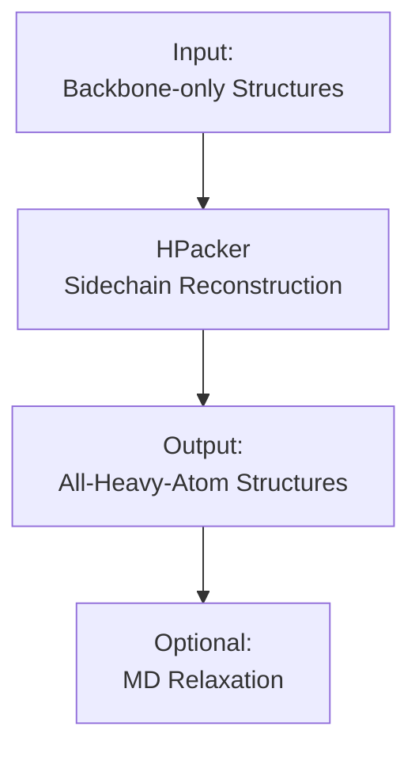
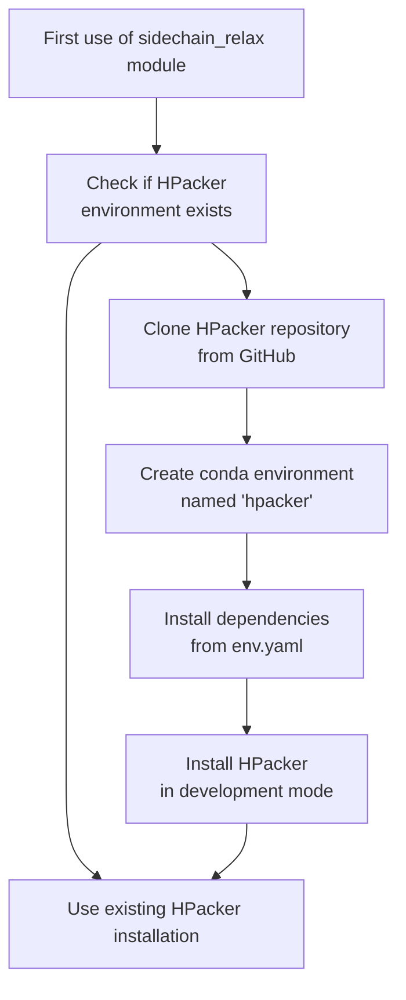
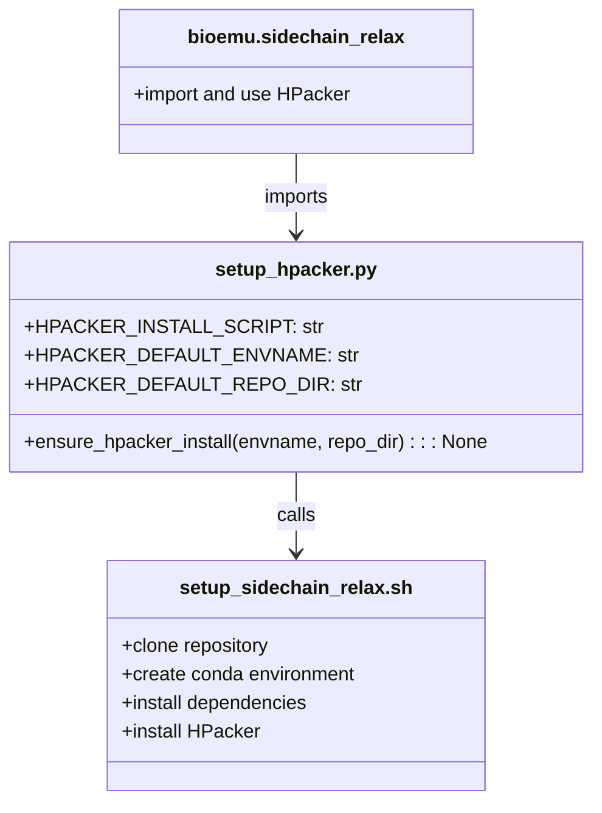
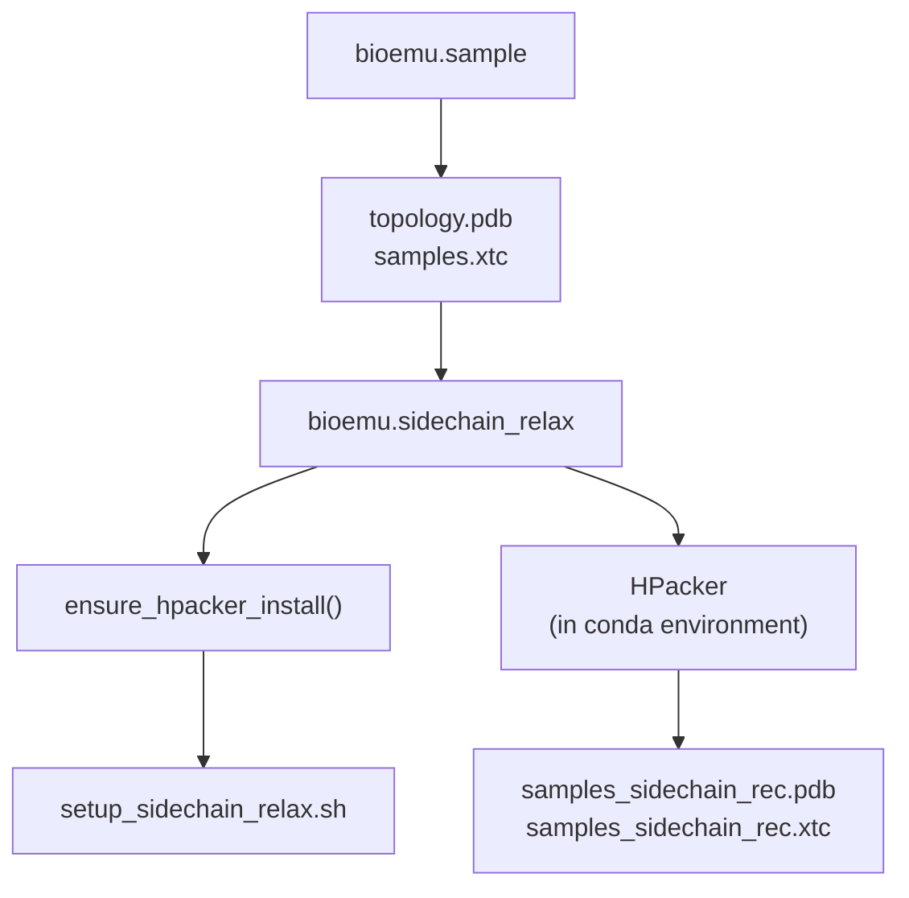

# HPacker Setup

> **Relevant source files**
> * [README.md](https://github.com/microsoft/bioemu/blob/6ff0ddd1/README.md?plain=1)
> * [src/bioemu/hpacker_setup/__init__.py](https://github.com/microsoft/bioemu/blob/6ff0ddd1/src/bioemu/hpacker_setup/__init__.py)
> * [src/bioemu/hpacker_setup/setup_hpacker.py](https://github.com/microsoft/bioemu/blob/6ff0ddd1/src/bioemu/hpacker_setup/setup_hpacker.py)
> * [src/bioemu/hpacker_setup/setup_sidechain_relax.sh](https://github.com/microsoft/bioemu/blob/6ff0ddd1/src/bioemu/hpacker_setup/setup_sidechain_relax.sh)

This document details the process of setting up HPacker within the BioEmu environment. HPacker is a third-party tool used for sidechain reconstruction of protein structures generated by BioEmu. For information about the overall installation process of BioEmu, see [Installation and Setup](/microsoft/bioemu/2-installation-and-setup), and for details on using the sidechain reconstruction functionality, see [Sidechain Reconstruction and MD Relaxation](/microsoft/bioemu/3.3-sidechain-reconstruction-and-md-relaxation).

## Overview

BioEmu outputs protein structures in backbone frame representation. HPacker is integrated as an optional component to reconstruct sidechains for these backbone-only structures, providing complete all-atom protein models.

Sources: [README.md L71-L72](https://github.com/microsoft/bioemu/blob/6ff0ddd1/README.md?plain=1#L71-L72)

 [README.md L96-L97](https://github.com/microsoft/bioemu/blob/6ff0ddd1/README.md?plain=1#L96-L97)

## Installation Process

HPacker is installed as an optional dependency in BioEmu. The installation is managed through a conda-based package manager.

### Prerequisites

* A conda-based package manager (Conda, Miniconda, or Anaconda) must be installed and available in your PATH
* BioEmu must be installed with the MD extension: `pip install bioemu[md]`

Sources: [README.md L74-L80](https://github.com/microsoft/bioemu/blob/6ff0ddd1/README.md?plain=1#L74-L80)

### Automatic Installation

When you first use the sidechain reconstruction functionality, BioEmu automatically:

1. Checks if the HPacker conda environment already exists
2. If not, clones the HPacker repository from GitHub
3. Creates a dedicated conda environment for HPacker
4. Installs all required dependencies
5. Installs HPacker in development mode

Sources: [src/bioemu/hpacker_setup/setup_hpacker.py L17-L37](https://github.com/microsoft/bioemu/blob/6ff0ddd1/src/bioemu/hpacker_setup/setup_hpacker.py#L17-L37)

 [src/bioemu/hpacker_setup/setup_sidechain_relax.sh L1-L17](https://github.com/microsoft/bioemu/blob/6ff0ddd1/src/bioemu/hpacker_setup/setup_sidechain_relax.sh#L1-L17)

## Configuration Options

HPacker setup can be customized with the following environment variables and function parameters:

| Configuration | Default Value | Description |
| --- | --- | --- |
| `HPACKER_ENVNAME` | `"hpacker"` | Name of the conda environment for HPacker |
| `repo_dir` | `"~/.hpacker"` | Directory where HPacker repository is cloned |

Sources: [README.md L88](https://github.com/microsoft/bioemu/blob/6ff0ddd1/README.md?plain=1#L88-L88)

 [src/bioemu/hpacker_setup/setup_hpacker.py L10-L11](https://github.com/microsoft/bioemu/blob/6ff0ddd1/src/bioemu/hpacker_setup/setup_hpacker.py#L10-L11)

 [src/bioemu/hpacker_setup/setup_hpacker.py L17-L19](https://github.com/microsoft/bioemu/blob/6ff0ddd1/src/bioemu/hpacker_setup/setup_hpacker.py#L17-L19)

## Implementation Details

The HPacker setup process is implemented in two key files:

1. **setup_hpacker.py**: Contains the Python function `ensure_hpacker_install()` that checks if HPacker is already installed and runs the installation script if needed.
2. **setup_sidechain_relax.sh**: Bash script that performs the actual installation by: * Cloning the HPacker repository * Creating a conda environment * Installing dependencies from HPacker's env.yaml * Installing HPacker in development mode

Sources: [src/bioemu/hpacker_setup/setup_hpacker.py L1-L37](https://github.com/microsoft/bioemu/blob/6ff0ddd1/src/bioemu/hpacker_setup/setup_hpacker.py#L1-L37)

 [src/bioemu/hpacker_setup/setup_sidechain_relax.sh L1-L17](https://github.com/microsoft/bioemu/blob/6ff0ddd1/src/bioemu/hpacker_setup/setup_sidechain_relax.sh#L1-L17)

## Integration with BioEmu

HPacker is integrated into BioEmu's workflow through the `bioemu.sidechain_relax` module:

Usage of HPacker in BioEmu follows this pattern:

1. Generate protein structures with `bioemu.sample`
2. Run sidechain reconstruction with `bioemu.sidechain_relax`
3. During first use, HPacker is automatically set up
4. HPacker reconstructs sidechains for the backbone-only structures
5. Optionally, reconstructed structures can undergo MD relaxation

Sources: [README.md L82-L100](https://github.com/microsoft/bioemu/blob/6ff0ddd1/README.md?plain=1#L82-L100)

## Troubleshooting

Common issues and solutions:

* **Conda not found**: Make sure conda is properly installed and in your PATH
* **Installation fails**: Check that you have write permissions to the default installation locations
* **HPacker environment conflicts**: Set a custom environment name using the `HPACKER_ENVNAME` environment variable

If HPacker installation fails, you can manually inspect the installation process by:

1. Setting detailed logging: `import logging; logging.basicConfig(level=logging.DEBUG)`
2. Running the setup function: `from bioemu.hpacker_setup.setup_hpacker import ensure_hpacker_install; ensure_hpacker_install()`

Sources: [src/bioemu/hpacker_setup/setup_hpacker.py L13-L14](https://github.com/microsoft/bioemu/blob/6ff0ddd1/src/bioemu/hpacker_setup/setup_hpacker.py#L13-L14)

 [src/bioemu/hpacker_setup/setup_hpacker.py L35-L37](https://github.com/microsoft/bioemu/blob/6ff0ddd1/src/bioemu/hpacker_setup/setup_hpacker.py#L35-L37)