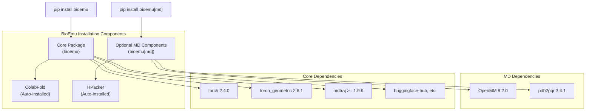
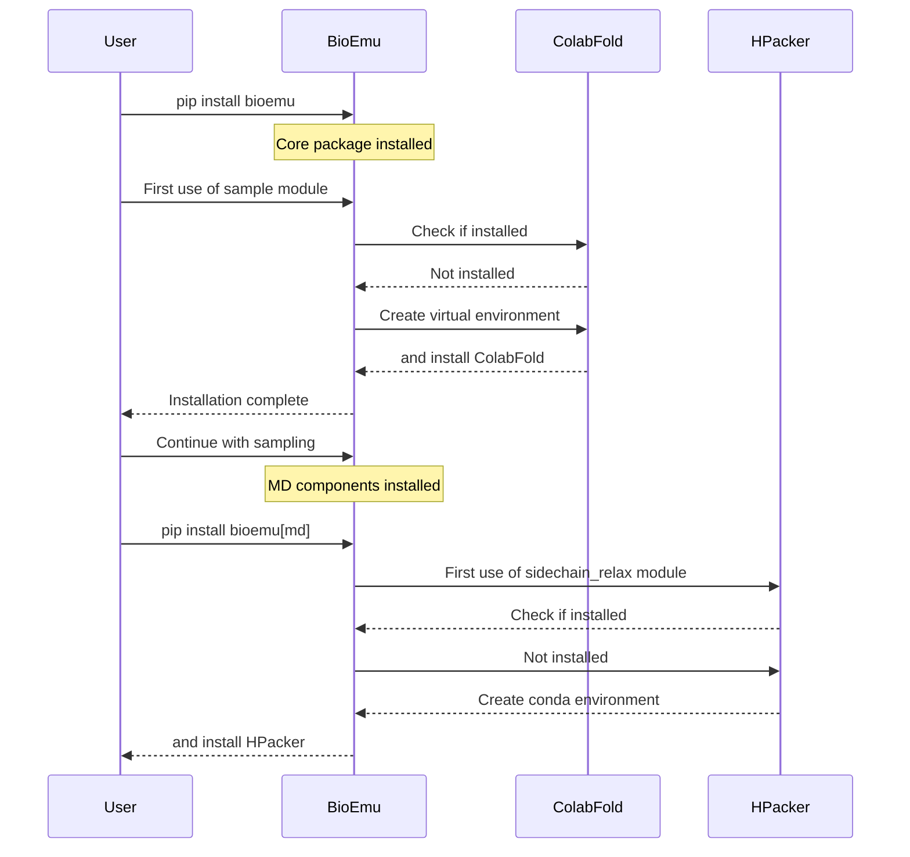

# Installation and Setup

> **Relevant source files**
> * [README.md](https://github.com/microsoft/bioemu/blob/6ff0ddd1/README.md?plain=1)
> * [pyproject.toml](https://github.com/microsoft/bioemu/blob/6ff0ddd1/pyproject.toml)

This page provides comprehensive instructions for installing BioEmu and setting up all required dependencies. BioEmu is a Linux-only Python package that generates protein structure ensembles from amino acid sequences. For information about using BioEmu after installation, see [Core Functionality](/microsoft/bioemu/3-core-functionality).

## System Requirements

Before installing BioEmu, ensure your system meets the following requirements:

* **Operating System**: Linux only (Not compatible with Windows or macOS)
* **Python Version**: 3.10 or higher
* **Memory**: Recommended minimum 16GB RAM (more for longer sequences)
* **GPU**: Recommended for efficient sampling of longer sequences
* **Disk Space**: ~5GB for dependencies and model weights

## Basic Installation

BioEmu is provided as a pip-installable package:

```
pip install bioemu
```

This installs the core functionality for structure sampling. For sidechain reconstruction and MD relaxation capabilities, install the optional dependencies:

```
pip install bioemu[md]
```

Sources: [README.md L26-L31](https://github.com/microsoft/bioemu/blob/6ff0ddd1/README.md?plain=1#L26-L31)

 [README.md L76-L80](https://github.com/microsoft/bioemu/blob/6ff0ddd1/README.md?plain=1#L76-L80)

 [pyproject.toml L1-L36](https://github.com/microsoft/bioemu/blob/6ff0ddd1/pyproject.toml#L1-L36)

## Installation Components



Sources: [pyproject.toml L12-L36](https://github.com/microsoft/bioemu/blob/6ff0ddd1/pyproject.toml#L12-L36)

 [README.md L26-L80](https://github.com/microsoft/bioemu/blob/6ff0ddd1/README.md?plain=1#L26-L80)

## External Dependencies Setup

BioEmu relies on two main external tools that are automatically set up during first use:

### ColabFold Setup

ColabFold is used for Multiple Sequence Alignment (MSA) and embedding generation. It's installed automatically in a separate virtual environment when you first use BioEmu to sample structures.

* **Default installation location**: `~/.bioemu_colabfold`
* **Custom location**: Set the `BIOEMU_COLABFOLD_DIR` environment variable before first use
* **Installation trigger**: First use of `bioemu.sample` module

```javascript
# Example of setting custom ColabFold locationexport BIOEMU_COLABFOLD_DIR=/path/to/custom/locationpython -m bioemu.sample --sequence GYDPETGTWG --num_samples 1
```

Sources: [README.md L33-L34](https://github.com/microsoft/bioemu/blob/6ff0ddd1/README.md?plain=1#L33-L34)

 [README.md L60-L61](https://github.com/microsoft/bioemu/blob/6ff0ddd1/README.md?plain=1#L60-L61)

### HPacker Setup

HPacker is used for sidechain reconstruction. It's installed automatically when you first use the sidechain reconstruction functionality.

* **Default installation**: Creates a conda environment named `hpacker`
* **Custom environment name**: Set the `HPACKER_ENVNAME` environment variable before first use
* **Installation trigger**: First use of `bioemu.sidechain_relax` module
* **Requirement**: A conda-based package manager (e.g., Conda, Mamba) must be in your PATH

```javascript
# Example of setting custom HPacker environment nameexport HPACKER_ENVNAME=my_custom_hpackerpython -m bioemu.sidechain_relax --pdb-path path/to/topology.pdb --xtc-path path/to/samples.xtc
```

Sources: [README.md L71-L88](https://github.com/microsoft/bioemu/blob/6ff0ddd1/README.md?plain=1#L71-L88)

## Dependency Installation Workflow



Sources: [README.md L33-L34](https://github.com/microsoft/bioemu/blob/6ff0ddd1/README.md?plain=1#L33-L34)

 [README.md L76-L88](https://github.com/microsoft/bioemu/blob/6ff0ddd1/README.md?plain=1#L76-L88)

## Directory Structure After Installation

After installation and first use, BioEmu creates the following directory structure:

```python
$HOME/
├── .bioemu_colabfold/   # Default ColabFold installation directory
│   ├── bin/
│   ├── lib/
│   └── ... (virtual environment files)
├── .conda/
│   └── envs/
│       └── hpacker/     # Default HPacker conda environment
│           ├── bin/
│           ├── lib/
│           └── ... (conda environment files)
└── .cache/
    └── huggingface/     # Downloaded model weights from HuggingFace
        └── hub/
            └── models--microsoft--bioemu/
                └── ... (model files)
```

Sources: [README.md L33-L34](https://github.com/microsoft/bioemu/blob/6ff0ddd1/README.md?plain=1#L33-L34)

 [README.md L76-L88](https://github.com/microsoft/bioemu/blob/6ff0ddd1/README.md?plain=1#L76-L88)

## Model Weights

BioEmu automatically downloads model weights from HuggingFace when first used. The weights are stored in the HuggingFace cache directory (typically `~/.cache/huggingface/`).

Sources: [README.md L50](https://github.com/microsoft/bioemu/blob/6ff0ddd1/README.md?plain=1#L50-L50)

## Verifying Installation

To verify that BioEmu was installed correctly, run a small test sample:

```
python -m bioemu.sample --sequence GYDPETGTWG --num_samples 1 --output_dir ~/test-verification
```

If this command completes successfully and creates output files in the specified directory, your installation is working correctly.

Sources: [README.md L38-L41](https://github.com/microsoft/bioemu/blob/6ff0ddd1/README.md?plain=1#L38-L41)

## Common Installation Issues

### ColabFold Installation Failures

If ColabFold installation fails, check:

* Internet connectivity (requires downloading packages)
* Python version compatibility
* Permissions to write to the installation directory

### HPacker Installation Failures

If HPacker installation fails, check:

* Conda is properly installed and in your PATH
* Internet connectivity
* Permissions to create conda environments

### GPU Availability

To check if your GPU is being detected by PyTorch:

```javascript
import torchprint(f"CUDA available: {torch.cuda.is_available()}")print(f"Number of GPUs: {torch.cuda.device_count()}")
```

## Compatibility with Virtual Environments

BioEmu can be installed in a virtual environment (venv, conda, etc.). However, note that it will still create separate environments for ColabFold and HPacker as needed.

Sources: [README.md L33-L34](https://github.com/microsoft/bioemu/blob/6ff0ddd1/README.md?plain=1#L33-L34)

 [README.md L76-L88](https://github.com/microsoft/bioemu/blob/6ff0ddd1/README.md?plain=1#L76-L88)

## Optional Components

The core BioEmu package provides protein structure sampling functionality. For additional capabilities:

| Component | Installation Command | Features |
| --- | --- | --- |
| Core Package | `pip install bioemu` | Structure sampling from amino acid sequences |
| MD Components | `pip install bioemu[md]` | Sidechain reconstruction and MD relaxation |
| Development Tools | `pip install bioemu[dev]` | Testing and development utilities |

Sources: [pyproject.toml L27-L36](https://github.com/microsoft/bioemu/blob/6ff0ddd1/pyproject.toml#L27-L36)

## Next Steps

After installing BioEmu, proceed to:

* [Protein Structure Sampling](/microsoft/bioemu/3.1-protein-structure-sampling) to learn how to generate protein structures
* [Sidechain Reconstruction and MD Relaxation](/microsoft/bioemu/3.3-sidechain-reconstruction-and-md-relaxation) for post-processing steps
* [Command Line Interface](/microsoft/bioemu/4.1-command-line-interface) for command-line usage details