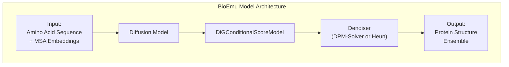
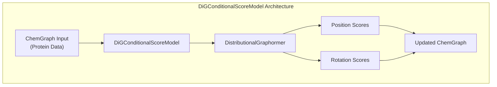
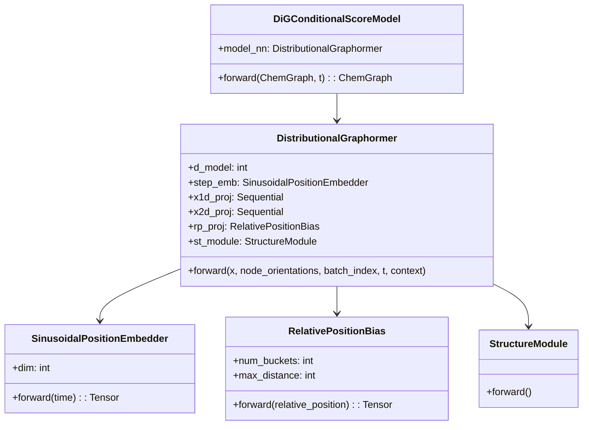
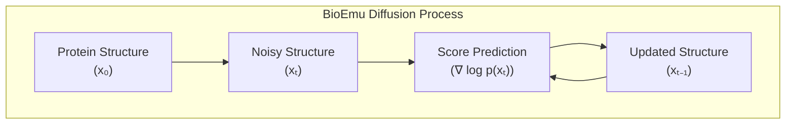
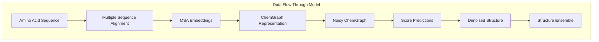
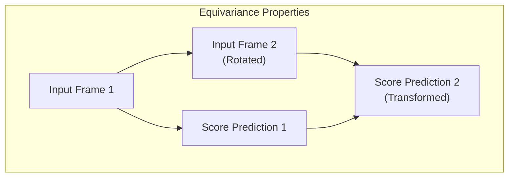

# Model Architecture

> **Relevant source files**
> * [MODEL_CARD.md](https://github.com/microsoft/bioemu/blob/6ff0ddd1/MODEL_CARD.md?plain=1)
> * [src/bioemu/config/denoiser/dpm.yaml](https://github.com/microsoft/bioemu/blob/6ff0ddd1/src/bioemu/config/denoiser/dpm.yaml)
> * [src/bioemu/config/denoiser/heun.yaml](https://github.com/microsoft/bioemu/blob/6ff0ddd1/src/bioemu/config/denoiser/heun.yaml)
> * [src/bioemu/models.py](https://github.com/microsoft/bioemu/blob/6ff0ddd1/src/bioemu/models.py)

This document provides a technical overview of the neural network architecture and diffusion model that powers BioEmu - a deep learning system for generating protein equilibrium structure ensembles. This page focuses specifically on the model architecture itself, including the neural network components, diffusion process, and how these components interact to produce protein structure ensembles.

For information about the overall system workflow, see [Core Functionality](/microsoft/bioemu/3-core-functionality).

## Overview

BioEmu uses the Distributional Graphormer (DiG) architecture trained with a combination of denoising score matching and property prediction fine-tuning (PPFT). The model has approximately 31 million parameters and generates protein structures through a diffusion-based process.

Sources: [MODEL_CARD.md L100-L102](https://github.com/microsoft/bioemu/blob/6ff0ddd1/MODEL_CARD.md?plain=1#L100-L102)

## DiG Model Architecture

The core of BioEmu is based on the Distributional Graphormer (DiG) architecture, which is specifically designed to model protein structures while respecting their geometric constraints. The architecture consists of several key components that work together to generate physically plausible protein conformations.

Sources: [src/bioemu/models.py L326-L384](https://github.com/microsoft/bioemu/blob/6ff0ddd1/src/bioemu/models.py#L326-L384)

### Key Components

The `DiGConditionalScoreModel` is a wrapper that converts between ChemGraph objects (the protein representation used throughout BioEmu) and the position/rotation tensors needed by the underlying DistributionalGraphormer neural network.

Sources: [src/bioemu/models.py L19-L384](https://github.com/microsoft/bioemu/blob/6ff0ddd1/src/bioemu/models.py#L19-L384)

#### DistributionalGraphormer

The core neural network is the `DistributionalGraphormer`, which uses a transformer-like architecture specifically adapted for protein structures:

1. **Time Embedding**: Uses `SinusoidalPositionEmbedder` to encode diffusion timesteps into a high-dimensional representation
2. **Representation Projections**: Projects 1D node features and 2D edge features to the model's dimensions
3. **Relative Position Encoding**: Uses `RelativePositionBias` to encode relative positions between residues
4. **Structure Module**: Processes the inputs to predict translation and rotation scores

The default configuration uses:

* Model dimension: 512
* Pair dimension: 256
* Number of layers: 8
* Number of heads: 32
* Hidden dimension: 1024

Sources: [src/bioemu/models.py L148-L324](https://github.com/microsoft/bioemu/blob/6ff0ddd1/src/bioemu/models.py#L148-L324)

#### Embedding Components

The model uses several specialized embedding components:

1. **SinusoidalPositionEmbedder**: Encodes diffusion timesteps using sinusoidal functions, similar to positional encodings in transformers. This helps the model understand where in the diffusion process it's operating.
2. **RelativePositionBias**: Creates learned embeddings based on the relative positions between residues in the sequence. The resolution of the distance buckets decreases the further you go from the diagonal, providing more detail for nearby residues.

Sources: [src/bioemu/models.py L19-L145](https://github.com/microsoft/bioemu/blob/6ff0ddd1/src/bioemu/models.py#L19-L145)

## Diffusion Model

BioEmu uses a diffusion-based approach to generate protein structures. The diffusion process involves:

1. **Forward Process**: Adding noise to a protein structure according to a predefined schedule
2. **Score Function**: Learning to predict the gradient of the log probability density (score)
3. **Reverse Process**: Using the score function to gradually denoise and generate samples

Sources: [MODEL_CARD.md L102-L103](https://github.com/microsoft/bioemu/blob/6ff0ddd1/MODEL_CARD.md?plain=1#L102-L103)

 [src/bioemu/config/denoiser/dpm.yaml](https://github.com/microsoft/bioemu/blob/6ff0ddd1/src/bioemu/config/denoiser/dpm.yaml)

 [src/bioemu/config/denoiser/heun.yaml](https://github.com/microsoft/bioemu/blob/6ff0ddd1/src/bioemu/config/denoiser/heun.yaml)

### Denoising Algorithms

BioEmu supports two main denoising algorithms for the reverse process:

#### DPM-Solver

A differential equation solver approach that can generate high-quality samples with fewer steps:

* Default steps: 30
* Epsilon time: 0.001
* Max time: 0.99

Sources: [src/bioemu/config/denoiser/dpm.yaml](https://github.com/microsoft/bioemu/blob/6ff0ddd1/src/bioemu/config/denoiser/dpm.yaml)

#### Heun Denoiser

A second-order method that provides more accurate denoising:

* Default steps: 100
* Epsilon time: 0.001
* Max time: 0.99
* Noise parameter: 0.5

Sources: [src/bioemu/config/denoiser/heun.yaml](https://github.com/microsoft/bioemu/blob/6ff0ddd1/src/bioemu/config/denoiser/heun.yaml)

## Model Inputs and Outputs

The model operates on protein structures represented as `ChemGraph` objects:

### Inputs

* **Amino acid sequence**: The primary input defining the protein
* **MSA embeddings**: Evolutionary information derived from multiple sequence alignment * Node features: 384-dimensional (EVOFORMER_NODE_DIM) * Edge features: 128-dimensional (EVOFORMER_EDGE_DIM)
* **Diffusion time (t)**: Controls the noise level in the diffusion process

### Outputs

* **Position scores**: Translation vectors that are equivariant to global rotations
* **Rotation scores**: Invariant rotation updates in axis-angle representation

These scores are used by the denoising process to iteratively refine the protein structure.

Sources: [src/bioemu/models.py L15-L17](https://github.com/microsoft/bioemu/blob/6ff0ddd1/src/bioemu/models.py#L15-L17)

 [src/bioemu/models.py L359-L384](https://github.com/microsoft/bioemu/blob/6ff0ddd1/src/bioemu/models.py#L359-L384)

## Model Training Objectives

BioEmu's model is trained using a combination of two main objectives:

1. **Denoising Score Matching**: Trains the model to predict the gradient of the log probability density of protein structures. This objective is applied to: * Structures from the AlphaFold Database (AFDB) * Molecular dynamics simulation data
2. **Property Prediction Fine-Tuning (PPFT)**: An additional objective that helps the model match experimental folding free energies.

This dual training approach allows BioEmu to generate structurally diverse ensembles that match the thermodynamic properties of real proteins.

Sources: [MODEL_CARD.md L41-L42](https://github.com/microsoft/bioemu/blob/6ff0ddd1/MODEL_CARD.md?plain=1#L41-L42)

 [MODEL_CARD.md L102-L103](https://github.com/microsoft/bioemu/blob/6ff0ddd1/MODEL_CARD.md?plain=1#L102-L103)

## SE(3) Equivariance Properties

The model architecture is designed with specific equivariance properties to handle 3D protein structures correctly:

* Translation scores are equivariant to global rotations
* Rotation scores are invariant to global rotations and translations

This ensures that the model's predictions respect the physical symmetries of protein structures and are independent of the coordinate frame.

Sources: [src/bioemu/models.py L178-L184](https://github.com/microsoft/bioemu/blob/6ff0ddd1/src/bioemu/models.py#L178-L184)

 [src/bioemu/models.py L305-L306](https://github.com/microsoft/bioemu/blob/6ff0ddd1/src/bioemu/models.py#L305-L306)

## Summary

BioEmu's model architecture combines the Distributional Graphormer (DiG) with diffusion-based generative modeling to produce protein structure ensembles that accurately represent the thermodynamic equilibrium. The architecture's key strengths include:

1. Effective representation of protein structures through specialized embeddings
2. SE(3) equivariance properties that respect physical symmetries
3. Combination of denoising score matching and property prediction objectives
4. Support for multiple denoising algorithms with different speed/quality tradeoffs

This architecture enables BioEmu to efficiently generate thousands of structurally diverse protein conformations per hour on a single GPU, while maintaining high physical accuracy.

Sources: [MODEL_CARD.md L22-L24](https://github.com/microsoft/bioemu/blob/6ff0ddd1/MODEL_CARD.md?plain=1#L22-L24)

 [MODEL_CARD.md L100-L103](https://github.com/microsoft/bioemu/blob/6ff0ddd1/MODEL_CARD.md?plain=1#L100-L103)