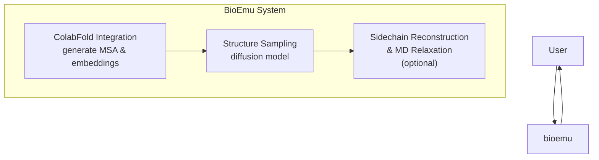
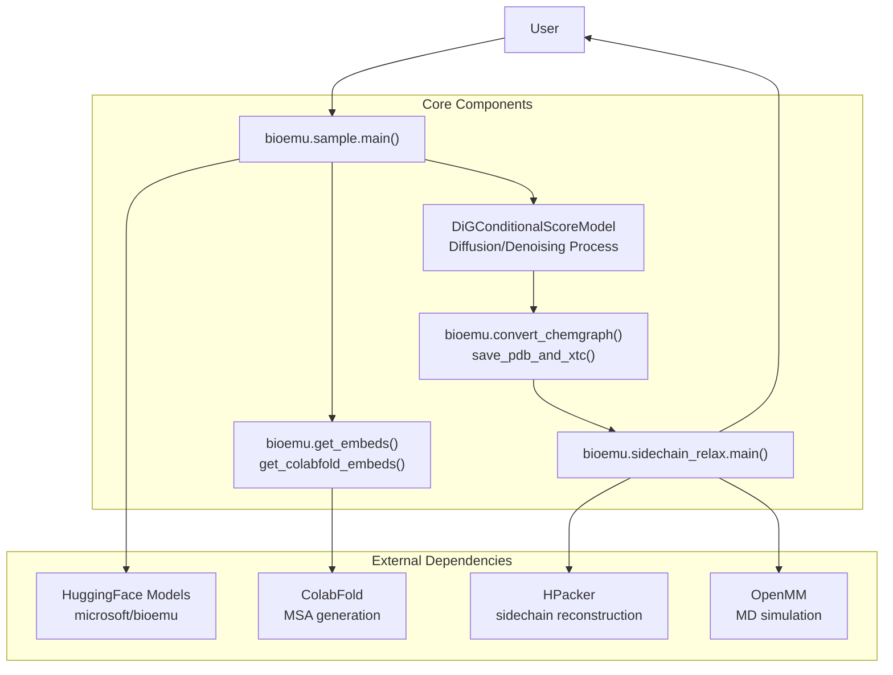
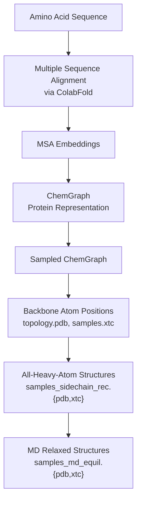
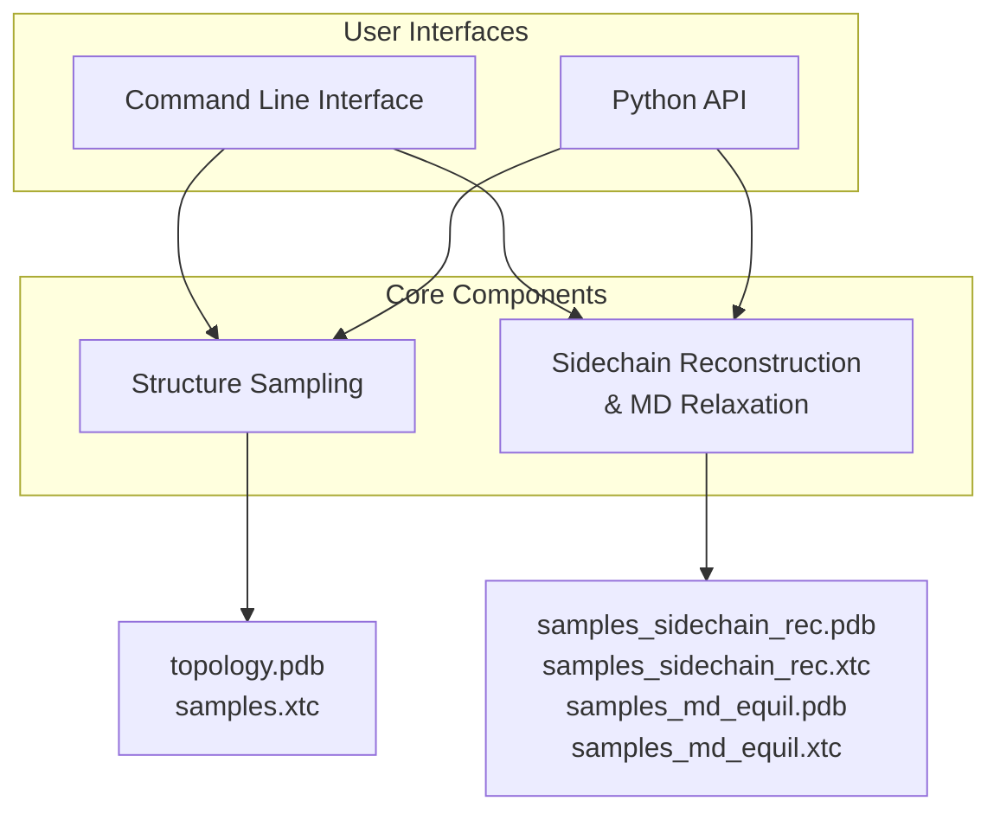

# Overview

> **Relevant source files**
> * [MODEL_CARD.md](https://github.com/microsoft/bioemu/blob/6ff0ddd1/MODEL_CARD.md?plain=1)
> * [README.md](https://github.com/microsoft/bioemu/blob/6ff0ddd1/README.md?plain=1)

## Purpose and Scope

BioEmu (Biomolecular Emulator) is a deep learning model that samples from the approximated equilibrium distribution of structures for a protein monomer, given its amino acid sequence. BioEmu can efficiently generate diverse protein structures that emulate the thermodynamic ensemble, allowing for prediction of structural ensembles, folding free energies, and providing mechanistic hypotheses for protein behavior.

This overview page introduces the core components and architecture of BioEmu, outlining how the system transforms amino acid sequences into protein structure ensembles. For detailed installation instructions, see [Installation and Setup](/microsoft/bioemu/2-installation-and-setup), and for specific usage information, see [Core Functionality](/microsoft/bioemu/3-core-functionality).

Sources: [README.md L12-L14](https://github.com/microsoft/bioemu/blob/6ff0ddd1/README.md?plain=1#L12-L14)

 [MODEL_CARD.md L14-L16](https://github.com/microsoft/bioemu/blob/6ff0ddd1/MODEL_CARD.md?plain=1#L14-L16)

## System Overview

BioEmu uses a combination of deep learning and molecular dynamics techniques to generate protein structure ensembles. The system consists of three primary components working in sequence:

**Primary Components:**

1. **ColabFold Integration** - Generates multiple sequence alignments (MSA) and embeddings from the input amino acid sequence
2. **Structure Sampling** - Uses a diffusion model to generate diverse backbone structures
3. **Sidechain Reconstruction & MD Relaxation** - Optional post-processing to add sidechains and refine structures

Sources: [README.md L12-L14](https://github.com/microsoft/bioemu/blob/6ff0ddd1/README.md?plain=1#L12-L14)

 [README.md L37-L48](https://github.com/microsoft/bioemu/blob/6ff0ddd1/README.md?plain=1#L37-L48)

 [README.md L70-L100](https://github.com/microsoft/bioemu/blob/6ff0ddd1/README.md?plain=1#L70-L100)

## Key Capabilities

BioEmu offers the following key capabilities:

| Capability | Description |
| --- | --- |
| Efficient Structure Sampling | Generate thousands of statistically independent structures per hour on a single GPU |
| Conformational Diversity | Sample functionally relevant conformational changes, including cryptic pockets, local unfolding, and domain rearrangements |
| Thermodynamic Accuracy | Samples with relative free energy errors around 1 kcal/mol, validated against MD simulations and experimental data |
| Sidechain Reconstruction | Optional reconstruction of side-chains using HPacker |
| MD Relaxation | Optional molecular dynamics equilibration using OpenMM |

Sources: [MODEL_CARD.md L20-L23](https://github.com/microsoft/bioemu/blob/6ff0ddd1/MODEL_CARD.md?plain=1#L20-L23)

 [MODEL_CARD.md L90-L94](https://github.com/microsoft/bioemu/blob/6ff0ddd1/MODEL_CARD.md?plain=1#L90-L94)

## System Architecture

The following diagram shows the detailed architecture of BioEmu, including the main code components and their interactions:

This diagram shows how user inputs flow through the system to generate protein structures. The system leverages multiple external dependencies and core processing components to transform amino acid sequences into protein structure ensembles.

Sources: [README.md L37-L48](https://github.com/microsoft/bioemu/blob/6ff0ddd1/README.md?plain=1#L37-L48)

 [README.md L70-L100](https://github.com/microsoft/bioemu/blob/6ff0ddd1/README.md?plain=1#L70-L100)

## Data Transformations

BioEmu transforms data through several key stages as illustrated below:

This diagram shows the progression from an input amino acid sequence to final structure outputs, with optional sidechain reconstruction and MD relaxation steps.

Sources: [README.md L37-L48](https://github.com/microsoft/bioemu/blob/6ff0ddd1/README.md?plain=1#L37-L48)

 [README.md L70-L100](https://github.com/microsoft/bioemu/blob/6ff0ddd1/README.md?plain=1#L70-L100)

## Usage Interfaces

BioEmu provides two main interfaces for users:

Users can interact with BioEmu through either a command-line interface or Python API. Both interfaces provide access to the core components of structure sampling and optional sidechain reconstruction/MD relaxation.

Sources: [README.md L37-L48](https://github.com/microsoft/bioemu/blob/6ff0ddd1/README.md?plain=1#L37-L48)

 [README.md L70-L100](https://github.com/microsoft/bioemu/blob/6ff0ddd1/README.md?plain=1#L70-L100)

## Performance Characteristics

BioEmu's performance varies with sequence length. The table below shows approximate sampling times for 1000 samples using an A100 GPU with 80GB VRAM:

| Sequence Length | Time (minutes) |
| --- | --- |
| 100 | 4 |
| 300 | 40 |
| 600 | 150 |

Sources: [README.md L52-L58](https://github.com/microsoft/bioemu/blob/6ff0ddd1/README.md?plain=1#L52-L58)

## Limitations and Scope

BioEmu has the following limitations:

1. Only supports sampling structures of protein monomers
2. Limited support for multi-chain proteins or protein-protein interactions
3. Does not explicitly model interactions with other chemical entities like small molecules
4. Inherits biases from training data (AlphaFold2 predictions and molecular dynamics simulations)

Sources: [README.md L63](https://github.com/microsoft/bioemu/blob/6ff0ddd1/README.md?plain=1#L63-L63)

 [MODEL_CARD.md L136-L139](https://github.com/microsoft/bioemu/blob/6ff0ddd1/MODEL_CARD.md?plain=1#L136-L139)

## Model Architecture

BioEmu uses a DiG (Directed Graph) neural network architecture trained using a combination of:

* Denoising score matching on flexible protein structures from AlphaFold DB
* Property prediction fine-tuning to match experimental folding free energies
* Molecular dynamics data

The model parameters are automatically downloaded from HuggingFace (microsoft/bioemu) when first used.

Sources: [MODEL_CARD.md L102-L103](https://github.com/microsoft/bioemu/blob/6ff0ddd1/MODEL_CARD.md?plain=1#L102-L103)

 [README.md L50](https://github.com/microsoft/bioemu/blob/6ff0ddd1/README.md?plain=1#L50-L50)