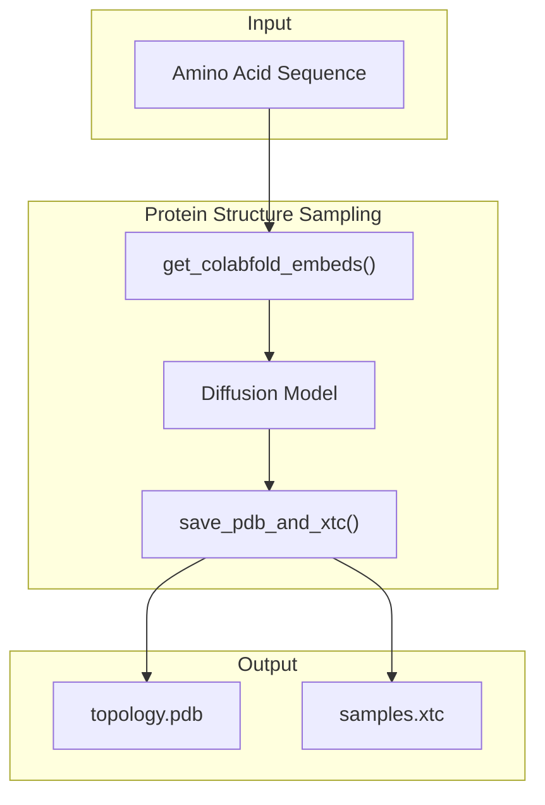
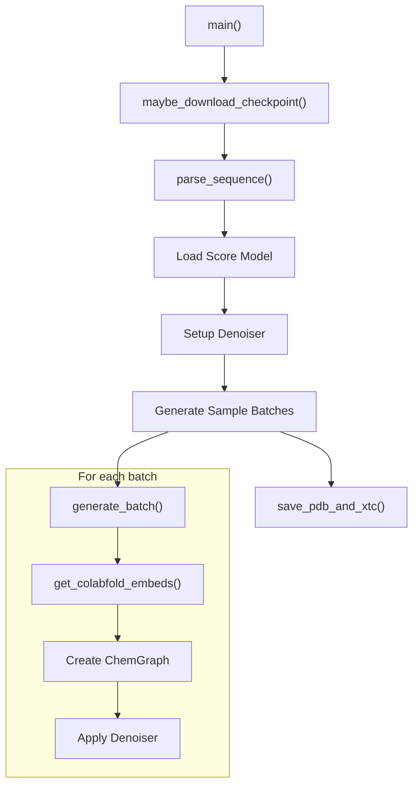
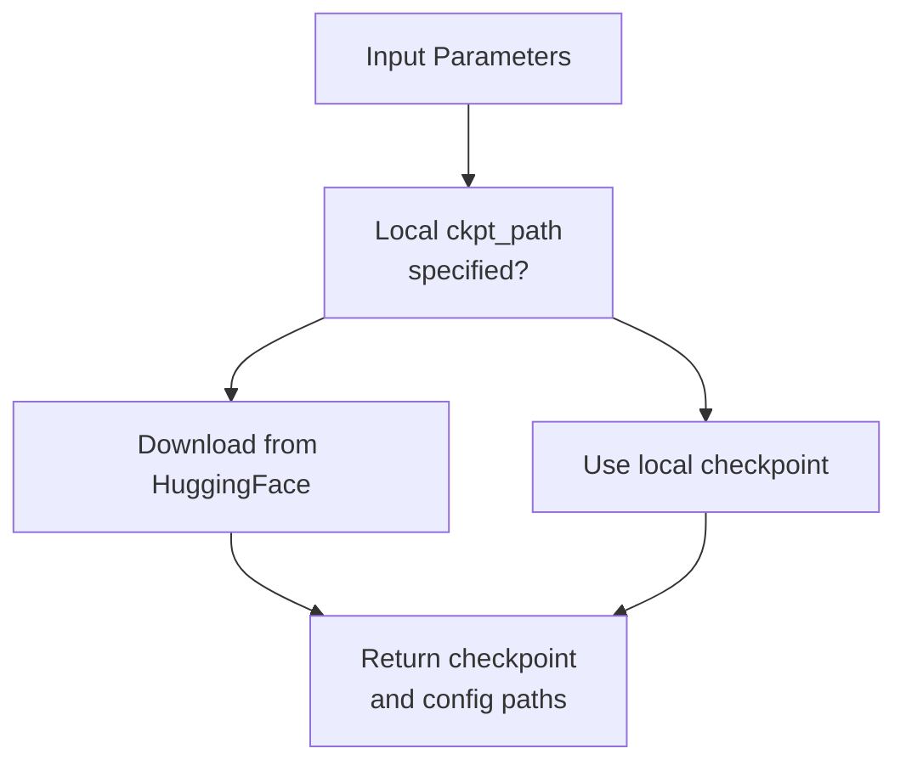
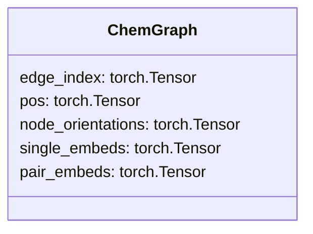
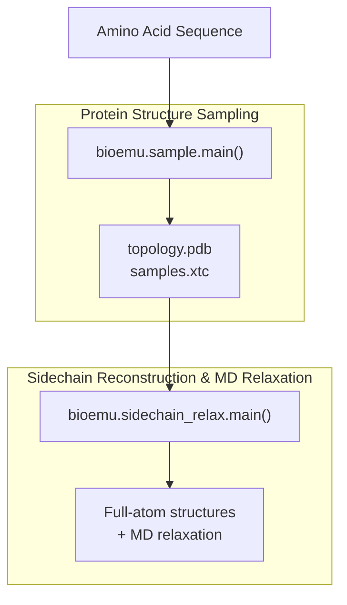

# Protein Structure Sampling

> **Relevant source files**
> * [src/bioemu/convert_chemgraph.py](https://github.com/microsoft/bioemu/blob/6ff0ddd1/src/bioemu/convert_chemgraph.py)
> * [src/bioemu/sample.py](https://github.com/microsoft/bioemu/blob/6ff0ddd1/src/bioemu/sample.py)
> * [tests/test_sample.py](https://github.com/microsoft/bioemu/blob/6ff0ddd1/tests/test_sample.py)

## Purpose and Scope

The Protein Structure Sampling module is a core component of BioEmu that generates protein backbone structure ensembles from amino acid sequences. It leverages a diffusion model to sample physically plausible protein backbone conformations. This document describes the structure sampling process, its inputs and outputs, and how to use it. For information about subsequent sidechain reconstruction and MD relaxation, see [Sidechain Reconstruction and MD Relaxation](/microsoft/bioemu/3.3-sidechain-reconstruction-and-md-relaxation).

Sources: [src/bioemu/sample.py L3](https://github.com/microsoft/bioemu/blob/6ff0ddd1/src/bioemu/sample.py#L3-L3)

## Workflow Overview

The Protein Structure Sampling module takes an amino acid sequence as input and produces an ensemble of protein backbone structures as output. The process involves generating embeddings using ColabFold, using these embeddings as context for a conditional diffusion model, and converting the results to standard protein structure formats (PDB and XTC).



Sources: [src/bioemu/sample.py L65-L200](https://github.com/microsoft/bioemu/blob/6ff0ddd1/src/bioemu/sample.py#L65-L200)

 [src/bioemu/sample.py L203-L277](https://github.com/microsoft/bioemu/blob/6ff0ddd1/src/bioemu/sample.py#L203-L277)

## Key Components

### Main Sampling Function

The primary entry point for protein structure sampling is the `main()` function in the `bioemu.sample` module. This function orchestrates the entire sampling process, from loading models to saving output files.



Sources: [src/bioemu/sample.py L65-L200](https://github.com/microsoft/bioemu/blob/6ff0ddd1/src/bioemu/sample.py#L65-L200)

### Model Loading

BioEmu uses pre-trained diffusion models hosted on HuggingFace. The `maybe_download_checkpoint()` function fetches the model if a local path isn't provided.



Sources: [src/bioemu/sample.py L39-L62](https://github.com/microsoft/bioemu/blob/6ff0ddd1/src/bioemu/sample.py#L39-L62)

### Batch Generation

The `generate_batch()` function handles the actual generation of protein structure samples using the diffusion model:

1. It first obtains embeddings for the sequence using ColabFold
2. Creates a ChemGraph representation with the embeddings
3. Applies the diffusion model using a denoiser
4. Returns the sampled structures

Sources: [src/bioemu/sample.py L203-L277](https://github.com/microsoft/bioemu/blob/6ff0ddd1/src/bioemu/sample.py#L203-L277)

### Format Conversion

The sampled structures are initially saved as NPZ files. After all batches are generated, they are converted to standard protein structure formats (PDB and XTC) using the `save_pdb_and_xtc()` function:

1. The first frame is saved as a PDB file, which contains the topology
2. All frames are saved as an XTC trajectory file
3. Optionally, unphysical samples are filtered out based on criteria like bond distances and steric clashes

Sources: [src/bioemu/convert_chemgraph.py L398-L458](https://github.com/microsoft/bioemu/blob/6ff0ddd1/src/bioemu/convert_chemgraph.py#L398-L458)

## Usage

The Protein Structure Sampling module can be used either through the command line interface or the Python API.

### Command Line Interface

```
python -m bioemu.sample <sequence> <num_samples> <output_dir> [options]
```

### Python API

```javascript
from bioemu.sample import main main(    sequence="ACDEFGHIKLMNPQRSTVWY",  # Amino acid sequence, FASTA file, or A3M file    num_samples=10,                    # Number of samples to generate    output_dir="./output",             # Directory to save results    model_name="bioemu-v1.0",          # Pretrained model to use    filter_samples=True                # Whether to filter unphysical samples)
```

### Key Parameters

| Parameter | Description |
| --- | --- |
| `sequence` | Amino acid sequence, path to FASTA file, or path to A3M file with MSAs |
| `num_samples` | Number of samples to generate |
| `output_dir` | Directory to save the samples |
| `batch_size_100` | Batch size for a sequence of length 100 (default: 10) |
| `model_name` | Name of pretrained model to use (default: "bioemu-v1.0") |
| `ckpt_path` | Path to model checkpoint (overrides `model_name` if provided) |
| `denoiser_type` | Type of denoiser for sampling (options: "dpm", "heun") |
| `cache_embeds_dir` | Directory to store MSA embeddings |
| `filter_samples` | Whether to filter out unphysical samples (default: True) |

Sources: [src/bioemu/sample.py L65-L99](https://github.com/microsoft/bioemu/blob/6ff0ddd1/src/bioemu/sample.py#L65-L99)

## Implementation Details

### ChemGraph Representation

The internal representation of protein structures in BioEmu is the `ChemGraph` class, which stores:

* Node positions (`pos`): 3D coordinates of residue centers
* Node orientations (`node_orientations`): 3x3 rotation matrices representing the orientation of each residue
* Embeddings (`single_embeds` and `pair_embeds`): Context features from ColabFold



### Diffusion Model Sampling

BioEmu uses a conditional score-based diffusion model (`DiGConditionalScoreModel`) to generate protein structures. The sampling process works as follows:

1. Start with a noisy structure sampled from a prior distribution
2. Iteratively denoise the structure using the score model
3. The score model is conditioned on the sequence embeddings (from ColabFold)
4. Two types of denoisers are supported: "dpm" and "heun", specified by the `denoiser_type` parameter

Sources: [src/bioemu/sample.py L146](https://github.com/microsoft/bioemu/blob/6ff0ddd1/src/bioemu/sample.py#L146-L146)

 [src/bioemu/sample.py L270](https://github.com/microsoft/bioemu/blob/6ff0ddd1/src/bioemu/sample.py#L270-L270)

### Output Files

The sampling process generates the following output files:

| File | Description |
| --- | --- |
| `sequence.fasta` | The input amino acid sequence in FASTA format |
| `batch_*.npz` | Intermediate files containing sample batches |
| `topology.pdb` | PDB file containing the topology of the sampled structures |
| `samples.xtc` | XTC trajectory file containing all sampled structures |

Sources: [src/bioemu/sample.py L198-L199](https://github.com/microsoft/bioemu/blob/6ff0ddd1/src/bioemu/sample.py#L198-L199)

## Sample Filtering

By default, BioEmu filters out "unphysical" protein structure samples based on the following criteria:

1. Maximum Cα-Cα distance between sequential residues (4.5 Å)
2. Maximum C-N distance between sequential residues (2.0 Å)
3. Minimum distance between any two atoms from different residues (1.0 Å)

This filtering can be disabled by setting `filter_samples=False`.

Sources: [src/bioemu/convert_chemgraph.py L371-L395](https://github.com/microsoft/bioemu/blob/6ff0ddd1/src/bioemu/convert_chemgraph.py#L371-L395)

 [src/bioemu/convert_chemgraph.py L452-L455](https://github.com/microsoft/bioemu/blob/6ff0ddd1/src/bioemu/convert_chemgraph.py#L452-L455)

## Integration with Other Components

The Protein Structure Sampling module is designed to work seamlessly with other components of BioEmu:



The backbone structures generated by the Protein Structure Sampling module can be fed into the Sidechain Reconstruction and MD Relaxation module for further refinement.

Sources: [src/bioemu/sample.py L84](https://github.com/microsoft/bioemu/blob/6ff0ddd1/src/bioemu/sample.py#L84-L84)