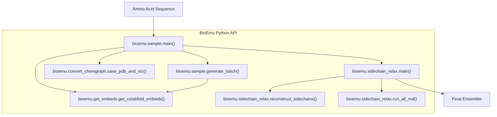
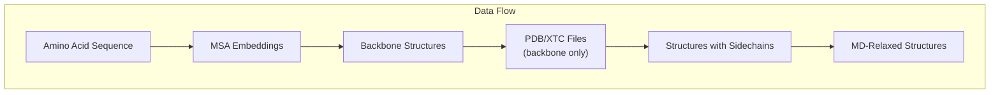

# Python API

> **Relevant source files**
> * [src/bioemu/convert_chemgraph.py](https://github.com/microsoft/bioemu/blob/6ff0ddd1/src/bioemu/convert_chemgraph.py)
> * [src/bioemu/get_embeds.py](https://github.com/microsoft/bioemu/blob/6ff0ddd1/src/bioemu/get_embeds.py)
> * [src/bioemu/sample.py](https://github.com/microsoft/bioemu/blob/6ff0ddd1/src/bioemu/sample.py)
> * [src/bioemu/seq_io.py](https://github.com/microsoft/bioemu/blob/6ff0ddd1/src/bioemu/seq_io.py)
> * [src/bioemu/sidechain_relax.py](https://github.com/microsoft/bioemu/blob/6ff0ddd1/src/bioemu/sidechain_relax.py)
> * [tests/test_seq_io.py](https://github.com/microsoft/bioemu/blob/6ff0ddd1/tests/test_seq_io.py)
> * [tests/test_utils.py](https://github.com/microsoft/bioemu/blob/6ff0ddd1/tests/test_utils.py)

This page documents the Python API for BioEmu, a biomolecular emulator that generates protein structure ensembles from amino acid sequences. The API allows users to programmatically integrate BioEmu's functionality into their own Python applications or workflows. For command-line usage, see [Command Line Interface](/microsoft/bioemu/4.1-command-line-interface).

## Overview

BioEmu's Python API provides functions to generate protein structure ensembles from amino acid sequences using diffusion models. The API supports:

1. Protein structure sampling from amino acid sequences
2. Sidechain reconstruction and molecular dynamics relaxation
3. Customization of sampling parameters and model selection



Sources: [src/bioemu/sample.py L66-L200](https://github.com/microsoft/bioemu/blob/6ff0ddd1/src/bioemu/sample.py#L66-L200)

 [src/bioemu/sidechain_relax.py L30-L243](https://github.com/microsoft/bioemu/blob/6ff0ddd1/src/bioemu/sidechain_relax.py#L30-L243)

## Core Functions

BioEmu's Python API consists of two primary functions that correspond to the main workflows:

### 1. Structure Sampling with bioemu.sample.main()

```javascript
from bioemu.sample import main as sample_main sample_main(    sequence="GKMDENQ...",  # Amino acid sequence or path to FASTA/A3M file    num_samples=10,         # Number of samples to generate    output_dir="./results", # Directory to save results    batch_size_100=10,      # Batch size calibrated for a sequence of length 100    model_name="bioemu-v1.0" # Model to use)
```

This function generates protein structure samples from an amino acid sequence and saves them as PDB and XTC files.

### 2. Sidechain Reconstruction with bioemu.sidechain_relax.main()

```javascript
from bioemu.sidechain_relax import main as sidechain_main sidechain_main(    xtc_path="./results/samples.xtc",   # Path to XTC file with backbone samples    pdb_path="./results/topology.pdb",  # Path to PDB file with topology    md_equil=True,                      # Whether to run MD equilibration    md_protocol="local_minimization",   # MD protocol to use    outpath="./results",                # Directory to save results    prefix="samples"                    # Prefix for output files)
```

This function reconstructs sidechains for backbone-only protein structures and optionally performs molecular dynamics relaxation.

Sources: [src/bioemu/sample.py L66-L200](https://github.com/microsoft/bioemu/blob/6ff0ddd1/src/bioemu/sample.py#L66-L200)

 [src/bioemu/sidechain_relax.py L206-L243](https://github.com/microsoft/bioemu/blob/6ff0ddd1/src/bioemu/sidechain_relax.py#L206-L243)

## Typical Workflow

A typical workflow involves two steps: (1) generating backbone structures, and (2) reconstructing sidechains and optionally relaxing the structures.

```mermaid
sequenceDiagram
  participant User
  participant bioemu.sample.main()
  participant bioemu.get_embeds.get_colabfold_embeds()
  participant Diffusion Denoiser
  participant bioemu.convert_chemgraph.save_pdb_and_xtc()
  participant bioemu.sidechain_relax.main()

  User->>bioemu.sample.main(): sequence, num_samples, output_dir
  bioemu.sample.main()->>bioemu.get_embeds.get_colabfold_embeds(): sequence
  bioemu.get_embeds.get_colabfold_embeds()-->>bioemu.sample.main(): embeddings
  bioemu.sample.main()->>Diffusion Denoiser: embeddings
  Diffusion Denoiser-->>bioemu.sample.main(): sampled structures
  bioemu.sample.main()->>bioemu.convert_chemgraph.save_pdb_and_xtc(): save as PDB/XTC
  bioemu.convert_chemgraph.save_pdb_and_xtc()-->>bioemu.sample.main(): files saved
  bioemu.sample.main()-->>User: backbone structures in output_dir
  User->>bioemu.sidechain_relax.main(): xtc_path, pdb_path
  bioemu.sidechain_relax.main()-->>User: structures with sidechains
```

Sources: [src/bioemu/sample.py L66-L200](https://github.com/microsoft/bioemu/blob/6ff0ddd1/src/bioemu/sample.py#L66-L200)

 [src/bioemu/get_embeds.py L127-L203](https://github.com/microsoft/bioemu/blob/6ff0ddd1/src/bioemu/get_embeds.py#L127-L203)

 [src/bioemu/sidechain_relax.py L206-L243](https://github.com/microsoft/bioemu/blob/6ff0ddd1/src/bioemu/sidechain_relax.py#L206-L243)

## Detailed API Reference

### Structure Sampling Functions

#### bioemu.sample.main()

```python
def main(    sequence: str | Path,    num_samples: int,    output_dir: str | Path,    batch_size_100: int = 10,    model_name: str | None = "bioemu-v1.0",    ckpt_path: str | Path | None = None,    model_config_path: str | Path | None = None,    denoiser_type: Literal["dpm", "heun"] | None = "dpm",    denoiser_config_path: str | Path | None = None,    cache_embeds_dir: str | Path | None = None,    msa_host_url: str | None = None,    filter_samples: bool = True,) -> None
```

Generates protein structure samples for a specified amino acid sequence.

Parameters:

* `sequence`: Amino acid sequence or path to a FASTA/A3M file
* `num_samples`: Number of samples to generate
* `output_dir`: Directory to save the samples
* `batch_size_100`: Batch size calibrated for a sequence of length 100
* `model_name`: Name of pretrained model to use (retrieved from HuggingFace)
* `ckpt_path`: Path to model checkpoint (if not using `model_name`)
* `model_config_path`: Path to model config (if using `ckpt_path`)
* `denoiser_type`: Type of denoiser to use ("dpm" or "heun")
* `denoiser_config_path`: Path to denoiser config
* `cache_embeds_dir`: Directory to cache embeddings
* `msa_host_url`: MSA server URL for ColabFold
* `filter_samples`: Whether to filter out unphysical samples

Returns:

* None (samples are saved to `output_dir`)

Output:

* `topology.pdb`: PDB file with the topology
* `samples.xtc`: XTC file with the sampled structures

Sources: [src/bioemu/sample.py L66-L200](https://github.com/microsoft/bioemu/blob/6ff0ddd1/src/bioemu/sample.py#L66-L200)

#### bioemu.sample.generate_batch()

```python
def generate_batch(    score_model: torch.nn.Module,    sequence: str,    sdes: dict[str, SDE],    batch_size: int,    seed: int,    denoiser: Callable,    cache_embeds_dir: str | Path | None,    msa_file: str | Path | None = None,    msa_host_url: str | None = None,) -> dict[str, torch.Tensor]
```

Generates a batch of samples, using GPU if available. This is a lower-level function that's used by `main()`.

Returns:

* Dictionary with keys "pos" and "node_orientations" containing the sampled structures

Sources: [src/bioemu/sample.py L203-L277](https://github.com/microsoft/bioemu/blob/6ff0ddd1/src/bioemu/sample.py#L203-L277)

### Embedding Generation

#### bioemu.get_embeds.get_colabfold_embeds()

```python
def get_colabfold_embeds(    seq: str,    cache_embeds_dir: StrPath | None,    msa_file: StrPath | None = None,    msa_host_url: str | None = None,) -> tuple[StrPath, StrPath]
```

Uses ColabFold to retrieve embeddings for a given sequence, with caching for efficiency.

Parameters:

* `seq`: Protein sequence to query
* `cache_embeds_dir`: Directory to cache embeddings
* `msa_file`: MSA A3M file to use as input (optional)
* `msa_host_url`: MSA host URL (optional)

Returns:

* Tuple of paths to single and pair embeddings

Sources: [src/bioemu/get_embeds.py L127-L203](https://github.com/microsoft/bioemu/blob/6ff0ddd1/src/bioemu/get_embeds.py#L127-L203)

### Sidechain Reconstruction and Relaxation

#### bioemu.sidechain_relax.main()

```python
def main(    xtc_path: str,    pdb_path: str,    md_equil: bool = True,    md_protocol: MDProtocol = MDProtocol.LOCAL_MINIMIZATION,    outpath: str = ".",    prefix: str = "samples",) -> None
```

Reconstructs sidechains for backbone-only samples and optionally performs MD relaxation.

Parameters:

* `xtc_path`: Path to XTC file with samples
* `pdb_path`: Path to PDB file with topology
* `md_equil`: Whether to run MD equilibration
* `md_protocol`: MD protocol to use (options are `LOCAL_MINIMIZATION` or `NVT_EQUIL`)
* `outpath`: Directory to save results
* `prefix`: Prefix for output filenames

Output:

* `{prefix}_sidechain_rec.pdb`: PDB file with sidechains
* `{prefix}_sidechain_rec.xtc`: XTC file with sidechains
* `{prefix}_md_equil.pdb`: PDB file after MD (if `md_equil=True`)
* `{prefix}_md_equil.xtc`: XTC file after MD (if `md_equil=True`)

Sources: [src/bioemu/sidechain_relax.py L206-L243](https://github.com/microsoft/bioemu/blob/6ff0ddd1/src/bioemu/sidechain_relax.py#L206-L243)

#### bioemu.sidechain_relax.reconstruct_sidechains()

```python
def reconstruct_sidechains(traj: mdtraj.Trajectory) -> mdtraj.Trajectory
```

Reconstructs sidechains from backbone-only samples using HPacker.

Parameters:

* `traj`: Trajectory with backbone-only samples

Returns:

* Trajectory with reconstructed sidechains

Sources: [src/bioemu/sidechain_relax.py L63-L105](https://github.com/microsoft/bioemu/blob/6ff0ddd1/src/bioemu/sidechain_relax.py#L63-L105)

#### bioemu.sidechain_relax.run_all_md()

```python
def run_all_md(    samples_all: list[mdtraj.Trajectory],     md_protocol: MDProtocol) -> mdtraj.Trajectory
```

Runs molecular dynamics for a set of protonated samples.

Parameters:

* `samples_all`: List of mdtraj objects with protonated samples
* `md_protocol`: MD protocol to use

Returns:

* Trajectory with relaxed structures

Sources: [src/bioemu/sidechain_relax.py L168-L203](https://github.com/microsoft/bioemu/blob/6ff0ddd1/src/bioemu/sidechain_relax.py#L168-L203)

### Utility Functions

#### bioemu.convert_chemgraph.save_pdb_and_xtc()

```python
def save_pdb_and_xtc(    pos_nm: torch.Tensor,    node_orientations: torch.Tensor,    sequence: str,    topology_path: str | Path,    xtc_path: str | Path,    filter_samples: bool = True,) -> None
```

Converts a batch of coarse-grained structures to backbone atom positions and saves them as PDB and XTC files.

Sources: [src/bioemu/convert_chemgraph.py L398-L458](https://github.com/microsoft/bioemu/blob/6ff0ddd1/src/bioemu/convert_chemgraph.py#L398-L458)

#### Sequence I/O Functions

```javascript
from bioemu.seq_io import parse_sequence, write_fasta, read_fasta # Parse a sequence from a FASTA/A3M file or a stringsequence = parse_sequence("path/to/file.fasta") # Write sequences to a FASTA filewrite_fasta([sequence], "output.fasta") # Read sequences from a FASTA filesequences = read_fasta("input.fasta")
```

Sources: [src/bioemu/seq_io.py L24-L52](https://github.com/microsoft/bioemu/blob/6ff0ddd1/src/bioemu/seq_io.py#L24-L52)

## Example Usage

Here's a complete example of using the BioEmu Python API to generate protein structure ensembles:

```javascript
from bioemu.sample import main as sample_mainfrom bioemu.sidechain_relax import main as sidechain_main # Step 1: Generate backbone structuressample_main(    sequence="GKMDENQVVTATDSDGNIHMTITGDKDASGNVPFHASSETLPASWQARNRLGFKVALLTGVPVGEEEPDSDAPF",    num_samples=10,    output_dir="./protein_samples",    batch_size_100=10,    model_name="bioemu-v1.0") # Step 2: Reconstruct sidechains and relax structuressidechain_main(    xtc_path="./protein_samples/samples.xtc",    pdb_path="./protein_samples/topology.pdb",    md_equil=True,    md_protocol="local_minimization",    outpath="./protein_samples",    prefix="samples")
```

The resulting output will include:

* `./protein_samples/topology.pdb`: Backbone topology
* `./protein_samples/samples.xtc`: Backbone samples
* `./protein_samples/samples_sidechain_rec.pdb`: Sidechain reconstructed structure
* `./protein_samples/samples_sidechain_rec.xtc`: Sidechain reconstructed samples
* `./protein_samples/samples_md_equil.pdb`: MD-relaxed structure
* `./protein_samples/samples_md_equil.xtc`: MD-relaxed samples

## Data Flow in BioEmu's Python API



Sources: [src/bioemu/sample.py L66-L200](https://github.com/microsoft/bioemu/blob/6ff0ddd1/src/bioemu/sample.py#L66-L200)

 [src/bioemu/get_embeds.py L127-L203](https://github.com/microsoft/bioemu/blob/6ff0ddd1/src/bioemu/get_embeds.py#L127-L203)

 [src/bioemu/sidechain_relax.py L63-L105](https://github.com/microsoft/bioemu/blob/6ff0ddd1/src/bioemu/sidechain_relax.py#L63-L105)

 [src/bioemu/sidechain_relax.py L168-L203](https://github.com/microsoft/bioemu/blob/6ff0ddd1/src/bioemu/sidechain_relax.py#L168-L203)

## File Formats and Data Types

BioEmu's Python API primarily works with these file formats and data types:

| Format/Type | Description | API Functions |
| --- | --- | --- |
| FASTA | Text format containing amino acid sequences | `parse_sequence()`, `write_fasta()`, `read_fasta()` |
| A3M | MSA format for protein families | Used as input to `get_colabfold_embeds()` |
| PDB | 3D protein structure format | Output of sampling and sidechain reconstruction |
| XTC | Trajectory format for multiple structures | Output of sampling and sidechain reconstruction |
| `torch.Tensor` | PyTorch tensor for internal structure representation | Used in `generate_batch()` and most internal functions |
| `mdtraj.Trajectory` | MDTraj trajectory object for manipulation | Used in sidechain reconstruction and MD relaxation |

Sources: [src/bioemu/seq_io.py L24-L52](https://github.com/microsoft/bioemu/blob/6ff0ddd1/src/bioemu/seq_io.py#L24-L52)

 [src/bioemu/sample.py L66-L200](https://github.com/microsoft/bioemu/blob/6ff0ddd1/src/bioemu/sample.py#L66-L200)

 [src/bioemu/sidechain_relax.py L63-L105](https://github.com/microsoft/bioemu/blob/6ff0ddd1/src/bioemu/sidechain_relax.py#L63-L105)

## Advanced Usage

### Using Custom Models

You can use custom models by providing the `ckpt_path` and `model_config_path` parameters:

```javascript
from bioemu.sample import main as sample_main sample_main(    sequence="GKMDENQ...",    num_samples=10,    output_dir="./results",    ckpt_path="./path/to/checkpoint.ckpt",    model_config_path="./path/to/config.yaml",)
```

### Custom Denoising Process

You can customize the denoising process by choosing between "dpm" and "heun" denoisers or providing a custom denoiser config:

```javascript
from bioemu.sample import main as sample_main sample_main(    sequence="GKMDENQ...",    num_samples=10,    output_dir="./results",    denoiser_type="heun",  # or provide denoiser_config_path)
```

### Using a Custom MSA File

You can provide your own MSA file in A3M format:

```javascript
from bioemu.sample import main as sample_main sample_main(    sequence="path/to/msa.a3m",  # A3M file containing the MSA    num_samples=10,    output_dir="./results",)
```

Sources: [src/bioemu/sample.py L66-L200](https://github.com/microsoft/bioemu/blob/6ff0ddd1/src/bioemu/sample.py#L66-L200)

 [src/bioemu/get_embeds.py L127-L203](https://github.com/microsoft/bioemu/blob/6ff0ddd1/src/bioemu/get_embeds.py#L127-L203)