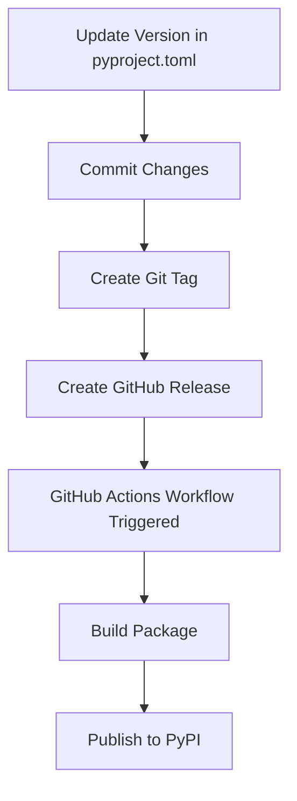
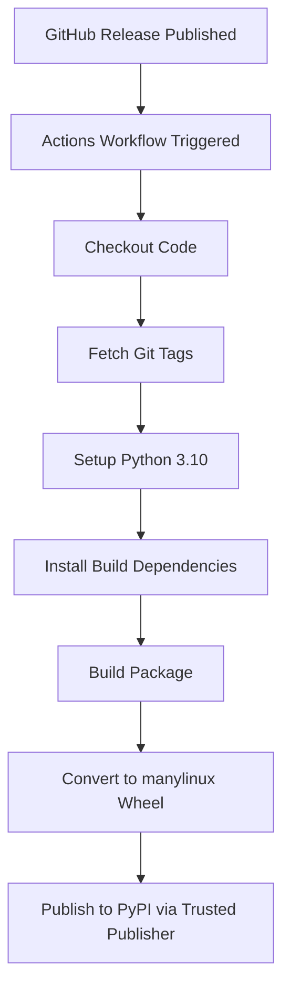
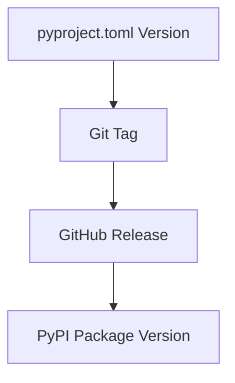

# Release Process

> **Relevant source files**
> * [.github/workflows/publish.yml](https://github.com/microsoft/bioemu/blob/6ff0ddd1/.github/workflows/publish.yml)
> * [pyproject.toml](https://github.com/microsoft/bioemu/blob/6ff0ddd1/pyproject.toml)
> * [src/bioemu/colabfold_setup/__init__.py](https://github.com/microsoft/bioemu/blob/6ff0ddd1/src/bioemu/colabfold_setup/__init__.py)
> * [src/bioemu/colabfold_setup/modules.patch](https://github.com/microsoft/bioemu/blob/6ff0ddd1/src/bioemu/colabfold_setup/modules.patch)

This document outlines the procedures and automation for releasing new versions of BioEmu to the Python Package Index (PyPI). It covers version management, release preparation, and the automated publication process using GitHub Actions.

For information about testing, which should be performed before any release, see [Testing](/microsoft/bioemu/7.1-testing).

## Version Management

BioEmu follows semantic versioning (`MAJOR.MINOR.PATCH`) with the version number specified in the `pyproject.toml` file.

```markdown
version = "0.1.6"  # Current version as of this documentation
```

Sources: [pyproject.toml L7](https://github.com/microsoft/bioemu/blob/6ff0ddd1/pyproject.toml#L7-L7)

## Release Workflow Overview

The release process follows a well-defined workflow that combines manual preparation with automated publication:



Sources: [pyproject.toml L5-L7](https://github.com/microsoft/bioemu/blob/6ff0ddd1/pyproject.toml#L5-L7)

 [.github/workflows/publish.yml L3-L5](https://github.com/microsoft/bioemu/blob/6ff0ddd1/.github/workflows/publish.yml#L3-L5)

## Release Preparation

Before initiating a release, ensure:

1. All tests pass successfully
2. Documentation is up-to-date
3. Code changes are reviewed and merged
4. The version number in `pyproject.toml` is updated

Update the version number in `pyproject.toml`:

```sql
[project]name = "bioemu"version = "X.Y.Z"  # Update this line with new version
```

Commit this change with a message like "Bump version to X.Y.Z".

Sources: [pyproject.toml L5-L7](https://github.com/microsoft/bioemu/blob/6ff0ddd1/pyproject.toml#L5-L7)

## GitHub Release Creation

To create a new release:

1. Go to the BioEmu GitHub repository
2. Navigate to the "Releases" section
3. Click "Create a new release"
4. Select or create a tag matching the version in `pyproject.toml` (e.g., `v0.1.6`)
5. Add a title and description summarizing the changes
6. Click "Publish release"

Publishing the release automatically triggers the GitHub Actions workflow that builds and publishes the package to PyPI.

Sources: [.github/workflows/publish.yml L3-L5](https://github.com/microsoft/bioemu/blob/6ff0ddd1/.github/workflows/publish.yml#L3-L5)

## Automated Publication with GitHub Actions

BioEmu uses GitHub Actions to automate the build and publication process. The workflow is defined in `.github/workflows/publish.yml` and is triggered when a GitHub release is published.



The workflow performs the following steps:

1. Checks out the repository code: ```yaml uses: actions/checkout@v2 ```
2. Fetches all Git tags to ensure proper version detection: ``` git fetch --prune --unshallow --tags ```
3. Sets up Python 3.10: ```yaml uses: actions/setup-python@v2with:  python-version: "3.10" ```
4. Installs build dependencies: ``` python -m pip install --upgrade pippython -m pip install --upgrade build twine wheel ```
5. Builds the package and converts wheels to manylinux format: ``` python -m buildpython -m wheel tags --platform-tag manylinux1_x86_64 dist/*any.whlrm dist/*any.whl ```
6. Publishes to PyPI using the PyPA's trusted publisher action: ```yaml uses: pypa/gh-action-pypi-publish@release/v1 ```

Sources: [.github/workflows/publish.yml L12-L40](https://github.com/microsoft/bioemu/blob/6ff0ddd1/.github/workflows/publish.yml#L12-L40)

## Package Building Configuration

The package building process uses the configuration in `pyproject.toml`, which includes:

### Build System

```
[build-system]requires = ["setuptools", "wheel"]build-backend = "setuptools.build_meta"
```

### Package Configuration

```markdown
[project]name = "bioemu"version = "0.1.6"description = "Biomolecular emulator"# Additional configuration...
```

### Setuptools Configuration

```
[tool.setuptools]include-package-data = true [tool.setuptools.packages.find]where = ["src"] [tool.setuptools.package-data]"*" = ["*.patch", "*.sh", "*.md"]
```

Sources: [pyproject.toml L1-L4](https://github.com/microsoft/bioemu/blob/6ff0ddd1/pyproject.toml#L1-L4)

 [pyproject.toml L5-L25](https://github.com/microsoft/bioemu/blob/6ff0ddd1/pyproject.toml#L5-L25)

 [pyproject.toml L162-L169](https://github.com/microsoft/bioemu/blob/6ff0ddd1/pyproject.toml#L162-L169)

## Version Flow Through the System

The following diagram illustrates how the version number flows through the release process:



This ensures consistency across all platforms and interfaces.

Sources: [pyproject.toml L7](https://github.com/microsoft/bioemu/blob/6ff0ddd1/pyproject.toml#L7-L7)

 [.github/workflows/publish.yml L19-L21](https://github.com/microsoft/bioemu/blob/6ff0ddd1/.github/workflows/publish.yml#L19-L21)

## Post-Release Tasks

After a successful release:

1. Verify the package is correctly listed on PyPI
2. Confirm the package can be installed with pip: `pip install bioemu==X.Y.Z`
3. Update the version in the main branch to the next development version (optional)
4. Close related GitHub issues and pull requests
5. Communicate the release to users and contributors

## Troubleshooting

### Failed GitHub Actions Workflow

If the GitHub Actions workflow fails:

1. Check the workflow logs for specific errors
2. Verify GitHub repository permissions are correct
3. Ensure the PyPI trusted publisher connection is properly configured

### Package Build Issues

To diagnose package build issues:

1. Run the build process locally: ``` pip install buildpython -m build ```
2. Check for errors in the output

### Version Conflicts

If encountering version conflicts:

1. Ensure the version in `pyproject.toml` doesn't already exist on PyPI
2. Verify that the Git tag matches the version in the configuration file

Sources: [.github/workflows/publish.yml L12-L40](https://github.com/microsoft/bioemu/blob/6ff0ddd1/.github/workflows/publish.yml#L12-L40)

 [pyproject.toml L7](https://github.com/microsoft/bioemu/blob/6ff0ddd1/pyproject.toml#L7-L7)

## Dependencies and Compatibility

BioEmu specifies its dependencies and Python compatibility in `pyproject.toml`:

| Requirement | Specification |
| --- | --- |
| Python Version | >=3.10 |
| Core Dependencies | mdtraj, torch_geometric, torch, etc. |
| Optional: Development | pytest, pytest-cov, pre-commit |
| Optional: MD Simulation | openmm, pdb2pqr |

Sources: [pyproject.toml L11-L36](https://github.com/microsoft/bioemu/blob/6ff0ddd1/pyproject.toml#L11-L36)