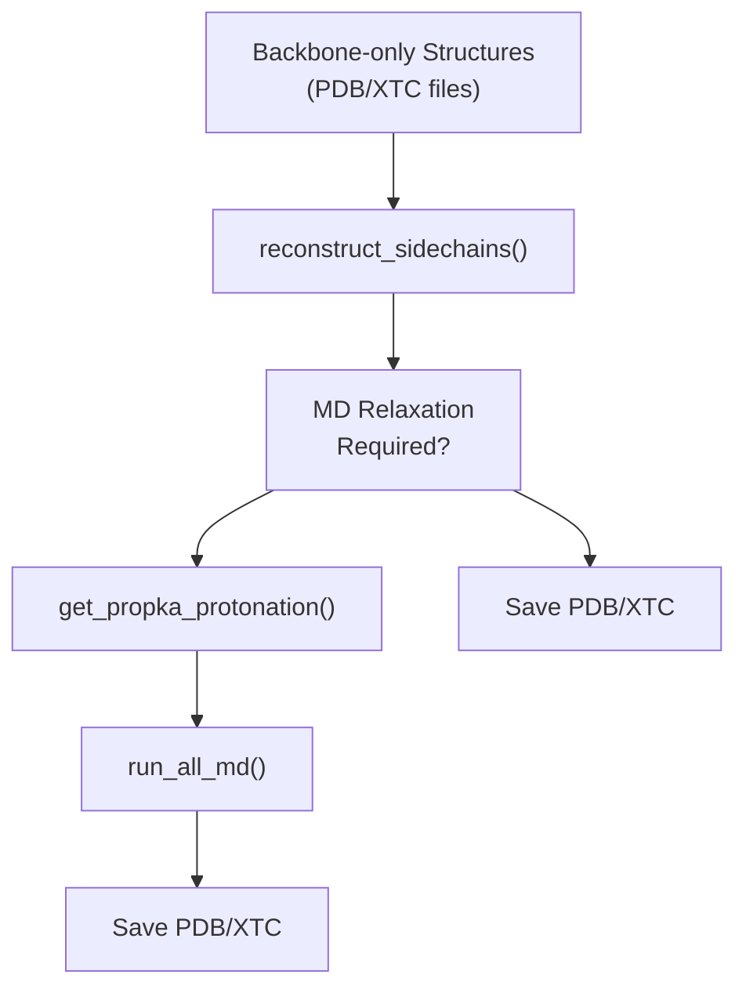
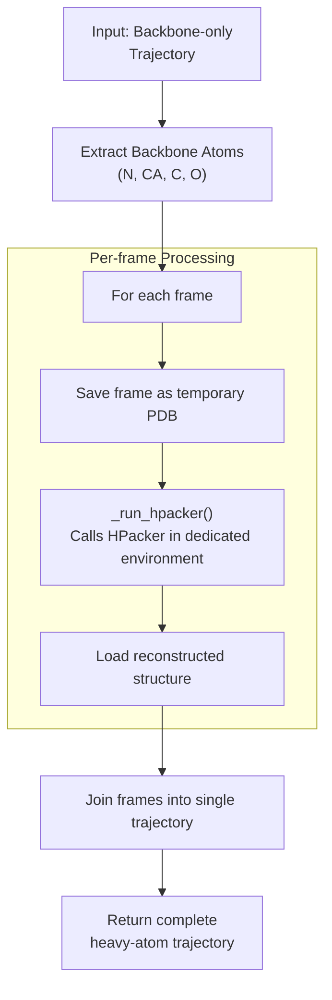
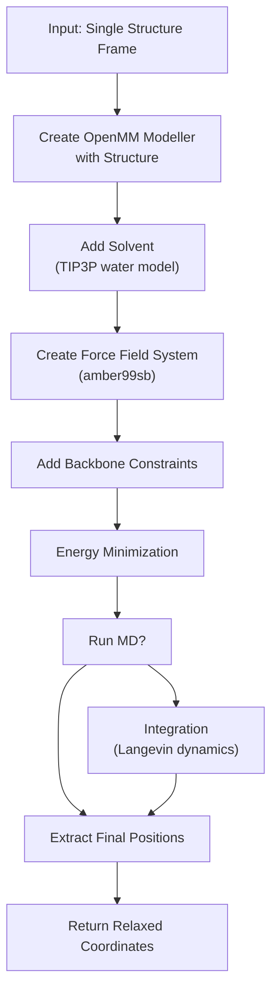
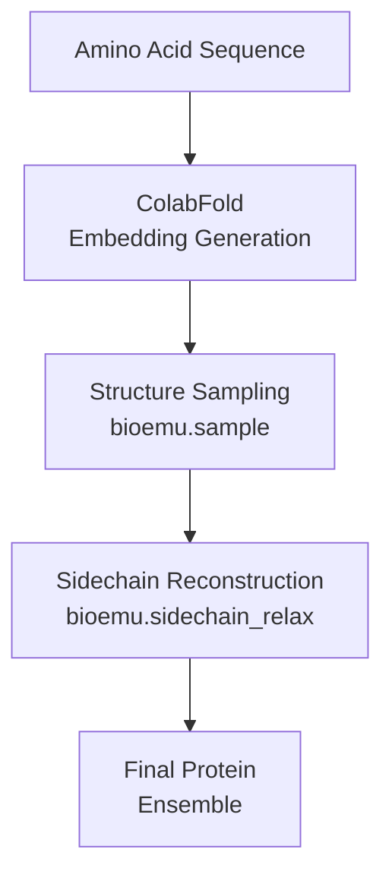

# Sidechain Reconstruction and MD Relaxation

> **Relevant source files**
> * [src/bioemu/sidechain_relax.py](https://github.com/microsoft/bioemu/blob/6ff0ddd1/src/bioemu/sidechain_relax.py)
> * [tests/test_mdrelax.py](https://github.com/microsoft/bioemu/blob/6ff0ddd1/tests/test_mdrelax.py)

## Purpose and Scope

This document details the sidechain reconstruction and molecular dynamics (MD) relaxation component of BioEmu. This component serves as an optional post-processing step that takes backbone-only protein structures generated by the Structure Sampling module (see [Protein Structure Sampling](/microsoft/bioemu/3.1-protein-structure-sampling)) and refines them by:

1. Reconstructing missing sidechain atoms
2. Optionally performing molecular dynamics simulations to relax the structures into more physically realistic conformations

The process transforms backbone-only protein structures into complete, all-atom protein models that have been energy-minimized and relaxed.

## System Overview

The sidechain reconstruction and MD relaxation workflow operates as the final stage in the BioEmu pipeline, taking backbone-only structures and producing refined, complete protein models.



Sources: [src/bioemu/sidechain_relax.py L206-L242](https://github.com/microsoft/bioemu/blob/6ff0ddd1/src/bioemu/sidechain_relax.py#L206-L242)

## Sidechain Reconstruction with HPacker

### Integration with HPacker

The system uses HPacker, an external tool, to reconstruct protein sidechains from backbone-only structures. HPacker installation and setup are managed automatically by the system.



Sources: [src/bioemu/sidechain_relax.py L36-L105](https://github.com/microsoft/bioemu/blob/6ff0ddd1/src/bioemu/sidechain_relax.py#L36-L105)

### Reconstruction Process

The `reconstruct_sidechains()` function processes each frame of the input trajectory:

1. Extracts only backbone atoms (N, CA, C, O) from the input structure, excluding CB atoms
2. For each frame: * Saves the backbone structure to a temporary PDB file * Calls HPacker via the `_run_hpacker()` function to add sidechains * Loads the reconstructed structure back into memory
3. Joins all reconstructed frames into a single trajectory
4. Handles errors if frames have inconsistent topologies

The `_run_hpacker()` function ensures HPacker is properly installed and runs it in a dedicated Conda environment to avoid dependency conflicts.

Sources: [src/bioemu/sidechain_relax.py L63-L105](https://github.com/microsoft/bioemu/blob/6ff0ddd1/src/bioemu/sidechain_relax.py#L63-L105)

## Molecular Dynamics Relaxation

### MD Protocols

The system offers two MD protocols for structure relaxation:

| Protocol | Description | Performance | Use Case |
| --- | --- | --- | --- |
| `LOCAL_MINIMIZATION` | Only performs energy minimization without integration | Fast | For resolving local issues like steric clashes |
| `NVT_EQUIL` | Energy minimization plus short MD simulation | Slower but more thorough | For resolving more severe structural issues |

Sources: [src/bioemu/sidechain_relax.py L31-L34](https://github.com/microsoft/bioemu/blob/6ff0ddd1/src/bioemu/sidechain_relax.py#L31-L34)

 [src/bioemu/sidechain_relax.py L218-L224](https://github.com/microsoft/bioemu/blob/6ff0ddd1/src/bioemu/sidechain_relax.py#L218-L224)

### MD Simulation Details



Sources: [src/bioemu/sidechain_relax.py L108-L165](https://github.com/microsoft/bioemu/blob/6ff0ddd1/src/bioemu/sidechain_relax.py#L108-L165)

The MD simulation uses the following settings:

* Force field: AMBER99SB for protein and TIP3P for water
* Solvation: 1.0 nm padding with 0.1 M ionic strength (Na+/Cl-)
* Periodic boundary conditions with Particle Mesh Ewald (PME)
* Constraints on backbone atoms (C, CA, N, O) with a force constant of 1000
* Langevin integrator at 300K with 2 fs timestep
* Energy minimization performed with 100 maximum iterations

For full MD simulation (`NVT_EQUIL`), the system runs for 0.1 ns by default, while for `LOCAL_MINIMIZATION`, only the energy minimization step is performed.

Sources: [src/bioemu/sidechain_relax.py L108-L165](https://github.com/microsoft/bioemu/blob/6ff0ddd1/src/bioemu/sidechain_relax.py#L108-L165)

### Batch Processing

The `run_all_md()` function manages running MD on multiple structures:

1. Processes each frame in the input trajectory
2. Applies the selected MD protocol to each frame
3. Extracts heavy atoms from the relaxed structures
4. Compiles the results into a new trajectory
5. Gracefully handles frames that fail MD setup

Sources: [src/bioemu/sidechain_relax.py L168-L203](https://github.com/microsoft/bioemu/blob/6ff0ddd1/src/bioemu/sidechain_relax.py#L168-L203)

## Command Line Interface

The module can be used directly from the command line:

```
python -m bioemu.sidechain_relax --xtc-path <XTC_FILE> --pdb-path <PDB_FILE> [options]
```

Key parameters include:

* `--xtc-path`: Path to XTC file containing backbone structures
* `--pdb-path`: Path to PDB file containing topology
* `--md-equil`: Flag to run MD equilibration (default: True)
* `--md-protocol`: MD protocol to use (`local_minimization` or `nvt_equil`)
* `--outpath`: Directory to save output files (default: current directory)
* `--prefix`: Prefix for output filenames (default: "samples")

Sources: [src/bioemu/sidechain_relax.py L206-L242](https://github.com/microsoft/bioemu/blob/6ff0ddd1/src/bioemu/sidechain_relax.py#L206-L242)

## Output Files

The module produces the following output files:

| File | Description |
| --- | --- |
| `<prefix>_sidechain_rec.pdb` | PDB file with the first frame after sidechain reconstruction |
| `<prefix>_sidechain_rec.xtc` | XTC trajectory file with all frames after sidechain reconstruction |
| `<prefix>_md_equil.pdb` | PDB file with the first frame after MD relaxation (if enabled) |
| `<prefix>_md_equil.xtc` | XTC trajectory file with all frames after MD relaxation (if enabled) |

Sources: [src/bioemu/sidechain_relax.py L232-L242](https://github.com/microsoft/bioemu/blob/6ff0ddd1/src/bioemu/sidechain_relax.py#L232-L242)

## Integration with BioEmu Pipeline



The sidechain reconstruction and MD relaxation component is the final step in the BioEmu pipeline. It takes the backbone-only structures generated by the structure sampling module and transforms them into complete, relaxed protein structures.

In a typical workflow:

1. Users first run `bioemu.sample` to generate backbone structures from an amino acid sequence
2. Then run `bioemu.sidechain_relax` on those structures to add sidechains and relax them

Sources: [src/bioemu/sidechain_relax.py L206-L242](https://github.com/microsoft/bioemu/blob/6ff0ddd1/src/bioemu/sidechain_relax.py#L206-L242)

## Protonation State Assignment

Before MD simulation, the system automatically assigns appropriate protonation states to the protein structures using PROPKA at pH 7.0. This ensures that the MD simulations use chemically accurate protonation states for histidines and other titratable residues.

Sources: [src/bioemu/sidechain_relax.py L237](https://github.com/microsoft/bioemu/blob/6ff0ddd1/src/bioemu/sidechain_relax.py#L237-L237)