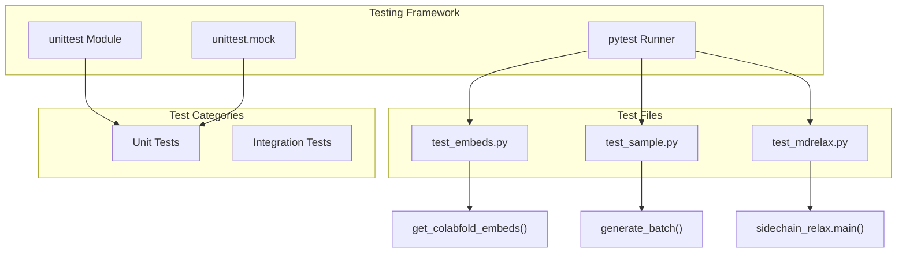
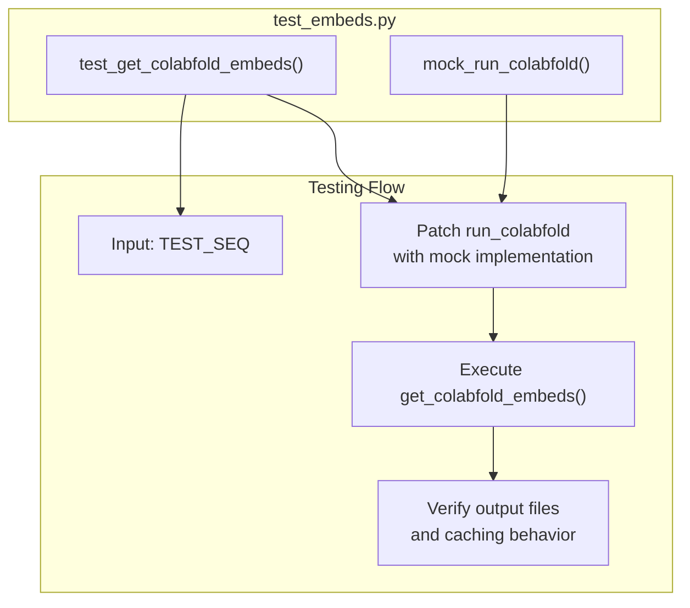
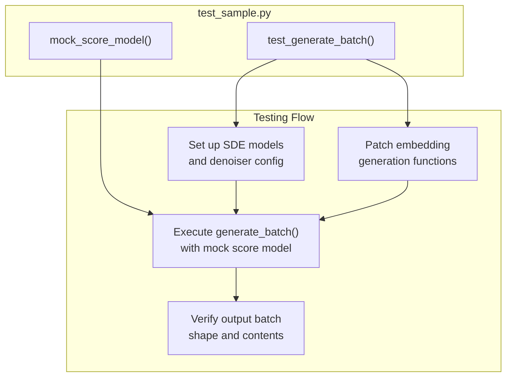
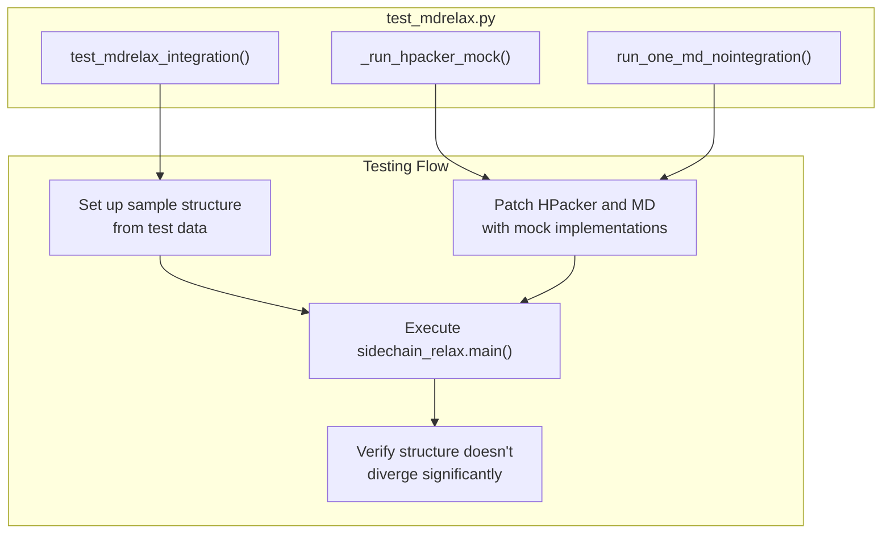
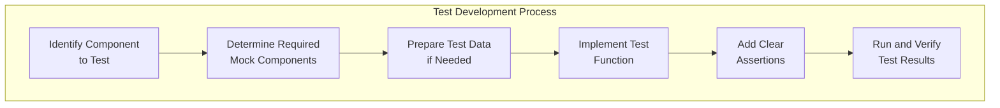

# Testing

> **Relevant source files**
> * [tests/test_embeds.py](https://github.com/microsoft/bioemu/blob/6ff0ddd1/tests/test_embeds.py)
> * [tests/test_mdrelax.py](https://github.com/microsoft/bioemu/blob/6ff0ddd1/tests/test_mdrelax.py)
> * [tests/test_sample.py](https://github.com/microsoft/bioemu/blob/6ff0ddd1/tests/test_sample.py)

This page documents BioEmu's testing infrastructure, framework, and procedures. It provides developers with information on how to run existing tests and how to write new tests when contributing to the codebase. For information about releasing the software, see [Release Process](/microsoft/bioemu/7.2-release-process).

## Overview of Testing Infrastructure

BioEmu uses Python's standard `unittest` framework along with mocking capabilities to test its various components. Tests are organized by functional area, with dedicated test files for different subsystems within the project.



Sources: [tests/test_embeds.py L1-L55](https://github.com/microsoft/bioemu/blob/6ff0ddd1/tests/test_embeds.py#L1-L55)

 [tests/test_sample.py L1-L55](https://github.com/microsoft/bioemu/blob/6ff0ddd1/tests/test_sample.py#L1-L55)

 [tests/test_mdrelax.py L1-L54](https://github.com/microsoft/bioemu/blob/6ff0ddd1/tests/test_mdrelax.py#L1-L54)

## Test Categories

BioEmu's test suite includes both unit tests and integration tests:

### Unit Tests

Unit tests focus on testing individual functions or components in isolation. The tests for embedding generation and structure sampling are primarily unit tests.

### Integration Tests

Integration tests verify interactions between different components. The MD relaxation tests include integration testing to ensure the entire pipeline functions correctly.

## Major Test Components

### Embedding Generation Tests

Tests in `test_embeds.py` validate the functionality for generating and caching protein sequence embeddings using ColabFold.



Key aspects tested:

* Proper function of `get_colabfold_embeds()`
* Creation of cached embedding files
* Proper handling of the embedding cache

Sources: [tests/test_embeds.py L11-L55](https://github.com/microsoft/bioemu/blob/6ff0ddd1/tests/test_embeds.py#L11-L55)

### Structure Sampling Tests

Tests in `test_sample.py` validate the structure generation functionality.



Key aspects tested:

* Batch generation functionality
* Integration with the score model
* Proper shape of output tensors

Sources: [tests/test_sample.py L15-L55](https://github.com/microsoft/bioemu/blob/6ff0ddd1/tests/test_sample.py#L15-L55)

### MD Relaxation Tests

Tests in `test_mdrelax.py` verify the molecular dynamics relaxation pipeline.



Key aspects tested:

* End-to-end sidechain reconstruction and relaxation
* Structure stability during the process
* Proper integration of MD components

Sources: [tests/test_mdrelax.py L1-L54](https://github.com/microsoft/bioemu/blob/6ff0ddd1/tests/test_mdrelax.py#L1-L54)

## Mock Testing Framework

BioEmu extensively uses mocking to isolate components during testing. This approach is particularly important given the dependencies on external tools like ColabFold and computational complexity of running full molecular dynamics simulations during tests.

### Key Mock Components

| Mock Component | Purpose | Used In |
| --- | --- | --- |
| `mock_run_colabfold()` | Creates synthetic embeddings without running actual ColabFold | Embedding and sampling tests |
| `mock_score_model()` | Provides synthetic score model outputs | Structure sampling tests |
| `_run_hpacker_mock()` | Uses pre-computed test data instead of running HPacker | MD relaxation tests |
| `run_one_md_nointegration()` | Performs minimization only without full MD simulation | MD relaxation tests |

Sources: [tests/test_embeds.py L14-L29](https://github.com/microsoft/bioemu/blob/6ff0ddd1/tests/test_embeds.py#L14-L29)

 [tests/test_sample.py L17-L22](https://github.com/microsoft/bioemu/blob/6ff0ddd1/tests/test_sample.py#L17-L22)

 [tests/test_mdrelax.py L12-L26](https://github.com/microsoft/bioemu/blob/6ff0ddd1/tests/test_mdrelax.py#L12-L26)

## Running Tests

Tests can be run using the pytest framework. The typical command to run all tests is:

```
python -m pytest tests/
```

To run specific test files:

```
python -m pytest tests/test_embeds.py
python -m pytest tests/test_sample.py
python -m pytest tests/test_mdrelax.py
```

### Test Data

The test suite includes pre-computed test data files in the `tests/test_data/` directory, which are used to mock external dependencies and provide consistent input for integration tests.

## Writing New Tests

When contributing to BioEmu, new features should be accompanied by appropriate tests. Follow these guidelines:

1. **Naming Conventions**: Test files should be named `test_*.py` and test functions should start with `test_`.
2. **Test File Organization**: Place tests in the `tests/` directory, organizing them to match the structure of the source code.
3. **Mocking External Dependencies**: Use `unittest.mock` to patch external dependencies and avoid actual execution of computationally expensive operations.
4. **Test Data**: If tests require sample data, add it to the `tests/test_data/` directory.
5. **Assertions**: Use clear assertions to verify expected outcomes and include helpful error messages.



## Continuous Integration

BioEmu's test suite is integrated with CI workflows to ensure all tests pass before changes are merged. Tests are automatically run on pull requests and commits to the main branch.