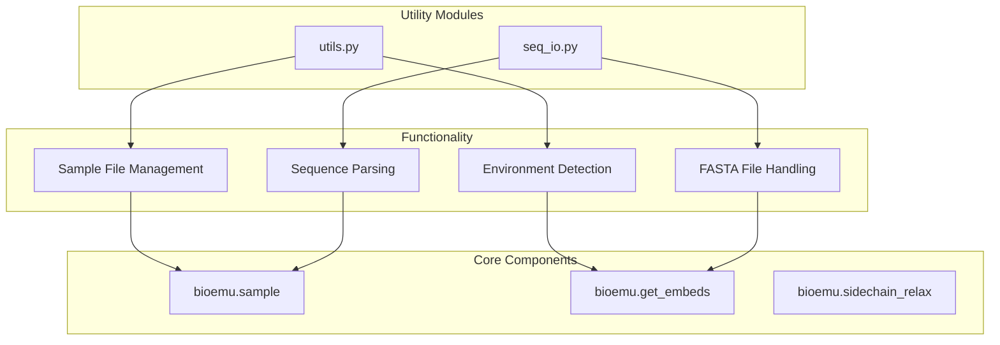
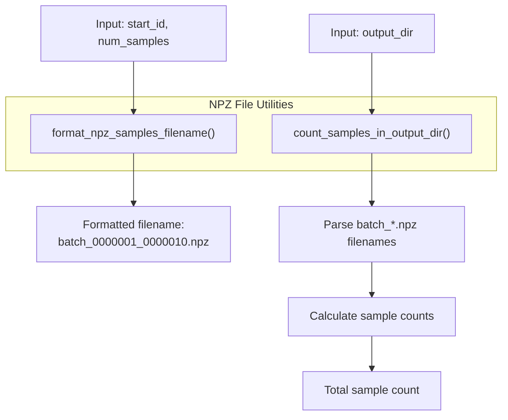
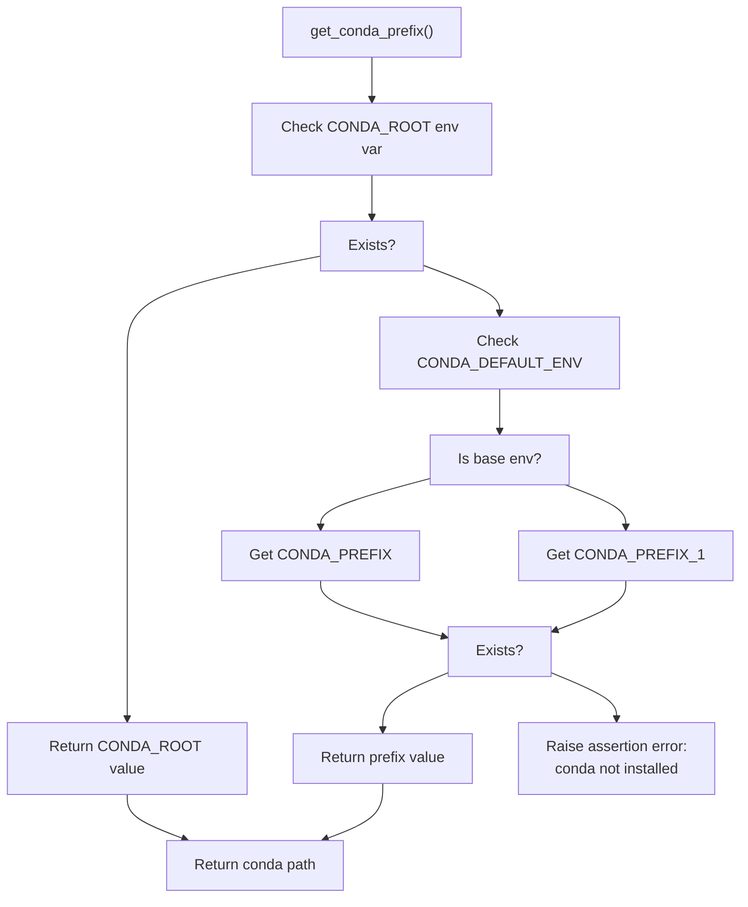
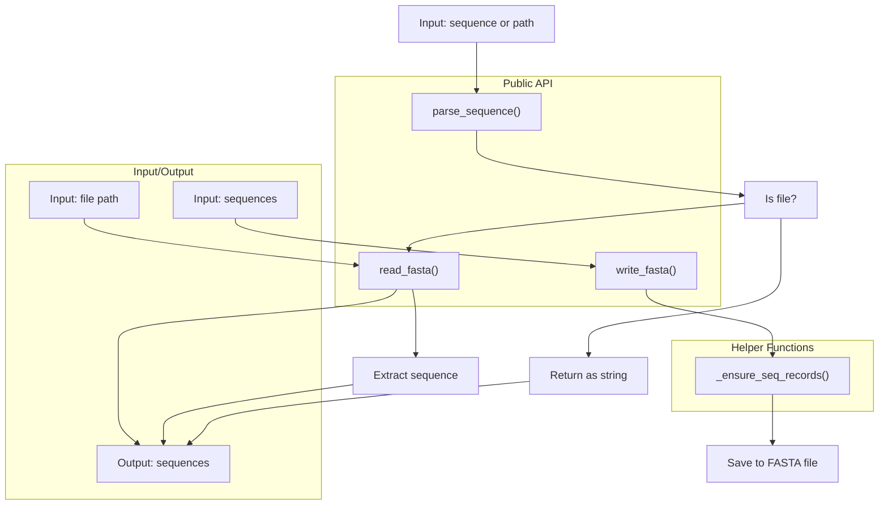
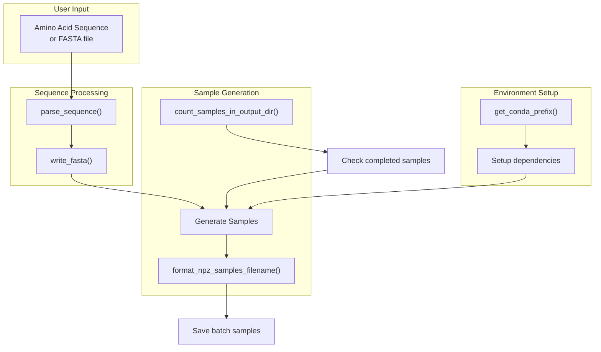

# Utilities and Helper Functions

> **Relevant source files**
> * [src/bioemu/seq_io.py](https://github.com/microsoft/bioemu/blob/6ff0ddd1/src/bioemu/seq_io.py)
> * [src/bioemu/utils.py](https://github.com/microsoft/bioemu/blob/6ff0ddd1/src/bioemu/utils.py)
> * [tests/test_seq_io.py](https://github.com/microsoft/bioemu/blob/6ff0ddd1/tests/test_seq_io.py)
> * [tests/test_utils.py](https://github.com/microsoft/bioemu/blob/6ff0ddd1/tests/test_utils.py)

This page documents the utility functions and helper modules in the BioEmu codebase. These utilities provide supporting functionality for the core components of BioEmu, focusing on file management, sequence I/O operations, and environment configuration.

For information about the main workflows and functionality, see [Core Functionality](/microsoft/bioemu/3-core-functionality).

## Utility Module Organization

BioEmu includes several dedicated utility modules that provide helper functions used throughout the codebase:



Sources: [src/bioemu/utils.py](https://github.com/microsoft/bioemu/blob/6ff0ddd1/src/bioemu/utils.py)

 [src/bioemu/seq_io.py](https://github.com/microsoft/bioemu/blob/6ff0ddd1/src/bioemu/seq_io.py)

## Sample Management Utilities

BioEmu includes utilities for managing sampled protein structure files and tracking batches of samples.

### NPZ File Management

The `utils.py` module provides functions for handling NPZ files containing protein structure samples:



Sources: [src/bioemu/utils.py L7-L22](https://github.com/microsoft/bioemu/blob/6ff0ddd1/src/bioemu/utils.py#L7-L22)

These functions follow specific conventions:

* `format_npz_samples_filename`: Creates standardized filenames for batch sample files using the pattern `batch_{start_id:07d}_{start_id + num_samples:07d}.npz` where IDs are zero-padded to 7 digits.
* `count_samples_in_output_dir`: Counts the total number of samples across all NPZ files in a directory by parsing the numeric portions of filenames.

### Environment Detection

The `get_conda_prefix()` function in `utils.py` helps locate the root Conda folder, which is necessary for certain dependencies:



Sources: [src/bioemu/utils.py L28-L41](https://github.com/microsoft/bioemu/blob/6ff0ddd1/src/bioemu/utils.py#L28-L41)

## Sequence I/O Utilities

The `seq_io.py` module provides utilities for handling protein sequences and FASTA files:

### Sequence Handling Functions



Sources: [src/bioemu/seq_io.py L14-L52](https://github.com/microsoft/bioemu/blob/6ff0ddd1/src/bioemu/seq_io.py#L14-L52)

The module provides the following key functionality:

1. **FASTA File Handling** * `write_fasta()`: Writes protein sequences to a FASTA file, accepting both raw strings and BioPython `SeqRecord` objects * `read_fasta()`: Reads sequences from a FASTA file, returning a list of `SeqRecord` objects
2. **Sequence Parsing** * `parse_sequence()`: A versatile function that can extract a protein sequence from: * A raw string sequence (returned as-is) * A FASTA file path (extracts the first sequence) * An a3m file path (extracts the first sequence) * Includes error handling for filenames that are too long
3. **Helper Functions** * `_ensure_seq_records()`: Internal helper that converts a mixed list of strings and `SeqRecord` objects to a uniform list of `SeqRecord` objects

## Usage in BioEmu Workflows

The utilities are integrated into BioEmu's main workflows in several ways:



Sources: [src/bioemu/utils.py](https://github.com/microsoft/bioemu/blob/6ff0ddd1/src/bioemu/utils.py)

 [src/bioemu/seq_io.py](https://github.com/microsoft/bioemu/blob/6ff0ddd1/src/bioemu/seq_io.py)

## Data Types and Error Handling

### Custom Type Definitions

The codebase defines custom type hints to improve code readability:

```markdown
StrPath = str | os.PathLike  # Used for file path parameters
```

### Error Handling

The utility functions handle several error cases:

1. **File System Errors** * `parse_sequence()` catches `OSError` exceptions that can occur with overly long filenames * `write_fasta()` creates parent directories if they don't exist, preventing file write errors
2. **Environment Configuration Errors** * `get_conda_prefix()` includes assertions to provide clear error messages when Conda is not properly installed

## Integration with External Libraries

The utility modules integrate with several external libraries:

1. **BioPython** * Used in `seq_io.py` for handling FASTA files and sequence records * Provides the `SeqRecord` and `Seq` classes for structured sequence representation
2. **Standard Library** * `pathlib.Path` for file path handling * `os` module for environment variable access and path manipulation

Sources: [src/bioemu/seq_io.py L7-L9](https://github.com/microsoft/bioemu/blob/6ff0ddd1/src/bioemu/seq_io.py#L7-L9)

 [src/bioemu/utils.py L3-L4](https://github.com/microsoft/bioemu/blob/6ff0ddd1/src/bioemu/utils.py#L3-L4)

## Testing

The utility functions are covered by dedicated test modules:

* `tests/test_utils.py`: Tests for NPZ file naming and sample counting
* `tests/test_seq_io.py`: Tests for sequence parsing and FASTA file operations

These tests verify both normal operation and edge cases, such as handling long sequence names and different batch sizes for sample files.

Sources: [tests/test_utils.py](https://github.com/microsoft/bioemu/blob/6ff0ddd1/tests/test_utils.py)

 [tests/test_seq_io.py](https://github.com/microsoft/bioemu/blob/6ff0ddd1/tests/test_seq_io.py)