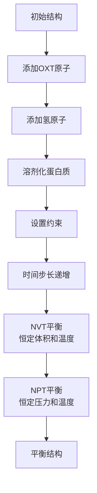

---
slug:11-molecular-dynamics-utilities
blog_type:normal
---


分子动力学（MD）模拟在优化和验证BioEmu等AI模型生成的蛋白质结构方面发挥着关键作用。BioEmu中的MD工具包为预测蛋白质结构的能量最小化、平衡和自由动力学模拟提供了全面的工具集。这些工具有助于确保生成的结构在现实条件下具有物理合理性和稳定性。

## 分子动力学在蛋白质结构预测中的重要性

AI模型预测的蛋白质结构可能存在细微的物理不一致性，如原子碰撞、扭曲的键角或能量不利的构象。**MD模拟**通过以下方式解决这些问题：

1. 通过能量最小化松弛紧张的几何结构
2. 在含有显式水分子的溶剂化环境中平衡结构
3. 提供物理上现实的途径来优化侧链和主链构象
4. 通过自由动力学模拟评估结构稳定性

BioEmu的MD工具包专门设计用于处理从头蛋白质结构预测的独特挑战，这些预测可能与实验确定的结构相差甚远。

## 核心MD组件

BioEmu中的分子动力学工具包建立在几个关键组件之上，这些组件协同工作以创建完整的优化流程。

### 系统准备

在运行任何MD模拟之前，必须正确准备蛋白质结构。`md_utils.py`中的`_prepare_system`函数处理这个关键的准备阶段：

```python
def _prepare_system(
    frame: mdtraj.Trajectory, padding_nm: float = 1.0
) -> tuple[mm.System, app.Modeller]:
    # 如果缺少OXT原子，将其添加到C端
    topology, positions = _add_oxt_to_terminus(frame.top.to_openmm(), frame.xyz[0] * u.nanometers)
    
    # 添加氢原子并创建建模器
    modeller = app.Modeller(topology, positions)
    modeller.addHydrogens()
    
    # 添加溶剂和离子
    forcefield = app.ForceField("amber99sb.xml", "tip3p.xml")
    modeller.addSolvent(forcefield, padding=padding_nm * u.nanometers, ionicStrength=0.1 * u.molar)
```

此函数执行几个基本准备步骤：
- 使用启发式方法向蛋白质C端添加缺失的OXT原子
- 向结构添加氢原子（预测中通常缺失）
- 在具有适当填充的水盒中溶剂化蛋白质
- 添加离子以中和系统并达到生理离子强度

该系统使用**amber99sb**蛋白质力场和**TIP3P**水模型，这些都是以其准确性和稳定性而闻名的成熟生物分子力场。

来源：[md_utils.py#L78-L114](src/bioemu/md_utils.py#L78-L114), [md_utils.py#L16-L59](repos/microsoft/bicrosoft/bioemu/src/bioemu/md_utils.py#L16-L59)

### 平衡方案

MD工具包中最复杂的组件之一是在`_do_equilibration`中实现的平衡方案。此函数专门设计用于处理可能远离平衡的结构：

```python
def _do_equilibration(
    simulation: app.Simulation,
    integrator: mm.Integrator,
    init_timesteps_ps: list[float],
    integrator_timestep_ps: float,
    simtime_ns_nvt_equil: float,
    simtime_ns_npt_equil: float,
    temperature_K: u.Quantity,
) -> None:
```

平衡方案采用**多阶段方法**：

1. **时间步长递增**：从非常小的时间步长（飞秒）开始，逐渐增加到目标时间步长
2. **NVT平衡**：在恒定体积和温度下平衡系统，具有高摩擦力
3. **NPT平衡**：在恒定压力和温度下平衡系统，具有正常摩擦力

以下Mermaid图表说明了平衡工作流程：



这种方法对BioEmu生成的结构特别有价值，这些结构可能包含显著的空间位阻或能量不利的构象，这些构象会导致传统MD设置失败。

来源：[md_utils.py#L143-L196](src/bioemu/md_utils.py#L143-L196)

### 主链约束

BioEmu MD工具包中的一个关键创新是在优化过程中使用**主链约束**。`_add_constraint_force`函数在主链原子上实现谐波约束：

```python
def _add_constraint_force(system: mm.System, modeller: app.Modeller, k: float) -> int:
    force = mm.CustomExternalForce("k*periodicdistance(x, y, z, x0, y0, z0)^2")
    force.addGlobalParameter("k", k)
    
    for atom in modeller.topology.atoms():
        if atom.name in ("C", "CA", "N", "O"):
            force.addParticle(atom.index, modeller.positions[atom.index])
    
    return system.addForce(force)
```

这些约束具有关键作用：它们在允许侧链和局部主链段松弛的同时保持蛋白质的整体折叠。这很重要，因为BioEmu的预测通常代表有意义的蛋白质折叠，在优化过程中不应被根本改变。

约束力使用具有可调力常数（k）的**谐波势**，允许受控松弛。在初始平衡后，这些约束可以逐渐减少并移除，以允许自由MD模拟。

来源：[md_utils.py#L117-L140](src/bioemu/md_utils.py#L117-L140), [md_utils.py#L198-L219](src/bioemu/md_utils.py#L198-L219)

## MD优化工作流程

BioEmu通过`sidechain_relax.py`模块提供两种主要的MD优化工作流程，该模块将MD工具编排成实用的工作流程。

### 侧链重建

在MD优化开始之前，预测的主链结构需要完整的侧链。`reconstruct_sidechains`函数与**HPacker**集成，这是一个专门用于侧链重建的工具：

```python
def reconstruct_sidechains(traj: mdtraj.Trajectory) -> mdtraj.Trajectory:
    # 提取主链原子
    traj_bb = traj.atom_slice(traj.top.select("backbone"))
    
    # 逐帧重建侧链
    for n, frame in enumerate(traj_bb):
        protein_pdb_in = os.path.join(tmp, f"frame_{n}_bb.pdb")
        protein_pdb_out = os.path.join(tmp, f"frame_{n}_heavyatom.pdb")
        frame.save_pdb(protein_pdb_in)
        _run_hpacker(protein_pdb_in, protein_pdb_out)
```

这个过程至关重要，因为BioEmu与许多结构预测模型一样，可能生成侧链不完整或缺失的结构。HPacker预测适合主链结构的最佳侧链构象（旋转异构体）。

<CgxTip>
侧链重建必须在MD模拟之前执行。MD工具要求输入结构具有完整的侧链，以正确评估能量和空间位阻。
</CgxTip>

来源：[sidechain_relax.py#L71-L113](src/bioemu/sidechain_relax.py#L71-L113)

### MD优化选项

BioEmu提供在`run_one_md`中实现的两种主要优化方案：

#### 1. 局部最小化（快速）

```python
equil_frame = run_one_md(
    frame,
    only_energy_minimization=True,  # 仅执行能量最小化
    simtime_ns_nvt_equil=0.0,
    simtime_ns_npt_equil=0.0,
    simtime_ns=0.0
)
```

此方案：
- 仅运行局部能量最小化
- 需要几秒钟完成
- 主要解决原子碰撞和明显的空间位阻问题
- 保持整体主链结构，变化最小

#### 2. 完全平衡（全面）

```python
equil_frame = run_one_md(
    frame,
    only_energy_minimization=False,
    simtime_ns_nvt_equil=0.1,  # 0.1 ns NVT平衡
    simtime_ns_npt_equil=0.4,  # 0.4 ns NPT平衡
    simtime_ns=10.0             # 10 ns自由MD（可选）
)
```

这个全面方案：
- 执行能量最小化，然后进行真正的MD平衡
- 模拟溶剂效应和热运动
- 可以在初始平衡后包括无约束MD
- 根据系统大小和模拟时间，需要几分钟到几小时

全面方案的**标准参数**经过精心调整：
- 时间步长：0.001 ps（1 fs）
- 温度：300 K
- 约束力常数：1000 kJ/mol/nm²
- NVT平衡：0.1 ns
- NPT平衡：0.4 ns

来源：[sidechain_relax.py#L116-L208](src/bioemu/sidechain_relax.py#L116-L208), [sidechain_relax.py#L252-L306](src/bioemu/sidechain_relax.py#L252-L306)

## 实际使用

### 命令行界面

MD工具包可以通过命令行界面访问：

```bash
python -m bioemu.sidechain_relax \
    --xtc-path samples.xtc \
    --pdb-path topology.pdb \
    --md-equil \
    --md-protocol md_equil \
    --simtime-ns 10.0 \
    --outpath results \
    --prefix refined
```

此命令：
- 接受输入轨迹和拓扑
- 重建侧链
- 运行MD平衡
- 如果需要，执行自由MD模拟
- 输出优化后的结构

### Python API集成

为了集成到分析流程中，可以直接调用MD工具：

```python
from bioemu.sidechain_relax import reconstruct_sidechains, run_one_md
import mdtraj

# 加载预测结构
traj = mdtraj.load('prediction.xtc', top='topology.pdb')

# 重建侧链
with_sidechains = reconstruct_sidechains(traj)

# 在每一帧上运行MD优化
refined_trajs = []
for frame in with_sidechains:
    refined_frame = run_one_md(
        frame,
        only_energy_minimization=False,
        simtime_ns_nvt_equil=0.1,
        simtime_ns_npt_equil=0.4
    )
    refined_trajs.append(refined_frame)

# 合并结果
final_result = mdtraj.join(refined_trajs)
```

来源：[sidechain_relax.py#L252-L306](src/bioemu/sidechain_relax.py#L252-L306)

## 性能考虑

MD工具包的设计兼顾了准确性和性能：

### 硬件加速

代码在可用时自动检测并使用CUDA加速：

```python
try:
    platform = mm.Platform.getPlatformByName("CUDA")
    logger.debug("simulation uses CUDA platform")
except Exception:
    # 回退到默认
    platform = None
    logger.warning("Cannot find CUDA platform. Simulation might be slow.")
```

**GPU加速**可以为典型蛋白质系统提供10-100倍的加速，使其成为实际工作流程的必需品。

### 内存和时间要求

| 方案 | 典型运行时间 | 用例 |
|----------|-----------------|----------|
| 局部最小化 | 秒 | 快速去除碰撞 |
| 短时平衡 | 1-5分钟 | 基本优化 |
| 完全平衡+自由MD | 5-60分钟 | 全面优化 |
| 长时自由MD | 数小时+ | 稳定性评估 |

<CgxTip>
对于大规模处理多个结构，考虑首先使用局部最小化方案。它能快速解决最严重的问题，并在投入更长的MD模拟之前筛选出有问题的结构。
</CgxTip>

来源：[sidechain_relax.py#L158-L165](src/bioemu/sidechain_relax.py#L158-L165), [sidechain_relax.py#L142-L148](src/bioemu/sidechain_relax.py#L142-L148)

## 与BioEmu工作流程的集成

MD工具包设计为无缝融入BioEmu的结构预测和优化流程：

1. **结构生成**：BioEmu生成蛋白质主链结构
2. **侧链重建**：HPacker添加完整侧链
3. **MD优化**：MD工具松弛和优化结构
4. **质量评估**：可以评估优化后结构的稳定性和质量

这种集成方法确保预测的结构不仅根据AI模型是合理的，而且在分子动力学模拟下也是**物理现实**和稳定的。

MD工具作为纯统计预测和物理现实模型之间的关键桥梁，能够生成既具有生物学意义又化学合理的蛋白质结构。