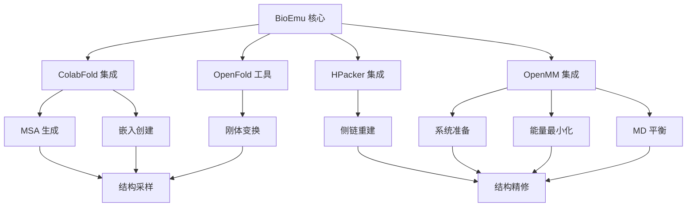

---
slug:12-integration-with-external-tools
blog_type:normal
---


BioEmu 并非独立运行——它利用了多个强大的外部工具来增强其生物分子结构建模能力。这些集成功能从序列嵌入生成到侧链重建和分子动力学精修，为蛋白质结构分析创建了一个完整的流程。

## 集成理念

BioEmu 被设计为一个模块化框架，它**无缝集成专业工具**而非重新开发现有解决方案。这种方法使 BioEmu 能够专注于其核心优势——生成多样化的蛋白质构象，同时依赖成熟的外部工具来处理补充任务。这些集成经过精心管理，既最小化了用户开销，又为高级用例保持了灵活性。

<CgxTip>
BioEmu 中的所有外部工具集成都设计为开箱即用，并提供合理的默认设置，同时也为有特定需求或专业硬件配置的用户提供了配置选项。
</CgxTip>

## 与 ColabFold 集成生成序列嵌入

BioEmu 与 **ColabFold** 集成以生成多序列比对（MSA）和序列嵌入，这些是准确结构预测的关键输入。当您首次使用 BioEmu 进行结构采样时，此集成会自动进行。

```python
# BioEmu 自动处理 ColabFold 设置
from bioemu.sample import main as sample
sample(sequence='GYDPETGTWG', num_samples=10, output_dir='./results')
```

集成过程遵循以下步骤：

1. **环境设置**：BioEmu 创建一个独立的虚拟环境（默认：`~/.bioemu_colabfold`）来隔离 ColabFold 依赖项
2. **依赖安装**：安装特定 CUDA 兼容版本的 ColabFold 以确保 GPU 加速
3. **补丁应用**：对 ColabFold 模块应用针对性补丁以确保与 BioEmu 要求的兼容性
4. **嵌入生成**：使用 ColabFold 的 MSA 生成功能创建序列嵌入

设置脚本处理复杂的依赖管理，包括 ColabFold 所需的特定 CUDA 库版本。此自动设置在首次使用时进行，无需用户手动干预。

来源：[get_embeds.py#L19-L21](src/bioemu/get_embeds.py#L19-L21), [colabfold_setup/setup.sh](src/bioemu/colabfold_setup/setup.sh)

## 与 HPacker 集成进行侧链重建

由于 BioEmu 生成主链结构，它需要一种机制来添加侧链。该框架与 **HPacker**（一个专门用于侧链重建的工具）集成，将仅含主链的结构转换为完整的原子模型。

HPacker 集成涉及两个主要组件：

### 设置和安装

BioEmu 为 HPacker 提供了专门的设置过程，处理 conda 环境管理：

```python
from bioemu.hpacker_setup.setup_hpacker import ensure_hpacker_install

# 确保 HPacker 在独立的 conda 环境中正确安装
ensure_hpacker_install(envname="hpacker", repo_dir="~/.hpacker")
```

设置过程：
1. 从 GitHub 克隆 HPacker 仓库
2. 创建专用的 conda 环境
3. 根据 HPacker 的环境规范安装依赖项
4. 执行可编辑安装以确保顺利集成

### 侧链重建执行

对于实际的重建过程，BioEmu 在其隔离环境中执行 HPacker：

```python
from bioemu.sidechain_relax import reconstruct_sidechains
import mdtraj

# 加载仅含主链的轨迹
backbone_traj = mdtraj.load('samples.xtc', top='topology.pdb')

# 重建侧链
full_atom_traj = reconstruct_sidechains(backbone_traj)
```

重建过程高效处理多个轨迹帧，使用临时目录进行中间处理，并提供强大的错误处理来管理拓扑变化。

来源：[setup_hpacker.py](src/bioemu/hpacker_setup/setup_hpacker.py), [run_hpacker.py](src/bioemu/run_hpacker.py), [sidechain_relax.py#L71-L113](src/bioemu/sidechain_relax.py#L71-L113)

## 与 OpenMM 集成进行分子动力学精修

BioEmu 与 **OpenMM**（一个高性能分子模拟工具包）集成，为生成的结构提供能量最小化和分子动力学精修。此集成有助于确保预测的结构在物理上是合理的且能量上有利的。

BioEmu 中的分子动力学工具提供几个关键功能：

```python
from bioemu.sidechain_relax import run_one_md
import mdtraj

# 加载用于 MD 精修的结构
structure = mdtraj.load('reconstructed.pdb')

# 运行包含能量最小化和平衡的 MD 协议
refined_structure = run_one_md(
    frame=structure,
    only_energy_minimization=False,
    simtime_ns_nvt_equil=0.1,
    simtime_ns_npt_equil=0.4,
    simtime_ns=1.0
)
```

MD 集成包括：

1. **系统准备**：添加缺失原子、溶剂化系统并设置力场（AMBER99sb 配合 TIP3P 水）
2. **约束管理**：应用主链约束以保持整体结构，同时允许局部松弛
3. **渐进式平衡**：使用分阶段方法，逐步增加时间步长并采用不同的系综条件（先 NVT 后 NPT）
4. **硬件加速**：在可用时自动检测并使用 CUDA 平台

该集成特别设计用于处理可能远离平衡的结构，使用专门协议温和地松弛系统而不会引起大的结构偏差。

来源：[md_utils.py](src/bioemu/md_utils.py), [sidechain_relax.py#L116-L200](src/bioemu/sidechain_relax.py#L116-L200)

## OpenFold 工具集成

BioEmu 融合了 **OpenFold**（AlphaFold 的开源实现）中的精选工具来处理几何变换和刚体操作。BioEmu 直接包含特定的实用函数，而非要求完整的 OpenFold 安装：

```python
from bioemu.openfold.utils.rigid_utils import quat_to_rot, rot_vec_mul

# 将四元数转换为旋转矩阵
rotation_matrix = quat_to_rot(quaternion)

# 对坐标应用旋转
rotated_coords = rot_vec_mul(rotation_matrix, coordinates)
```

集成包括：
- **旋转操作**：高效的四元数到旋转矩阵转换
- **向量变换**：坐标向量的刚体变换
- **恒等操作**：为参考系生成恒等变换

这种选择性集成方法避免了安装复杂性，同时提供了 BioEmu 进行结构操作所需的基本几何运算。

来源：[openfold/utils/rigid_utils.py](src/bioemu/openfold/utils/rigid_utils.py)

## 集成架构和工作流程

BioEmu 中的外部工具集成遵循精心设计的架构，确保顺畅的互操作性：



该架构实现了从序列到精修结构的完整工作流程：

1. **输入处理**：ColabFold 从输入序列生成 MSA 和嵌入
2. **结构生成**：BioEmu 使用嵌入采样主链构象
3. **侧链重建**：HPacker 向主链结构添加原子细节
4. **精修**：OpenMM 执行能量最小化和 MD 平衡

在整个工作流程中，OpenFold 工具提供坐标操作所需的几何变换。

<CgxTip>
集成架构设计为模块化——如果您不需要完整流程，可以独立使用各个组件。例如，您可以使用 BioEmu 进行采样，但提供自己的侧链重建方法。
</CgxTip>

## 配置和自定义

BioEmu 提供了多种自定义外部工具集成的方法：

### 环境配置
大多数工具可以通过环境变量配置：

```bash
# 自定义 ColabFold 安装位置
export BIOEMU_COLABFOLD_DIR="/custom/colabfold/path"

# 自定义 HPacker 环境
export HPACKER_ENV_NAME="custom_hpacker_env"
export HPACKER_REPO_DIR="/custom/hpacker/repo"
export HPACKER_PYTHONBIN="/custom/python/path"
```

### 协议参数
MD 和重建协议暴露了众多参数：

```python
# 自定义 MD 协议
refined_structure = run_one_md(
    frame=structure,
    simtime_ns_nvt_equil=0.2,  # 更长的 NVT 平衡
    simtime_ns_npt_equil=0.8,  # 更长的 NPT 平衡
    temperature_K=310.0,       # 更高温度
    simtime_ns=5.0             # 更长的生产 MD
)
```

### 工具版本
BioEmu 固定了外部工具的特定版本以确保可重复性，但高级用户可以在需要时修改设置脚本中的版本。

来源：[sidechain_relax.py#L35-L36](src/bioemu/sidechain_relax.py#L35-L36), [hpacker_setup/setup_hpacker.py#L10-L11](src/bioemu/hpacker_setup/setup_hpacker.py#L10-L11)

## 集成使用的最佳实践

使用 BioEmu 的外部工具集成时，请考虑这些最佳实践：

1. **首次设置**：为初始设置分配充足时间，特别是对于 ColabFold 和 HPacker，它们需要下载和安装大型依赖项
2. **资源管理**：某些集成（特别是 MD 模拟）可能消耗大量资源——监控内存使用情况，并考虑对大型数据集进行批处理
3. **错误处理**：集成包含了强大的错误处理，但网络问题或缺失依赖项仍可能导致问题——检查日志以获取详细诊断信息
4. **版本一致性**：除非有特定升级理由，否则保持与外部工具固定版本的一致性

## 常见问题故障排除

### 安装失败
如果外部工具设置失败：

```bash
# 检查 conda 是否正确安装且可访问
conda --version

# 验证 CUDA 驱动程序（如果使用 GPU 加速）
nvidia-smi

# 检查可用磁盘空间（ColabFold 需要几个 GB）
df -h
```

### 运行时错误
针对特定集成的错误：

1. **ColabFold**：确保 MSA 生成时的网络连接
2. **HPacker**：验证 conda 环境是否存在且正确激活
3. **OpenMM**：检查 GPU 兼容性和 CUDA 加速的驱动程序版本
4. **OpenFold**：这些是包含的工具，不需要单独设置

### 性能优化
要提高集成性能：

1. 在可用时使用 GPU 加速（特别是 OpenMM 和 ColabFold）
2. 调整批量大小以处理多个结构
3. 在不需要高精度时考虑使用更快的 MD 协议
4. 监控内存使用情况并相应调整参数

外部工具集成使 BioEmu 成为蛋白质结构建模的综合解决方案，将最先进的生成能力与成熟的精修和分析工具相结合。通过理解这些集成，您可以充分利用 BioEmu 生态系统进行生物分子研究。