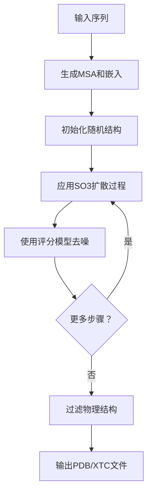

---
slug:5-biomolecular-structure-modeling-principles
blog_type:normal
---


<text>

生物分子结构建模是计算生物学中的一个基本挑战，旨在根据蛋白质和其他生物分子的序列预测其三维排列方式。BioEmu采用基于**扩散模型**和**随机微分方程**的精密框架来解决这个问题，该框架专门针对分子结构的独特几何特性进行了设计。

## 生物分子结构建模的核心原理

BioEmu的核心原理是：通过学习天然蛋白质构象的平衡分布来生成蛋白质结构。与传统专注于寻找单一最低能量结构的预测方法不同，BioEmu从可能结构的**完整分布**中进行采样，从而捕捉生物分子固有的灵活性和动态特性。

该方法建立在几个关键原则之上：

1. **几何适宜性**：蛋白质结构存在于具有特定几何约束的三维空间中。键长、键角和扭转角必须符合物理上合理的范围。

2. **旋转自由度**：蛋白质主链和侧链的旋转自然地使用**SO(3)旋转群**来描述，这需要专门的数学处理。

3. **层次组织**：蛋白质结构从一级（序列）到二级（α-螺旋、β-折叠）再到三级（整体折叠）结构表现出层次性组织。

4. **能量景观**：天然蛋白质结构占据复杂能量景观中的低能区域，可能存在多种稳定构象。

## 用于三维结构生成的扩散模型

BioEmu采用**扩散模型**方法，逐步将随机噪声转化为真实的蛋白质结构。这个过程由随机微分方程（SDE）控制，定义了结构随时间的演化方式。

```python
# 核心SDE框架定义了结构的演化方式
class SDE:
    def sde(self, x: torch.Tensor, t: torch.Tensor, batch_idx: torch.LongTensor | None = None) -> tuple[torch.Tensor, torch.Tensor]:
        """返回漂移项f和扩散系数g，使得dx = f * dt + g * sqrt(dt) * 标准高斯分布"""
        pass
```

扩散过程反向进行：从随机噪声开始，模型逐步学习**去噪**，直到获得真实的蛋白质结构。这类似于蛋白质折叠的物理过程，其中无序链逐渐组织成特定的三维结构。

<CgxTip>
扩散方法之所以特别强大，是因为它能生成多种物理上合理的结构，而不仅仅是单一预测。这对于理解蛋白质动力学和设计柔性分子系统至关重要。
</CgxTip>

## SO(3)随机微分方程

BioEmu的一个关键创新是使用**SO(3)专用SDE**来处理蛋白质结构中的旋转自由度。与在欧几里得空间中操作的标准扩散模型不同，蛋白质旋转需要特殊的数学处理。

```python
class SO3SDE(SDE, torch.nn.Module):
    def __init__(self, eps_t: float = 1e-4, num_sigma: int = 1000, num_omega: int = 1000, 
                 omega_exponent: int = 3, l_max: int = 1000, tol: float = 1e-6):
        """
        用于SO(3)采样的基本SDE类。实现以下旋转R的SDE：
        
        dR^(t) = g(t) * dB_SO(3)^(t)
        
        其中B_SO(3)是SO(3)上的布朗运动，g(t)是扩散系数。
        """
```

SO(3) SDE使用**IGSO(3)分布**（逆高斯SO(3)）来建模旋转不确定性。这种分布特别适合蛋白质结构，因为：

- 它自然地尊重三维旋转的几何特性
- 它可以表示小扰动（局部灵活性）和大旋转（全局重排）
- 它通过预计算的查找表提供高效的采样

## 化学图表示

BioEmu将蛋白质结构表示为**化学图**，其中节点对应氨基酸残基，边表示空间或序列关系。这种基于图的方法使模型能够捕捉蛋白质中的局部和长程相互作用。

```python
class ChemGraph(Data):
    node_orientations: torch.Tensor  # [num_nodes, 3, 3] 每个残基的旋转矩阵
    pos: torch.Tensor  # [num_nodes, 3] 以纳米为单位的位置
    edge_index: torch.Tensor  # [2, num_edges] 连接信息
    single_embeds: torch.Tensor  # [num_nodes, EVOFORMER_NODE_DIM] 序列嵌入
    pair_embeds: torch.Tensor  # [num_nodes**2, EVOFORMER_EDGE_DIM] 成对嵌入
    sequence: str  # 氨基酸序列
```

这种表示优雅地结合了：
- **几何信息**（位置和方向）
- **化学信息**（序列和嵌入）
- **拓扑信息**（通过边的连接性）

图结构使模型能够处理任意长度的蛋白质，并捕捉决定蛋白质折叠的复杂、非局部相互作用。

## 结构模块和不变点注意力

**结构模块**负责处理三维坐标并生成关于结构在扩散过程中应如何演化的预测。它使用**不变点注意力**（IPA），这是一种尊重蛋白质结构三维几何特性的复杂注意力机制。

```python
class SAAttention(nn.Module):
    """DiG版本的不变点注意力模块。参见AF2补充材料算法22。"""
    
    def __init__(self, d_model: int, d_pair: int, n_head: int, dropout: float = 0.1):
        # 为标量和点特征初始化注意力机制
        self.scalar_query = nn.Linear(d_model, d_model, bias=False)
        self.scalar_key = nn.Linear(d_model, d_model, bias=False)
        self.point_query = nn.Linear(d_model, n_head * 3 * 4, bias=False)
        self.point_key = nn.Linear(d_model, n_head * 3 * 4, bias=False)
```

不变点注意力至关重要，因为它：
- 保持**旋转和平移不变性** - 如果旋转或移动整个蛋白质，预测不会改变
- 处理**局部坐标系** - 每个残基都有自己的局部参考系
- 结合**序列和结构信息** - 注意力由进化模式和三维几何共同引导

## 采样过程和结构生成

BioEmu中的完整采样过程遵循精心设计的流程，将氨基酸序列转化为三维结构：



该过程从使用ColabFold生成**多序列比对（MSA）**和进化嵌入开始。这些嵌入提供了关于保守模式和约束的关键信息，指导结构生成。

然后扩散过程迭代优化随机初始结构，评分模型预测每一步如何去除噪声。SO(3) SDE确保所有中间和最终结构都符合蛋白质构象的几何约束。

最后，生成的结构经过过滤，去除具有空间冲突或不合理键几何的**非物理构象**，确保只返回生物学上合理的结构。

## 物理真实性和约束

BioEmu中的一个基本原则是在整个结构生成过程中保持**物理真实性**。这涉及几种类型的约束：

1. **几何约束**：键长、键角和扭转角必须保持在物理合理的范围内。

2. **空间约束**：原子不能占据相同空间，防止不合理的重叠。

3. **链连续性**：蛋白质主链必须保持连接不断裂。

4. **能量景观**：生成的结构应占据与天然蛋白质折叠一致的低能区域。

这些约束通过SO(3) SDE的数学公式和去除不合理结构的后处理过滤器来强制执行。

```python
def check_protein_valid(sequence: str) -> None:
    """检查输入序列是否有效"""
    # 验证氨基酸序列并检测潜在问题
    
def filter_samples(samples: list) -> list:
    """过滤掉具有例如长键距离或空间冲突的非物理样本"""
    # 移除违反物理约束的结构
```

## 与外部工具的集成和后处理

BioEmu认识到生成的骨架结构通常需要额外处理才能创建完整的全原子模型。该系统与外部工具集成用于：

- **侧链重建**：使用HPacker向生成的骨架添加侧链原子
- **分子动力学松弛**：短时间MD模拟以优化局部几何并消除轻微冲突
- **结构验证**：根据已知质量指标检查生成的结构

```python
# 侧链重建和MD松弛
python -m bioemu.sidechain_relax --pdb-path path/to/topology.pdb --xtc-path path/to/samples.xtc
```

这种集成确保BioEmu不仅能生成骨架预测，还能产生适合药物发现、蛋白质设计和结构生物学下游应用的完整高质量原子模型。

## 结论

BioEmu的生物分子结构建模方法代表了该领域的重大进步，结合了精密的数学框架和深度学习来生成多样化、物理上合理的蛋白质结构。通过利用SO(3)扩散模型、不变点注意力和仔细的约束执行，该系统能够捕捉氨基酸序列与其三维结构之间的复杂关系。

这里概述的原则——几何适宜性、旋转自由度、层次组织和能量景观考虑——为理解现代深度学习方法如何转变我们建模和预测生物分子结构的能力提供了基础。

</text>