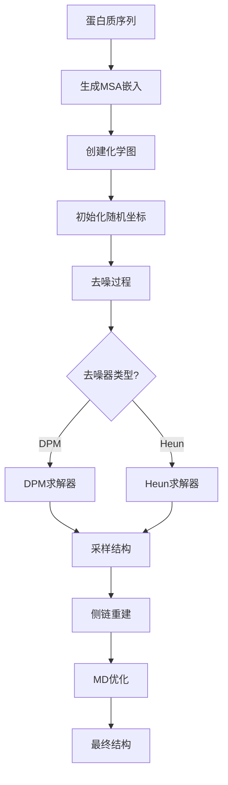

---
slug:9-structure-sampling-and-refinement
blog_type:normal
---


在蛋白质结构建模领域，从氨基酸序列生成准确的三维结构是一项复杂的挑战。BioEmu采用基于扩散模型的精密方法来解决这一问题，该方法逐步将随机噪声细化为逼真的蛋白质结构。本文将详细介绍使BioEmu成为生物分子结构建模强大工具的结构采样和优化过程。

## 理解采样过程

BioEmu中的结构采样是为给定蛋白质序列生成多个候选三维结构的过程。这就像艺术家从空白画布开始，逐步添加细节创作杰作——只不过这里的"艺术家"是一个精密的数学模型，能将随机噪声转化为物理上合理的蛋白质结构。

采样过程首先从蛋白质序列生成嵌入表示，这些嵌入包含进化和结构信息。这些嵌入作为指导结构生成过程的"上下文"。系统随后使用**去噪扩散概率模型(DDPM)**，通过迭代方式将随机三维坐标细化为有意义的蛋白质结构。

```python
# 主采样函数
def main(
    sequence: str | Path,
    num_samples: int,
    output_dir: str | Path,
    batch_size_100: int = 10,
    model_name: Literal["bioemu-v1.0", "bioemu-v1.1"] | None = "bioemu-v1.1",
    denoiser_type: SupportedDenoisersLiteral | None = "dpm",
    filter_samples: bool = True,
) -> None:
```
来源：[sample.py#L39-L53](src/bioemu/sample.py#L39-L53)

### 采样流程的关键组件

采样流程由多个协同工作的关键组件组成：

1. **序列处理**：输入的蛋白质序列经过处理，使用ColabFold生成嵌入表示，该过程从多序列比对(MSAs)中捕获进化信息。

2. **上下文创建**：这些嵌入被转换为化学图表示，作为结构生成的基础。

3. **去噪过程**：使用DPM(扩散概率模型)或Heun求解器，系统通过迭代方式将随机三维坐标细化为逼真的蛋白质结构。

4. **批处理**：为提高效率，多个样本以批处理方式生成，批大小根据序列长度自动调整。

```python
# 生成一批样本
def generate_batch(
    score_model: torch.nn.Module,
    sequence: str,
    sdes: dict[str, SDE],
    batch_size: int,
    seed: int,
    denoiser: Callable,
    cache_embeds_dir: str | Path | None,
    msa_file: str | Path | None = None,
    msa_host_url: str | None = None,
) -> dict[str, torch.Tensor]:
```
来源：[sample.py#L219-L229](src/bioemu/sample.py#L219-L229)

## 去噪过程

BioEmu采样过程的核心是去噪机制，它将随机噪声转化为结构化的蛋白质构象。该过程基于**随机微分方程(SDEs)**，描述如何逐步从生成的结构中去除噪声。

BioEmu提供两种主要的去噪算法：

### 1. DPM求解器(扩散概率模型)

DPM求解器是一种高效算法，使用二阶方法求解反向时间SDE。它特别适合BioEmu中使用的余弦噪声调度，在速度和质量之间提供了良好的平衡。

```python
def dpm_solver(
    sdes: dict[str, SDE],
    batch: Batch,
    N: int,
    score_model: torch.nn.Module,
    max_t: float,
    eps_t: float,
    device: torch.device,
    record_grad_steps: set[int] = set(),
    noise: float = 0.0,
) -> ChemGraph:
```
来源：[denoiser.py#L259-L269](src/bioemu/denoiser.py#L259-L269)

### 2. Heun求解器

Heun求解器是另一种可用于去噪的二阶方法。当需要对采样过程进行更多控制时，它特别有用，并能有效处理不同的噪声调度。

```python
def heun_denoiser(
    *,
    sdes: dict[str, SDE],
    N: int,
    eps_t: float,
    max_t: float,
    device: torch.device,
    batch: Batch,
    score_model: torch.nn.Module,
    noise: float,
) -> ChemGraph:
```
来源：[denoiser.py#L143-L153](src/bioemu/denoiser.py#L143-L153)

### 理解BioEmu中的SDE

随机微分方程(SDEs)构成了扩散过程的数学基础。BioEmu对位置使用**CosineVPSDE**(带余弦噪声调度的方差保持SDE)，对旋转使用专门的SDE(SO3SDE)。

```python
class CosineVPSDE(BaseVPSDE):
    """带余弦噪声调度的方差保持SDE"""
    
    def __init__(self, s: float = 0.008):
        self.s = s
        self.c = np.cos(s / (1 + s) * np.pi / 2)
    
    def beta(self, t) -> torch.Tensor:
        # 使用Song等人论文中的公式(29)从_marginal_mean_coeff推导
        return torch.tan((t + self.s) / (1 + s) * np.pi / 2) * np.pi / (1 + self.s)
```
来源：[sde_lib.py#L156-L166](src/bioemu/sde_lib.py#L156-L166)

余弦噪声调度提供了从噪声到结构的平滑过渡，有助于生成高质量的蛋白质构象。

## 结构优化过程

初始结构采样完成后，它们会经过优化过程以提高物理真实性并解决任何结构问题。该优化分为两个主要阶段：

### 1. 侧链重建

初始采样过程生成主链结构。侧链重建使用**HPacker**添加缺失的侧链原子，这是一个专门用于预测侧链构象的工具。

```python
def reconstruct_sidechains(traj: mdtraj.Trajectory) -> mdtraj.Trajectory:
    """使用hpacker从仅主链样本重建侧链(丢弃CB原子)
    
    参考 https://github.com/gvisani/hpacker
    
    参数:
        traj: 轨迹(多帧)
    
    返回:
        重建侧链后的轨迹
    """
```
来源：[sidechain_relax.py#L71-L81](src/bioemu/sidechain_relax.py#L71-L81)

### 2. 分子动力学优化

侧链重建后，结构经过分子动力学(MD)优化以解决空间位阻并提高整体结构质量。BioEmu提供两种MD协议：

#### 局部最小化
该协议仅执行局部能量最小化，速度快但只能解决原子碰撞等局部问题。

```python
class MDProtocol(str, Enum):
    LOCAL_MINIMIZATION = "local_minimization"
    MD_EQUIL = "md_equil"
```
来源：[sidechain_relax.py#L39-L42](src/bioemu/sidechain_relax.py#L39-L42)

#### MD平衡
这个更全面的协议包括能量最小化和约束MD平衡，可以解决更严重的结构问题。

```python
def run_one_md(
    frame: mdtraj.Trajectory,
    only_energy_minimization: bool = False,
    simtime_ns_nvt_equil: float = 0.1,
    simtime_ns_npt_equil: float = 0.4,
    simtime_ns: float = 0.0,
    outpath: str = ".",
    file_prefix: str = "",
) -> mdtraj.Trajectory:
```
来源：[sidechain_relax.py#L116-L124](src/bioemu/sidechain_relax.py#L116-L124)

## 实用示例

让我们通过一个实际示例来演示如何使用BioEmu的结构采样和优化功能：

```python
from bioemu.sample import main

# 为蛋白质序列生成10个样本
main(
    sequence="ACDEFGHIKLMNPQRSTVWY",  # 您的蛋白质序列
    num_samples=10,
    output_dir="./output_samples",
    model_name="bioemu-v1.1",
    denoiser_type="dpm",
    filter_samples=True
)
```

这将：
1. 使用ColabFold为序列生成嵌入表示
2. 创建化学图表示
3. 使用DPM求解器采样10个结构
4. 将样本转换为PDB和XTC格式
5. 过滤掉任何物理上不合理的样本

<CgxTip>
批大小根据序列长度自动调整以优化内存使用。对于较长序列，批大小会平方级减小以保持高效的GPU内存利用率。
</CgxTip>

## 理解输出

采样完成后，BioEmu会生成几个输出文件：

- **topology.pdb**：包含蛋白质拓扑信息
- **samples.xtc**：包含所有采样结构的轨迹
- **batch_*.npz**：包含原始采样坐标的中间文件
- **sequence.fasta**：用于采样的输入序列

优化过程还会生成：
- **samples_sidechain_rec.pdb/xtc**：重建侧链后的结构
- **samples_md_equil.pdb/xtc**：MD优化后的结构(如果启用)

## 性能考虑

使用结构采样和优化时，请牢记以下性能考虑因素：

1. **序列长度**：较长序列需要更多计算资源。批大小自动按`(100/序列长度)^2`缩放。

2. **GPU内存**：采样过程使用GPU加速。确保有足够的GPU内存处理您的序列。

3. **去噪器选择**：DPM通常更快，而Heun在某些情况下可能提供稍好的质量。

4. **优化**：侧链重建和MD优化可能耗时，特别是对于大量样本。



## 常见问题排查

使用结构采样和优化时，可能会遇到一些常见问题：

### 内存问题
如果遇到GPU内存问题，尝试减小`batch_size_100`参数或使用较短序列。

### 采样质量
如果采样结构看起来不真实，确保使用最新模型版本(`bioemu-v1.1`)，并考虑增加采样数量。

### 优化失败
某些结构可能因严重空间位阻而在MD优化过程中失败。这是正常现象——系统会跳过有问题的样本并继续处理其余样本。

## 结论

BioEmu中的结构采样和优化代表了蛋白质结构建模的强大方法。通过结合先进的扩散模型和精密的优化技术，BioEmu能够从氨基酸序列生成高质量的蛋白质结构。无论您是探索蛋白质折叠的研究人员，还是构建结构预测工具的开发人员，理解这一采样和优化流程对于充分发挥BioEmu的潜力都至关重要。

采样过程的模块化设计提供了灵活性和可定制性，而自动优化确保最终结构物理真实，适用于药物发现或蛋白质工程等下游应用。