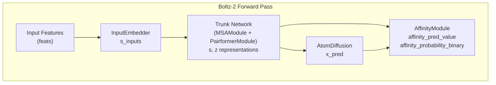
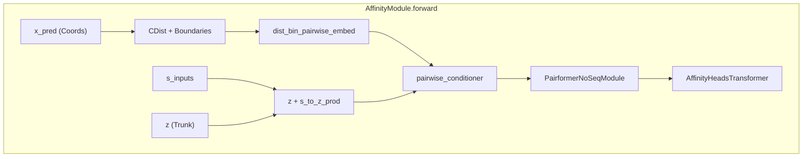

# Affinity Prediction

> **Relevant source files**
> * [docs/boltz2_title.png](https://github.com/jwohlwend/boltz/blob/b1ebfc46/docs/boltz2_title.png)
> * [docs/pearson_plot.png](https://github.com/jwohlwend/boltz/blob/b1ebfc46/docs/pearson_plot.png)
> * [docs/plot_test_boltz2.png](https://github.com/jwohlwend/boltz/blob/b1ebfc46/docs/plot_test_boltz2.png)
> * [examples/affinity.yaml](https://github.com/jwohlwend/boltz/blob/b1ebfc46/examples/affinity.yaml)
> * [src/boltz/model/layers/pairformer.py](https://github.com/jwohlwend/boltz/blob/b1ebfc46/src/boltz/model/layers/pairformer.py)
> * [src/boltz/model/models/boltz2.py](https://github.com/jwohlwend/boltz/blob/b1ebfc46/src/boltz/model/models/boltz2.py)
> * [src/boltz/model/modules/affinity.py](https://github.com/jwohlwend/boltz/blob/b1ebfc46/src/boltz/model/modules/affinity.py)
> * [src/boltz/model/modules/trunkv2.py](https://github.com/jwohlwend/boltz/blob/b1ebfc46/src/boltz/model/modules/trunkv2.py)
> * [src/boltz/model/modules/utils.py](https://github.com/jwohlwend/boltz/blob/b1ebfc46/src/boltz/model/modules/utils.py)

## Purpose and Scope

This document describes Boltz-2's affinity prediction capability, which jointly models complex structures and binding affinities for protein-ligand interactions. The affinity module predicts binding strength in two complementary ways: a regression task for ranking binders and a binary classification task for discriminating binders from non-binders. This functionality is exclusive to Boltz-2 and not available in Boltz-1.

**Sources:** [src/boltz/model/models/boltz2.py L60-L69](https://github.com/jwohlwend/boltz/blob/b1ebfc46/src/boltz/model/models/boltz2.py#L60-L69)

 [src/boltz/model/modules/affinity.py L34-L47](https://github.com/jwohlwend/boltz/blob/b1ebfc46/src/boltz/model/modules/affinity.py#L34-L47)

---

## Overview

Boltz-2's affinity prediction produces two distinct outputs trained on different datasets with different supervision signals:

| Output | Use Case | Value Range | Supervision |
| --- | --- | --- | --- |
| `affinity_probability_binary` | Hit discovery, binder vs. decoy discrimination | 0 to 1 (probability) | Binary classification |
| `affinity_pred_value` | Lead optimization, ranking active molecules | Real number (log10(IC50) in μM) | Regression on IC50 values |

The dual-output design reflects different stages of drug discovery: early-stage screening requires identifying any binders, while later optimization requires precise quantification of relative binding strength among known actives.

**Sources:** [src/boltz/model/modules/affinity.py L214-L220](https://github.com/jwohlwend/boltz/blob/b1ebfc46/src/boltz/model/modules/affinity.py#L214-L220)

 [src/boltz/model/models/boltz2.py L629-L686](https://github.com/jwohlwend/boltz/blob/b1ebfc46/src/boltz/model/models/boltz2.py#L629-L686)

---

## Architecture Integration

The affinity module operates as a downstream task in the Boltz-2 architecture, consuming representations from the trunk network and coordinates from the diffusion process.



**Diagram: Affinity Module in Boltz-2 Pipeline**

The affinity module is invoked during prediction and receives:

* **s_inputs**: Token-level sequence embeddings from `InputEmbedder` (re-computed with `affinity=True` [src/boltz/model/modules/trunkv2.py L174-L180](https://github.com/jwohlwend/boltz/blob/b1ebfc46/src/boltz/model/modules/trunkv2.py#L174-L180) ).
* **z**: Pair representation from the trunk.
* **x_pred**: Predicted coordinates from diffusion sampling [src/boltz/model/modules/affinity.py L81](https://github.com/jwohlwend/boltz/blob/b1ebfc46/src/boltz/model/modules/affinity.py#L81-L81)

**Sources:** [src/boltz/model/models/boltz2.py L608-L721](https://github.com/jwohlwend/boltz/blob/b1ebfc46/src/boltz/model/models/boltz2.py#L608-L721)

 [src/boltz/model/modules/affinity.py L77-L85](https://github.com/jwohlwend/boltz/blob/b1ebfc46/src/boltz/model/modules/affinity.py#L77-L85)

---

## The AffinityModule Implementation

The `AffinityModule` [src/boltz/model/modules/affinity.py L34](https://github.com/jwohlwend/boltz/blob/b1ebfc46/src/boltz/model/modules/affinity.py#L34-L34)

 performs several internal processing steps before passing data to prediction heads.

### Internal Data Flow



**Diagram: Internal AffinityModule Data Flow**

1. **Geometric Conditioning**: It calculates distances between representative atoms of tokens using `torch.cdist` [src/boltz/model/modules/affinity.py L105](https://github.com/jwohlwend/boltz/blob/b1ebfc46/src/boltz/model/modules/affinity.py#L105-L105)  These distances are binned and embedded via `dist_bin_pairwise_embed` [src/boltz/model/modules/affinity.py L51](https://github.com/jwohlwend/boltz/blob/b1ebfc46/src/boltz/model/modules/affinity.py#L51-L51)
2. **Representation Update**: The trunk pair representation `z` is updated with sequence information `s_inputs` via linear projections `s_to_z_prod_in1/2` [src/boltz/model/modules/affinity.py L91-L93](https://github.com/jwohlwend/boltz/blob/b1ebfc46/src/boltz/model/modules/affinity.py#L91-L93)
3. **Refinement**: A `PairformerNoSeqModule` [src/boltz/model/modules/affinity.py L66](https://github.com/jwohlwend/boltz/blob/b1ebfc46/src/boltz/model/modules/affinity.py#L66-L66)  refines the representation, restricted by a `cross_pair_mask` that focuses on the receptor-ligand interface [src/boltz/model/modules/affinity.py L121-L130](https://github.com/jwohlwend/boltz/blob/b1ebfc46/src/boltz/model/modules/affinity.py#L121-L130)

**Sources:** [src/boltz/model/modules/affinity.py L77-L140](https://github.com/jwohlwend/boltz/blob/b1ebfc46/src/boltz/model/modules/affinity.py#L77-L140)

---

## Dual Prediction Outputs

### Affinity Value (Regression)

The `affinity_pred_value` predicts binding affinity as `log10(IC50)` where IC50 is in micromolar (μM). This is computed by the `to_affinity_pred_value` MLP [src/boltz/model/modules/affinity.py L161-L167](https://github.com/jwohlwend/boltz/blob/b1ebfc46/src/boltz/model/modules/affinity.py#L161-L167)

### Binary Probability (Classification)

The `affinity_probability_binary` represents the probability that the ligand is a binder. This is derived from `affinity_logits_binary` [src/boltz/model/modules/affinity.py L176](https://github.com/jwohlwend/boltz/blob/b1ebfc46/src/boltz/model/modules/affinity.py#L176-L176)

 which is conditioned on the `affinity_pred_score` [src/boltz/model/modules/affinity.py L216-L218](https://github.com/jwohlwend/boltz/blob/b1ebfc46/src/boltz/model/modules/affinity.py#L216-L218)

**Sources:** [src/boltz/model/modules/affinity.py L142-L220](https://github.com/jwohlwend/boltz/blob/b1ebfc46/src/boltz/model/modules/affinity.py#L142-L220)

---

## Ensemble Architecture

Boltz-2 supports an optional two-model ensemble for affinity prediction, controlled by the `affinity_ensemble` flag [src/boltz/model/models/boltz2.py L69](https://github.com/jwohlwend/boltz/blob/b1ebfc46/src/boltz/model/models/boltz2.py#L69-L69)

```markdown
# Initialization in boltz2.pyif self.affinity_ensemble:    self.affinity_module1 = AffinityModule(...)    self.affinity_module2 = AffinityModule(...)
```

When enabled, outputs are averaged:

```
affinity_pred_value = (model1_value + model2_value) / 2affinity_probability_binary = (model1_prob + model2_prob) / 2
```

**Sources:** [src/boltz/model/models/boltz2.py L321-L349](https://github.com/jwohlwend/boltz/blob/b1ebfc46/src/boltz/model/models/boltz2.py#L321-L349)

 [src/boltz/model/models/boltz2.py L629-L686](https://github.com/jwohlwend/boltz/blob/b1ebfc46/src/boltz/model/models/boltz2.py#L629-L686)

---

## Molecular Weight Correction

When `affinity_mw_correction=True` [src/boltz/model/models/boltz2.py L70](https://github.com/jwohlwend/boltz/blob/b1ebfc46/src/boltz/model/models/boltz2.py#L70-L70)

 the predicted affinity value is adjusted using a linear correction based on the ligand's molecular weight:

```markdown
# Correction logic in boltz2.py:687-697model_coef = 1.03525938mw_coef = -0.59992683bias = 2.83288489mw = feats["affinity_mw"][0] ** 0.3 corrected_value = model_coef * affinity_pred_value + mw_coef * mw + bias
```

This accounts for the correlation between molecular size and binding affinity observations in experimental datasets.

**Sources:** [src/boltz/model/models/boltz2.py L687-L697](https://github.com/jwohlwend/boltz/blob/b1ebfc46/src/boltz/model/models/boltz2.py#L687-L697)

---

## Input Requirements and Constraints

Affinity prediction requires specific flags in the input schema:

1. **Binder Selection**: The YAML input must specify a `binder` property [examples/affinity.yaml L11](https://github.com/jwohlwend/boltz/blob/b1ebfc46/examples/affinity.yaml#L11-L11)
2. **Ligand Masking**: The model uses `affinity_token_mask` to identify the ligand tokens involved in the binding event [src/boltz/model/modules/affinity.py L116-L120](https://github.com/jwohlwend/boltz/blob/b1ebfc46/src/boltz/model/modules/affinity.py#L116-L120)
3. **Receptor Masking**: Receptor tokens are identified where `mol_type == 0` (protein) [src/boltz/model/modules/affinity.py L113](https://github.com/jwohlwend/boltz/blob/b1ebfc46/src/boltz/model/modules/affinity.py#L113-L113)

**Sources:** [examples/affinity.yaml L9-L11](https://github.com/jwohlwend/boltz/blob/b1ebfc46/examples/affinity.yaml#L9-L11)

 [src/boltz/model/modules/affinity.py L112-L125](https://github.com/jwohlwend/boltz/blob/b1ebfc46/src/boltz/model/modules/affinity.py#L112-L125)

---

## Output Format

Affinity predictions are included in the model's output dictionary during the prediction step.

| Field | Description |
| --- | --- |
| `affinity_pred_value` | Predicted log10(IC50) in μM |
| `affinity_probability_binary` | Probability of binding (0.0 to 1.0) |
| `affinity_pred_value1/2` | Individual model values (if ensembled) |
| `affinity_probability_binary1/2` | Individual model probabilities (if ensembled) |

**Sources:** [src/boltz/model/models/boltz2.py L1107-L1120](https://github.com/jwohlwend/boltz/blob/b1ebfc46/src/boltz/model/models/boltz2.py#L1107-L1120)