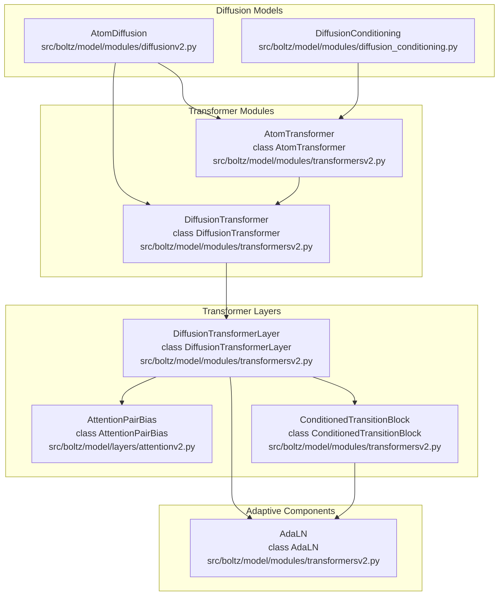
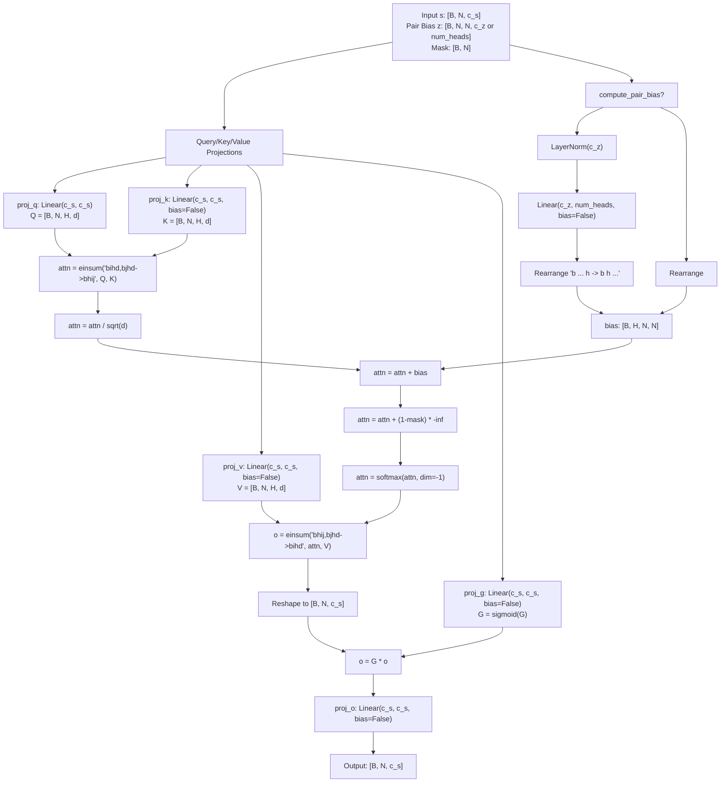
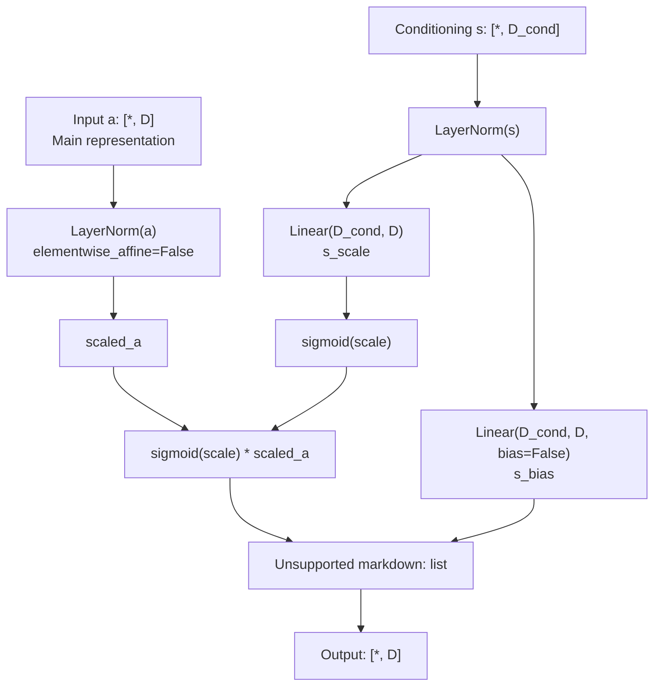
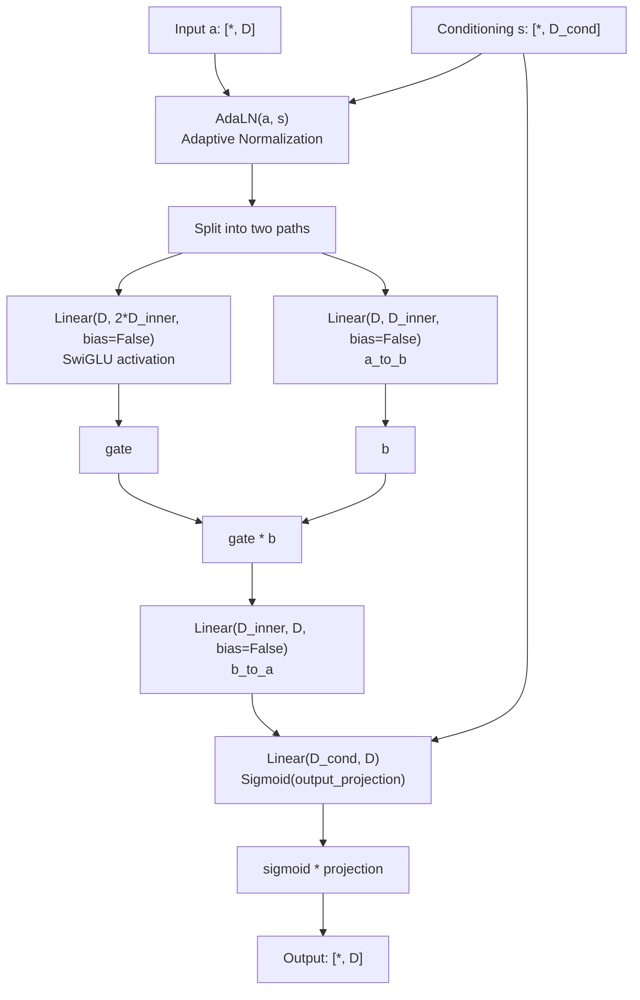
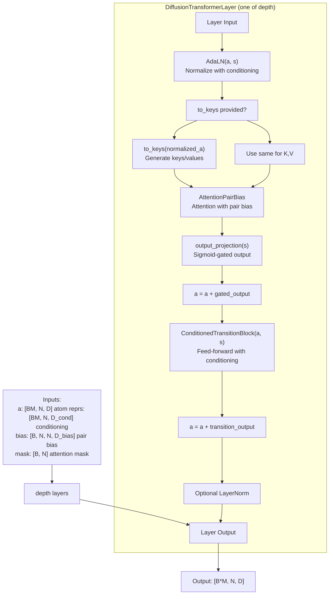
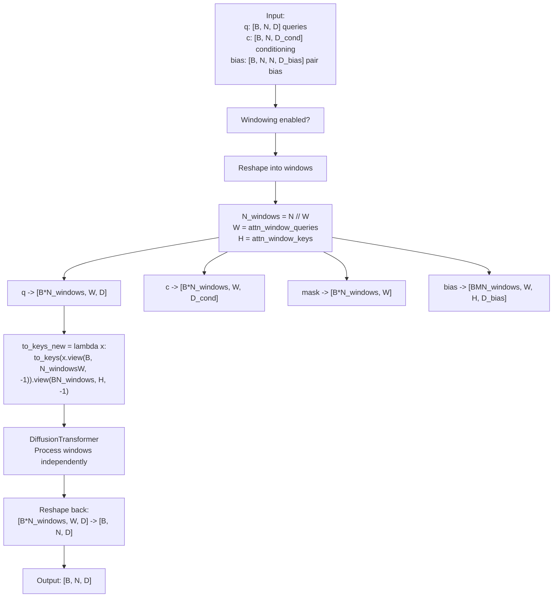

# Attention and Transformer Layers

> **Relevant source files**
> * [examples/prot_no_msa.yaml](https://github.com/jwohlwend/boltz/blob/b1ebfc46/examples/prot_no_msa.yaml)
> * [pyproject.toml](https://github.com/jwohlwend/boltz/blob/b1ebfc46/pyproject.toml)
> * [src/boltz/model/layers/attention.py](https://github.com/jwohlwend/boltz/blob/b1ebfc46/src/boltz/model/layers/attention.py)
> * [src/boltz/model/layers/attentionv2.py](https://github.com/jwohlwend/boltz/blob/b1ebfc46/src/boltz/model/layers/attentionv2.py)
> * [src/boltz/model/layers/outer_product_mean.py](https://github.com/jwohlwend/boltz/blob/b1ebfc46/src/boltz/model/layers/outer_product_mean.py)
> * [src/boltz/model/layers/pair_averaging.py](https://github.com/jwohlwend/boltz/blob/b1ebfc46/src/boltz/model/layers/pair_averaging.py)
> * [src/boltz/model/layers/pairformer.py](https://github.com/jwohlwend/boltz/blob/b1ebfc46/src/boltz/model/layers/pairformer.py)
> * [src/boltz/model/layers/transition.py](https://github.com/jwohlwend/boltz/blob/b1ebfc46/src/boltz/model/layers/transition.py)
> * [src/boltz/model/layers/triangular_attention/attention.py](https://github.com/jwohlwend/boltz/blob/b1ebfc46/src/boltz/model/layers/triangular_attention/attention.py)
> * [src/boltz/model/layers/triangular_attention/primitives.py](https://github.com/jwohlwend/boltz/blob/b1ebfc46/src/boltz/model/layers/triangular_attention/primitives.py)
> * [src/boltz/model/layers/triangular_mult.py](https://github.com/jwohlwend/boltz/blob/b1ebfc46/src/boltz/model/layers/triangular_mult.py)
> * [src/boltz/model/modules/affinity.py](https://github.com/jwohlwend/boltz/blob/b1ebfc46/src/boltz/model/modules/affinity.py)
> * [src/boltz/model/modules/transformers.py](https://github.com/jwohlwend/boltz/blob/b1ebfc46/src/boltz/model/modules/transformers.py)
> * [src/boltz/model/modules/transformersv2.py](https://github.com/jwohlwend/boltz/blob/b1ebfc46/src/boltz/model/modules/transformersv2.py)
> * [src/boltz/model/modules/trunkv2.py](https://github.com/jwohlwend/boltz/blob/b1ebfc46/src/boltz/model/modules/trunkv2.py)

This document covers the attention and transformer layers used in Boltz's structure generation and refinement tracks. These layers implement specialized mechanisms including multi-head attention with pair bias, adaptive normalization, and windowing strategies that enable efficient processing of molecular structures at the atom level.

For information about how these layers fit into the complete model architecture, see [Model Architecture (3)](https://github.com/jwohlwend/boltz/blob/b1ebfc46/Model Architecture (3))

 For details about the diffusion process that uses these layers, see [Diffusion Process (3.4)](https://github.com/jwohlwend/boltz/blob/b1ebfc46/Diffusion Process (3.4))

 For trunk layers like `MSAModule` and `PairformerModule`, see [Boltz-1 Model (3.1)](https://github.com/jwohlwend/boltz/blob/b1ebfc46/Boltz-1 Model (3.1))

 and [Boltz-2 Model (3.2)](https://github.com/jwohlwend/boltz/blob/b1ebfc46/Boltz-2 Model (3.2))

## Attention and Transformer Layer Hierarchy

Boltz uses specialized attention and transformer layers in its diffusion process. These layers are distinct from the trunk's triangular attention layers and are designed for iterative refinement of atomic coordinates and cross-track communication.

**Diffusion Transformer Stack Hierarchy**



Sources: [src/boltz/model/modules/transformersv2.py L17-L211](https://github.com/jwohlwend/boltz/blob/b1ebfc46/src/boltz/model/modules/transformersv2.py#L17-L211)

 [src/boltz/model/layers/attentionv2.py L10-L111](https://github.com/jwohlwend/boltz/blob/b1ebfc46/src/boltz/model/layers/attentionv2.py#L10-L111)

 [src/boltz/model/modules/transformers.py L17-L180](https://github.com/jwohlwend/boltz/blob/b1ebfc46/src/boltz/model/modules/transformers.py#L17-L180)

## AttentionPairBias

`AttentionPairBias` is the core attention mechanism used throughout Boltz's transformer layers. It implements multi-head attention with an additive bias derived from pairwise representations.

**AttentionPairBias Architecture**



### Key Features

| Feature | Implementation | Location |
| --- | --- | --- |
| **Multi-head Attention** | `c_s` divided into `num_heads` heads of dimension `head_dim = c_s // num_heads` | [src/boltz/model/layers/attentionv2.py L37-L41](https://github.com/jwohlwend/boltz/blob/b1ebfc46/src/boltz/model/layers/attentionv2.py#L37-L41) |
| **Pair Bias** | Optional projection from pairwise features `z` to per-head biases | [src/boltz/model/layers/attentionv2.py L50-L57](https://github.com/jwohlwend/boltz/blob/b1ebfc46/src/boltz/model/layers/attentionv2.py#L50-L57) |
| **Gating** | Sigmoid-gated output projection | [src/boltz/model/layers/attentionv2.py L97-L109](https://github.com/jwohlwend/boltz/blob/b1ebfc46/src/boltz/model/layers/attentionv2.py#L97-L109) |
| **Masking** | Additive mask with large negative value (`inf=1e6`) | [src/boltz/model/layers/attentionv2.py L42](https://github.com/jwohlwend/boltz/blob/b1ebfc46/src/boltz/model/layers/attentionv2.py#L42-L42) |
| **Precision** | Float32 for attention computation, even with bfloat16 inputs | [src/boltz/model/layers/attentionv2.py L99-L107](https://github.com/jwohlwend/boltz/blob/b1ebfc46/src/boltz/model/layers/attentionv2.py#L99-L107) |

### Variants

Boltz includes two versions of `AttentionPairBias`:

1. **Version 2** (`attentionv2.py`): Used in `DiffusionTransformer` and `AtomTransformer`. * Simpler interface with `k_in` parameter for key/value source [src/boltz/model/layers/attentionv2.py L91-L92](https://github.com/jwohlwend/boltz/blob/b1ebfc46/src/boltz/model/layers/attentionv2.py#L91-L92) * Optional `compute_pair_bias` flag to skip pair bias projection [src/boltz/model/layers/attentionv2.py L49](https://github.com/jwohlwend/boltz/blob/b1ebfc46/src/boltz/model/layers/attentionv2.py#L49-L49) * Used in: [src/boltz/model/modules/transformersv2.py L155-L157](https://github.com/jwohlwend/boltz/blob/b1ebfc46/src/boltz/model/modules/transformersv2.py#L155-L157)
2. **Version 1** (`attention.py`): Used in confidence and affinity modules. * Includes optional initial layer normalization [src/boltz/model/layers/attention.py L45-L46](https://github.com/jwohlwend/boltz/blob/b1ebfc46/src/boltz/model/layers/attention.py#L45-L46) * Supports caching of projected pair bias via `model_cache` [src/boltz/model/layers/attention.py L108-L112](https://github.com/jwohlwend/boltz/blob/b1ebfc46/src/boltz/model/layers/attention.py#L108-L112) * Supports `to_keys` function for cross-attention patterns [src/boltz/model/layers/attention.py L96-L98](https://github.com/jwohlwend/boltz/blob/b1ebfc46/src/boltz/model/layers/attention.py#L96-L98)

Sources: [src/boltz/model/layers/attentionv2.py L10-L111](https://github.com/jwohlwend/boltz/blob/b1ebfc46/src/boltz/model/layers/attentionv2.py#L10-L111)

 [src/boltz/model/layers/attention.py L8-L132](https://github.com/jwohlwend/boltz/blob/b1ebfc46/src/boltz/model/layers/attention.py#L8-L132)

## Adaptive Layer Normalization (AdaLN)

`AdaLN` implements adaptive layer normalization, where normalization parameters are conditioned on an auxiliary single representation. This is a key component of the diffusion transformer's conditioning mechanism.

**AdaLN Architecture (Algorithm 26)**



**Key Characteristics:**

* **Affine-Free Normalization**: The primary input `a` is normalized without learnable scale/bias parameters [src/boltz/model/modules/transformersv2.py L22](https://github.com/jwohlwend/boltz/blob/b1ebfc46/src/boltz/model/modules/transformersv2.py#L22-L22)
* **Conditioned Parameters**: Scale and bias are computed from the conditioning input `s` [src/boltz/model/modules/transformersv2.py L24-L25](https://github.com/jwohlwend/boltz/blob/b1ebfc46/src/boltz/model/modules/transformersv2.py#L24-L25)
* **Sigmoid Gating**: Scale is passed through sigmoid to ensure positive values [src/boltz/model/modules/transformersv2.py L30](https://github.com/jwohlwend/boltz/blob/b1ebfc46/src/boltz/model/modules/transformersv2.py#L30-L30)
* **Formula**: `output = sigmoid(s_scale(s)) * LayerNorm(a) + s_bias(s)` [src/boltz/model/modules/transformersv2.py L30](https://github.com/jwohlwend/boltz/blob/b1ebfc46/src/boltz/model/modules/transformersv2.py#L30-L30)

Sources: [src/boltz/model/modules/transformersv2.py L17-L31](https://github.com/jwohlwend/boltz/blob/b1ebfc46/src/boltz/model/modules/transformersv2.py#L17-L31)

 [src/boltz/model/modules/transformers.py L17-L41](https://github.com/jwohlwend/boltz/blob/b1ebfc46/src/boltz/model/modules/transformers.py#L17-L41)

## ConditionedTransitionBlock

`ConditionedTransitionBlock` implements a feed-forward network with conditioning via `AdaLN` and gated activations.

**ConditionedTransitionBlock Architecture (Algorithm 25)**



**Key Features:**

* **SwiGLU Activation**: Uses Swish-Gated Linear Units for non-linearity [src/boltz/model/modules/transformersv2.py L43-L46](https://github.com/jwohlwend/boltz/blob/b1ebfc46/src/boltz/model/modules/transformersv2.py#L43-L46)
* **Expansion Factor**: Default factor of 2 expands hidden dimension [src/boltz/model/modules/transformersv2.py L37](https://github.com/jwohlwend/boltz/blob/b1ebfc46/src/boltz/model/modules/transformersv2.py#L37-L37)
* **Output Gating**: Final output is gated by sigmoid-transformed conditioning [src/boltz/model/modules/transformersv2.py L54-L63](https://github.com/jwohlwend/boltz/blob/b1ebfc46/src/boltz/model/modules/transformersv2.py#L54-L63)
* **Zero Initialization**: Output projection initialized with weights=0, bias=-2.0 [src/boltz/model/modules/transformersv2.py L51-L52](https://github.com/jwohlwend/boltz/blob/b1ebfc46/src/boltz/model/modules/transformersv2.py#L51-L52)

Sources: [src/boltz/model/modules/transformersv2.py L34-L66](https://github.com/jwohlwend/boltz/blob/b1ebfc46/src/boltz/model/modules/transformersv2.py#L34-L66)

 [src/boltz/model/modules/transformers.py L44-L87](https://github.com/jwohlwend/boltz/blob/b1ebfc46/src/boltz/model/modules/transformers.py#L44-L87)

## DiffusionTransformer

`DiffusionTransformer` is a stack of transformer layers used in the diffusion score model. It processes atom representations with conditioning from single representations.

**DiffusionTransformer Architecture (Algorithm 23)**



### Configuration Options

| Parameter | Description | Typical Values |
| --- | --- | --- |
| `depth` | Number of transformer layers | [src/boltz/model/modules/transformersv2.py L73](https://github.com/jwohlwend/boltz/blob/b1ebfc46/src/boltz/model/modules/transformersv2.py#L73-L73) |
| `heads` | Number of attention heads | [src/boltz/model/modules/transformersv2.py L74](https://github.com/jwohlwend/boltz/blob/b1ebfc46/src/boltz/model/modules/transformersv2.py#L74-L74) |
| `dim` | Main representation dimension | 384 [src/boltz/model/modules/transformersv2.py L75](https://github.com/jwohlwend/boltz/blob/b1ebfc46/src/boltz/model/modules/transformersv2.py#L75-L75) |
| `pair_bias_attn` | Use pair bias in attention | True [src/boltz/model/modules/transformersv2.py L77](https://github.com/jwohlwend/boltz/blob/b1ebfc46/src/boltz/model/modules/transformersv2.py#L77-L77) |
| `activation_checkpointing` | Use gradient checkpointing | [src/boltz/model/modules/transformersv2.py L78](https://github.com/jwohlwend/boltz/blob/b1ebfc46/src/boltz/model/modules/transformersv2.py#L78-L78) |
| `post_layer_norm` | Apply LayerNorm after each layer | [src/boltz/model/modules/transformersv2.py L79](https://github.com/jwohlwend/boltz/blob/b1ebfc46/src/boltz/model/modules/transformersv2.py#L79-L79) |

### Pair Bias Handling

The version 2 transformer (`transformersv2.py`) splits a combined bias tensor across layers:

```markdown
# bias shape: [B, N, N, depth * num_heads]# Split into per-layer biases: [B, N, N, num_heads] for each layerB, N, M, D = bias.shapeL = len(self.layers)bias = bias.view(B, N, M, L, D // L)bias_l = bias[:, :, :, i]  # For layer i
```

Sources: [src/boltz/model/modules/transformersv2.py L106-L115](https://github.com/jwohlwend/boltz/blob/b1ebfc46/src/boltz/model/modules/transformersv2.py#L106-L115)

 [src/boltz/model/modules/transformersv2.py L140-L209](https://github.com/jwohlwend/boltz/blob/b1ebfc46/src/boltz/model/modules/transformersv2.py#L140-L209)

 [src/boltz/model/modules/transformers.py L90-L178](https://github.com/jwohlwend/boltz/blob/b1ebfc46/src/boltz/model/modules/transformers.py#L90-L178)

## AtomTransformer

`AtomTransformer` wraps `DiffusionTransformer` with windowed attention for efficient processing of large atom sets.

**AtomTransformer Windowing Strategy (Algorithm 7)**



### Window Parameters

| Parameter | Description | Typical Values |
| --- | --- | --- |
| `attn_window_queries` | Query window size (W) | [src/boltz/model/modules/transformersv2.py L221](https://github.com/jwohlwend/boltz/blob/b1ebfc46/src/boltz/model/modules/transformersv2.py#L221-L221) |
| `attn_window_keys` | Key/value window size (H) | [src/boltz/model/modules/transformersv2.py L222](https://github.com/jwohlwend/boltz/blob/b1ebfc46/src/boltz/model/modules/transformersv2.py#L222-L222) |

The `to_keys` function is modified within `AtomTransformer` to map query windows to their corresponding key/value context windows, maintaining consistency across the local attention scope [src/boltz/model/modules/transformersv2.py L252-L257](https://github.com/jwohlwend/boltz/blob/b1ebfc46/src/boltz/model/modules/transformersv2.py#L252-L257)

Sources: [src/boltz/model/modules/transformersv2.py L211-L262](https://github.com/jwohlwend/boltz/blob/b1ebfc46/src/boltz/model/modules/transformersv2.py#L211-L262)

 [src/boltz/model/modules/transformers.py L252-L323](https://github.com/jwohlwend/boltz/blob/b1ebfc46/src/boltz/model/modules/transformers.py#L252-L323)

## Trunk Transformer Layers

Boltz-1 and Boltz-2 utilize `PairformerLayer` within the main trunk to refine sequence and pairwise representations.

### PairformerLayer Components

`PairformerLayer` integrates multiple specialized layers to update the sequence track `s` and pairwise track `z` [src/boltz/model/layers/pairformer.py L21-L34](https://github.com/jwohlwend/boltz/blob/b1ebfc46/src/boltz/model/layers/pairformer.py#L21-L34)

:

1. **Triangle Multiplication**: `TriangleMultiplicationOutgoing` and `TriangleMultiplicationIncoming` update pairwise features based on triangular relationships [src/boltz/model/layers/pairformer.py L47-L48](https://github.com/jwohlwend/boltz/blob/b1ebfc46/src/boltz/model/layers/pairformer.py#L47-L48)
2. **Triangle Attention**: `TriangleAttentionStartingNode` and `TriangleAttentionEndingNode` apply attention along the rows and columns of the pair matrix [src/boltz/model/layers/pairformer.py L50-L55](https://github.com/jwohlwend/boltz/blob/b1ebfc46/src/boltz/model/layers/pairformer.py#L50-L55)
3. **AttentionPairBias**: Updates the sequence track using the pairwise track as a bias [src/boltz/model/layers/pairformer.py L43-L45](https://github.com/jwohlwend/boltz/blob/b1ebfc46/src/boltz/model/layers/pairformer.py#L43-L45)
4. **Transition**: Feed-forward blocks for both tracks [src/boltz/model/layers/pairformer.py L57-L58](https://github.com/jwohlwend/boltz/blob/b1ebfc46/src/boltz/model/layers/pairformer.py#L57-L58)

### OuterProductMean

The `OuterProductMean` layer bridges the sequence track back to the pairwise track by computing the mean of outer products of sequence features [src/boltz/model/layers/outer_product_mean.py L7-L10](https://github.com/jwohlwend/boltz/blob/b1ebfc46/src/boltz/model/layers/outer_product_mean.py#L7-L10)

* **Chunking**: Supports sequential computation in chunks to manage memory [src/boltz/model/layers/outer_product_mean.py L71-L88](https://github.com/jwohlwend/boltz/blob/b1ebfc46/src/boltz/model/layers/outer_product_mean.py#L71-L88)
* **Projection**: Projects input `m` to hidden dimension `c_hidden` before computing the outer product [src/boltz/model/layers/outer_product_mean.py L52-L54](https://github.com/jwohlwend/boltz/blob/b1ebfc46/src/boltz/model/layers/outer_product_mean.py#L52-L54)

Sources: [src/boltz/model/layers/pairformer.py L21-L114](https://github.com/jwohlwend/boltz/blob/b1ebfc46/src/boltz/model/layers/pairformer.py#L21-L114)

 [src/boltz/model/layers/outer_product_mean.py L7-L98](https://github.com/jwohlwend/boltz/blob/b1ebfc46/src/boltz/model/layers/outer_product_mean.py#L7-L98)

 [src/boltz/model/layers/triangular_mult.py L39-L212](https://github.com/jwohlwend/boltz/blob/b1ebfc46/src/boltz/model/layers/triangular_mult.py#L39-L212)

## Performance and Numerical Stability

### Precision Control

Critical attention computations are forced to float32 even when using mixed precision to prevent numerical instability in softmax operations [src/boltz/model/layers/attentionv2.py L99-L107](https://github.com/jwohlwend/boltz/blob/b1ebfc46/src/boltz/model/layers/attentionv2.py#L99-L107)

### Kernel Support

The `use_kernels` flag enables optimized implementations of triangular operations and attention when `cuequivariance_torch` is available [src/boltz/model/layers/triangular_mult.py L91-L105](https://github.com/jwohlwend/boltz/blob/b1ebfc46/src/boltz/model/layers/triangular_mult.py#L91-L105)

 [src/boltz/model/layers/triangular_attention/primitives.py L199-L202](https://github.com/jwohlwend/boltz/blob/b1ebfc46/src/boltz/model/layers/triangular_attention/primitives.py#L199-L202)

### Memory Optimization

* **Activation Checkpointing**: Supports gradient checkpointing to reduce memory usage during training [src/boltz/model/modules/transformersv2.py L117-L126](https://github.com/jwohlwend/boltz/blob/b1ebfc46/src/boltz/model/modules/transformersv2.py#L117-L126)
* **CPU Offloading**: `DiffusionTransformer` in Boltz-1 supports offloading checkpointed layers to CPU [src/boltz/model/modules/transformers.py L101](https://github.com/jwohlwend/boltz/blob/b1ebfc46/src/boltz/model/modules/transformers.py#L101-L101)

Sources: [src/boltz/model/layers/attentionv2.py L99-L107](https://github.com/jwohlwend/boltz/blob/b1ebfc46/src/boltz/model/layers/attentionv2.py#L99-L107)

 [src/boltz/model/layers/triangular_mult.py L8-L36](https://github.com/jwohlwend/boltz/blob/b1ebfc46/src/boltz/model/layers/triangular_mult.py#L8-L36)

 [src/boltz/model/modules/transformersv2.py L117-L126](https://github.com/jwohlwend/boltz/blob/b1ebfc46/src/boltz/model/modules/transformersv2.py#L117-L126)

 [src/boltz/model/modules/transformers.py L129-L140](https://github.com/jwohlwend/boltz/blob/b1ebfc46/src/boltz/model/modules/transformers.py#L129-L140)