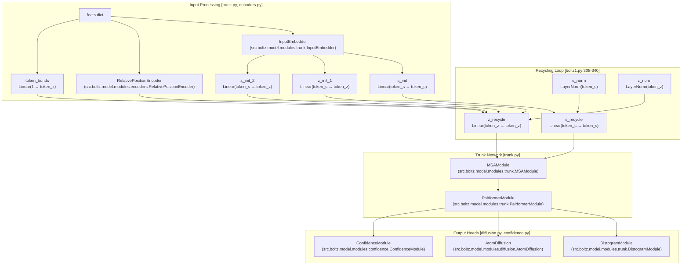
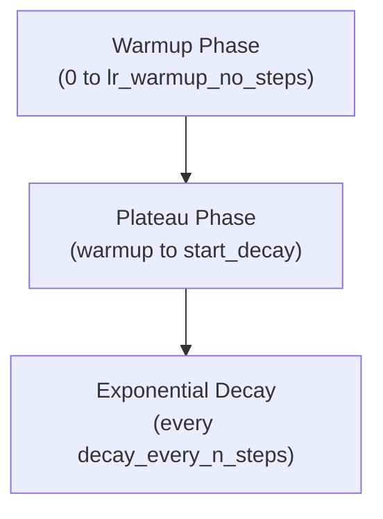

# Boltz-1 Model

> **Relevant source files**
> * [src/boltz/data/const.py](https://github.com/jwohlwend/boltz/blob/b1ebfc46/src/boltz/data/const.py)
> * [src/boltz/model/models/boltz1.py](https://github.com/jwohlwend/boltz/blob/b1ebfc46/src/boltz/model/models/boltz1.py)
> * [src/boltz/model/modules/confidence.py](https://github.com/jwohlwend/boltz/blob/b1ebfc46/src/boltz/model/modules/confidence.py)
> * [src/boltz/model/modules/confidencev2.py](https://github.com/jwohlwend/boltz/blob/b1ebfc46/src/boltz/model/modules/confidencev2.py)
> * [src/boltz/model/modules/encoders.py](https://github.com/jwohlwend/boltz/blob/b1ebfc46/src/boltz/model/modules/encoders.py)
> * [src/boltz/model/modules/trunk.py](https://github.com/jwohlwend/boltz/blob/b1ebfc46/src/boltz/model/modules/trunk.py)

This document provides detailed documentation of the Boltz-1 model architecture, the original structure prediction model in the Boltz system. Boltz-1 implements an end-to-end neural network for predicting biomolecular structures from sequence and optional MSA information.

The Boltz-1 model is implemented in the `Boltz1` class at [src/boltz/model/models/boltz1.py L40-L1292](https://github.com/jwohlwend/boltz/blob/b1ebfc46/src/boltz/model/models/boltz1.py#L40-L1292)

 For information about the enhanced Boltz-2 model with template support and affinity prediction, see page 3.2. For detailed information about the attention layers, see page 3.3. For the diffusion process used in structure generation, see page 3.4.

## Architecture Overview

Boltz-1 follows a three-stage architecture:

1. **Input Processing**: Embeddings and feature extraction from sequences, MSAs, and molecular features.
2. **Trunk Network**: MSA Module and Pairformer for processing sequence and pairwise representations.
3. **Output Heads**: Diffusion module for structure generation, distogram module, and optional confidence module.

The model processes molecular features through multiple recycling iterations, where the output from one iteration feeds back as input to the next, allowing the model to iteratively refine its predictions [src/boltz/model/models/boltz1.py L308-L340](https://github.com/jwohlwend/boltz/blob/b1ebfc46/src/boltz/model/models/boltz1.py#L308-L340)

## Boltz-1 Architecture Diagram

The following diagram maps the logical components to the specific classes and methods in the codebase.

Sources: [src/boltz/model/models/boltz1.py L154-L256](https://github.com/jwohlwend/boltz/blob/b1ebfc46/src/boltz/model/models/boltz1.py#L154-L256)

 [src/boltz/model/modules/trunk.py L24-L35](https://github.com/jwohlwend/boltz/blob/b1ebfc46/src/boltz/model/modules/trunk.py#L24-L35)

 [src/boltz/model/modules/encoders.py L45-L133](https://github.com/jwohlwend/boltz/blob/b1ebfc46/src/boltz/model/modules/encoders.py#L45-L133)

## Input Embedder

The `InputEmbedder` module converts raw molecular features into initial token-level embeddings. It processes various input features including residue identities, atom types, and molecular properties.

**Key Responsibilities:**

* Embed token-level features: `res_type`, `profile`, `deletion_mean`, and `pocket_feature` [src/boltz/model/modules/trunk.py L99-L102](https://github.com/jwohlwend/boltz/blob/b1ebfc46/src/boltz/model/modules/trunk.py#L99-L102)
* Encode atom-level information through an `AtomAttentionEncoder` [src/boltz/model/modules/trunk.py L71-L82](https://github.com/jwohlwend/boltz/blob/b1ebfc46/src/boltz/model/modules/trunk.py#L71-L82)

**Configuration Parameters:**

| Parameter | Purpose | Code Location |
| --- | --- | --- |
| `atom_s` | Atom single representation dimension | [src/boltz/model/modules/trunk.py L44-L45](https://github.com/jwohlwend/boltz/blob/b1ebfc46/src/boltz/model/modules/trunk.py#L44-L45) |
| `atom_z` | Atom pair representation dimension | [src/boltz/model/modules/trunk.py L46-L47](https://github.com/jwohlwend/boltz/blob/b1ebfc46/src/boltz/model/modules/trunk.py#L46-L47) |
| `token_s` | Token single representation dimension | [src/boltz/model/modules/trunk.py L48-L49](https://github.com/jwohlwend/boltz/blob/b1ebfc46/src/boltz/model/modules/trunk.py#L48-L49) |
| `token_z` | Token pair representation dimension | [src/boltz/model/modules/trunk.py L50-L51](https://github.com/jwohlwend/boltz/blob/b1ebfc46/src/boltz/model/modules/trunk.py#L50-L51) |
| `atom_feature_dim` | Dimension of atom feature embeddings | [src/boltz/model/modules/trunk.py L56-L57](https://github.com/jwohlwend/boltz/blob/b1ebfc46/src/boltz/model/modules/trunk.py#L56-L57) |

The embedder outputs a feature vector `s` which is a concatenation of the atom attention output, residue type, profile, deletion mean, and pocket features [src/boltz/model/modules/trunk.py L112](https://github.com/jwohlwend/boltz/blob/b1ebfc46/src/boltz/model/modules/trunk.py#L112-L112)

Sources: [src/boltz/model/modules/trunk.py L24-L113](https://github.com/jwohlwend/boltz/blob/b1ebfc46/src/boltz/model/modules/trunk.py#L24-L113)

## Trunk Network

The Trunk Network consists of the `MSAModule` and `PairformerModule`. It is responsible for iteratively updating the single (`s`) and pair (`z`) representations.

### MSA Module

The `MSAModule` processes Multiple Sequence Alignments. It projects sequence inputs and MSA features (tokens, deletions, and optional paired features) into the `msa_s` embedding space [src/boltz/model/modules/trunk.py L172-L177](https://github.com/jwohlwend/boltz/blob/b1ebfc46/src/boltz/model/modules/trunk.py#L172-L177)

 It consists of a stack of `MSALayer` blocks [src/boltz/model/modules/trunk.py L178-L204](https://github.com/jwohlwend/boltz/blob/b1ebfc46/src/boltz/model/modules/trunk.py#L178-L204)

### Pairformer Module

The `PairformerModule` implements the primary interaction logic between single and pair representations.

* **Pair Stack**: Updates the pair representation `z` using triangle multiplications and triangle attention [src/boltz/model/modules/trunk.py L643-L653](https://github.com/jwohlwend/boltz/blob/b1ebfc46/src/boltz/model/modules/trunk.py#L643-L653)
* **Single Stack**: Updates the single representation `s` using `AttentionPairBias` (which incorporates information from `z`) followed by a `Transition` layer [src/boltz/model/modules/trunk.py L660-L667](https://github.com/jwohlwend/boltz/blob/b1ebfc46/src/boltz/model/modules/trunk.py#L660-L667)

Sources: [src/boltz/model/modules/trunk.py L116-L205](https://github.com/jwohlwend/boltz/blob/b1ebfc46/src/boltz/model/modules/trunk.py#L116-L205)

 [src/boltz/model/modules/trunk.py L569-L674](https://github.com/jwohlwend/boltz/blob/b1ebfc46/src/boltz/model/modules/trunk.py#L569-L674)

## Diffusion and Output Heads

### Atom Diffusion

The `AtomDiffusion` module generates 3D coordinates. It uses a `DiffusionTransformer` to predict coordinates from the trunk representations [src/boltz/model/modules/diffusion.py L48-L60](https://github.com/jwohlwend/boltz/blob/b1ebfc46/src/boltz/model/modules/diffusion.py#L48-L60)

 The sampling process involves an iterative denoising loop [src/boltz/model/modules/diffusion.py L321-L449](https://github.com/jwohlwend/boltz/blob/b1ebfc46/src/boltz/model/modules/diffusion.py#L321-L449)

### Confidence Module

The `ConfidenceModule` predicts structure quality. It can operate in two modes:

1. **Imitate Trunk**: Re-runs a mini-trunk (MSA + Pairformer) specifically for confidence prediction [src/boltz/model/modules/confidence.py L107-L153](https://github.com/jwohlwend/boltz/blob/b1ebfc46/src/boltz/model/modules/confidence.py#L107-L153)
2. **Direct**: Uses trunk outputs and predicted coordinates to compute `ConfidenceHeads` [src/boltz/model/modules/confidence.py L155-L181](https://github.com/jwohlwend/boltz/blob/b1ebfc46/src/boltz/model/modules/confidence.py#L155-L181)

**Predicted Metrics**:

* **pLDDT**: Predicted Local Distance Difference Test.
* **PAE**: Predicted Aligned Error [src/boltz/model/modules/confidence.py L35](https://github.com/jwohlwend/boltz/blob/b1ebfc46/src/boltz/model/modules/confidence.py#L35-L35)
* **PTM/iPTM**: Predicted TM-score and interface TM-score [src/boltz/model/modules/confidence_utils.py L130-L155](https://github.com/jwohlwend/boltz/blob/b1ebfc46/src/boltz/model/modules/confidence_utils.py#L130-L155)

Sources: [src/boltz/model/modules/diffusion.py L25-L60](https://github.com/jwohlwend/boltz/blob/b1ebfc46/src/boltz/model/modules/diffusion.py#L25-L60)

 [src/boltz/model/modules/confidence.py L20-L181](https://github.com/jwohlwend/boltz/blob/b1ebfc46/src/boltz/model/modules/confidence.py#L20-L181)

## Optimizer and Learning Rate Schedule

Boltz-1 uses the Adam optimizer with a custom learning rate schedule.

**Optimizer Configuration:**
The optimizer is typically initialized with `AlphaFoldLRScheduler` logic in the `configure_optimizers` method of the `Boltz1` class [src/boltz/model/models/boltz1.py L1207-L1239](https://github.com/jwohlwend/boltz/blob/b1ebfc46/src/boltz/model/models/boltz1.py#L1207-L1239)

**Learning Rate Schedule**: The `AlphaFoldLRScheduler` implements a warmup + exponential decay schedule:

**Schedule Parameters [src/boltz/model/models/boltz1.py L833-L844](https://github.com/jwohlwend/boltz/blob/b1ebfc46/src/boltz/model/models/boltz1.py#L833-L844)

:**

| Parameter | Purpose |
| --- | --- |
| `base_lr` | Initial learning rate |
| `lr_warmup_no_steps` | Warmup duration |
| `lr_start_decay_after_n_steps` | When to start decay |
| `lr_decay_every_n_steps` | Decay frequency |
| `lr_decay_factor` | Decay multiplier |

Sources: [src/boltz/model/models/boltz1.py L1207-L1239](https://github.com/jwohlwend/boltz/blob/b1ebfc46/src/boltz/model/models/boltz1.py#L1207-L1239)

 [src/boltz/model/optim/scheduler.py L9-L75](https://github.com/jwohlwend/boltz/blob/b1ebfc46/src/boltz/model/optim/scheduler.py#L9-L75)

## Model Configuration

Boltz-1 supports extensive configuration through hyperparameters. Key configuration groups defined in `Boltz1.__init__` [src/boltz/model/models/boltz1.py L43-L80](https://github.com/jwohlwend/boltz/blob/b1ebfc46/src/boltz/model/models/boltz1.py#L43-L80)

:

* **Architectural Parameters**: `atom_s`, `atom_z`, `token_s`, `token_z`, `num_bins`.
* **Module-Specific Parameters**: `embedder_args`, `msa_args`, `pairformer_args`, `score_model_args`, `diffusion_process_args`, `confidence_model_args`.
* **Feature Flags**: `confidence_prediction`, `no_msa`, `no_atom_encoder`, `ema`.

Sources: [src/boltz/model/models/boltz1.py L43-L80](https://github.com/jwohlwend/boltz/blob/b1ebfc46/src/boltz/model/models/boltz1.py#L43-L80)

## Differences from Boltz-2

Boltz-1 serves as the foundation for Boltz-2, which introduces several enhancements:

| Feature | Boltz-1 | Boltz-2 |
| --- | --- | --- |
| Template Support | No | Yes (via `TemplateModule`) |
| Affinity Prediction | No | Yes (via `AffinityModule`) |
| Diffusion Conditioning | Computed inline | Pre-computed biases |
| Contact Guidance | No | Yes |
| Tokenization | `BoltzTokenizer` | `Boltz2Tokenizer` |

For detailed information about Boltz-2 enhancements, see page 3.2.

Sources: [src/boltz/model/models/boltz1.py](https://github.com/jwohlwend/boltz/blob/b1ebfc46/src/boltz/model/models/boltz1.py)

 [src/boltz/model/models/boltz2.py](https://github.com/jwohlwend/boltz/blob/b1ebfc46/src/boltz/model/models/boltz2.py)