# Boltz-1 vs Boltz-2

> **Relevant source files**
> * [README.md](https://github.com/jwohlwend/boltz/blob/b1ebfc46/README.md?plain=1)
> * [src/boltz/model/models/boltz1.py](https://github.com/jwohlwend/boltz/blob/b1ebfc46/src/boltz/model/models/boltz1.py)
> * [src/boltz/model/models/boltz2.py](https://github.com/jwohlwend/boltz/blob/b1ebfc46/src/boltz/model/models/boltz2.py)
> * [src/boltz/model/modules/utils.py](https://github.com/jwohlwend/boltz/blob/b1ebfc46/src/boltz/model/modules/utils.py)

## Purpose

This document compares the architectural and capability differences between the Boltz-1 and Boltz-2 models. Boltz-1 focuses exclusively on biomolecular structure prediction, while Boltz-2 extends this capability with binding affinity prediction, template integration, and enhanced conditioning mechanisms. Understanding these differences is essential for selecting the appropriate model for your use case and understanding the codebase organization.

For information about running predictions with either model, see [Command-Line Interface](https://github.com/jwohlwend/boltz/blob/b1ebfc46/Command-Line Interface)

(). For details about the prediction pipeline, see [Prediction Pipeline](https://github.com/jwohlwend/boltz/blob/b1ebfc46/Prediction Pipeline)

(). For training configurations, see [Training System](https://github.com/jwohlwend/boltz/blob/b1ebfc46/Training System)

().

---

## Model Selection and Downloads

The codebase supports both models through the `--model` flag in the CLI. The models are downloaded from different sources with separate checkpoints.

Title: Boltz Model Asset Flow

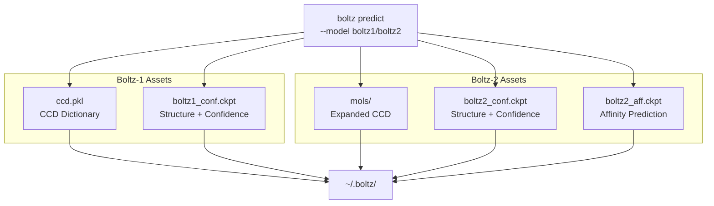

**Sources:** [src/boltz/main.py L36-L52](https://github.com/jwohlwend/boltz/blob/b1ebfc46/src/boltz/main.py#L36-L52)

 [src/boltz/main.py L161-L259](https://github.com/jwohlwend/boltz/blob/b1ebfc46/src/boltz/main.py#L161-L259)

 [src/boltz/main.py L974-L978](https://github.com/jwohlwend/boltz/blob/b1ebfc46/src/boltz/main.py#L974-L978)

### Download Functions

| Function | Model | Assets | Lines |
| --- | --- | --- | --- |
| `download_boltz1()` | Boltz-1 | `ccd.pkl`, `boltz1_conf.ckpt` | [src/boltz/main.py L161-L195](https://github.com/jwohlwend/boltz/blob/b1ebfc46/src/boltz/main.py#L161-L195) |
| `download_boltz2()` | Boltz-2 | `mols.tar`, `boltz2_conf.ckpt`, `boltz2_aff.ckpt` | [src/boltz/main.py L197-L259](https://github.com/jwohlwend/boltz/blob/b1ebfc46/src/boltz/main.py#L197-L259) |

**Sources:** [src/boltz/main.py L161-L259](https://github.com/jwohlwend/boltz/blob/b1ebfc46/src/boltz/main.py#L161-L259)

---

## Architecture Comparison

The two models share a common trunk architecture (MSA Module + Pairformer) but differ significantly in their input processing, conditioning, and output heads.

Title: Architectural Evolution from Boltz-1 to Boltz-2

```mermaid
flowchart TD

B2Input["Input Features +<br>Templates +<br>Method"]
B2Embed["InputEmbedder<br>enhanced features"]
B2Template["TemplateModule<br>structural priors"]
B2MSA["MSAModule<br>4 blocks<br>with templates"]
B2Pair["PairformerModule<br>64 blocks<br>16 heads"]
B2Disto["DistogramModule"]
B2Cond["DiffusionConditioning<br>method-specific"]
B2Diff["AtomDiffusion<br>conditioned sampling"]
B2Conf["ConfidenceModule<br>pLDDT, PAE, PDE"]
B2Aff["AffinityModule<br>IC50 + Binary"]
B1Input["Input Features"]
B1Embed["InputEmbedder<br>token_s, atom_s"]
B1MSA["MSAModule<br>4 blocks<br>no templates"]
B1Pair["PairformerModule<br>48 blocks<br>16 heads"]
B1Disto["DistogramModule"]
B1Diff["AtomDiffusion<br>σ_data=16<br>no conditioning"]
B1Conf["ConfidenceModule<br>pLDDT, PAE, PDE"]

subgraph subGraph1 ["Boltz-2 Architecture"]
    B2Input
    B2Embed
    B2Template
    B2MSA
    B2Pair
    B2Disto
    B2Cond
    B2Diff
    B2Conf
    B2Aff
    B2Input --> B2Embed
    B2Embed --> B2Template
    B2Template --> B2MSA
    B2MSA --> B2Pair
    B2Pair --> B2Disto
    B2Pair --> B2Cond
    B2Cond --> B2Diff
    B2Diff --> B2Conf
    B2Diff --> B2Aff
end

subgraph subGraph0 ["Boltz-1 Architecture"]
    B1Input
    B1Embed
    B1MSA
    B1Pair
    B1Disto
    B1Diff
    B1Conf
    B1Input --> B1Embed
    B1Embed --> B1MSA
    B1MSA --> B1Pair
    B1Pair --> B1Disto
    B1Pair --> B1Diff
    B1Diff --> B1Conf
end
```

**Sources:** [src/boltz/model/models/boltz1.py L40-L257](https://github.com/jwohlwend/boltz/blob/b1ebfc46/src/boltz/model/models/boltz1.py#L40-L257)

 [src/boltz/model/models/boltz2.py L40-L350](https://github.com/jwohlwend/boltz/blob/b1ebfc46/src/boltz/model/models/boltz2.py#L40-L350)

### Core Module Comparison

| Component | Boltz-1 | Boltz-2 |
| --- | --- | --- |
| **Model Class** | `Boltz1` [src/boltz/model/models/boltz1.py L40](https://github.com/jwohlwend/boltz/blob/b1ebfc46/src/boltz/model/models/boltz1.py#L40-L40) | `Boltz2` [src/boltz/model/models/boltz2.py L41](https://github.com/jwohlwend/boltz/blob/b1ebfc46/src/boltz/model/models/boltz2.py#L41-L41) |
| **Input Embedder** | `InputEmbedder` (basic) [src/boltz/model/modules/trunk.py L44](https://github.com/jwohlwend/boltz/blob/b1ebfc46/src/boltz/model/modules/trunk.py#L44-L44) | `InputEmbedder` (enhanced) [src/boltz/model/modules/trunkv2.py L44](https://github.com/jwohlwend/boltz/blob/b1ebfc46/src/boltz/model/modules/trunkv2.py#L44-L44) |
| **Template Module** | ❌ None | ✅ `TemplateModule` [src/boltz/model/modules/trunkv2.py L642](https://github.com/jwohlwend/boltz/blob/b1ebfc46/src/boltz/model/modules/trunkv2.py#L642-L642) |
| **MSA Module** | `MSAModule` (4 blocks) | `MSAModule` (4 blocks, template-aware) |
| **Pairformer Blocks** | 48 (default) [src/boltz/main.py L73](https://github.com/jwohlwend/boltz/blob/b1ebfc46/src/boltz/main.py#L73-L73) | 64 (default) [src/boltz/main.py L82](https://github.com/jwohlwend/boltz/blob/b1ebfc46/src/boltz/main.py#L82-L82) |
| **Pairformer Heads** | 16 | 16 |
| **Diffusion Conditioning** | ❌ None | ✅ `DiffusionConditioning` [src/boltz/model/modules/diffusion_conditioning.py L11](https://github.com/jwohlwend/boltz/blob/b1ebfc46/src/boltz/model/modules/diffusion_conditioning.py#L11-L11) |
| **Confidence Module** | `ConfidenceModule` [src/boltz/model/modules/confidence.py L34](https://github.com/jwohlwend/boltz/blob/b1ebfc46/src/boltz/model/modules/confidence.py#L34-L34) | `ConfidenceModule` (extended) [src/boltz/model/modules/confidencev2.py L44](https://github.com/jwohlwend/boltz/blob/b1ebfc46/src/boltz/model/modules/confidencev2.py#L44-L44) |
| **Affinity Module** | ❌ None | ✅ `AffinityModule` [src/boltz/model/modules/affinity.py L16](https://github.com/jwohlwend/boltz/blob/b1ebfc46/src/boltz/model/modules/affinity.py#L16-L16) |

**Sources:** [src/boltz/main.py L68-L89](https://github.com/jwohlwend/boltz/blob/b1ebfc46/src/boltz/main.py#L68-L89)

 [src/boltz/model/models/boltz1.py L188-L228](https://github.com/jwohlwend/boltz/blob/b1ebfc46/src/boltz/model/models/boltz1.py#L188-L228)

 [src/boltz/model/models/boltz2.py L217-L349](https://github.com/jwohlwend/boltz/blob/b1ebfc46/src/boltz/model/models/boltz2.py#L217-L349)

---

## Diffusion Process Parameters

The diffusion process has different hyperparameters tuned for each model version.

### Parameter Comparison Table

| Parameter | Boltz-1 Default | Boltz-2 Default | Purpose |
| --- | --- | --- | --- |
| `gamma_0` | 0.605 | 0.8 | Initial noise schedule parameter |
| `gamma_min` | 1.107 | 1.0 | Minimum noise schedule parameter |
| `noise_scale` | 0.901 | 1.003 | Noise scaling factor |
| `rho` | 8 | 7 | Sampling schedule exponent |
| `step_scale` | 1.638 | 1.5 | Diffusion step size (temperature) |
| `sigma_min` | 0.0004 | 0.0001 | Minimum noise level |
| `sigma_max` | 160.0 | 160.0 | Maximum noise level |
| `sigma_data` | 16.0 | 16.0 | Data distribution scale |

**Sources:** [src/boltz/main.py L109-L145](https://github.com/jwohlwend/boltz/blob/b1ebfc46/src/boltz/main.py#L109-L145)

### Diffusion Architecture Differences

Title: ScoreModel Conditioning in Boltz-1 vs Boltz-2

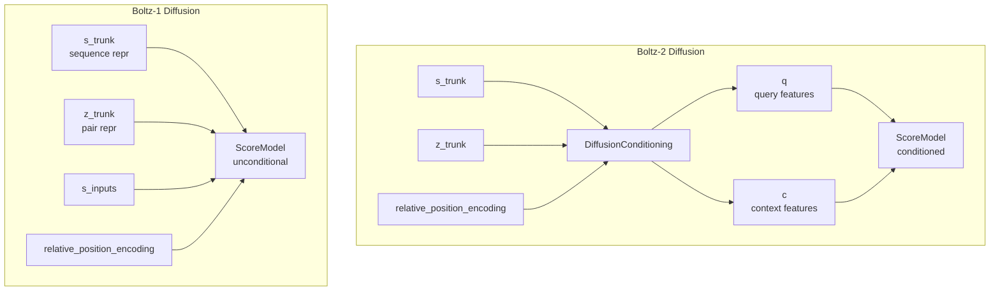

**Sources:** [src/boltz/model/models/boltz1.py L350-L377](https://github.com/jwohlwend/boltz/blob/b1ebfc46/src/boltz/model/models/boltz1.py#L350-L377)

 [src/boltz/model/models/boltz2.py L503-L543](https://github.com/jwohlwend/boltz/blob/b1ebfc46/src/boltz/model/models/boltz2.py#L503-L543)

---

## Template Support

Boltz-2 introduces template integration to leverage known structural information, a feature absent in Boltz-1.

Title: Boltz-2 Template Data Flow

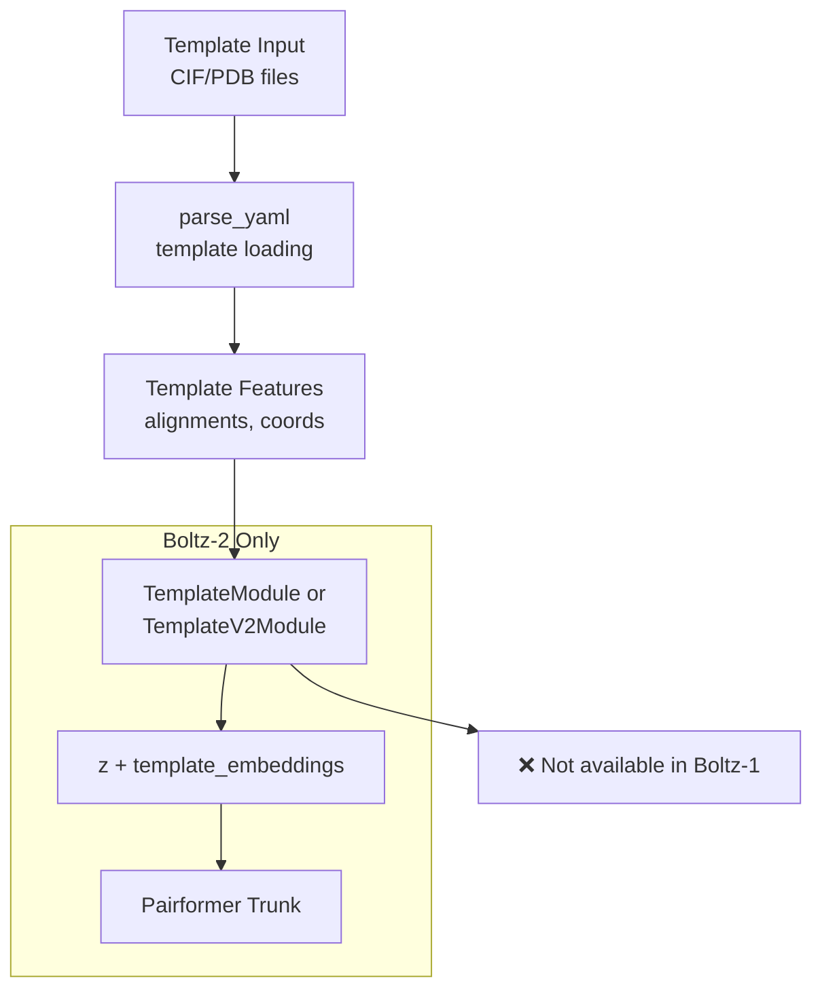

**Sources:** [src/boltz/model/models/boltz2.py L217-L228](https://github.com/jwohlwend/boltz/blob/b1ebfc46/src/boltz/model/models/boltz2.py#L217-L228)

 [src/boltz/model/models/boltz2.py L458-L466](https://github.com/jwohlwend/boltz/blob/b1ebfc46/src/boltz/model/models/boltz2.py#L458-L466)

### Template Configuration Options

| Option | Type | Purpose |
| --- | --- | --- |
| `use_templates` | `bool` | Enable `TemplateModule` [src/boltz/model/models/boltz2.py L101](https://github.com/jwohlwend/boltz/blob/b1ebfc46/src/boltz/model/models/boltz2.py#L101-L101) |
| `use_templates_v2` | `bool` | Use enhanced `TemplateV2Module` [src/boltz/model/models/boltz2.py L106](https://github.com/jwohlwend/boltz/blob/b1ebfc46/src/boltz/model/models/boltz2.py#L106-L106) |
| `compile_templates` | `bool` | Compile template module for speed [src/boltz/model/models/boltz2.py L102](https://github.com/jwohlwend/boltz/blob/b1ebfc46/src/boltz/model/models/boltz2.py#L102-L102) |
| `template_args` | `dict` | Template module hyperparameters [src/boltz/model/models/boltz2.py L66](https://github.com/jwohlwend/boltz/blob/b1ebfc46/src/boltz/model/models/boltz2.py#L66-L66) |

**Sources:** [src/boltz/model/models/boltz2.py L100-L106](https://github.com/jwohlwend/boltz/blob/b1ebfc46/src/boltz/model/models/boltz2.py#L100-L106)

 [src/boltz/model/models/boltz2.py L217-L228](https://github.com/jwohlwend/boltz/blob/b1ebfc46/src/boltz/model/models/boltz2.py#L217-L228)

---

## Affinity Prediction

Boltz-2's key enhancement is joint structure and affinity prediction, enabling in silico screening at 1000x the speed of physics-based methods [README.md L17](https://github.com/jwohlwend/boltz/blob/b1ebfc46/README.md?plain=1#L17-L17)

Title: AffinityModule and Multi-task Prediction

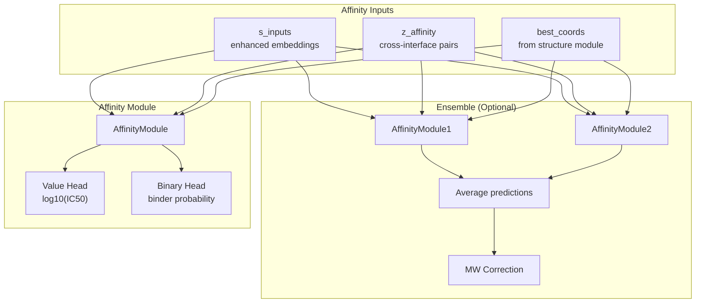

**Sources:** [src/boltz/model/models/boltz2.py L321-L349](https://github.com/jwohlwend/boltz/blob/b1ebfc46/src/boltz/model/models/boltz2.py#L321-L349)

 [src/boltz/model/models/boltz2.py L608-L720](https://github.com/jwohlwend/boltz/blob/b1ebfc46/src/boltz/model/models/boltz2.py#L608-L720)

### Affinity Outputs

| Output | Range | Training Data | Use Case |
| --- | --- | --- | --- |
| `affinity_pred_value` | log₁₀(IC50 in μM) | IC50 measurements | Lead optimization, measuring relative binding strength |
| `affinity_probability_binary` | 0.0 - 1.0 | Binary binder/non-binder labels | Hit discovery, distinguishing binders from decoys |

The value head is trained with molecular weight correction in `Boltz2.forward` [src/boltz/model/models/boltz2.py L687-L697](https://github.com/jwohlwend/boltz/blob/b1ebfc46/src/boltz/model/models/boltz2.py#L687-L697)

:

```markdown
# Boltz-2 MW correctionmodel_coef = 1.03525938mw_coef = -0.59992683bias = 2.83288489mw = affinity_mw ** 0.3affinity_pred_value = model_coef * raw_prediction + mw_coef * mw + bias
```

**Sources:** [src/boltz/model/models/boltz2.py L608-L720](https://github.com/jwohlwend/boltz/blob/b1ebfc46/src/boltz/model/models/boltz2.py#L608-L720)

 [README.md L51-L52](https://github.com/jwohlwend/boltz/blob/b1ebfc46/README.md?plain=1#L51-L52)

---

## Training and Inference Differences

### Model Initialization Parameters

Title: Boltz1 vs Boltz2 Initialization

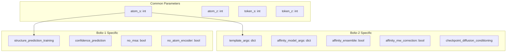

**Sources:** [src/boltz/model/models/boltz1.py L43-L80](https://github.com/jwohlwend/boltz/blob/b1ebfc46/src/boltz/model/models/boltz1.py#L43-L80)

 [src/boltz/model/models/boltz2.py L43-L107](https://github.com/jwohlwend/boltz/blob/b1ebfc46/src/boltz/model/models/boltz2.py#L43-L107)

### Inference Sampling Steps

| Model | Default Sampling Steps | Default Samples | Configurable |
| --- | --- | --- | --- |
| Boltz-1 | 200 | 1 | ✅ `--sampling_steps`, `--diffusion_samples` |
| Boltz-2 | 200 (structure)200 (affinity) | 5 (structure)5 (affinity) | ✅ `--sampling_steps`, `--diffusion_samples`✅ `--sampling_steps_affinity`, `--diffusion_samples_affinity` |

**Sources:** [src/boltz/main.py L858-L1007](https://github.com/jwohlwend/boltz/blob/b1ebfc46/src/boltz/main.py#L858-L1007)

---

## Forward Pass Comparison

### Boltz-1 Forward Pass

Title: Boltz1.forward Execution Flow

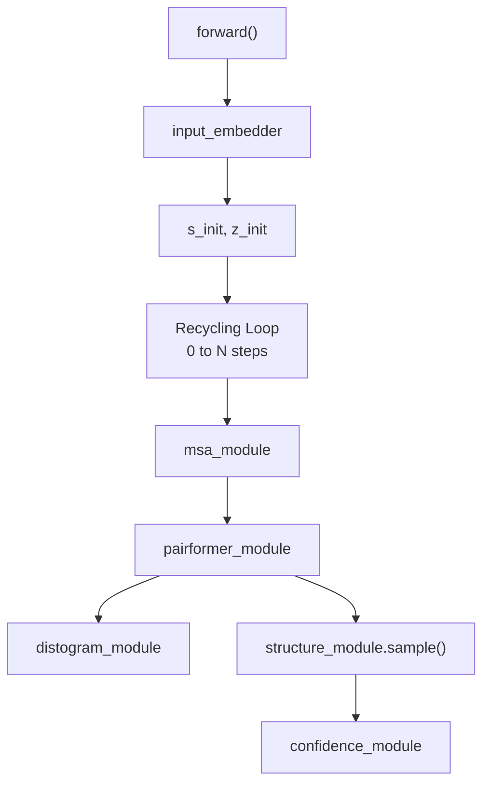

**Sources:** [src/boltz/model/models/boltz1.py L272-L400](https://github.com/jwohlwend/boltz/blob/b1ebfc46/src/boltz/model/models/boltz1.py#L272-L400)

### Boltz-2 Forward Pass

Title: Boltz2.forward Execution Flow

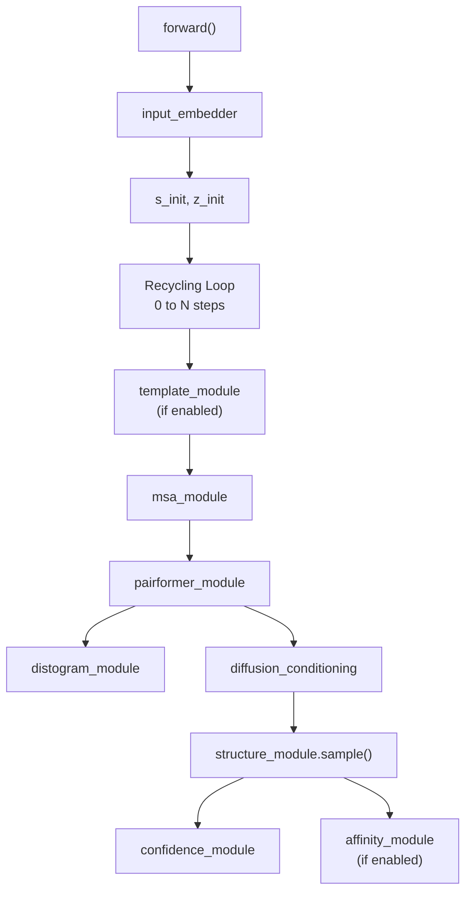

**Sources:** [src/boltz/model/models/boltz2.py L401-L722](https://github.com/jwohlwend/boltz/blob/b1ebfc46/src/boltz/model/models/boltz2.py#L401-L722)

---

## File Organization

Title: Code Entity Mapping

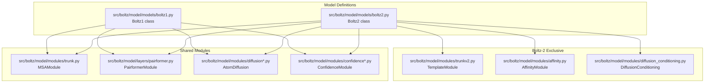

**Sources:** [src/boltz/model/models/boltz1.py L1-L1292](https://github.com/jwohlwend/boltz/blob/b1ebfc46/src/boltz/model/models/boltz1.py#L1-L1292)

 [src/boltz/model/models/boltz2.py L1-L1256](https://github.com/jwohlwend/boltz/blob/b1ebfc46/src/boltz/model/models/boltz2.py#L1-L1256)

---

## Configuration and Hyperparameters

### Command-Line Interface

```markdown
# Boltz-1 predictionboltz predict input.yaml --model boltz1 --use_msa_server # Boltz-2 structure predictionboltz predict input.yaml --model boltz2 --use_msa_server # Boltz-2 with affinity predictionboltz predict input.yaml --model boltz2 --use_msa_server \    --sampling_steps_affinity 200 \    --diffusion_samples_affinity 5 \    --affinity_mw_correction
```

**Sources:** [src/boltz/main.py L974-L1009](https://github.com/jwohlwend/boltz/blob/b1ebfc46/src/boltz/main.py#L974-L1009)

 [README.md L42-L52](https://github.com/jwohlwend/boltz/blob/b1ebfc46/README.md?plain=1#L42-L52)

---

## Prediction Output Comparison

### Boltz-1 Outputs

Title: Boltz1 predict_step Return Structure

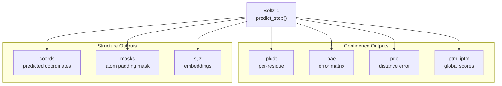

**Sources:** [src/boltz/model/models/boltz1.py L1153-L1196](https://github.com/jwohlwend/boltz/blob/b1ebfc46/src/boltz/model/models/boltz1.py#L1153-L1196)

### Boltz-2 Outputs

Title: Boltz2 predict_step Return Structure

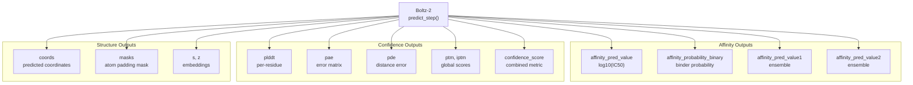

**Sources:** [src/boltz/model/models/boltz2.py L1057-L1121](https://github.com/jwohlwend/boltz/blob/b1ebfc46/src/boltz/model/models/boltz2.py#L1057-L1121)

---

## Loss Functions and Training

### Boltz-1 Loss Components

```markdown
# src/boltz/model/models/boltz1.py:516-520loss = (    confidence_loss_weight * confidence_loss    + diffusion_loss_weight * diffusion_loss    + distogram_loss_weight * distogram_loss)
```

**Sources:** [src/boltz/model/models/boltz1.py L458-L540](https://github.com/jwohlwend/boltz/blob/b1ebfc46/src/boltz/model/models/boltz1.py#L458-L540)

### Boltz-2 Loss Components

```markdown
# src/boltz/model/models/boltz2.py:898-903loss = (    confidence_loss_weight * confidence_loss    + diffusion_loss_weight * diffusion_loss    + distogram_loss_weight * distogram_loss    + bfactor_loss_weight * bfactor_loss  # Optional)
```

**Sources:** [src/boltz/model/models/boltz2.py L793-L929](https://github.com/jwohlwend/boltz/blob/b1ebfc46/src/boltz/model/models/boltz2.py#L793-L929)

---

## Use Case Guidelines

### When to Use Boltz-1

* **Pure structure prediction** without need for binding affinity [README.md L17](https://github.com/jwohlwend/boltz/blob/b1ebfc46/README.md?plain=1#L17-L17)
* **Lower computational requirements** (48 blocks vs 64) [src/boltz/main.py L73-L82](https://github.com/jwohlwend/boltz/blob/b1ebfc46/src/boltz/main.py#L73-L82)
* **Baseline comparisons** with the original model.
* **No template information** available or needed.

### When to Use Boltz-2

* **Binding affinity prediction** for drug discovery workflows [README.md L17-L18](https://github.com/jwohlwend/boltz/blob/b1ebfc46/README.md?plain=1#L17-L18)
* **Template-guided modeling** when structural priors are available [src/boltz/model/models/boltz2.py L101](https://github.com/jwohlwend/boltz/blob/b1ebfc46/src/boltz/model/models/boltz2.py#L101-L101)
* **Hit discovery** using binary binder classification [README.md L52](https://github.com/jwohlwend/boltz/blob/b1ebfc46/README.md?plain=1#L52-L52)
* **Lead optimization** using IC50 value prediction [README.md L52](https://github.com/jwohlwend/boltz/blob/b1ebfc46/README.md?plain=1#L52-L52)
* **Multi-task learning** scenarios including B-factor prediction [src/boltz/model/models/boltz2.py L103](https://github.com/jwohlwend/boltz/blob/b1ebfc46/src/boltz/model/models/boltz2.py#L103-L103)

**Sources:** [README.md L17-L52](https://github.com/jwohlwend/boltz/blob/b1ebfc46/README.md?plain=1#L17-L52)

 [src/boltz/model/models/boltz2.py L41-L107](https://github.com/jwohlwend/boltz/blob/b1ebfc46/src/boltz/model/models/boltz2.py#L41-L107)