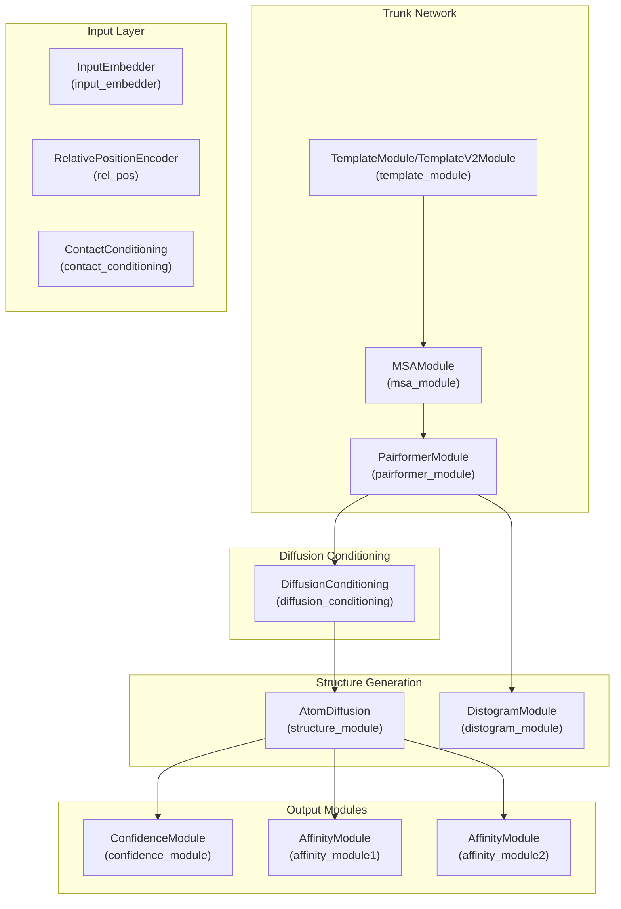
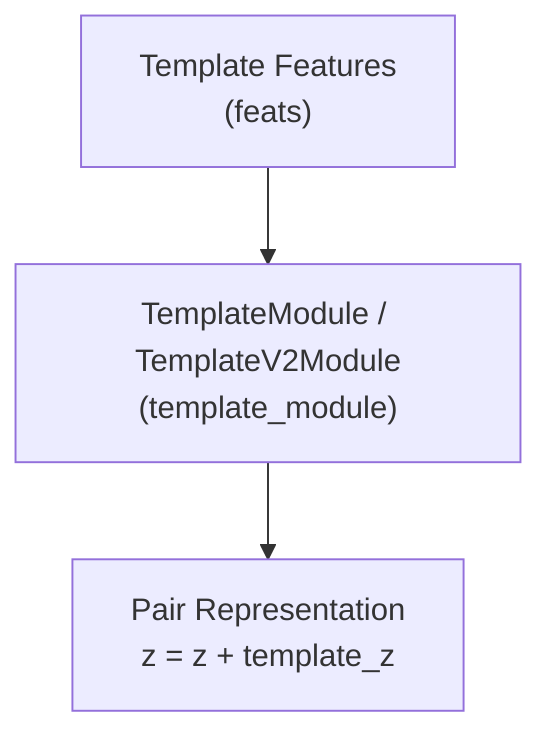
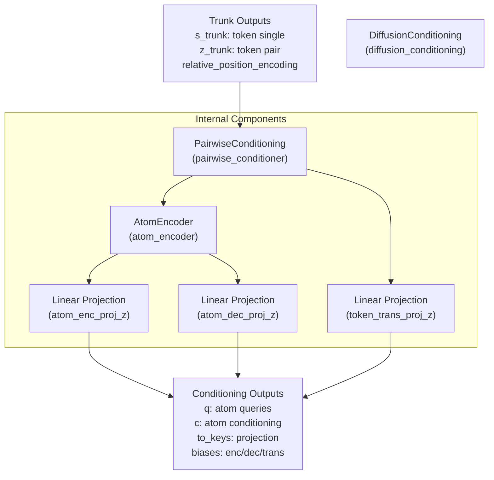
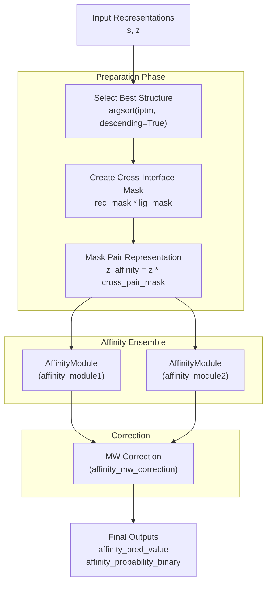

# Boltz-2 Model

> **Relevant source files**
> * [src/boltz/model/models/boltz2.py](https://github.com/jwohlwend/boltz/blob/b1ebfc46/src/boltz/model/models/boltz2.py)
> * [src/boltz/model/modules/diffusion_conditioning.py](https://github.com/jwohlwend/boltz/blob/b1ebfc46/src/boltz/model/modules/diffusion_conditioning.py)
> * [src/boltz/model/modules/encodersv2.py](https://github.com/jwohlwend/boltz/blob/b1ebfc46/src/boltz/model/modules/encodersv2.py)
> * [src/boltz/model/modules/utils.py](https://github.com/jwohlwend/boltz/blob/b1ebfc46/src/boltz/model/modules/utils.py)

## Purpose and Scope

This page documents the Boltz-2 model architecture, focusing on the enhancements and extensions beyond Boltz-1 that enable joint prediction of biomolecular structures and binding affinities. Boltz-2 introduces template integration, diffusion conditioning, and multi-task learning capabilities that allow it to predict both structure quality (via confidence metrics) and binding affinity (via IC50 prediction).

For detailed information on the base architecture components shared with Boltz-1 (MSA Module, Pairformer), see [Boltz-1 Model](https://github.com/jwohlwend/boltz/blob/b1ebfc46/Boltz-1 Model)

 For specific module implementations, see [Diffusion Process](https://github.com/jwohlwend/boltz/blob/b1ebfc46/Diffusion Process)

 [Confidence Prediction](https://github.com/jwohlwend/boltz/blob/b1ebfc46/Confidence Prediction)

 and [Affinity Prediction](https://github.com/jwohlwend/boltz/blob/b1ebfc46/Affinity Prediction)

## Architecture Overview

The `Boltz2` class [src/boltz/model/models/boltz2.py L41-L42](https://github.com/jwohlwend/boltz/blob/b1ebfc46/src/boltz/model/models/boltz2.py#L41-L42)

 is a PyTorch Lightning module that extends the base structure prediction model with three major enhancements:

1. **Template Module**: Integrates known structural information from templates.
2. **Diffusion Conditioning**: Provides method-specific conditioning for the diffusion process.
3. **Affinity Module**: Predicts binding affinity as log10(IC50) and binary binder probability.

### Boltz-2 Architecture Components



**Sources:** [src/boltz/model/models/boltz2.py L41-L400](https://github.com/jwohlwend/boltz/blob/b1ebfc46/src/boltz/model/models/boltz2.py#L41-L400)

### Key Architectural Parameters

| Component | Parameter | Default Value | Description |
| --- | --- | --- | --- |
| Token Representations | `token_s` | Variable | Single representation dimension [src/boltz/model/models/boltz2.py L48](https://github.com/jwohlwend/boltz/blob/b1ebfc46/src/boltz/model/models/boltz2.py#L48-L48) |
| Token Representations | `token_z` | Variable | Pair representation dimension [src/boltz/model/models/boltz2.py L49](https://github.com/jwohlwend/boltz/blob/b1ebfc46/src/boltz/model/models/boltz2.py#L49-L49) |
| Atom Representations | `atom_s` | Variable | Atom single dimension [src/boltz/model/models/boltz2.py L46](https://github.com/jwohlwend/boltz/blob/b1ebfc46/src/boltz/model/models/boltz2.py#L46-L46) |
| Atom Representations | `atom_z` | Variable | Atom pair dimension [src/boltz/model/models/boltz2.py L47](https://github.com/jwohlwend/boltz/blob/b1ebfc46/src/boltz/model/models/boltz2.py#L47-L47) |
| Template Module | `use_templates` | `False` | Enable template integration [src/boltz/model/models/boltz2.py L101](https://github.com/jwohlwend/boltz/blob/b1ebfc46/src/boltz/model/models/boltz2.py#L101-L101) |
| Template Module | `use_templates_v2` | `False` | Use V2 template module [src/boltz/model/models/boltz2.py L106](https://github.com/jwohlwend/boltz/blob/b1ebfc46/src/boltz/model/models/boltz2.py#L106-L106) |
| Affinity Module | `affinity_prediction` | `False` | Enable affinity prediction [src/boltz/model/models/boltz2.py L68](https://github.com/jwohlwend/boltz/blob/b1ebfc46/src/boltz/model/models/boltz2.py#L68-L68) |
| Affinity Module | `affinity_ensemble` | `False` | Use two-model ensemble [src/boltz/model/models/boltz2.py L69](https://github.com/jwohlwend/boltz/blob/b1ebfc46/src/boltz/model/models/boltz2.py#L69-L69) |
| Confidence Module | `confidence_prediction` | `True` | Enable confidence prediction [src/boltz/model/models/boltz2.py L67](https://github.com/jwohlwend/boltz/blob/b1ebfc46/src/boltz/model/models/boltz2.py#L67-L67) |

**Sources:** [src/boltz/model/models/boltz2.py L44-L108](https://github.com/jwohlwend/boltz/blob/b1ebfc46/src/boltz/model/models/boltz2.py#L44-L108)

## Template Integration

Boltz-2 introduces template support through the `TemplateModule` or `TemplateV2Module`, allowing the model to leverage known structural information. Templates are integrated early in the trunk network, before the MSA module.

### Template Module Implementation



The template module is instantiated based on configuration flags [src/boltz/model/models/boltz2.py L216-L228](https://github.com/jwohlwend/boltz/blob/b1ebfc46/src/boltz/model/models/boltz2.py#L216-L228)

:

```
self.use_templates = use_templatesif use_templates:    if use_templates_v2:        self.template_module = TemplateV2Module(token_z, **template_args)    else:        self.template_module = TemplateModule(token_z, **template_args)
```

During the forward pass, templates are applied before MSA processing [src/boltz/model/models/boltz2.py L458-L466](https://github.com/jwohlwend/boltz/blob/b1ebfc46/src/boltz/model/models/boltz2.py#L458-L466)

:

```
if self.use_templates:    z = z + template_module(        z, feats, pair_mask, use_kernels=self.use_kernels    )
```

**Sources:** [src/boltz/model/models/boltz2.py L216-L228](https://github.com/jwohlwend/boltz/blob/b1ebfc46/src/boltz/model/models/boltz2.py#L216-L228)

 [src/boltz/model/models/boltz2.py L458-L466](https://github.com/jwohlwend/boltz/blob/b1ebfc46/src/boltz/model/models/boltz2.py#L458-L466)

## Diffusion Conditioning

The `DiffusionConditioning` module [src/boltz/model/modules/diffusion_conditioning.py L13](https://github.com/jwohlwend/boltz/blob/b1ebfc46/src/boltz/model/modules/diffusion_conditioning.py#L13-L13)

 processes trunk outputs (`s` and `z`) into specialized representations for the diffusion process. This allows for method-specific conditioning and better separation of concerns between structure encoding and coordinate generation.

### Diffusion Conditioning Architecture



The `DiffusionConditioning` module creates specialized representations used by the `AtomDiffusion` module [src/boltz/model/modules/diffusion_conditioning.py L116](https://github.com/jwohlwend/boltz/blob/b1ebfc46/src/boltz/model/modules/diffusion_conditioning.py#L116-L116)

:

| Output | Description | Usage |
| --- | --- | --- |
| `q` | Atom-level queries | Used by diffusion score model |
| `c` | Atom-level conditioning | Guides the denoising process |
| `to_keys` | Key projection parameters | For attention mechanisms |
| `atom_enc_bias` | Encoder attention biases | Atom encoder biases |
| `atom_dec_bias` | Decoder attention biases | Atom decoder biases |
| `token_trans_bias` | Token transformer biases | Token-level biases |

**Sources:** [src/boltz/model/modules/diffusion_conditioning.py L13-L116](https://github.com/jwohlwend/boltz/blob/b1ebfc46/src/boltz/model/modules/diffusion_conditioning.py#L13-L116)

 [src/boltz/model/models/boltz2.py L252-L272](https://github.com/jwohlwend/boltz/blob/b1ebfc46/src/boltz/model/models/boltz2.py#L252-L272)

## Affinity Prediction Module

Boltz-2's affinity prediction capability enables joint structure and binding affinity prediction. The `AffinityModule` [src/boltz/model/modules/affinity.py](https://github.com/jwohlwend/boltz/blob/b1ebfc46/src/boltz/model/modules/affinity.py)

 produces two outputs.

### Affinity Module Outputs

| Output | Description | Use Case |
| --- | --- | --- |
| `affinity_pred_value` | Predicted log10(IC50) in μM | Lead optimization, rank binders |
| `affinity_probability_binary` | Probability ligand is a binder (0-1) | Hit discovery, binder vs decoy |

### Affinity Prediction Architecture



The molecular weight correction [src/boltz/model/models/boltz2.py L687-L697](https://github.com/jwohlwend/boltz/blob/b1ebfc46/src/boltz/model/models/boltz2.py#L687-L697)

 uses empirically determined coefficients:

```
if self.affinity_mw_correction:    model_coef = 1.03525938    mw_coef = -0.59992683    bias = 2.83288489    mw = feats["affinity_mw"][0] ** 0.3    dict_out_affinity_ensemble["affinity_pred_value"] = (        model_coef * dict_out_affinity_ensemble["affinity_pred_value"]        + mw_coef * mw + bias    )
```

**Sources:** [src/boltz/model/models/boltz2.py L321-L349](https://github.com/jwohlwend/boltz/blob/b1ebfc46/src/boltz/model/models/boltz2.py#L321-L349)

 [src/boltz/model/models/boltz2.py L608-L721](https://github.com/jwohlwend/boltz/blob/b1ebfc46/src/boltz/model/models/boltz2.py#L608-L721)

## Multi-Task Architecture

Boltz-2 jointly trains structure prediction, confidence estimation, and affinity prediction.

### Task Control Flags

The multi-task behavior is controlled by initialization flags [src/boltz/model/models/boltz2.py L66-L74](https://github.com/jwohlwend/boltz/blob/b1ebfc46/src/boltz/model/models/boltz2.py#L66-L74)

:

| Flag | Default | Controls |
| --- | --- | --- |
| `confidence_prediction` | `True` | Enable confidence module |
| `affinity_prediction` | `False` | Enable affinity module |
| `run_trunk_and_structure` | `True` | Run trunk and structure modules |
| `structure_prediction_training` | `True` | Train structure prediction weights |

During training, if `structure_prediction_training` is `False`, trunk parameters are frozen [src/boltz/model/models/boltz2.py L352-L358](https://github.com/jwohlwend/boltz/blob/b1ebfc46/src/boltz/model/models/boltz2.py#L352-L358)

:

```markdown
if not structure_prediction_training:    for p in self.input_embedder.parameters():        p.requires_grad = False    # ... other trunk modules frozen
```

**Sources:** [src/boltz/model/models/boltz2.py L66-L74](https://github.com/jwohlwend/boltz/blob/b1ebfc46/src/boltz/model/models/boltz2.py#L66-L74)

 [src/boltz/model/models/boltz2.py L352-L358](https://github.com/jwohlwend/boltz/blob/b1ebfc46/src/boltz/model/models/boltz2.py#L352-L358)

## Forward Pass Workflow

### Recycling Mechanism

Boltz-2 uses recycling to iteratively refine representations [src/boltz/model/models/boltz2.py L439-L489](https://github.com/jwohlwend/boltz/blob/b1ebfc46/src/boltz/model/models/boltz2.py#L439-L489)

:

```markdown
for i in range(recycling_steps + 1):    with torch.set_grad_enabled(        self.training and self.structure_prediction_training and (i == recycling_steps)    ):        # Apply recycling        s = s_init + self.s_recycle(self.s_norm(s))        z = z_init + self.z_recycle(self.z_norm(z))                # Run trunk modules        if self.use_templates:            z = z + template_module(z, feats, pair_mask)        z = z + msa_module(z, s_inputs, feats)        s, z = pairformer_module(s, z, mask=mask, pair_mask=pair_mask)
```

**Sources:** [src/boltz/model/models/boltz2.py L401-L722](https://github.com/jwohlwend/boltz/blob/b1ebfc46/src/boltz/model/models/boltz2.py#L401-L722)

## Training vs Inference Differences

### Recycling Strategy

Training uses variable recycling to improve generalization [src/boltz/model/models/boltz2.py L793-L801](https://github.com/jwohlwend/boltz/blob/b1ebfc46/src/boltz/model/models/boltz2.py#L793-L801)

:

```
if self.no_random_recycling_training:    recycling_steps = self.training_args.recycling_stepselse:    rgn = np.random.default_rng(self.global_step)    recycling_steps = rgn.integers(0, self.training_args.recycling_steps + 1).item()
```

### Memory Optimization

**Gradient Checkpointing** [src/boltz/model/models/boltz2.py L503-L513](https://github.com/jwohlwend/boltz/blob/b1ebfc46/src/boltz/model/models/boltz2.py#L503-L513)

:

```
if self.checkpoint_diffusion_conditioning and self.training:    q, c, to_keys, atom_enc_bias, atom_dec_bias, token_trans_bias = (        torch.utils.checkpoint.checkpoint(            self.diffusion_conditioning, s, z, relative_position_encoding, feats        )    )
```

**Autocast Cache Clearing** [src/boltz/model/models/boltz2.py L446-L451](https://github.com/jwohlwend/boltz/blob/b1ebfc46/src/boltz/model/models/boltz2.py#L446-L451)

:

```
if self.training and (i == recycling_steps) and torch.is_autocast_enabled():    torch.clear_autocast_cache()
```

**Sources:** [src/boltz/model/models/boltz2.py L411-L580](https://github.com/jwohlwend/boltz/blob/b1ebfc46/src/boltz/model/models/boltz2.py#L411-L580)

 [src/boltz/model/models/boltz2.py L793-L930](https://github.com/jwohlwend/boltz/blob/b1ebfc46/src/boltz/model/models/boltz2.py#L793-L930)

## Loss Function Components

Boltz-2 combines multiple loss terms for multi-task learning [src/boltz/model/models/boltz2.py L896-L903](https://github.com/jwohlwend/boltz/blob/b1ebfc46/src/boltz/model/models/boltz2.py#L896-L903)

:

| Loss Component | Weight Parameter | Purpose |
| --- | --- | --- |
| Diffusion Loss | `diffusion_loss_weight` | Structure accuracy |
| Distogram Loss | `distogram_loss_weight` | Pairwise distances |
| Confidence Loss | `confidence_loss_weight` | Confidence calibration |
| B-factor Loss | `bfactor_loss_weight` | Temperature factors |

**Sources:** [src/boltz/model/models/boltz2.py L820-L903](https://github.com/jwohlwend/boltz/blob/b1ebfc46/src/boltz/model/models/boltz2.py#L820-L903)