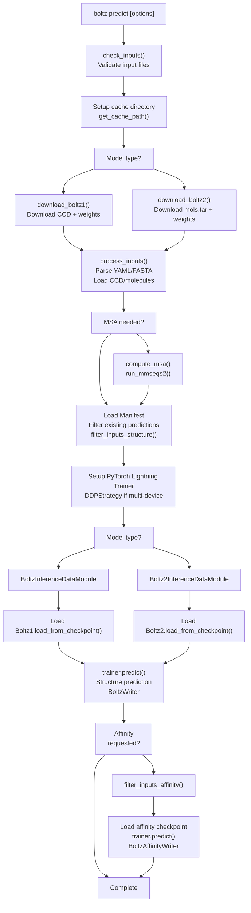
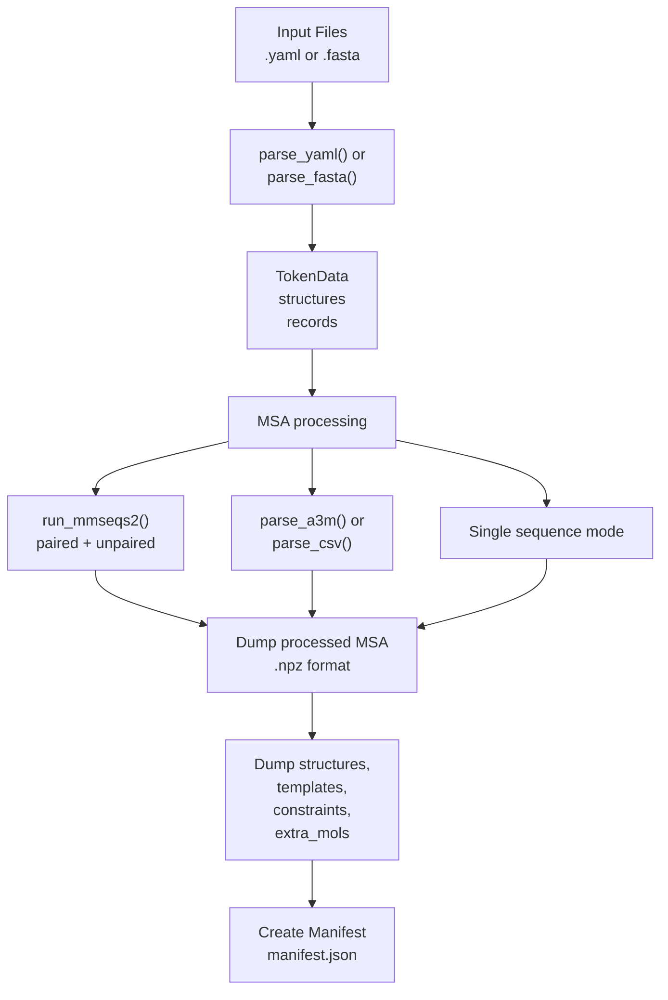
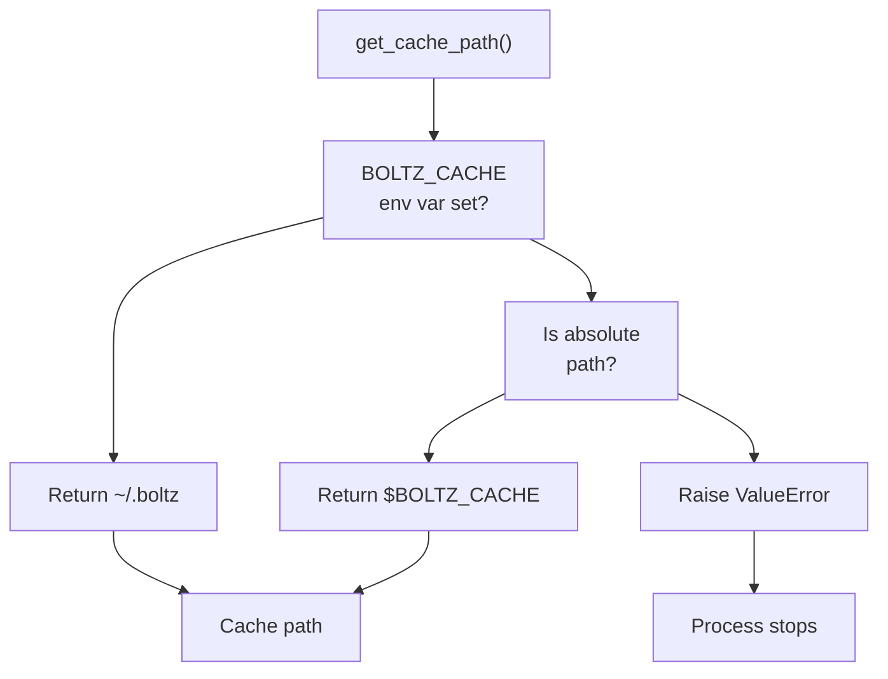
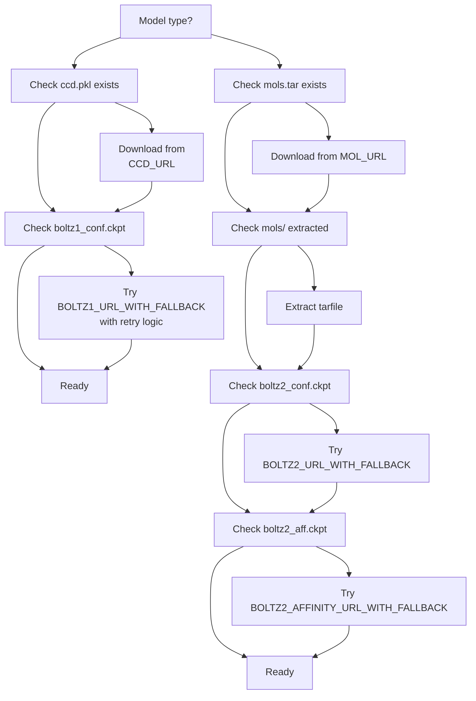
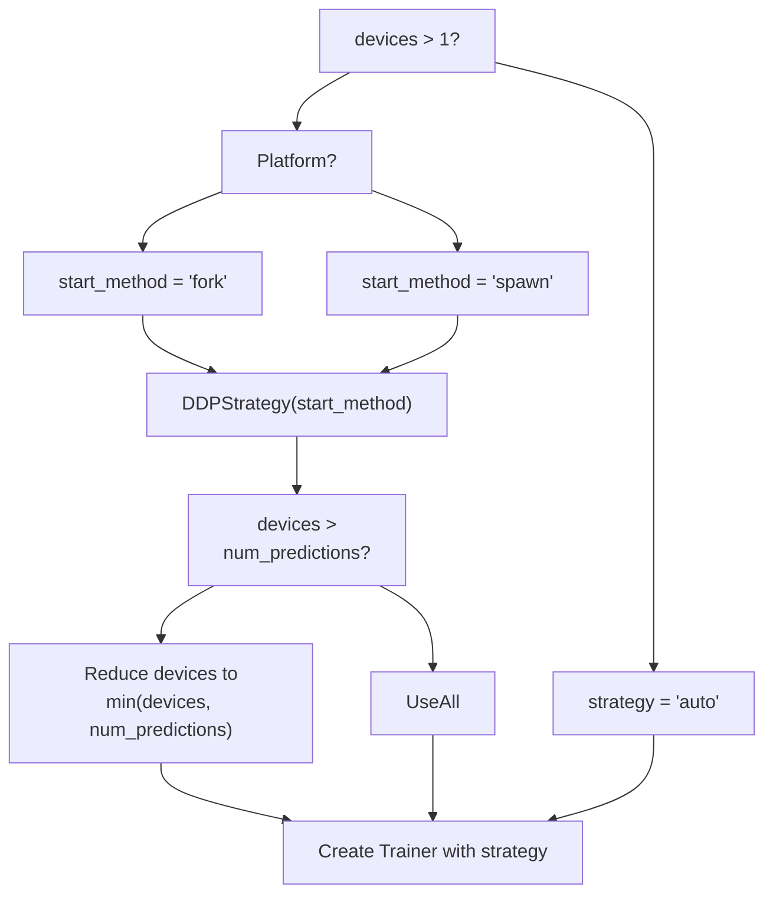

# Command-Line Interface

> **Relevant source files**
> * [docs/prediction.md](https://github.com/jwohlwend/boltz/blob/b1ebfc46/docs/prediction.md?plain=1)
> * [src/boltz/data/msa/mmseqs2.py](https://github.com/jwohlwend/boltz/blob/b1ebfc46/src/boltz/data/msa/mmseqs2.py)
> * [src/boltz/data/parse/pdb.py](https://github.com/jwohlwend/boltz/blob/b1ebfc46/src/boltz/data/parse/pdb.py)
> * [src/boltz/main.py](https://github.com/jwohlwend/boltz/blob/b1ebfc46/src/boltz/main.py)

This document describes the `boltz predict` command-line interface (CLI), which serves as the primary entry point for running structure and affinity predictions. For details on input file formats (YAML/FASTA), see [Input Formats](/jwohlwend/boltz/2.2-input-formats). For information on MSA generation, see [MSA Generation](/jwohlwend/boltz/2.3-msa-generation). For output interpretation, see [Output Formats and Interpretation](/jwohlwend/boltz/2.4-output-formats-and-interpretation).

The CLI is implemented using the `click` library and provides extensive configuration options for model selection, sampling parameters, MSA generation, and output control.

## Command Syntax

The basic command structure is:

```
boltz predict <INPUT_PATH> [OPTIONS]
```

* `<INPUT_PATH>`: Required positional argument specifying either: * A single `.yaml` or `.fasta` file [docs/prediction.md L7](https://github.com/jwohlwend/boltz/blob/b1ebfc46/docs/prediction.md?plain=1#L7-L7) * A directory containing multiple `.yaml` or `.fasta` files (all will be processed) [docs/prediction.md L7](https://github.com/jwohlwend/boltz/blob/b1ebfc46/docs/prediction.md?plain=1#L7-L7)

**Sources:** [src/boltz/main.py L817-L818](https://github.com/jwohlwend/boltz/blob/b1ebfc46/src/boltz/main.py#L817-L818)

 [docs/prediction.md L3-L7](https://github.com/jwohlwend/boltz/blob/b1ebfc46/docs/prediction.md?plain=1#L3-L7)

## Command Execution Flow

The following diagram illustrates the high-level execution flow of the `predict` command, mapping CLI operations to internal code functions.

**Diagram: CLI Execution Pipeline**



**Sources:** [src/boltz/main.py L1042-L1414](https://github.com/jwohlwend/boltz/blob/b1ebfc46/src/boltz/main.py#L1042-L1414)

## Input Processing Pipeline

This diagram bridges the Natural Language input space to the Code Entity Space by showing how input files are transformed into internal data structures.

**Diagram: Input to Code Entity Mapping**



**Sources:** [src/boltz/main.py L525-L662](https://github.com/jwohlwend/boltz/blob/b1ebfc46/src/boltz/main.py#L525-L662)

 [src/boltz/main.py L665-L809](https://github.com/jwohlwend/boltz/blob/b1ebfc46/src/boltz/main.py#L665-L809)

 [src/boltz/data/msa/mmseqs2.py L21-L32](https://github.com/jwohlwend/boltz/blob/b1ebfc46/src/boltz/data/msa/mmseqs2.py#L21-L32)

## CLI Options Reference

The following tables summarize all available CLI options organized by category.

### Basic Configuration

| Option | Type | Default | Description |
| --- | --- | --- | --- |
| `--out_dir` | `PATH` | `./` | Output directory for predictions [src/boltz/main.py L832-L835](https://github.com/jwohlwend/boltz/blob/b1ebfc46/src/boltz/main.py#L832-L835) |
| `--cache` | `PATH` | `~/.boltz` or `$BOLTZ_CACHE` | Cache directory for models and data [src/boltz/main.py L826-L830](https://github.com/jwohlwend/boltz/blob/b1ebfc46/src/boltz/main.py#L826-L830) |
| `--checkpoint` | `PATH` | `None` | Custom model checkpoint [src/boltz/main.py L837-L840](https://github.com/jwohlwend/boltz/blob/b1ebfc46/src/boltz/main.py#L837-L840) |
| `--devices` | `INTEGER` | `1` | Number of devices for prediction [src/boltz/main.py L842-L845](https://github.com/jwohlwend/boltz/blob/b1ebfc46/src/boltz/main.py#L842-L845) |
| `--accelerator` | `[gpu,cpu,tpu]` | `gpu` | Accelerator type [src/boltz/main.py L847-L850](https://github.com/jwohlwend/boltz/blob/b1ebfc46/src/boltz/main.py#L847-L850) |
| `--num_workers` | `INTEGER` | `2` | Number of dataloader workers [src/boltz/main.py L910-L913](https://github.com/jwohlwend/boltz/blob/b1ebfc46/src/boltz/main.py#L910-L913) |
| `--seed` | `INTEGER` | `None` | Random seed for reproducibility [src/boltz/main.py L915-L918](https://github.com/jwohlwend/boltz/blob/b1ebfc46/src/boltz/main.py#L915-L918) |
| `--override` | `FLAG` | `False` | Override existing predictions [src/boltz/main.py L920-L923](https://github.com/jwohlwend/boltz/blob/b1ebfc46/src/boltz/main.py#L920-L923) |

**Sources:** [src/boltz/main.py L819-L923](https://github.com/jwohlwend/boltz/blob/b1ebfc46/src/boltz/main.py#L819-L923)

### Model Selection

| Option | Type | Default | Description |
| --- | --- | --- | --- |
| `--model` | `[boltz1,boltz2]` | `boltz2` | Model version to use [src/boltz/main.py L974-L978](https://github.com/jwohlwend/boltz/blob/b1ebfc46/src/boltz/main.py#L974-L978) |
| `--method` | `STRING` | `None` | Method conditioning (Boltz-2 only) [src/boltz/main.py L980-L984](https://github.com/jwohlwend/boltz/blob/b1ebfc46/src/boltz/main.py#L980-L984) |

The `--method` option allows specifying experimental method conditioning for Boltz-2. Valid values are validated against `const.method_types_ids` at [src/boltz/main.py L1150-L1157](https://github.com/jwohlwend/boltz/blob/b1ebfc46/src/boltz/main.py#L1150-L1157)

**Sources:** [src/boltz/main.py L974-L984](https://github.com/jwohlwend/boltz/blob/b1ebfc46/src/boltz/main.py#L974-L984)

### Sampling Parameters

| Option | Type | Default | Description |
| --- | --- | --- | --- |
| `--recycling_steps` | `INTEGER` | `3` | Number of trunk recycling iterations [src/boltz/main.py L852-L855](https://github.com/jwohlwend/boltz/blob/b1ebfc46/src/boltz/main.py#L852-L855) |
| `--sampling_steps` | `INTEGER` | `200` | Number of diffusion sampling steps [src/boltz/main.py L857-L860](https://github.com/jwohlwend/boltz/blob/b1ebfc46/src/boltz/main.py#L857-L860) |
| `--diffusion_samples` | `INTEGER` | `1` | Number of diffusion samples to generate [src/boltz/main.py L862-L865](https://github.com/jwohlwend/boltz/blob/b1ebfc46/src/boltz/main.py#L862-L865) |
| `--max_parallel_samples` | `INTEGER` | `5` | Maximum samples to predict in parallel [src/boltz/main.py L873-L876](https://github.com/jwohlwend/boltz/blob/b1ebfc46/src/boltz/main.py#L873-L876) |
| `--step_scale` | `FLOAT` | `1.638` (B1) / `1.5` (B2) | Diffusion step size [src/boltz/main.py L878-L883](https://github.com/jwohlwend/boltz/blob/b1ebfc46/src/boltz/main.py#L878-L883) |

The `step_scale` parameter controls the temperature of the diffusion sampling process. The default is automatically set based on the model version at [src/boltz/main.py L1229-L1238](https://github.com/jwohlwend/boltz/blob/b1ebfc46/src/boltz/main.py#L1229-L1238)

**Sources:** [src/boltz/main.py L852-L888](https://github.com/jwohlwend/boltz/blob/b1ebfc46/src/boltz/main.py#L852-L888)

### MSA Generation

| Option | Type | Default | Description |
| --- | --- | --- | --- |
| `--use_msa_server` | `FLAG` | `False` | Enable automatic MSA generation via MMseqs2 [src/boltz/main.py L925-L928](https://github.com/jwohlwend/boltz/blob/b1ebfc46/src/boltz/main.py#L925-L928) |
| `--msa_server_url` | `STRING` | `https://api.colabfold.com` | MSA server endpoint [src/boltz/main.py L930-L934](https://github.com/jwohlwend/boltz/blob/b1ebfc46/src/boltz/main.py#L930-L934) |
| `--msa_pairing_strategy` | `STRING` | `greedy` | Pairing strategy: `greedy` or `complete` [src/boltz/main.py L936-L940](https://github.com/jwohlwend/boltz/blob/b1ebfc46/src/boltz/main.py#L936-L940) |
| `--max_msa_seqs` | `INTEGER` | `8192` | Maximum MSA sequences to load [src/boltz/main.py L1026-L1031](https://github.com/jwohlwend/boltz/blob/b1ebfc46/src/boltz/main.py#L1026-L1031) |
| `--subsample_msa` | `FLAG` | `False` | Enable MSA subsampling [src/boltz/main.py L1016-L1019](https://github.com/jwohlwend/boltz/blob/b1ebfc46/src/boltz/main.py#L1016-L1019) |
| `--num_subsampled_msa` | `INTEGER` | `1024` | Number of sequences when subsampling [src/boltz/main.py L1021-L1024](https://github.com/jwohlwend/boltz/blob/b1ebfc46/src/boltz/main.py#L1021-L1024) |

MSA generation is handled by `compute_msa()` at [src/boltz/main.py L415-L523](https://github.com/jwohlwend/boltz/blob/b1ebfc46/src/boltz/main.py#L415-L523)

 which calls `run_mmseqs2()` from [src/boltz/data/msa/mmseqs2.py L21-L32](https://github.com/jwohlwend/boltz/blob/b1ebfc46/src/boltz/data/msa/mmseqs2.py#L21-L32)

**Sources:** [src/boltz/main.py L924-L943](https://github.com/jwohlwend/boltz/blob/b1ebfc46/src/boltz/main.py#L924-L943)

 [src/boltz/main.py L1016-L1031](https://github.com/jwohlwend/boltz/blob/b1ebfc46/src/boltz/main.py#L1016-L1031)

### Authentication

Two mutually exclusive authentication methods are supported for MSA servers:

#### Basic Authentication

| Option | Type | Default | Description |
| --- | --- | --- | --- |
| `--msa_server_username` | `STRING` | `None` | Username for basic auth [src/boltz/main.py L945-L949](https://github.com/jwohlwend/boltz/blob/b1ebfc46/src/boltz/main.py#L945-L949) |
| `--msa_server_password` | `STRING` | `None` | Password for basic auth [src/boltz/main.py L951-L955](https://github.com/jwohlwend/boltz/blob/b1ebfc46/src/boltz/main.py#L951-L955) |

#### API Key Authentication

| Option | Type | Default | Description |
| --- | --- | --- | --- |
| `--api_key_header` | `STRING` | `None` | Header name for API key (default: `X-API-Key`) [src/boltz/main.py L957-L961](https://github.com/jwohlwend/boltz/blob/b1ebfc46/src/boltz/main.py#L957-L961) |
| `--api_key_value` | `STRING` | `None` | API key value [src/boltz/main.py L963-L967](https://github.com/jwohlwend/boltz/blob/b1ebfc46/src/boltz/main.py#L963-L967) |

Authentication credentials can be provided via CLI options or environment variables. Environment variables are checked at [src/boltz/main.py L1115-L1129](https://github.com/jwohlwend/boltz/blob/b1ebfc46/src/boltz/main.py#L1115-L1129)

 Mutual exclusivity is validated at [src/boltz/main.py L714-L722](https://github.com/jwohlwend/boltz/blob/b1ebfc46/src/boltz/main.py#L714-L722)

 and inside `run_mmseqs2` at [src/boltz/data/msa/mmseqs2.py L35-L42](https://github.com/jwohlwend/boltz/blob/b1ebfc46/src/boltz/data/msa/mmseqs2.py#L35-L42)

**Sources:** [src/boltz/main.py L944-L967](https://github.com/jwohlwend/boltz/blob/b1ebfc46/src/boltz/main.py#L944-L967)

 [src/boltz/data/msa/mmseqs2.py L29-L63](https://github.com/jwohlwend/boltz/blob/b1ebfc46/src/boltz/data/msa/mmseqs2.py#L29-L63)

### Output Control

| Option | Type | Default | Description |
| --- | --- | --- | --- |
| `--output_format` | `[pdb,mmcif]` | `mmcif` | Output structure format [src/boltz/main.py L891-L895](https://github.com/jwohlwend/boltz/blob/b1ebfc46/src/boltz/main.py#L891-L895) |
| `--write_full_pae` | `FLAG` | `False` | Save full PAE matrix as `.npz` [src/boltz/main.py L897-L900](https://github.com/jwohlwend/boltz/blob/b1ebfc46/src/boltz/main.py#L897-L900) |
| `--write_full_pde` | `FLAG` | `False` | Save full PDE matrix as `.npz` [src/boltz/main.py L902-L905](https://github.com/jwohlwend/boltz/blob/b1ebfc46/src/boltz/main.py#L902-L905) |
| `--write_embeddings` | `FLAG` | `False` | Save trunk embeddings as `.npz` [src/boltz/main.py L1038-L1041](https://github.com/jwohlwend/boltz/blob/b1ebfc46/src/boltz/main.py#L1038-L1041) |

Output writing is handled by `BoltzWriter` configured at [src/boltz/main.py L1247-L1253](https://github.com/jwohlwend/boltz/blob/b1ebfc46/src/boltz/main.py#L1247-L1253)

**Sources:** [src/boltz/main.py L890-L906](https://github.com/jwohlwend/boltz/blob/b1ebfc46/src/boltz/main.py#L890-L906)

 [src/boltz/main.py L1038-L1041](https://github.com/jwohlwend/boltz/blob/b1ebfc46/src/boltz/main.py#L1038-L1041)

### Physical Guidance

| Option | Type | Default | Description |
| --- | --- | --- | --- |
| `--use_potentials` | `FLAG` | `False` | Enable inference-time physical guidance [src/boltz/main.py L969-L972](https://github.com/jwohlwend/boltz/blob/b1ebfc46/src/boltz/main.py#L969-L972) |

When enabled, potentials are applied through `BoltzSteeringParams` configured at [src/boltz/main.py L1309-L1311](https://github.com/jwohlwend/boltz/blob/b1ebfc46/src/boltz/main.py#L1309-L1311)

 This enables both `fk_steering` and physical guidance updates.

**Sources:** [src/boltz/main.py L969-L972](https://github.com/jwohlwend/boltz/blob/b1ebfc46/src/boltz/main.py#L969-L972)

 [src/boltz/main.py L148-L158](https://github.com/jwohlwend/boltz/blob/b1ebfc46/src/boltz/main.py#L148-L158)

### Affinity Prediction (Boltz-2 Only)

| Option | Type | Default | Description |
| --- | --- | --- | --- |
| `--affinity_checkpoint` | `PATH` | `None` | Custom affinity model checkpoint [src/boltz/main.py L993-L996](https://github.com/jwohlwend/boltz/blob/b1ebfc46/src/boltz/main.py#L993-L996) |
| `--sampling_steps_affinity` | `INTEGER` | `200` | Steps for affinity prediction [src/boltz/main.py L998-L1001](https://github.com/jwohlwend/boltz/blob/b1ebfc46/src/boltz/main.py#L998-L1001) |
| `--diffusion_samples_affinity` | `INTEGER` | `5` | Samples for affinity prediction [src/boltz/main.py L1003-L1006](https://github.com/jwohlwend/boltz/blob/b1ebfc46/src/boltz/main.py#L1003-L1006) |
| `--affinity_mw_correction` | `FLAG` | `False` | Apply molecular weight correction [src/boltz/main.py L1008-L1011](https://github.com/jwohlwend/boltz/blob/b1ebfc46/src/boltz/main.py#L1008-L1011) |

Affinity prediction is run as a separate pass using `BoltzAffinityWriter` [src/boltz/main.py L1336-L1414](https://github.com/jwohlwend/boltz/blob/b1ebfc46/src/boltz/main.py#L1336-L1414)

**Sources:** [src/boltz/main.py L992-L1014](https://github.com/jwohlwend/boltz/blob/b1ebfc46/src/boltz/main.py#L992-L1014)

 [src/boltz/main.py L32](https://github.com/jwohlwend/boltz/blob/b1ebfc46/src/boltz/main.py#L32-L32)

### Preprocessing

| Option | Type | Default | Description |
| --- | --- | --- | --- |
| `--preprocessing_threads` | `INTEGER` | `CPU count` | Threads for input processing [src/boltz/main.py L987-L990](https://github.com/jwohlwend/boltz/blob/b1ebfc46/src/boltz/main.py#L987-L990) |

Input processing is parallelized using `multiprocessing.Pool` at [src/boltz/main.py L798-L803](https://github.com/jwohlwend/boltz/blob/b1ebfc46/src/boltz/main.py#L798-L803)

**Sources:** [src/boltz/main.py L986-L990](https://github.com/jwohlwend/boltz/blob/b1ebfc46/src/boltz/main.py#L986-L990)

## Cache Directory Management

The cache directory stores downloaded models and molecular data. It is determined by the `get_cache_path()` function:

**Diagram: Cache Path Resolution**



**Sources:** [src/boltz/main.py L261-L278](https://github.com/jwohlwend/boltz/blob/b1ebfc46/src/boltz/main.py#L261-L278)

## Model Download Workflow

Models and data are automatically downloaded on first use via `download_boltz1` and `download_boltz2`.

**Diagram: Model Acquisition Logic**



Download functions include fallback URLs defined at [src/boltz/main.py L39-L52](https://github.com/jwohlwend/boltz/blob/b1ebfc46/src/boltz/main.py#L39-L52)

 For Boltz-2, it extracts a `mols.tar` archive to a `mols` subdirectory [src/boltz/main.py L208-L224](https://github.com/jwohlwend/boltz/blob/b1ebfc46/src/boltz/main.py#L208-L224)

**Sources:** [src/boltz/main.py L161-L259](https://github.com/jwohlwend/boltz/blob/b1ebfc46/src/boltz/main.py#L161-L259)

 [src/boltz/main.py L39-L52](https://github.com/jwohlwend/boltz/blob/b1ebfc46/src/boltz/main.py#L39-L52)

## Multi-Device Strategy

When using multiple devices, the CLI configures PyTorch Lightning's `DDPStrategy`.

**Diagram: Distributed Strategy Selection**



**Sources:** [src/boltz/main.py L1210-L1227](https://github.com/jwohlwend/boltz/blob/b1ebfc46/src/boltz/main.py#L1210-L1227)

## Diffusion Parameter Configuration

Diffusion parameters differ between Boltz-1 and Boltz-2, encapsulated in `BoltzDiffusionParams` and `Boltz2DiffusionParams`.

| Parameter | Boltz-1 | Boltz-2 | Description |
| --- | --- | --- | --- |
| `gamma_0` | 0.605 | 0.8 | Initial gamma [src/boltz/main.py L112](https://github.com/jwohlwend/boltz/blob/b1ebfc46/src/boltz/main.py#L112-L112) <br>  [src/boltz/main.py L132](https://github.com/jwohlwend/boltz/blob/b1ebfc46/src/boltz/main.py#L132-L132) |
| `gamma_min` | 1.107 | 1.0 | Minimum gamma [src/boltz/main.py L113](https://github.com/jwohlwend/boltz/blob/b1ebfc46/src/boltz/main.py#L113-L113) <br>  [src/boltz/main.py L133](https://github.com/jwohlwend/boltz/blob/b1ebfc46/src/boltz/main.py#L133-L133) |
| `noise_scale` | 0.901 | 1.003 | Noise scaling factor [src/boltz/main.py L114](https://github.com/jwohlwend/boltz/blob/b1ebfc46/src/boltz/main.py#L114-L114) <br>  [src/boltz/main.py L134](https://github.com/jwohlwend/boltz/blob/b1ebfc46/src/boltz/main.py#L134-L134) |
| `rho` | 8 | 7 | Schedule exponent [src/boltz/main.py L115](https://github.com/jwohlwend/boltz/blob/b1ebfc46/src/boltz/main.py#L115-L115) <br>  [src/boltz/main.py L135](https://github.com/jwohlwend/boltz/blob/b1ebfc46/src/boltz/main.py#L135-L135) |
| `step_scale` | 1.638 | 1.5 | Step size multiplier [src/boltz/main.py L116](https://github.com/jwohlwend/boltz/blob/b1ebfc46/src/boltz/main.py#L116-L116) <br>  [src/boltz/main.py L136](https://github.com/jwohlwend/boltz/blob/b1ebfc46/src/boltz/main.py#L136-L136) |
| `sigma_min` | 0.0004 | 0.0001 | Minimum sigma [src/boltz/main.py L117](https://github.com/jwohlwend/boltz/blob/b1ebfc46/src/boltz/main.py#L117-L117) <br>  [src/boltz/main.py L137](https://github.com/jwohlwend/boltz/blob/b1ebfc46/src/boltz/main.py#L137-L137) |
| `sigma_max` | 160.0 | 160.0 | Maximum sigma [src/boltz/main.py L118](https://github.com/jwohlwend/boltz/blob/b1ebfc46/src/boltz/main.py#L118-L118) <br>  [src/boltz/main.py L138](https://github.com/jwohlwend/boltz/blob/b1ebfc46/src/boltz/main.py#L138-L138) |

**Sources:** [src/boltz/main.py L109-L145](https://github.com/jwohlwend/boltz/blob/b1ebfc46/src/boltz/main.py#L109-L145)

 [src/boltz/main.py L1229-L1238](https://github.com/jwohlwend/boltz/blob/b1ebfc46/src/boltz/main.py#L1229-L1238)

## Environment Variable Support

The CLI supports several environment variables for configuration:

| Environment Variable | Purpose | Fallback CLI Option |
| --- | --- | --- |
| `BOLTZ_CACHE` | Cache directory location | `--cache` [src/boltz/main.py L263-L264](https://github.com/jwohlwend/boltz/blob/b1ebfc46/src/boltz/main.py#L263-L264) |
| `BOLTZ_MSA_USERNAME` | MSA server username | `--msa_server_username` [src/boltz/main.py L1115-L1118](https://github.com/jwohlwend/boltz/blob/b1ebfc46/src/boltz/main.py#L1115-L1118) |
| `BOLTZ_MSA_PASSWORD` | MSA server password | `--msa_server_password` [src/boltz/main.py L1119-L1122](https://github.com/jwohlwend/boltz/blob/b1ebfc46/src/boltz/main.py#L1119-L1122) |
| `MSA_API_KEY_VALUE` | MSA API key | `--api_key_value` [src/boltz/main.py L1126-L1129](https://github.com/jwohlwend/boltz/blob/b1ebfc46/src/boltz/main.py#L1126-L1129) |

**Sources:** [src/boltz/main.py L261-L278](https://github.com/jwohlwend/boltz/blob/b1ebfc46/src/boltz/main.py#L261-L278)

 [src/boltz/main.py L1115-L1129](https://github.com/jwohlwend/boltz/blob/b1ebfc46/src/boltz/main.py#L1115-L1129)