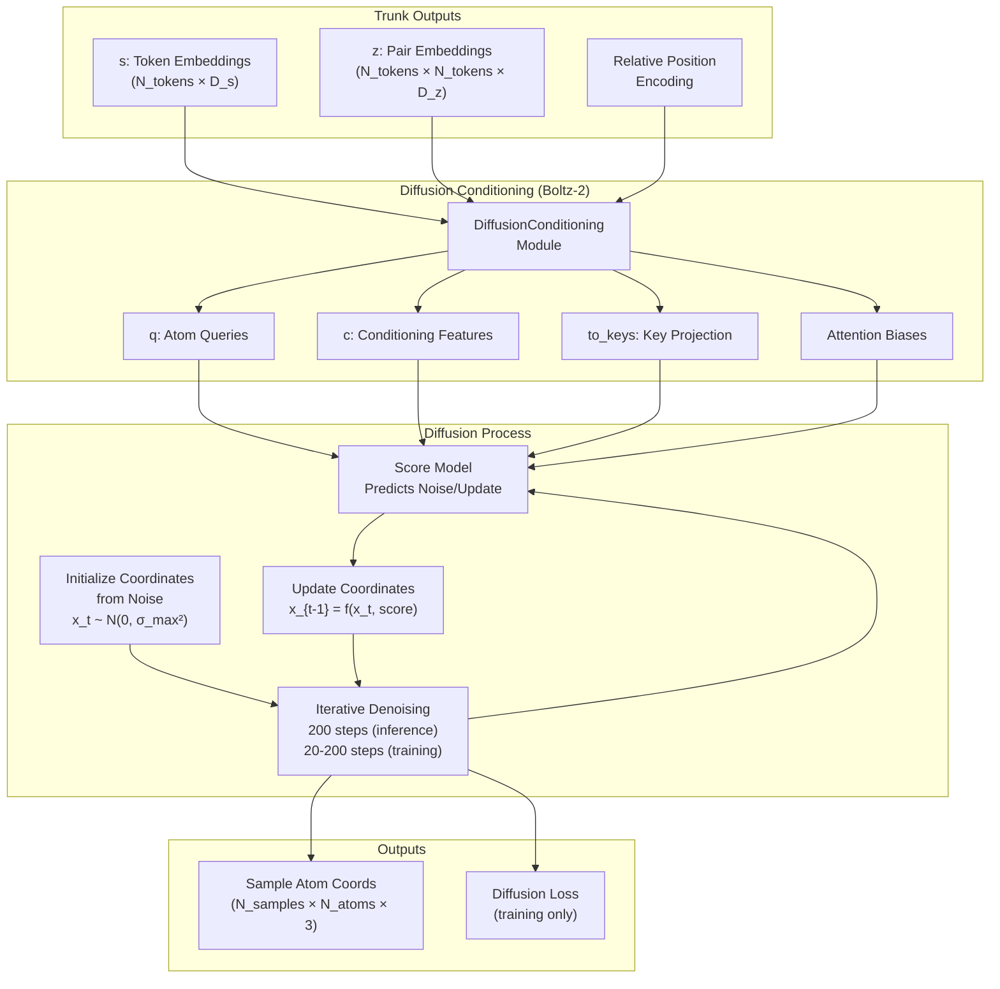
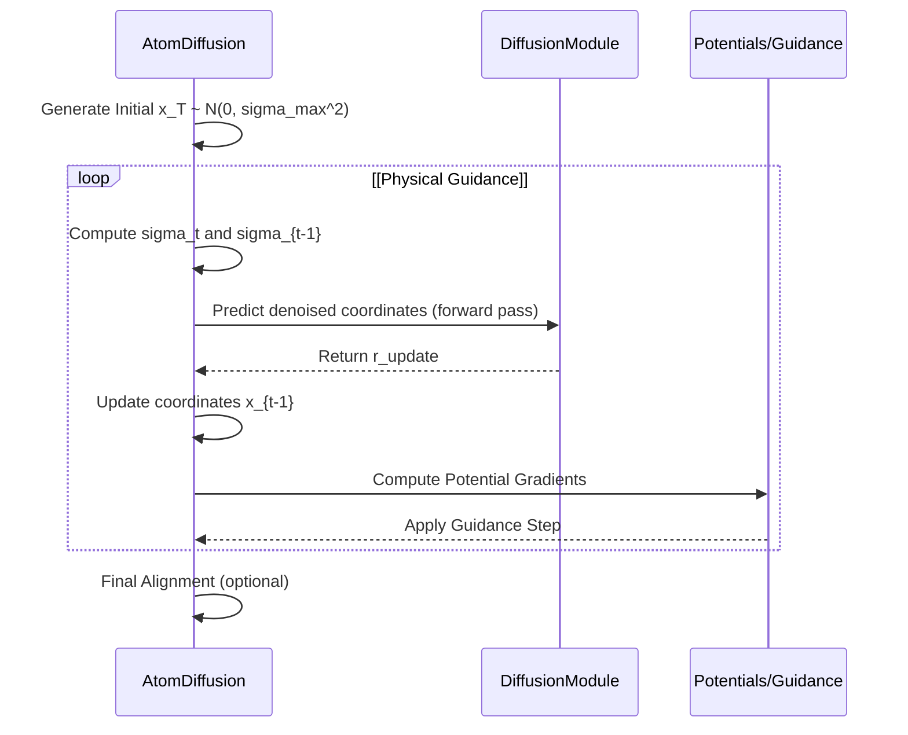
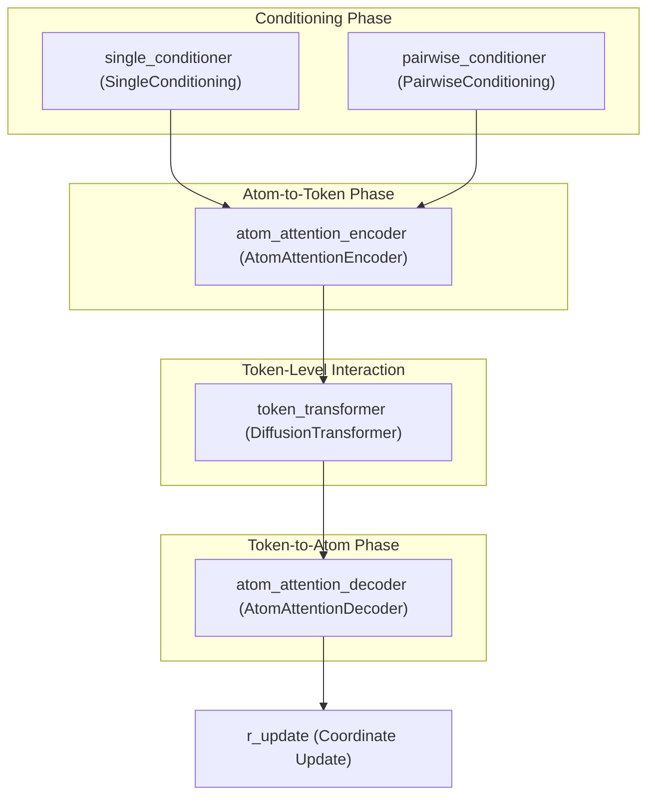

# Diffusion Process

> **Relevant source files**
> * [scripts/eval/physcialsim_metrics.py](https://github.com/jwohlwend/boltz/blob/b1ebfc46/scripts/eval/physcialsim_metrics.py)
> * [src/boltz/data/module/inferencev2.py](https://github.com/jwohlwend/boltz/blob/b1ebfc46/src/boltz/data/module/inferencev2.py)
> * [src/boltz/data/parse/fasta.py](https://github.com/jwohlwend/boltz/blob/b1ebfc46/src/boltz/data/parse/fasta.py)
> * [src/boltz/model/loss/confidencev2.py](https://github.com/jwohlwend/boltz/blob/b1ebfc46/src/boltz/model/loss/confidencev2.py)
> * [src/boltz/model/loss/diffusion.py](https://github.com/jwohlwend/boltz/blob/b1ebfc46/src/boltz/model/loss/diffusion.py)
> * [src/boltz/model/loss/diffusionv2.py](https://github.com/jwohlwend/boltz/blob/b1ebfc46/src/boltz/model/loss/diffusionv2.py)
> * [src/boltz/model/modules/diffusion.py](https://github.com/jwohlwend/boltz/blob/b1ebfc46/src/boltz/model/modules/diffusion.py)
> * [src/boltz/model/modules/diffusionv2.py](https://github.com/jwohlwend/boltz/blob/b1ebfc46/src/boltz/model/modules/diffusionv2.py)

## Purpose and Scope

This document describes the diffusion process used in Boltz for generating 3D atomic coordinates. The diffusion module takes the learned representations from the model trunk (single and pairwise embeddings) and generates atomic coordinates through an iterative denoising process. This page focuses on the `AtomDiffusion` module, noise schedules, sampling strategies, and coordinate generation.

For information about the trunk architecture that produces the conditioning inputs, see [Model Architecture](https://github.com/jwohlwend/boltz/blob/b1ebfc46/Model Architecture)

 For details on physical guidance that can optionally steer the diffusion process, see [Physical Guidance and Potentials](https://github.com/jwohlwend/boltz/blob/b1ebfc46/Physical Guidance and Potentials)

 For confidence prediction on the generated structures, see [Confidence Prediction](https://github.com/jwohlwend/boltz/blob/b1ebfc46/Confidence Prediction)

## Overview

The diffusion process in Boltz generates 3D atomic coordinates by learning to reverse a noise corruption process. Starting from pure Gaussian noise, the model iteratively denoises the coordinates over multiple steps until reaching a plausible molecular structure. This approach is implemented in the `AtomDiffusion` class, which serves as the `structure_module` in both Boltz-1 and Boltz-2 models.



**Sources:** [src/boltz/model/modules/diffusion.py L41-L65](https://github.com/jwohlwend/boltz/blob/b1ebfc46/src/boltz/model/modules/diffusion.py#L41-L65)

 [src/boltz/model/modules/diffusionv2.py L179-L201](https://github.com/jwohlwend/boltz/blob/b1ebfc46/src/boltz/model/modules/diffusionv2.py#L179-L201)

## AtomDiffusion Module

The `AtomDiffusion` class is the core component that implements the diffusion process. It manages the noise schedule and calls the internal `DiffusionModule` (the "score model") to predict coordinate updates.

### Initialization

The `AtomDiffusion` class is initialized with parameters defining the noise schedule and the architecture of the underlying score model.

In Boltz-1 (`diffusion.py`):

```
AtomDiffusion(    score_model_args={        "token_z": token_z,        "token_s": token_s,        "atom_z": atom_z,        "atom_s": atom_s,        ...    },    num_sampling_steps=5,    sigma_min=0.0004,    sigma_max=160.0,    ...)
```

In Boltz-2 (`diffusionv2.py`):

```
AtomDiffusion(    score_model_args={        "token_s": token_s,        "atom_s": atom_s,        ...    },    num_sampling_steps=5,    sigma_min=0.0004,    sigma_max=160.0,    ...)
```

**Sources:** [src/boltz/model/modules/diffusion.py L441-L462](https://github.com/jwohlwend/boltz/blob/b1ebfc46/src/boltz/model/modules/diffusion.py#L441-L462)

 [src/boltz/model/modules/diffusionv2.py L179-L201](https://github.com/jwohlwend/boltz/blob/b1ebfc46/src/boltz/model/modules/diffusionv2.py#L179-L201)

### Diffusion Scoring Architecture

The internal `DiffusionModule` performs the actual denoising prediction using a three-stage architecture:

1. **Atom Attention Encoder**: Maps atom-level features and noisy coordinates back to token-level representations.
2. **Token Transformer**: Performs global attention across tokens (residues/ligand units) to capture long-range structural dependencies.
3. **Atom Attention Decoder**: Maps token representations back to individual atoms to predict coordinate updates.

**Sources:** [src/boltz/model/modules/diffusion.py L126-L166](https://github.com/jwohlwend/boltz/blob/b1ebfc46/src/boltz/model/modules/diffusion.py#L126-L166)

 [src/boltz/model/modules/diffusionv2.py L74-L113](https://github.com/jwohlwend/boltz/blob/b1ebfc46/src/boltz/model/modules/diffusionv2.py#L74-L113)

## Noise Schedule and Parameters

Boltz utilizes an EDM-style (Elucidating the Design Space of Diffusion-Based Generative Models) schedule.

### Core Parameters

| Parameter | Default Value | Description |
| --- | --- | --- |
| `sigma_min` | 0.0004 | Minimum noise level (near-zero noise at final step). |
| `sigma_max` | 160.0 | Maximum noise level (initial random state). |
| `sigma_data` | 16.0 | Standard deviation of the data distribution used for scaling. |
| `rho` | 7.0 | Controls the distribution of noise levels across steps. |
| `P_mean` | -1.2 | Mean of log-normal distribution for training noise. |
| `P_std` | 1.5 | Std of log-normal distribution for training noise. |

**Sources:** [src/boltz/model/modules/diffusion.py L443-L450](https://github.com/jwohlwend/boltz/blob/b1ebfc46/src/boltz/model/modules/diffusion.py#L443-L450)

 [src/boltz/model/modules/diffusionv2.py L184-L189](https://github.com/jwohlwend/boltz/blob/b1ebfc46/src/boltz/model/modules/diffusionv2.py#L184-L189)

### Coordinate Augmentation

The module can apply random rotations and translations to the coordinates during training to ensure the model is SE(3)-invariant. This is controlled by `coordinate_augmentation`.

**Sources:** [src/boltz/model/modules/diffusion.py L456](https://github.com/jwohlwend/boltz/blob/b1ebfc46/src/boltz/model/modules/diffusion.py#L456-L456)

 [src/boltz/model/modules/diffusionv2.py L195](https://github.com/jwohlwend/boltz/blob/b1ebfc46/src/boltz/model/modules/diffusionv2.py#L195-L195)

## Sampling Process

The `sample` method implements the iterative denoising loop. It starts with coordinates sampled from a normal distribution $\mathcal{N}(0, \sigma_{max}^2)$ and progressively reduces noise.



**Sources:** [src/boltz/model/modules/diffusion.py L656-L788](https://github.com/jwohlwend/boltz/blob/b1ebfc46/src/boltz/model/modules/diffusion.py#L656-L788)

 [src/boltz/model/modules/diffusionv2.py L388-L518](https://github.com/jwohlwend/boltz/blob/b1ebfc46/src/boltz/model/modules/diffusionv2.py#L388-L518)

### Stochastic Sampling

Stochasticity is introduced during sampling via `gamma` parameters, which add a small amount of noise back into the coordinates at each step before the deterministic denoising update.

**Sources:** [src/boltz/model/modules/diffusion.py L726-L735](https://github.com/jwohlwend/boltz/blob/b1ebfc46/src/boltz/model/modules/diffusion.py#L726-L735)

 [src/boltz/model/modules/diffusionv2.py L456-L465](https://github.com/jwohlwend/boltz/blob/b1ebfc46/src/boltz/model/modules/diffusionv2.py#L456-L465)

## Training and Loss Functions

During training, the `forward` method of `AtomDiffusion` samples a random noise level for each example in the batch, corrupts the ground truth coordinates, and computes the loss.

### Loss Components

1. **Diffusion Loss**: The primary MSE loss between predicted and ground truth denoised coordinates, scaled by the EDM weighting function.
2. **Smooth LDDT Loss**: A differentiable version of the Local Distance Difference Test (LDDT) to encourage local structural accuracy.
3. **Bond/Potential Losses**: Optional losses to enforce physical constraints.

**Sources:** [src/boltz/model/modules/diffusion.py L539-L605](https://github.com/jwohlwend/boltz/blob/b1ebfc46/src/boltz/model/modules/diffusion.py#L539-L605)

 [src/boltz/model/modules/diffusionv2.py L276-L342](https://github.com/jwohlwend/boltz/blob/b1ebfc46/src/boltz/model/modules/diffusionv2.py#L276-L342)

### Weighted Rigid Alignment

To compute losses correctly, predicted coordinates are often aligned to ground truth coordinates using the Kabsch algorithm, implemented as `weighted_rigid_align`.

**Sources:** [src/boltz/model/loss/diffusion.py L8-L94](https://github.com/jwohlwend/boltz/blob/b1ebfc46/src/boltz/model/loss/diffusion.py#L8-L94)

 [src/boltz/model/loss/diffusionv2.py L9-L84](https://github.com/jwohlwend/boltz/blob/b1ebfc46/src/boltz/model/loss/diffusionv2.py#L9-L84)

## Data Flow in DiffusionModule

The following diagram maps the high-level logic to the specific code entities in `DiffusionModule`.



**Sources:** [src/boltz/model/modules/diffusion.py L180-L230](https://github.com/jwohlwend/boltz/blob/b1ebfc46/src/boltz/model/modules/diffusion.py#L180-L230)

 [src/boltz/model/modules/diffusionv2.py L125-L176](https://github.com/jwohlwend/boltz/blob/b1ebfc46/src/boltz/model/modules/diffusionv2.py#L125-L176)

### Key Data Tensors

* `s_trunk`: Token-level single representations from the model trunk.
* `z_trunk`: Token-level pair representations (Boltz-1).
* `r_noisy`: The current noisy atomic coordinates (shape: `[Batch, Atoms, 3]`).
* `times`: The noise level $\sigma$ associated with each sample.
* `feats`: Dictionary containing atom masks, element types, and residue mappings.

**Sources:** [src/boltz/model/modules/diffusion.py L168-L179](https://github.com/jwohlwend/boltz/blob/b1ebfc46/src/boltz/model/modules/diffusion.py#L168-L179)

 [src/boltz/model/modules/diffusionv2.py L115-L124](https://github.com/jwohlwend/boltz/blob/b1ebfc46/src/boltz/model/modules/diffusionv2.py#L115-L124)

## Differences in Boltz-2 (diffusionv2.py)

Boltz-2 introduces several optimizations and architectural shifts in the diffusion process:

1. **DiffusionConditioning Integration**: In Boltz-2, much of the pair-based conditioning is pre-computed in a `DiffusionConditioning` module (outside the `AtomDiffusion` loop) to save memory.
2. **Bias Injection**: The `DiffusionModule.forward` in Boltz-2 accepts a `diffusion_conditioning` dictionary containing pre-calculated attention biases (`token_trans_bias`, `atom_enc_bias`, `atom_dec_bias`).
3. **Simplified Inputs**: `z_trunk` is no longer passed directly to the diffusion module's `forward` pass; instead, its influence is encapsulated in the `diffusion_conditioning` biases.

**Sources:** [src/boltz/model/modules/diffusionv2.py L122-L124](https://github.com/jwohlwend/boltz/blob/b1ebfc46/src/boltz/model/modules/diffusionv2.py#L122-L124)

 [src/boltz/model/modules/diffusionv2.py L158-L160](https://github.com/jwohlwend/boltz/blob/b1ebfc46/src/boltz/model/modules/diffusionv2.py#L158-L160)