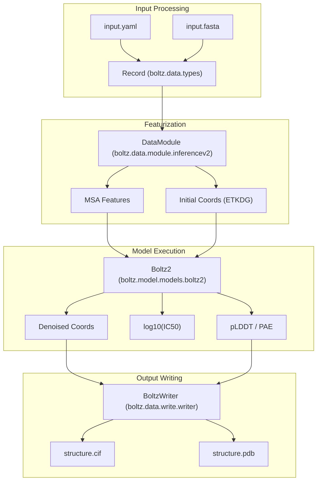
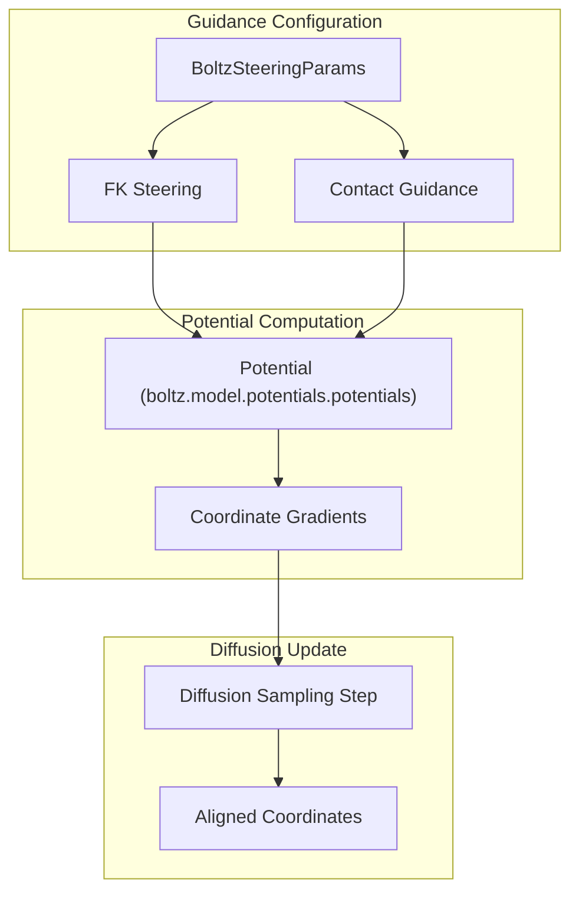

# Glossary

> **Relevant source files**
> * [README.md](https://github.com/jwohlwend/boltz/blob/b1ebfc46/README.md?plain=1)
> * [examples/pocket.yaml](https://github.com/jwohlwend/boltz/blob/b1ebfc46/examples/pocket.yaml)
> * [examples/prot_no_msa.yaml](https://github.com/jwohlwend/boltz/blob/b1ebfc46/examples/prot_no_msa.yaml)
> * [pyproject.toml](https://github.com/jwohlwend/boltz/blob/b1ebfc46/pyproject.toml)
> * [src/boltz/data/feature/featurizer.py](https://github.com/jwohlwend/boltz/blob/b1ebfc46/src/boltz/data/feature/featurizer.py)
> * [src/boltz/data/msa/mmseqs2.py](https://github.com/jwohlwend/boltz/blob/b1ebfc46/src/boltz/data/msa/mmseqs2.py)
> * [src/boltz/data/parse/schema.py](https://github.com/jwohlwend/boltz/blob/b1ebfc46/src/boltz/data/parse/schema.py)
> * [src/boltz/data/write/mmcif.py](https://github.com/jwohlwend/boltz/blob/b1ebfc46/src/boltz/data/write/mmcif.py)
> * [src/boltz/data/write/pdb.py](https://github.com/jwohlwend/boltz/blob/b1ebfc46/src/boltz/data/write/pdb.py)
> * [src/boltz/data/write/writer.py](https://github.com/jwohlwend/boltz/blob/b1ebfc46/src/boltz/data/write/writer.py)
> * [src/boltz/main.py](https://github.com/jwohlwend/boltz/blob/b1ebfc46/src/boltz/main.py)
> * [src/boltz/model/layers/triangular_mult.py](https://github.com/jwohlwend/boltz/blob/b1ebfc46/src/boltz/model/layers/triangular_mult.py)
> * [src/boltz/model/modules/confidence_utils.py](https://github.com/jwohlwend/boltz/blob/b1ebfc46/src/boltz/model/modules/confidence_utils.py)
> * [src/boltz/model/potentials/potentials.py](https://github.com/jwohlwend/boltz/blob/b1ebfc46/src/boltz/model/potentials/potentials.py)

This glossary provides definitions for codebase-specific terms, abbreviations, and architectural components used throughout the Boltz system. It serves as a technical reference for engineers onboarding to the codebase.

## Biological and Chemical Terms

| Term | Definition | Code Reference |
| --- | --- | --- |
| **MSA** | Multiple Sequence Alignment. A collection of evolutionary related sequences used to capture co-variation signals. | [boltz/data/msa/mmseqs2.py L21-L32](https://github.com/jwohlwend/boltz/blob/b1ebfc46/boltz/data/msa/mmseqs2.py#L21-L32) |
| **CCD** | Chemical Component Dictionary. A database containing standard definitions for residues and small molecules. | [boltz/main.py L36-L37](https://github.com/jwohlwend/boltz/blob/b1ebfc46/boltz/main.py#L36-L37) |
| **SMILES** | Simplified Molecular Input Line Entry System. A notation for describing the structure of chemical species using short ASCII strings. | [boltz/data/parse/schema.py L233-L236](https://github.com/jwohlwend/boltz/blob/b1ebfc46/boltz/data/parse/schema.py#L233-L236) |
| **IC50** | Half maximal inhibitory concentration. A measure of the potency of a substance in inhibiting a specific biological function. | [boltz/main.py L52](https://github.com/jwohlwend/boltz/blob/b1ebfc46/boltz/main.py#L52-L52) |
| **FEP** | Free Energy Perturbation. A physics-based method for calculating the difference in free energy between two states. | [README.md L17-L19](https://github.com/jwohlwend/boltz/blob/b1ebfc46/README.md?plain=1#L17-L19) |

## Model Confidence Metrics

Confidence scores are predicted by the `ConfidenceModule` and stored in a summary JSON file.

* **pLDDT**: Predicted Local Distance Difference Test. Measures local confidence at the residue level (0-100). [boltz/data/write/pdb.py L105-L111](https://github.com/jwohlwend/boltz/blob/b1ebfc46/boltz/data/write/pdb.py#L105-L111)
* **PAE**: Predicted Aligned Error. Estimates the error in the relative position of two residues. [boltz/data/write/writer.py L193](https://github.com/jwohlwend/boltz/blob/b1ebfc46/boltz/data/write/writer.py#L193-L193)
* **PTM**: Predicted TM-score. A global measure of structural similarity between predicted and ground truth structures. [boltz/data/write/writer.py L192](https://github.com/jwohlwend/boltz/blob/b1ebfc46/boltz/data/write/writer.py#L192-L192)
* **iPTM**: Interface PTM. Measures structural quality specifically at the interface between different chains. [boltz/data/write/writer.py L194](https://github.com/jwohlwend/boltz/blob/b1ebfc46/boltz/data/write/writer.py#L194-L194)
* **PDE**: Predicted Distance Error. Used to estimate the accuracy of pairwise distances. [boltz/data/write/writer.py L195](https://github.com/jwohlwend/boltz/blob/b1ebfc46/boltz/data/write/writer.py#L195-L195)

## Architectural Components

### Pairformer

The central transformer-like module that processes the pair representation and single representation. Boltz-2 uses a larger version (64 blocks vs 48 in Boltz-1).

* **Implementation**: `PairformerArgs` and `PairformerArgsV2` [boltz/main.py L68-L89](https://github.com/jwohlwend/boltz/blob/b1ebfc46/boltz/main.py#L68-L89)

### Diffusion

Boltz uses a generative diffusion process to produce atomic coordinates.

* **AtomDiffusion**: The module responsible for the denoising process.
* **Noise Schedule**: Controlled by parameters like `sigma_min`, `sigma_max`, and `rho`. [boltz/main.py L109-L145](https://github.com/jwohlwend/boltz/blob/b1ebfc46/boltz/main.py#L109-L145)

### cuEquivariance

A library of optimized CUDA kernels for equivariant operations, specifically utilized in Boltz for triangular multiplicative updates to accelerate inference.

* **Implementation**: `kernel_triangular_mult` [boltz/model/layers/triangular_mult.py L8-L36](https://github.com/jwohlwend/boltz/blob/b1ebfc46/boltz/model/layers/triangular_mult.py#L8-L36)

## Data and Featurization

### Identity Identifiers

* **entity_id**: Unique identifier for a molecular species (e.g., all identical protein chains share one `entity_id`). [boltz/data/write/mmcif.py L45-L48](https://github.com/jwohlwend/boltz/blob/b1ebfc46/boltz/data/write/mmcif.py#L45-L48)
* **asym_id**: Unique identifier for each instance of a chain in the asymmetric unit. [boltz/data/write/mmcif.py L99-L100](https://github.com/jwohlwend/boltz/blob/b1ebfc46/boltz/data/write/mmcif.py#L99-L100)
* **sym_id**: Used during symmetry processing to identify identical sub-units. [boltz/data/feature/featurizer.py L14-L18](https://github.com/jwohlwend/boltz/blob/b1ebfc46/boltz/data/feature/featurizer.py#L14-L18)

### Coordinate Generation (ETKDG)

Experimental-Torsion Knowledge Distance Geometry. Used to generate initial 3D conformers for small molecules when no template is provided.

* **Function**: `compute_3d_conformer` [boltz/data/parse/schema.py L200-L254](https://github.com/jwohlwend/boltz/blob/b1ebfc46/boltz/data/parse/schema.py#L200-L254)

### Constraints and Guidance

* **FK Steering**: Flinn-Kapoor steering, a method for guiding the diffusion process using physical or contact potentials. [boltz/main.py L151-L153](https://github.com/jwohlwend/boltz/blob/b1ebfc46/boltz/main.py#L151-L153)
* **Binder-Pocket Conditioning**: A mechanism in Boltz-2 to provide external constraints (e.g., known contacts) to guide the binding site prediction. [examples/pocket.yaml L9-L11](https://github.com/jwohlwend/boltz/blob/b1ebfc46/examples/pocket.yaml#L9-L11)
* **VDW Potential**: Van der Waals potential used during steering to prevent atomic clashes. [boltz/model/potentials/potentials.py L6-L12](https://github.com/jwohlwend/boltz/blob/b1ebfc46/boltz/model/potentials/potentials.py#L6-L12)

## Data Flow Diagrams

### Prediction Data Flow

The following diagram illustrates the transformation from user input to the final predicted coordinates and confidence scores.

**Natural Language to Code Entity Space: Inference Pipeline**

**Sources**: [boltz/main.py L23-L34](https://github.com/jwohlwend/boltz/blob/b1ebfc46/boltz/main.py#L23-L34)

 [boltz/data/parse/schema.py L200-L205](https://github.com/jwohlwend/boltz/blob/b1ebfc46/boltz/data/parse/schema.py#L200-L205)

 [boltz/data/write/writer.py L82-L135](https://github.com/jwohlwend/boltz/blob/b1ebfc46/boltz/data/write/writer.py#L82-L135)

 [boltz/data/feature/featurizer.py L151-L158](https://github.com/jwohlwend/boltz/blob/b1ebfc46/boltz/data/feature/featurizer.py#L151-L158)

### Potential and Guidance System

This diagram shows how physical constraints and guidance parameters influence the diffusion sampling process.

**Natural Language to Code Entity Space: Steering & Potentials**

**Sources**: [boltz/main.py L148-L158](https://github.com/jwohlwend/boltz/blob/b1ebfc46/boltz/main.py#L148-L158)

 [boltz/model/potentials/potentials.py L15-L25](https://github.com/jwohlwend/boltz/blob/b1ebfc46/boltz/model/potentials/potentials.py#L15-L25)

 [boltz/model/potentials/potentials.py L91-L100](https://github.com/jwohlwend/boltz/blob/b1ebfc46/boltz/model/potentials/potentials.py#L91-L100)

## Glossary Table of Symbols

| Symbol | Description | File Context |
| --- | --- | --- |
| `z` | Pair representation tensor. | [boltz/main.py L98](https://github.com/jwohlwend/boltz/blob/b1ebfc46/boltz/main.py#L98-L98) |
| `s` | Single representation tensor (often MSA sequence dimension). | [boltz/main.py L95](https://github.com/jwohlwend/boltz/blob/b1ebfc46/boltz/main.py#L95-L95) |
| `asym_id` | Asymmetric unit identifier. | [boltz/data/feature/featurizer.py L61-L65](https://github.com/jwohlwend/boltz/blob/b1ebfc46/boltz/data/feature/featurizer.py#L61-L65) |
| `res_type` | Numerical encoding of residue identity. | [boltz/data/feature/featurizer.py L141](https://github.com/jwohlwend/boltz/blob/b1ebfc46/boltz/data/feature/featurizer.py#L141-L141) |
| `distogram` | A predicted probability distribution over pairwise distances. | [boltz/data/parse/schema.py L141](https://github.com/jwohlwend/boltz/blob/b1ebfc46/boltz/data/parse/schema.py#L141-L141) |

**Sources**: [boltz/main.py L92-L106](https://github.com/jwohlwend/boltz/blob/b1ebfc46/boltz/main.py#L92-L106)

 [boltz/data/feature/featurizer.py L61-L100](https://github.com/jwohlwend/boltz/blob/b1ebfc46/boltz/data/feature/featurizer.py#L61-L100)

 [boltz/data/parse/schema.py L131-L150](https://github.com/jwohlwend/boltz/blob/b1ebfc46/boltz/data/parse/schema.py#L131-L150)