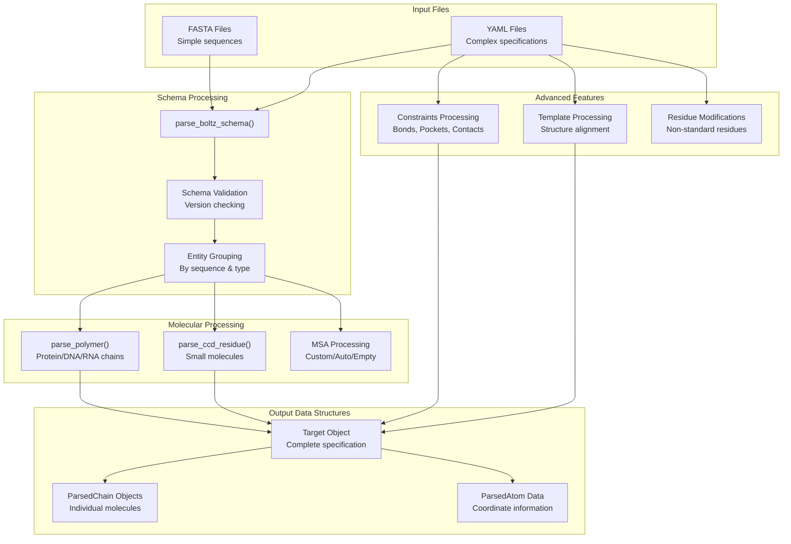
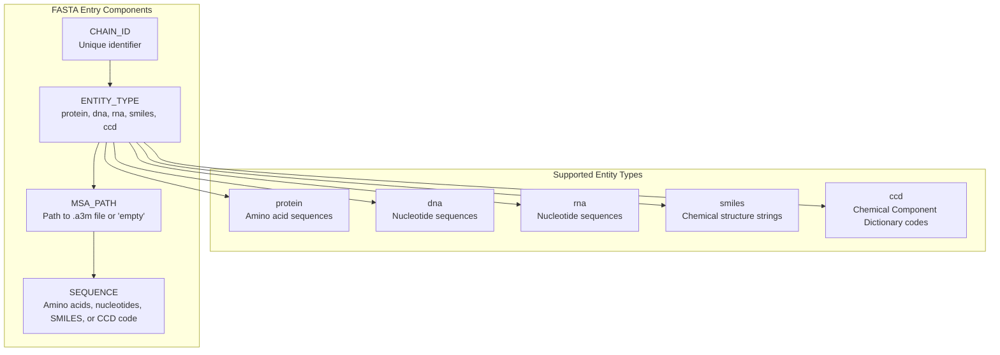
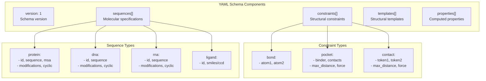
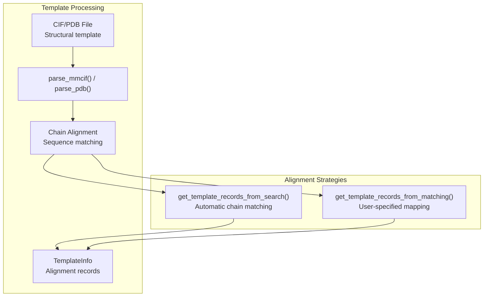

# Input Formats

> **Relevant source files**
> * [docs/boltz2_title.png](https://github.com/jwohlwend/boltz/blob/b1ebfc46/docs/boltz2_title.png)
> * [docs/pearson_plot.png](https://github.com/jwohlwend/boltz/blob/b1ebfc46/docs/pearson_plot.png)
> * [docs/plot_test_boltz2.png](https://github.com/jwohlwend/boltz/blob/b1ebfc46/docs/plot_test_boltz2.png)
> * [docs/prediction.md](https://github.com/jwohlwend/boltz/blob/b1ebfc46/docs/prediction.md?plain=1)
> * [examples/affinity.yaml](https://github.com/jwohlwend/boltz/blob/b1ebfc46/examples/affinity.yaml)
> * [examples/cyclic_prot.yaml](https://github.com/jwohlwend/boltz/blob/b1ebfc46/examples/cyclic_prot.yaml)
> * [examples/msa/seq2.a3m](https://github.com/jwohlwend/boltz/blob/b1ebfc46/examples/msa/seq2.a3m)
> * [examples/multimer.yaml](https://github.com/jwohlwend/boltz/blob/b1ebfc46/examples/multimer.yaml)
> * [examples/prot.fasta](https://github.com/jwohlwend/boltz/blob/b1ebfc46/examples/prot.fasta)
> * [examples/prot.yaml](https://github.com/jwohlwend/boltz/blob/b1ebfc46/examples/prot.yaml)
> * [examples/prot_custom_msa.yaml](https://github.com/jwohlwend/boltz/blob/b1ebfc46/examples/prot_custom_msa.yaml)
> * [src/boltz/data/msa/__init__.py](https://github.com/jwohlwend/boltz/blob/b1ebfc46/src/boltz/data/msa/__init__.py)
> * [src/boltz/data/parse/csv.py](https://github.com/jwohlwend/boltz/blob/b1ebfc46/src/boltz/data/parse/csv.py)
> * [src/boltz/data/parse/pdb.py](https://github.com/jwohlwend/boltz/blob/b1ebfc46/src/boltz/data/parse/pdb.py)
> * [src/boltz/data/parse/schema.py](https://github.com/jwohlwend/boltz/blob/b1ebfc46/src/boltz/data/parse/schema.py)
> * [src/boltz/data/parse/yaml.py](https://github.com/jwohlwend/boltz/blob/b1ebfc46/src/boltz/data/parse/yaml.py)

This document covers the input formats supported by Boltz for specifying molecular structures and their properties. Boltz supports two primary input formats: YAML for complex molecular specifications with advanced features and FASTA for simple sequences (though YAML is preferred).

For information about running predictions with these formats, see [Command-Line Interface](/jwohlwend/boltz/2.1-command-line-interface). For details about the internal data processing pipeline, see [Data Processing](/jwohlwend/boltz/4-data-processing).

## Format Capabilities Overview

Boltz supports two input formats with different feature sets:

| Feature | FASTA | YAML |
| --- | --- | --- |
| Polymers (protein/DNA/RNA) | ✓ | ✓ |
| Small molecules (SMILES) | ✓ | ✓ |
| CCD codes | ✓ | ✓ |
| Custom MSA | ✓ | ✓ |
| Modified residues | ✗ | ✓ |
| Covalent bonds | ✗ | ✓ |
| Pocket conditioning | ✗ | ✓ |
| Contact constraints | ✗ | ✓ |
| Templates | ✗ | ✓ |
| Affinity prediction | ✗ | ✓ |
| Cyclic polymers | ✗ | ✓ |

**Input Format Processing Pipeline**



Sources: [src/boltz/data/parse/schema.py L939-L1798](https://github.com/jwohlwend/boltz/blob/b1ebfc46/src/boltz/data/parse/schema.py#L939-L1798)

 [docs/prediction.md L13-L64](https://github.com/jwohlwend/boltz/blob/b1ebfc46/docs/prediction.md?plain=1#L13-L64)

## FASTA Format

The FASTA format provides a simple way to specify molecular sequences. Each entry follows the pattern:

```
>CHAIN_ID|ENTITY_TYPE|MSA_PATH
SEQUENCE
```

**FASTA Format Structure**



Sources: [docs/prediction.md L108-L137](https://github.com/jwohlwend/boltz/blob/b1ebfc46/docs/prediction.md?plain=1#L108-L137)

 [examples/prot.fasta L1-L2](https://github.com/jwohlwend/boltz/blob/b1ebfc46/examples/prot.fasta#L1-L2)

### FASTA Examples

**Multi-chain protein complex:**

```markdown
>A|protein|./examples/msa/seq1.a3m
MVTPEGNVSLVDESLLVGVTDEDRAVRSAHQFYERLIGLW
>B|protein|./examples/msa/seq1.a3m  
MVTPEGNVSLVDESLLVGVTDEDRAVRSAHQFYERLIGLW
>C|ccd
SAH
>D|smiles
N[C@@H](Cc1ccc(O)cc1)C(=O)O
```

**MSA Options:**

* Custom MSA file: `>A|protein|./path/to/msa.a3m`
* Auto-generated MSA: `>A|protein|` (requires `--use_msa_server` flag)
* Single sequence mode: `>A|protein|empty` (not recommended)
* CSV format with pairing keys: `>A|protein|./path/to/msa.csv`

Sources: [docs/prediction.md L113-L136](https://github.com/jwohlwend/boltz/blob/b1ebfc46/docs/prediction.md?plain=1#L113-L136)

 [src/boltz/data/parse/schema.py L1108-L1137](https://github.com/jwohlwend/boltz/blob/b1ebfc46/src/boltz/data/parse/schema.py#L1108-L1137)

## YAML Format

The YAML format is the preferred input method. It supports versioning and advanced constraints.

**YAML Schema Structure**



Sources: [docs/prediction.md L18-L64](https://github.com/jwohlwend/boltz/blob/b1ebfc46/docs/prediction.md?plain=1#L18-L64)

 [src/boltz/data/parse/schema.py L948-L983](https://github.com/jwohlwend/boltz/blob/b1ebfc46/src/boltz/data/parse/schema.py#L948-L983)

### Basic YAML Structure

```yaml
version: 1sequences:  - protein:      id: A      sequence: "MADQLTEEQIAEFKEAFSLF"      msa: path/to/msa1.a3m  - ligand:      id: B      smiles: "CC1=CC=CC=C1"
```

### Multiple Identical Entities

Chains with identical sequences can be grouped using a list of IDs to reduce redundant specification.

```yaml
sequences:  - protein:      id: [A, B]  # Multiple chains with same sequence      sequence: "MADQLTEEQIAEFKEAFSLF"      msa: path/to/msa1.a3m
```

Sources: [docs/prediction.md L71](https://github.com/jwohlwend/boltz/blob/b1ebfc46/docs/prediction.md?plain=1#L71-L71)

 [src/boltz/data/parse/schema.py L1091-L1096](https://github.com/jwohlwend/boltz/blob/b1ebfc46/src/boltz/data/parse/schema.py#L1091-L1096)

## Advanced YAML Features

### Residue Modifications

Modified residues in polymers are specified using their 1-indexed position and the corresponding CCD code.

```yaml
sequences:  - protein:      id: A      sequence: "MADQLTEEQIAEFKEAFSLF"      modifications:        - position: 5    # 1-indexed residue position          ccd: MSE      # Modified residue CCD code
```

Sources: [docs/prediction.md L26-L28](https://github.com/jwohlwend/boltz/blob/b1ebfc46/docs/prediction.md?plain=1#L26-L28)

 [src/boltz/data/parse/schema.py L1164-L1167](https://github.com/jwohlwend/boltz/blob/b1ebfc46/src/boltz/data/parse/schema.py#L1164-L1167)

### Cyclic Polymers

Polymers (protein, DNA, RNA) can be flagged as cyclic, which affects how covalent bonds are handled at the chain termini.

```yaml
sequences:  - protein:      id: A      sequence: QLEDSEVEAVAKG      cyclic: true
```

Sources: [examples/cyclic_prot.yaml L3-L6](https://github.com/jwohlwend/boltz/blob/b1ebfc46/examples/cyclic_prot.yaml#L3-L6)

 [docs/prediction.md L83](https://github.com/jwohlwend/boltz/blob/b1ebfc46/docs/prediction.md?plain=1#L83-L83)

### Constraints

Boltz supports three types of constraints that can be enforced during inference using the `--use_potentials` flag.

#### Covalent Bonds

Specifies a bond between two specific atoms.

```yaml
constraints:  - bond:      atom1: [A, 1, CA]  # [chain_id, residue_idx, atom_name]      atom2: [B, 2, N]
```

#### Pocket Constraints

Restricts a binder (ligand or polymer) to be within a certain distance of specific contact residues.

```yaml
constraints:  - pocket:      binder: C           # Ligand chain      contacts: [[A, 15], [A, 16], [B, 23]]  # Contact residues      max_distance: 6.0   # Angstroms (4-20A supported)      force: false        # If true, uses a potential to enforce
```

#### Contact Constraints

Specifies a distance constraint between two tokens (residues or atoms).

```yaml
constraints:  - contact:      token1: [A, 5]      # [chain_id, residue_idx/atom_name]      token2: [B, 10]      max_distance: 8.0      force: true
```

Sources: [docs/prediction.md L33-L46](https://github.com/jwohlwend/boltz/blob/b1ebfc46/docs/prediction.md?plain=1#L33-L46)

 [src/boltz/data/parse/schema.py L1494-L1575](https://github.com/jwohlwend/boltz/blob/b1ebfc46/src/boltz/data/parse/schema.py#L1494-L1575)

### Templates

Structural templates for protein chains can be provided via CIF or PDB files. Boltz can automatically find the best matching chains or use a manual mapping.

```yaml
templates:  - cif: path/to/template.cif    force: true                # Enforce backbone with potential    threshold: 2.0             # Max deviation in Angstroms  - pdb: path/to/template2.pdb    chain_id: [A, B]           # Query chains    template_id: [A1, B1]      # Template chains (PDB subchains)
```

**Template Processing Pipeline:**



Sources: [docs/prediction.md L48-L59](https://github.com/jwohlwend/boltz/blob/b1ebfc46/docs/prediction.md?plain=1#L48-L59)

 [src/boltz/data/parse/schema.py L1581-L1693](https://github.com/jwohlwend/boltz/blob/b1ebfc46/src/boltz/data/parse/schema.py#L1581-L1693)

 [src/boltz/data/parse/pdb.py L7-L13](https://github.com/jwohlwend/boltz/blob/b1ebfc46/src/boltz/data/parse/pdb.py#L7-L13)

### Affinity Prediction

Boltz-2 can predict binding affinity for a specified binder.

```yaml
properties:  - affinity:      binder: C  # Chain ID to calculate affinity for
```

Sources: [docs/prediction.md L60-L63](https://github.com/jwohlwend/boltz/blob/b1ebfc46/docs/prediction.md?plain=1#L60-L63)

 [src/boltz/data/parse/schema.py L1045-L1075](https://github.com/jwohlwend/boltz/blob/b1ebfc46/src/boltz/data/parse/schema.py#L1045-L1075)

## Implementation Details

### Data Structures

The parser converts raw YAML/FASTA inputs into a hierarchy of internal dataclasses:

* `ParsedAtom`: Represents individual atoms with elements, charges, and coordinates [src/boltz/data/parse/schema.py L59-L68](https://github.com/jwohlwend/boltz/blob/b1ebfc46/src/boltz/data/parse/schema.py#L59-L68)
* `ParsedResidue`: A collection of atoms and internal bonds for a specific residue [src/boltz/data/parse/schema.py L131-L149](https://github.com/jwohlwend/boltz/blob/b1ebfc46/src/boltz/data/parse/schema.py#L131-L149)
* `ParsedChain`: Represents a full molecular entity (polymer or ligand) [src/boltz/data/parse/schema.py L153-L163](https://github.com/jwohlwend/boltz/blob/b1ebfc46/src/boltz/data/parse/schema.py#L153-L163)
* `Target`: The top-level container for a prediction task, including chains and constraints [src/boltz/data/types.py L49](https://github.com/jwohlwend/boltz/blob/b1ebfc46/src/boltz/data/types.py#L49-L49)

### Parsing Logic

The main entry point is `parse_boltz_schema` [src/boltz/data/parse/schema.py L939](https://github.com/jwohlwend/boltz/blob/b1ebfc46/src/boltz/data/parse/schema.py#L939-L939)

 It handles:

1. **Ligand Featurization**: Uses RDKit to compute 3D conformers via ETKDG if coordinates aren't provided [src/boltz/data/parse/schema.py L200-L254](https://github.com/jwohlwend/boltz/blob/b1ebfc46/src/boltz/data/parse/schema.py#L200-L254)
2. **MSA Parsing**: Processes `.a3m` or `.csv` files into internal `MSA` objects [src/boltz/data/parse/csv.py L11-L100](https://github.com/jwohlwend/boltz/blob/b1ebfc46/src/boltz/data/parse/csv.py#L11-L100)
3. **Template Alignment**: Uses `Align.PairwiseAligner` to match query sequences against template sequences [src/boltz/data/parse/schema.py L541-L624](https://github.com/jwohlwend/boltz/blob/b1ebfc46/src/boltz/data/parse/schema.py#L541-L624)

Sources: [src/boltz/data/parse/schema.py L1-L1798](https://github.com/jwohlwend/boltz/blob/b1ebfc46/src/boltz/data/parse/schema.py#L1-L1798)

 [src/boltz/data/parse/csv.py L1-L100](https://github.com/jwohlwend/boltz/blob/b1ebfc46/src/boltz/data/parse/csv.py#L1-L100)