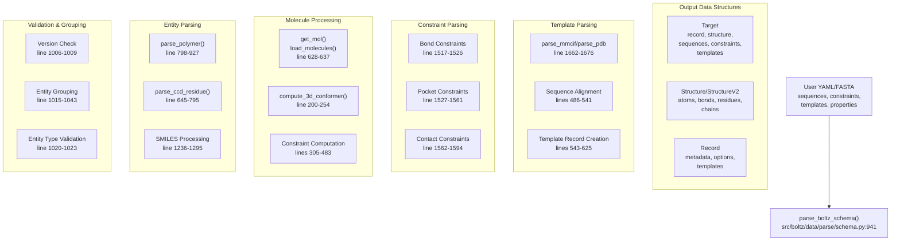
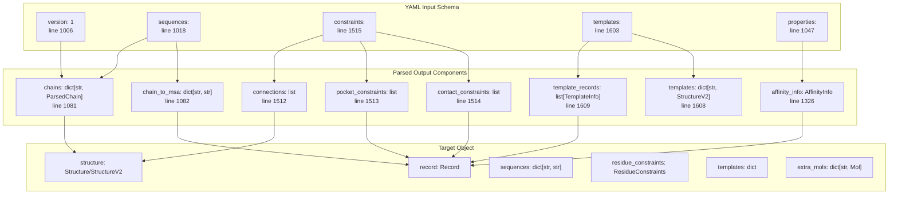
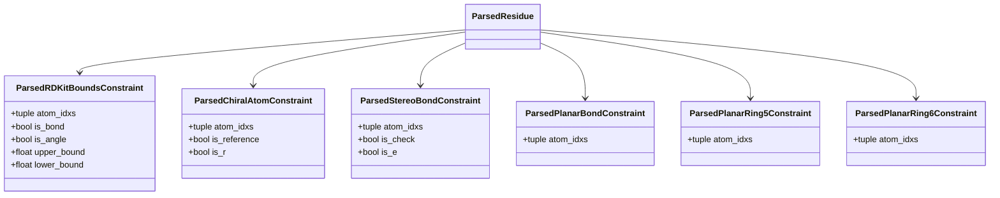
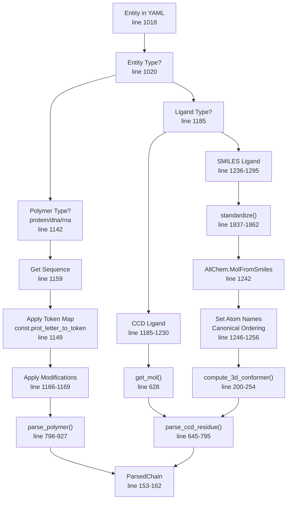
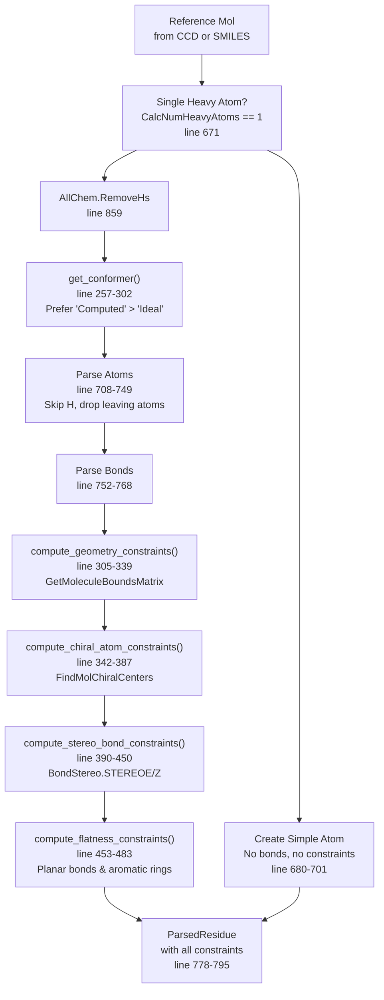
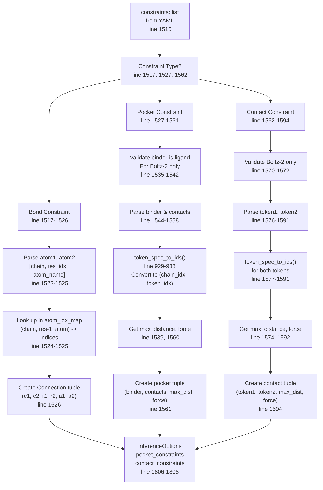
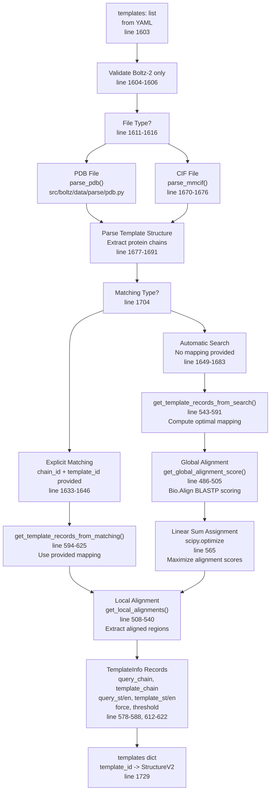
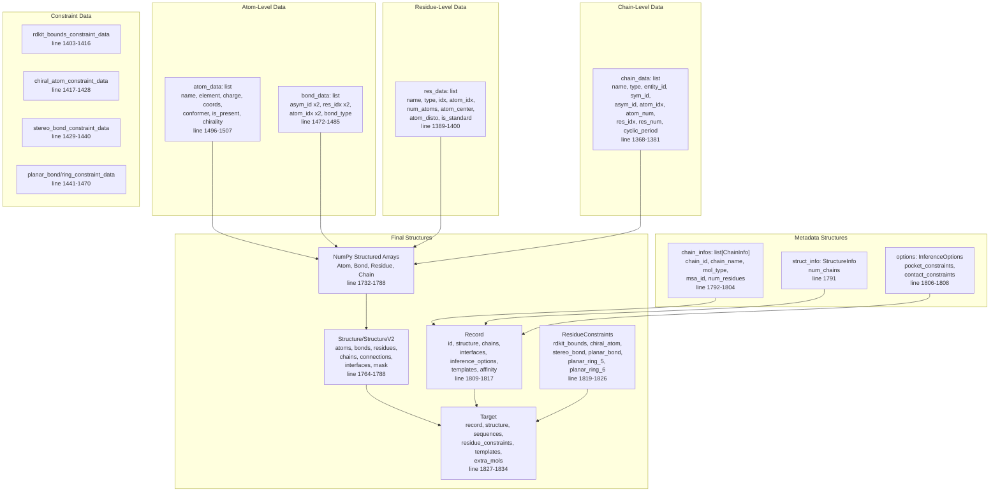

# Input Parsing and Schema

> **Relevant source files**
> * [docs/prediction.md](https://github.com/jwohlwend/boltz/blob/b1ebfc46/docs/prediction.md?plain=1)
> * [src/boltz/data/parse/a3m.py](https://github.com/jwohlwend/boltz/blob/b1ebfc46/src/boltz/data/parse/a3m.py)
> * [src/boltz/data/parse/mmcif.py](https://github.com/jwohlwend/boltz/blob/b1ebfc46/src/boltz/data/parse/mmcif.py)
> * [src/boltz/data/parse/mmcif_with_constraints.py](https://github.com/jwohlwend/boltz/blob/b1ebfc46/src/boltz/data/parse/mmcif_with_constraints.py)
> * [src/boltz/data/parse/pdb.py](https://github.com/jwohlwend/boltz/blob/b1ebfc46/src/boltz/data/parse/pdb.py)
> * [src/boltz/data/parse/schema.py](https://github.com/jwohlwend/boltz/blob/b1ebfc46/src/boltz/data/parse/schema.py)

## Purpose and Scope

This document details the input parsing and schema validation system that converts user-provided YAML/FASTA files into internal data structures for model processing. The parsing system validates input specifications, loads molecular definitions from the Chemical Component Dictionary (CCD), computes geometric constraints, and performs sequence alignments for templates.

For information about user-facing input formats and CLI usage, see [Input Formats](/jwohlwend/boltz/2.2-input-formats). For the subsequent tokenization step, see [Tokenization](/jwohlwend/boltz/4.2-tokenization).

## Overview

The parsing system transforms declarative input specifications into typed, validated data structures. The main entry point is the `parse_boltz_schema` function, which processes YAML dictionaries containing sequences, constraints, templates, and properties into a `Target` object ready for tokenization and featurization.

### High-Level Parsing Flow



**Sources:** [src/boltz/data/parse/schema.py L941-L1834](https://github.com/jwohlwend/boltz/blob/b1ebfc46/src/boltz/data/parse/schema.py#L941-L1834)

## Input Schema Structure

The input schema follows a hierarchical YAML structure with four main sections: `sequences`, `constraints`, `templates`, and `properties`. The parser validates version compatibility and processes each section sequentially.

### Schema Sections Mapping



**Sources:** [src/boltz/data/parse/schema.py L941-L1834](https://github.com/jwohlwend/boltz/blob/b1ebfc46/src/boltz/data/parse/schema.py#L941-L1834)

## Parsed Data Structures

The parsing process creates a hierarchy of dataclasses that represent molecular entities at different levels of granularity.

### Core Dataclass Hierarchy

| Dataclass | Fields | Purpose | Line Reference |
| --- | --- | --- | --- |
| `ParsedAtom` | `name`, `element`, `charge`, `coords`, `conformer`, `is_present`, `chirality` | Represents a single atom with its properties and coordinates | [src/boltz/data/parse/schema.py L58-L68](https://github.com/jwohlwend/boltz/blob/b1ebfc46/src/boltz/data/parse/schema.py#L58-L68) |
| `ParsedBond` | `atom_1`, `atom_2`, `type` | Represents a chemical bond between two atoms | [src/boltz/data/parse/schema.py L72-L77](https://github.com/jwohlwend/boltz/blob/b1ebfc46/src/boltz/data/parse/schema.py#L72-L77) |
| `ParsedResidue` | `name`, `type`, `idx`, `atoms`, `bonds`, `atom_center`, `atom_disto`, `is_standard`, `is_present`, constraints | Represents a residue (amino acid, nucleotide, or ligand molecule) | [src/boltz/data/parse/schema.py L131-L149](https://github.com/jwohlwend/boltz/blob/b1ebfc46/src/boltz/data/parse/schema.py#L131-L149) |
| `ParsedChain` | `entity`, `type`, `residues`, `cyclic_period`, `sequence`, `affinity`, `affinity_mw` | Represents a polymer or non-polymer chain | [src/boltz/data/parse/schema.py L153-L162](https://github.com/jwohlwend/boltz/blob/b1ebfc46/src/boltz/data/parse/schema.py#L153-L162) |
| `Alignment` | `query_st`, `query_en`, `template_st`, `template_en` | Represents sequence alignment coordinates | [src/boltz/data/parse/schema.py L166-L172](https://github.com/jwohlwend/boltz/blob/b1ebfc46/src/boltz/data/parse/schema.py#L166-L172) |

### Constraint Dataclasses



**Sources:** [src/boltz/data/parse/schema.py L58-L149](https://github.com/jwohlwend/boltz/blob/b1ebfc46/src/boltz/data/parse/schema.py#L58-L149)

## Entity Parsing

The parser handles four entity types: proteins, DNA, RNA, and ligands (non-polymers). Each type follows a different parsing path depending on whether it's a standard polymer or a custom molecule.

### Entity Type Resolution Flow



**Sources:** [src/boltz/data/parse/schema.py L645-L1295](https://github.com/jwohlwend/boltz/blob/b1ebfc46/src/boltz/data/parse/schema.py#L645-L1295)

### Polymer Parsing

The `parse_polymer` function processes protein, DNA, and RNA sequences by mapping each residue to its reference structure from the CCD and extracting atomic coordinates.

**Key Steps:**

1. **Sequence Conversion** [src/boltz/data/parse/schema.py L1163](https://github.com/jwohlwend/boltz/blob/b1ebfc46/src/boltz/data/parse/schema.py#L1163-L1163) : Converts letters to token names using predefined mappings (e.g., `const.prot_letter_to_token`)
2. **Modification Application** [src/boltz/data/parse/schema.py L1166-L1169](https://github.com/jwohlwend/boltz/blob/b1ebfc46/src/boltz/data/parse/schema.py#L1166-L1169) : Replaces standard residues with modified CCD components at specified positions
3. **Residue Processing** [src/boltz/data/parse/schema.py L840-L912](https://github.com/jwohlwend/boltz/blob/b1ebfc46/src/boltz/data/parse/schema.py#L840-L912) : For each residue: * Loads reference molecule from CCD [src/boltz/data/parse/schema.py L858](https://github.com/jwohlwend/boltz/blob/b1ebfc46/src/boltz/data/parse/schema.py#L858-L858) * Checks if standard or non-standard [src/boltz/data/parse/schema.py L846](https://github.com/jwohlwend/boltz/blob/b1ebfc46/src/boltz/data/parse/schema.py#L846-L846) * For standard residues: uses `const.ref_atoms` ordering [src/boltz/data/parse/schema.py L864](https://github.com/jwohlwend/boltz/blob/b1ebfc46/src/boltz/data/parse/schema.py#L864-L864) * For non-standard: calls `parse_ccd_residue` [src/boltz/data/parse/schema.py L848-L854](https://github.com/jwohlwend/boltz/blob/b1ebfc46/src/boltz/data/parse/schema.py#L848-L854)
4. **Atom Extraction** [src/boltz/data/parse/schema.py L869-L895](https://github.com/jwohlwend/boltz/blob/b1ebfc46/src/boltz/data/parse/schema.py#L869-L895) : Extracts atoms in canonical order with conformer coordinates
5. **Cyclic Detection** [src/boltz/data/parse/schema.py L914-L917](https://github.com/jwohlwend/boltz/blob/b1ebfc46/src/boltz/data/parse/schema.py#L914-L917) : Sets cyclic period if specified

**Sources:** [src/boltz/data/parse/schema.py L798-L927](https://github.com/jwohlwend/boltz/blob/b1ebfc46/src/boltz/data/parse/schema.py#L798-L927)

### CCD Residue Parsing

The `parse_ccd_residue` function handles arbitrary molecules defined by CCD codes or SMILES strings. It performs conformer generation and constraint computation.



**Constraint Computation Details:**

| Constraint Type | Function | RDKit Method | Purpose |
| --- | --- | --- | --- |
| Geometry Bounds | `compute_geometry_constraints` [src/boltz/data/parse/schema.py L305-L339](https://github.com/jwohlwend/boltz/blob/b1ebfc46/src/boltz/data/parse/schema.py#L305-L339) | `GetMoleculeBoundsMatrix` | Distance bounds between atom pairs (bonds, angles, VDW) |
| Chiral Atoms | `compute_chiral_atom_constraints` [src/boltz/data/parse/schema.py L342-L387](https://github.com/jwohlwend/boltz/blob/b1ebfc46/src/boltz/data/parse/schema.py#L342-L387) | `FindMolChiralCenters` | Enforces R/S chirality at stereogenic centers |
| Stereo Bonds | `compute_stereo_bond_constraints` [src/boltz/data/parse/schema.py L390-L450](https://github.com/jwohlwend/boltz/blob/b1ebfc46/src/boltz/data/parse/schema.py#L390-L450) | `GetStereo` | Enforces E/Z stereochemistry at double bonds |
| Planar Bonds | `compute_flatness_constraints` [src/boltz/data/parse/schema.py L453-L483](https://github.com/jwohlwend/boltz/blob/b1ebfc46/src/boltz/data/parse/schema.py#L453-L483) | SMARTS matching | Enforces planarity for aromatic rings and double bonds |

**Sources:** [src/boltz/data/parse/schema.py L305-L795](https://github.com/jwohlwend/boltz/blob/b1ebfc46/src/boltz/data/parse/schema.py#L305-L795)

### SMILES Processing

For ligands specified via SMILES strings, the parser performs additional standardization and conformer generation.

**Processing Steps:**

1. **Standardization** [src/boltz/data/parse/schema.py L1240](https://github.com/jwohlwend/boltz/blob/b1ebfc46/src/boltz/data/parse/schema.py#L1240-L1240) : Uses ChEMBL structure pipeline to canonicalize the molecule * Calls `standardize()` function [src/boltz/data/parse/schema.py L1837-L1862](https://github.com/jwohlwend/boltz/blob/b1ebfc46/src/boltz/data/parse/schema.py#L1837-L1862) * Removes salts via `LargestFragmentChooser` * Applies ChEMBL standardization rules
2. **Molecule Creation** [src/boltz/data/parse/schema.py L1242](https://github.com/jwohlwend/boltz/blob/b1ebfc46/src/boltz/data/parse/schema.py#L1242-L1242) : Creates RDKit mol with `AllChem.MolFromSmiles`
3. **Hydrogen Addition** [src/boltz/data/parse/schema.py L1243](https://github.com/jwohlwend/boltz/blob/b1ebfc46/src/boltz/data/parse/schema.py#L1243-L1243) : Adds explicit hydrogens with `AllChem.AddHs`
4. **Atom Naming** [src/boltz/data/parse/schema.py L1246-L1256](https://github.com/jwohlwend/boltz/blob/b1ebfc46/src/boltz/data/parse/schema.py#L1246-L1256) : Assigns atom names based on canonical ordering * Format: `{Element}{CanonicalRank + 1}` (e.g., "C1", "O2") * Validates name length ≤ 4 characters
5. **3D Conformer** [src/boltz/data/parse/schema.py L1258](https://github.com/jwohlwend/boltz/blob/b1ebfc46/src/boltz/data/parse/schema.py#L1258-L1258) : Generates 3D coordinates using ETKDG * Tries ETKDGv3, falls back to random coords if needed [src/boltz/data/parse/schema.py L200-L254](https://github.com/jwohlwend/boltz/blob/b1ebfc46/src/boltz/data/parse/schema.py#L200-L254) * Optimizes with UFF force field [src/boltz/data/parse/schema.py L240](https://github.com/jwohlwend/boltz/blob/b1ebfc46/src/boltz/data/parse/schema.py#L240-L240)
6. **Affinity Checks** [src/boltz/data/parse/schema.py L1266-L1272](https://github.com/jwohlwend/boltz/blob/b1ebfc46/src/boltz/data/parse/schema.py#L1266-L1272) : Validates ligand size for affinity prediction * Maximum 128 atoms (error) * Warning if > 56 atoms (training limit)

**Sources:** [src/boltz/data/parse/schema.py L200-L1862](https://github.com/jwohlwend/boltz/blob/b1ebfc46/src/boltz/data/parse/schema.py#L200-L1862)

## Constraint Parsing

The parser processes three types of user-specified constraints: bond constraints, pocket constraints, and contact constraints. These are stored in the `InferenceOptions` object within the `Record`.

### Constraint Processing Flow



### Token Specification Resolution

The `token_spec_to_ids` function [src/boltz/data/parse/schema.py L929-L938](https://github.com/jwohlwend/boltz/blob/b1ebfc46/src/boltz/data/parse/schema.py#L929-L938)

 converts user-friendly chain/residue/atom specifications to internal indices:

| Input Type | Chain Type | Resolution | Example |
| --- | --- | --- | --- |
| Residue Index | Polymer (protein/DNA/RNA) | `(chain_idx, residue_idx - 1)` | `[A, 42]` → `(0, 41)` |
| Atom Name | Non-polymer (ligand) | `(chain_idx, atom_idx)` | `[E, C1]` → `(4, 5)` |

The function looks up atoms in the `atom_idx_map` dictionary [src/boltz/data/parse/schema.py L1343](https://github.com/jwohlwend/boltz/blob/b1ebfc46/src/boltz/data/parse/schema.py#L1343-L1343)

 which maps `(chain_name, res_idx, atom_name)` tuples to `(asym_id, res_idx, atom_idx)` tuples.

**Sources:** [src/boltz/data/parse/schema.py L929-L1594](https://github.com/jwohlwend/boltz/blob/b1ebfc46/src/boltz/data/parse/schema.py#L929-L1594)

## Template Parsing

Template structures provide structural guidance during prediction. The parser loads template files (CIF or PDB), extracts protein chains, performs sequence alignment, and creates `TemplateInfo` records.

### Template Loading and Alignment



### Alignment Algorithm Details

**Global Alignment** [src/boltz/data/parse/schema.py L486-L505](https://github.com/jwohlwend/boltz/blob/b1ebfc46/src/boltz/data/parse/schema.py#L486-L505)

:

* Uses `Bio.Align.PairwiseAligner` with BLASTP scoring matrix
* Mode: `global`
* Returns single numerical score representing sequence similarity

**Optimal Chain Matching** [src/boltz/data/parse/schema.py L554-L566](https://github.com/jwohlwend/boltz/blob/b1ebfc46/src/boltz/data/parse/schema.py#L554-L566)

:

* Computes pairwise global alignment scores for all query-template chain pairs
* Uses `scipy.optimize.linear_sum_assignment` to find optimal one-to-one mapping
* Maximizes total alignment score across all chains

**Local Alignment** [src/boltz/data/parse/schema.py L508-L540](https://github.com/jwohlwend/boltz/blob/b1ebfc46/src/boltz/data/parse/schema.py#L508-L540)

:

* Uses `Bio.Align.PairwiseAligner` with BLASTP scoring
* Mode: `local`
* Gap penalties: `-1000` (strongly discourages gaps)
* Extracts aligned regions as `Alignment` objects with start/end coordinates

**Template Records Creation:**

Each aligned region produces a `TemplateInfo` record [src/boltz/data/parse/schema.py L578-L622](https://github.com/jwohlwend/boltz/blob/b1ebfc46/src/boltz/data/parse/schema.py#L578-L622)

 containing:

* `name`: Template ID (file stem)
* `query_chain`: Query chain ID
* `query_st`, `query_en`: Query alignment range
* `template_chain`: Template chain ID
* `template_st`, `template_en`: Template alignment range
* `force`: Whether to apply template potential (default: `False`)
* `threshold`: Distance threshold for template enforcement (required if `force=True`)

**Sources:** [src/boltz/data/parse/schema.py L486-L1729](https://github.com/jwohlwend/boltz/blob/b1ebfc46/src/boltz/data/parse/schema.py#L486-L1729)

 [src/boltz/data/parse/pdb.py L7-L39](https://github.com/jwohlwend/boltz/blob/b1ebfc46/src/boltz/data/parse/pdb.py#L7-L39)

## Affinity Parsing

The parser handles affinity prediction configuration specified in the `properties` section. Affinity is only supported for single ligand chains in Boltz-2.

**Validation Steps:**

1. **Boltz-2 Check** [src/boltz/data/parse/schema.py L1048-L1050](https://github.com/jwohlwend/boltz/blob/b1ebfc46/src/boltz/data/parse/schema.py#L1048-L1050) : Raises error if affinity requested for Boltz-1
2. **Binder Type Check** [src/boltz/data/parse/schema.py L1056-L1070](https://github.com/jwohlwend/boltz/blob/b1ebfc46/src/boltz/data/parse/schema.py#L1056-L1070) : Ensures binder is a single ligand chain, not protein/DNA/RNA
3. **Uniqueness Check** [src/boltz/data/parse/schema.py L1074-L1077](https://github.com/jwohlwend/boltz/blob/b1ebfc46/src/boltz/data/parse/schema.py#L1074-L1077) : Ensures only one affinity ligand per structure
4. **Copy Check** [src/boltz/data/parse/schema.py L1100-L1106](https://github.com/jwohlwend/boltz/blob/b1ebfc46/src/boltz/data/parse/schema.py#L1100-L1106) : Prohibits affinity for ligands with multiple copies
5. **Size Validation** [src/boltz/data/parse/schema.py L1205-L1272](https://github.com/jwohlwend/boltz/blob/b1ebfc46/src/boltz/data/parse/schema.py#L1205-L1272) : * Error if > 128 atoms * Warning if > 56 atoms (training limit)

**Affinity Information Storage:**

When affinity is enabled, an `AffinityInfo` object [src/boltz/data/parse/schema.py L1360-L1363](https://github.com/jwohlwend/boltz/blob/b1ebfc46/src/boltz/data/parse/schema.py#L1360-L1363)

 is created containing:

* `chain_id`: The `asym_id` of the affinity ligand chain
* `mw`: Molecular weight of the ligand (used for optional MW correction)

This information is attached to the `Record` object [src/boltz/data/parse/schema.py L1816](https://github.com/jwohlwend/boltz/blob/b1ebfc46/src/boltz/data/parse/schema.py#L1816-L1816)

 for use during featurization and model inference.

**Sources:** [src/boltz/data/parse/schema.py L1047-L1363](https://github.com/jwohlwend/boltz/blob/b1ebfc46/src/boltz/data/parse/schema.py#L1047-L1363)

## Output Data Structures

The `parse_boltz_schema` function returns a `Target` object that consolidates all parsed information into structured arrays and metadata.

### Target Assembly Flow



### Structure Versions

The parser generates different structure formats depending on the Boltz version:

| Version | Structure Type | Atom Fields | Bond Fields | Special Features |
| --- | --- | --- | --- | --- |
| Boltz-1 | `Structure` [src/boltz/data/parse/schema.py L1780-L1788](https://github.com/jwohlwend/boltz/blob/b1ebfc46/src/boltz/data/parse/schema.py#L1780-L1788) | `name` (4 ints), `element`, `charge`, `coords`, `conformer`, `is_present`, `chirality` | `atom_1`, `atom_2`, `type` | Atom names encoded as 4-byte integers; separate `Connection` array for bonds [src/boltz/data/parse/schema.py L1779](https://github.com/jwohlwend/boltz/blob/b1ebfc46/src/boltz/data/parse/schema.py#L1779-L1779) |
| Boltz-2 | `StructureV2` [src/boltz/data/parse/schema.py L1764-L1773](https://github.com/jwohlwend/boltz/blob/b1ebfc46/src/boltz/data/parse/schema.py#L1764-L1773) | `name` (string), `coords`, `is_present`, `b_factor`, `occupancy` | `asym_id_1`, `asym_id_2`, `res_idx_1`, `res_idx_2`, `atom_idx_1`, `atom_idx_2`, `type` | Atom names as strings; bonds include chain/residue context; `Coords` and `Ensemble` arrays [src/boltz/data/parse/schema.py L1761-L1763](https://github.com/jwohlwend/boltz/blob/b1ebfc46/src/boltz/data/parse/schema.py#L1761-L1763) |

**Boltz-1 Atom Name Encoding** [src/boltz/data/parse/schema.py L1776](https://github.com/jwohlwend/boltz/blob/b1ebfc46/src/boltz/data/parse/schema.py#L1776-L1776)

: Uses `convert_atom_name()` [src/boltz/data/parse/schema.py L180-L197](https://github.com/jwohlwend/boltz/blob/b1ebfc46/src/boltz/data/parse/schema.py#L180-L197)

 to encode each character as `ord(c) - 32`, padded to 4 integers.

**Boltz-2 Connection Merging** [src/boltz/data/parse/schema.py L1757-L1758](https://github.com/jwohlwend/boltz/blob/b1ebfc46/src/boltz/data/parse/schema.py#L1757-L1758)

: User-specified bond constraints are converted to `BondV2` format with `COVALENT` type and merged with residue-internal bonds.

**Sources:** [src/boltz/data/parse/schema.py L1732-L1834](https://github.com/jwohlwend/boltz/blob/b1ebfc46/src/boltz/data/parse/schema.py#L1732-L1834)

## Helper Functions

### Molecule Loading

The `get_mol` function [src/boltz/data/parse/schema.py L628-L637](https://github.com/jwohlwend/boltz/blob/b1ebfc46/src/boltz/data/parse/schema.py#L628-L637)

 manages molecule retrieval from the CCD cache:

```python
def get_mol(ccd: str, mols: dict, moldir: str) -> Mol
```

* Checks if molecule already in `mols` dictionary
* If not found, loads from `moldir` using `load_molecules()` [src/boltz/data/parse/schema.py L636](https://github.com/jwohlwend/boltz/blob/b1ebfc46/src/boltz/data/parse/schema.py#L636-L636)
* Caches result in `mols` dictionary for reuse

### Conformer Selection

The `get_conformer` function [src/boltz/data/parse/schema.py L257-L302](https://github.com/jwohlwend/boltz/blob/b1ebfc46/src/boltz/data/parse/schema.py#L257-L302)

 prioritizes conformers:

1. **Computed conformer** [src/boltz/data/parse/schema.py L279-L284](https://github.com/jwohlwend/boltz/blob/b1ebfc46/src/boltz/data/parse/schema.py#L279-L284) : Generated by `compute_3d_conformer()`
2. **Ideal conformer** [src/boltz/data/parse/schema.py L287-L292](https://github.com/jwohlwend/boltz/blob/b1ebfc46/src/boltz/data/parse/schema.py#L287-L292) : From CCD ideal coordinates
3. **First available** [src/boltz/data/parse/schema.py L295-L299](https://github.com/jwohlwend/boltz/blob/b1ebfc46/src/boltz/data/parse/schema.py#L295-L299) : Any conformer by ID

Raises `ValueError` if no conformers exist [src/boltz/data/parse/schema.py L301-L302](https://github.com/jwohlwend/boltz/blob/b1ebfc46/src/boltz/data/parse/schema.py#L301-L302)

### Entity Grouping

The parser groups entities by `(entity_type, sequence)` tuples [src/boltz/data/parse/schema.py L1015-L1043](https://github.com/jwohlwend/boltz/blob/b1ebfc46/src/boltz/data/parse/schema.py#L1015-L1043)

 to:

* Assign unique entity IDs
* Enable MSA sharing across identical sequences
* Support multiple chains with same sequence (e.g., `id: [A, B]`)

Entity grouping ensures that chains A and B with identical sequences share the same MSA and are assigned the same `entity_id` but different `sym_id` values [src/boltz/data/parse/schema.py L1367-L1383](https://github.com/jwohlwend/boltz/blob/b1ebfc46/src/boltz/data/parse/schema.py#L1367-L1383)

**Sources:** [src/boltz/data/parse/schema.py L257-L1043](https://github.com/jwohlwend/boltz/blob/b1ebfc46/src/boltz/data/parse/schema.py#L257-L1043)