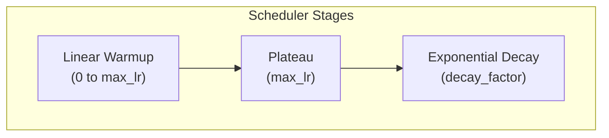
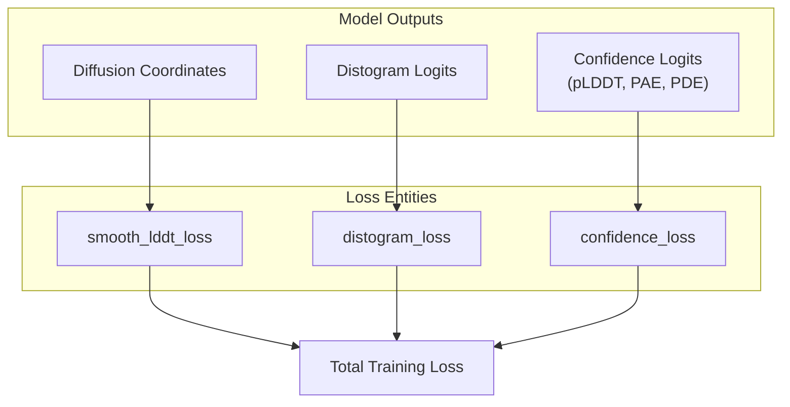

# Loss Functions and Optimization

> **Relevant source files**
> * [scripts/eval/physcialsim_metrics.py](https://github.com/jwohlwend/boltz/blob/b1ebfc46/scripts/eval/physcialsim_metrics.py)
> * [scripts/train/configs/confidence.yaml](https://github.com/jwohlwend/boltz/blob/b1ebfc46/scripts/train/configs/confidence.yaml)
> * [scripts/train/configs/full.yaml](https://github.com/jwohlwend/boltz/blob/b1ebfc46/scripts/train/configs/full.yaml)
> * [scripts/train/configs/structure.yaml](https://github.com/jwohlwend/boltz/blob/b1ebfc46/scripts/train/configs/structure.yaml)
> * [src/boltz/data/module/inferencev2.py](https://github.com/jwohlwend/boltz/blob/b1ebfc46/src/boltz/data/module/inferencev2.py)
> * [src/boltz/data/parse/fasta.py](https://github.com/jwohlwend/boltz/blob/b1ebfc46/src/boltz/data/parse/fasta.py)
> * [src/boltz/model/loss/confidence.py](https://github.com/jwohlwend/boltz/blob/b1ebfc46/src/boltz/model/loss/confidence.py)
> * [src/boltz/model/loss/confidencev2.py](https://github.com/jwohlwend/boltz/blob/b1ebfc46/src/boltz/model/loss/confidencev2.py)
> * [src/boltz/model/loss/diffusion.py](https://github.com/jwohlwend/boltz/blob/b1ebfc46/src/boltz/model/loss/diffusion.py)
> * [src/boltz/model/loss/diffusionv2.py](https://github.com/jwohlwend/boltz/blob/b1ebfc46/src/boltz/model/loss/diffusionv2.py)
> * [src/boltz/model/loss/distogram.py](https://github.com/jwohlwend/boltz/blob/b1ebfc46/src/boltz/model/loss/distogram.py)
> * [src/boltz/model/optim/ema.py](https://github.com/jwohlwend/boltz/blob/b1ebfc46/src/boltz/model/optim/ema.py)
> * [src/boltz/model/optim/scheduler.py](https://github.com/jwohlwend/boltz/blob/b1ebfc46/src/boltz/model/optim/scheduler.py)

This page documents the loss function components, weighting schemes, optimizer configuration, and learning rate scheduling used in the Boltz training system. Boltz employs a multi-task loss approach to optimize for structural accuracy, physical plausibility, and confidence estimation.

## Optimization Strategy

Boltz utilizes the Adam optimizer with a specialized learning rate schedule derived from AlphaFold3. The training process is typically managed by PyTorch Lightning, which orchestrates the optimization steps across one or more devices.

### Optimizer Configuration

The model uses Adam with specific beta parameters and epsilon values to ensure stable convergence:

* **Adam Beta 1**: 0.9 [scripts/train/configs/structure.yaml L149](https://github.com/jwohlwend/boltz/blob/b1ebfc46/scripts/train/configs/structure.yaml#L149-L149)
* **Adam Beta 2**: 0.95 [scripts/train/configs/structure.yaml L150](https://github.com/jwohlwend/boltz/blob/b1ebfc46/scripts/train/configs/structure.yaml#L150-L150)
* **Adam Epsilon**: 1e-8 [scripts/train/configs/structure.yaml L151](https://github.com/jwohlwend/boltz/blob/b1ebfc46/scripts/train/configs/structure.yaml#L151-L151)
* **Gradient Clipping**: 10.0 [scripts/train/configs/structure.yaml L5](https://github.com/jwohlwend/boltz/blob/b1ebfc46/scripts/train/configs/structure.yaml#L5-L5)

### Learning Rate Schedule

The `AlphaFoldLRScheduler` implements a three-stage schedule: linear warmup, plateau, and exponential decay [src/boltz/model/optim/scheduler.py L4-L13](https://github.com/jwohlwend/boltz/blob/b1ebfc46/src/boltz/model/optim/scheduler.py#L4-L13)

**Learning Rate Dynamics**

* **Max Learning Rate**: 1.8e-3 [src/boltz/model/optim/scheduler.py L20](https://github.com/jwohlwend/boltz/blob/b1ebfc46/src/boltz/model/optim/scheduler.py#L20-L20)
* **Warmup Steps**: 1,000 steps [src/boltz/model/optim/scheduler.py L21](https://github.com/jwohlwend/boltz/blob/b1ebfc46/src/boltz/model/optim/scheduler.py#L21-L21)
* **Decay Start**: 50,000 steps [src/boltz/model/optim/scheduler.py L22](https://github.com/jwohlwend/boltz/blob/b1ebfc46/src/boltz/model/optim/scheduler.py#L22-L22)
* **Decay Interval**: Every 50,000 steps [src/boltz/model/optim/scheduler.py L23](https://github.com/jwohlwend/boltz/blob/b1ebfc46/src/boltz/model/optim/scheduler.py#L23-L23)
* **Decay Factor**: 0.95 [src/boltz/model/optim/scheduler.py L24](https://github.com/jwohlwend/boltz/blob/b1ebfc46/src/boltz/model/optim/scheduler.py#L24-L24)

Sources: [src/boltz/model/optim/scheduler.py L88-L99](https://github.com/jwohlwend/boltz/blob/b1ebfc46/src/boltz/model/optim/scheduler.py#L88-L99)

 [scripts/train/configs/structure.yaml L152-L158](https://github.com/jwohlwend/boltz/blob/b1ebfc46/scripts/train/configs/structure.yaml#L152-L158)

### Exponential Moving Average (EMA)

To improve generalization, Boltz maintains a moving average of the model weights using the `EMA` callback [src/boltz/model/optim/ema.py L14-L26](https://github.com/jwohlwend/boltz/blob/b1ebfc46/src/boltz/model/optim/ema.py#L14-L26)

 During evaluation and checkpoint saving, the EMA weights are preferred [src/boltz/model/optim/ema.py L33-L49](https://github.com/jwohlwend/boltz/blob/b1ebfc46/src/boltz/model/optim/ema.py#L33-L49)

* **Decay**: 0.999 [scripts/train/configs/structure.yaml L91](https://github.com/jwohlwend/boltz/blob/b1ebfc46/scripts/train/configs/structure.yaml#L91-L91)
* **Warm Start**: The decay is adjusted during the early steps to prevent bias from the initial random weights [src/boltz/model/optim/ema.py L133-L134](https://github.com/jwohlwend/boltz/blob/b1ebfc46/src/boltz/model/optim/ema.py#L133-L134)

Sources: [src/boltz/model/optim/ema.py L132-L143](https://github.com/jwohlwend/boltz/blob/b1ebfc46/src/boltz/model/optim/ema.py#L132-L143)

 [scripts/train/configs/structure.yaml L90-L91](https://github.com/jwohlwend/boltz/blob/b1ebfc46/scripts/train/configs/structure.yaml#L90-L91)

## Loss Function Components

The total loss is a weighted sum of several components targeting different aspects of the prediction.

### Structure Loss

The primary structure loss is driven by the diffusion process.

* **Diffusion Loss**: Computed in `diffusion_loss` (or `diffusion_loss_v2`), it supervises the coordinate denoising process. It includes specific weights for nucleotides (5.0) and ligands (10.0) to emphasize their structural importance [scripts/train/configs/structure.yaml L185-L186](https://github.com/jwohlwend/boltz/blob/b1ebfc46/scripts/train/configs/structure.yaml#L185-L186)
* **Smooth lDDT Loss**: Algorithm 27 implementation that provides a differentiable approximation of the Local Distance Difference Test [src/boltz/model/loss/diffusionv2.py L87-L139](https://github.com/jwohlwend/boltz/blob/b1ebfc46/src/boltz/model/loss/diffusionv2.py#L87-L139)
* **Distogram Loss**: A cross-entropy loss over predicted inter-token distance bins, computed in `distogram_loss` [src/boltz/model/loss/distogram.py L5-L48](https://github.com/jwohlwend/boltz/blob/b1ebfc46/src/boltz/model/loss/distogram.py#L5-L48)

### Confidence Loss

Computed in `confidence_loss`, this module supervises the `ConfidenceModule` outputs [src/boltz/model/loss/confidencev2.py L8-L87](https://github.com/jwohlwend/boltz/blob/b1ebfc46/src/boltz/model/loss/confidencev2.py#L8-L87)

* **pLDDT Loss**: Supervises the per-token/atom confidence prediction [src/boltz/model/loss/confidencev2.py L21-L32](https://github.com/jwohlwend/boltz/blob/b1ebfc46/src/boltz/model/loss/confidencev2.py#L21-L32)
* **PDE Loss**: Supervises Predicted Distance Error [src/boltz/model/loss/confidencev2.py L33-L43](https://github.com/jwohlwend/boltz/blob/b1ebfc46/src/boltz/model/loss/confidencev2.py#L33-L43)
* **PAE Loss**: Supervises Predicted Aligned Error [src/boltz/model/loss/confidencev2.py L55-L65](https://github.com/jwohlwend/boltz/blob/b1ebfc46/src/boltz/model/loss/confidencev2.py#L55-L65)
* **Resolved Loss**: Supervises the binary prediction of whether an atom's position is resolved in the experimental structure [src/boltz/model/loss/confidencev2.py L44-L51](https://github.com/jwohlwend/boltz/blob/b1ebfc46/src/boltz/model/loss/confidencev2.py#L44-L51)

**Loss Aggregation Flow**

Sources: [src/boltz/model/loss/confidencev2.py L67-L73](https://github.com/jwohlwend/boltz/blob/b1ebfc46/src/boltz/model/loss/confidencev2.py#L67-L73)

 [src/boltz/model/loss/distogram.py L38-L47](https://github.com/jwohlwend/boltz/blob/b1ebfc46/src/boltz/model/loss/distogram.py#L38-L47)

 [scripts/train/configs/structure.yaml L146-L148](https://github.com/jwohlwend/boltz/blob/b1ebfc46/scripts/train/configs/structure.yaml#L146-L148)

## Weighting Schemes

Loss weights vary depending on the training stage. For example, the `confidence_loss_weight` is significantly higher during the "Full" and "Confidence" stages compared to the initial "Structure" stage.

| Loss Component | Parameter Name | Structure Stage | Full/Conf Stage |
| --- | --- | --- | --- |
| Diffusion | `diffusion_loss_weight` | 4.0 | 4.0 |
| Distogram | `distogram_loss_weight` | 0.03 | 0.03 |
| Confidence | `confidence_loss_weight` | 1e-4 | 3e-3 |
| Nucleotide | `nucleotide_loss_weight` | 5.0 | 5.0 |
| Ligand | `ligand_loss_weight` | 10.0 | 10.0 |

Sources: [scripts/train/configs/structure.yaml L146-L148](https://github.com/jwohlwend/boltz/blob/b1ebfc46/scripts/train/configs/structure.yaml#L146-L148)

 [scripts/train/configs/full.yaml L150-L152](https://github.com/jwohlwend/boltz/blob/b1ebfc46/scripts/train/configs/full.yaml#L150-L152)

 [scripts/train/configs/confidence.yaml L151-L153](https://github.com/jwohlwend/boltz/blob/b1ebfc46/scripts/train/configs/confidence.yaml#L151-L153)

## Geometry and Symmetry Correction

During loss calculation, Boltz handles molecular symmetries and physical constraints to ensure meaningful gradients.

### Weighted Rigid Alignment

`weighted_rigid_align` (Algorithm 28) is used to align predicted coordinates to ground truth by calculating the optimal rotation and translation while respecting per-atom weights and masks [src/boltz/model/loss/diffusionv2.py L9-L84](https://github.com/jwohlwend/boltz/blob/b1ebfc46/src/boltz/model/loss/diffusionv2.py#L9-L84)

### Symmetry Correction

For structures with symmetric components (e.g., homomers or symmetric ligands), the training system applies symmetry correction during validation and optionally during training to ensure the loss is calculated against the closest symmetric permutation [scripts/train/configs/full.yaml L163-L170](https://github.com/jwohlwend/boltz/blob/b1ebfc46/scripts/train/configs/full.yaml#L163-L170)

### Physical Metrics

While not directly part of the backpropagated loss, Boltz monitors physical plausibility through:

* **Bond Length/Angle Violations**: Checked against RDKit bounds [scripts/eval/physcialsim_metrics.py L49-L54](https://github.com/jwohlwend/boltz/blob/b1ebfc46/scripts/eval/physcialsim_metrics.py#L49-L54)
* **Stereochemistry Violations**: Checks chiral atom and stereo bond orientations [scripts/eval/physcialsim_metrics.py L88-L102](https://github.com/jwohlwend/boltz/blob/b1ebfc46/scripts/eval/physcialsim_metrics.py#L88-L102)
* **Clash Detection**: Identifies steric clashes between chains or atoms [scripts/eval/physcialsim_metrics.py L146-L158](https://github.com/jwohlwend/boltz/blob/b1ebfc46/scripts/eval/physcialsim_metrics.py#L146-L158)

Sources: [src/boltz/model/loss/diffusionv2.py L15-L16](https://github.com/jwohlwend/boltz/blob/b1ebfc46/src/boltz/model/loss/diffusionv2.py#L15-L16)

 [scripts/eval/physcialsim_metrics.py L38-L72](https://github.com/jwohlwend/boltz/blob/b1ebfc46/scripts/eval/physcialsim_metrics.py#L38-L72)