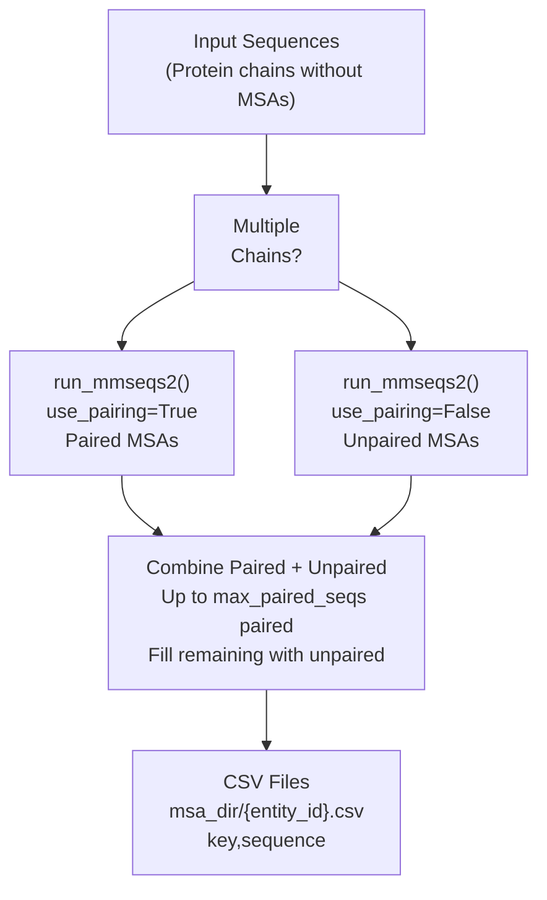
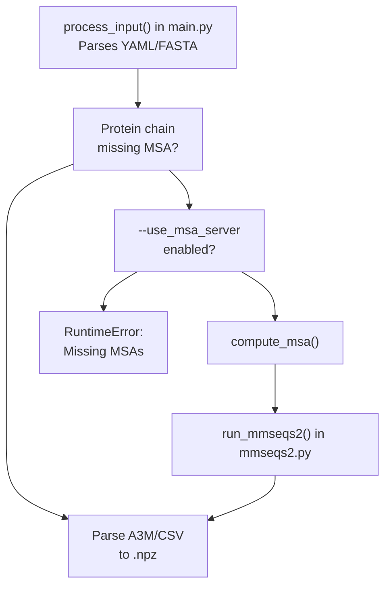

# MSA Generation

> **Relevant source files**
> * [docs/prediction.md](https://github.com/jwohlwend/boltz/blob/b1ebfc46/docs/prediction.md?plain=1)
> * [src/boltz/data/msa/mmseqs2.py](https://github.com/jwohlwend/boltz/blob/b1ebfc46/src/boltz/data/msa/mmseqs2.py)
> * [src/boltz/data/parse/a3m.py](https://github.com/jwohlwend/boltz/blob/b1ebfc46/src/boltz/data/parse/a3m.py)
> * [src/boltz/data/parse/pdb.py](https://github.com/jwohlwend/boltz/blob/b1ebfc46/src/boltz/data/parse/pdb.py)
> * [src/boltz/main.py](https://github.com/jwohlwend/boltz/blob/b1ebfc46/src/boltz/main.py)

## Purpose and Scope

This document explains how Multiple Sequence Alignments (MSAs) are generated and provided to the Boltz prediction pipeline. MSAs are critical for protein structure prediction as they provide evolutionary context that improves accuracy.

This page covers:

* Automatic MSA generation using the MMseqs2 server API.
* Authentication methods for MSA server access (Basic Auth vs. API Keys).
* Custom MSA file formats (A3M and CSV).
* The workflow from input sequences to processed MSA data.

For information about how MSAs are parsed and processed into model features, see [MSA Processing](https://github.com/jwohlwend/boltz/blob/b1ebfc46/MSA Processing)

 For details on how MSA features are used in the model, see [Feature Generation](https://github.com/jwohlwend/boltz/blob/b1ebfc46/Feature Generation)

---

## Overview

Boltz supports two approaches for providing MSAs:

1. **Automatic Generation**: When the `--use_msa_server` flag is set, Boltz automatically generates MSAs by querying the MMseqs2 server API with protein sequences [docs/prediction.md L7-L9](https://github.com/jwohlwend/boltz/blob/b1ebfc46/docs/prediction.md?plain=1#L7-L9)
2. **Pre-computed MSAs**: Users can provide custom MSA files in A3M or CSV format via the input YAML specification [docs/prediction.md L73-L78](https://github.com/jwohlwend/boltz/blob/b1ebfc46/docs/prediction.md?plain=1#L73-L78)

MSA generation only applies to protein sequences. DNA, RNA, and ligand entities do not use MSAs and their `msa_id` fields are set to `-1` during processing [src/boltz/main.py L576-L578](https://github.com/jwohlwend/boltz/blob/b1ebfc46/src/boltz/main.py#L576-L578)

**Sources:** [src/boltz/main.py L576-L578](https://github.com/jwohlwend/boltz/blob/b1ebfc46/src/boltz/main.py#L576-L578)

 [docs/prediction.md L7-L9](https://github.com/jwohlwend/boltz/blob/b1ebfc46/docs/prediction.md?plain=1#L7-L9)

 [docs/prediction.md L73-L78](https://github.com/jwohlwend/boltz/blob/b1ebfc46/docs/prediction.md?plain=1#L73-L78)

---

## Automatic MSA Generation via MMseqs2

### Workflow

When `--use_msa_server` is enabled, Boltz uses the MMseqs2 server to generate MSAs for all protein chains that don't have pre-specified MSA files. The process involves:



**Figure 1: MSA Generation Workflow**

The `compute_msa` function in `src/boltz/main.py` orchestrates this process [src/boltz/main.py L415-L416](https://github.com/jwohlwend/boltz/blob/b1ebfc46/src/boltz/main.py#L415-L416)

:

1. **Paired MSA Generation** (multi-chain complexes only): Generates paired MSAs where sequences across chains are co-evolved and aligned. This uses the pairing strategy specified by `pairing_strategy` [src/boltz/main.py L469-L482](https://github.com/jwohlwend/boltz/blob/b1ebfc46/src/boltz/main.py#L469-L482)
2. **Unpaired MSA Generation**: Generates standard MSAs for each chain independently using environmental databases [src/boltz/main.py L484-L495](https://github.com/jwohlwend/boltz/blob/b1ebfc46/src/boltz/main.py#L484-L495)
3. **Combination**: Merges paired and unpaired MSAs, prioritizing paired sequences up to `const.max_paired_seqs`, then filling remaining slots up to `const.max_msa_seqs` with unpaired sequences [src/boltz/main.py L503-L518](https://github.com/jwohlwend/boltz/blob/b1ebfc46/src/boltz/main.py#L503-L518)

**Sources:** [src/boltz/main.py L415-L523](https://github.com/jwohlwend/boltz/blob/b1ebfc46/src/boltz/main.py#L415-L523)

 [src/boltz/main.py L469-L518](https://github.com/jwohlwend/boltz/blob/b1ebfc46/src/boltz/main.py#L469-L518)

---

### MMseqs2 Server API Interaction

The `run_mmseqs2` function in `src/boltz/data/msa/mmseqs2.py` handles all communication with the MMseqs2 server [src/boltz/data/msa/mmseqs2.py L21-L32](https://github.com/jwohlwend/boltz/blob/b1ebfc46/src/boltz/data/msa/mmseqs2.py#L21-L32)

:

```mermaid
sequenceDiagram
  participant Boltz main.py
  participant submit() in mmseqs2.py
  participant status() in mmseqs2.py
  participant download() in mmseqs2.py
  participant MMseqs2 Server (api.colabfold.com)

  Boltz main.py->>submit() in mmseqs2.py: submit(sequences, mode)
  submit() in mmseqs2.py->>MMseqs2 Server (api.colabfold.com): POST /{submission_endpoint}
  MMseqs2 Server (api.colabfold.com)-->>submit() in mmseqs2.py: {"id": job_id, "status": "PENDING"}
  loop [Poll until COMPLETE/ERROR]
    Boltz main.py->>status() in mmseqs2.py: status(job_id)
    status() in mmseqs2.py->>MMseqs2 Server (api.colabfold.com): GET /ticket/{job_id}
    MMseqs2 Server (api.colabfold.com)-->>status() in mmseqs2.py: {"status": "RUNNING"/"COMPLETE"}
    note over Boltz main.py: Sleep 5-10s
  end
  Boltz main.py->>download() in mmseqs2.py: download(job_id, path)
  download() in mmseqs2.py->>MMseqs2 Server (api.colabfold.com): GET /result/download/{job_id}
  MMseqs2 Server (api.colabfold.com)-->>download() in mmseqs2.py: tar.gz with MSAs
  download() in mmseqs2.py-->>Boltz main.py: Extract a3m files
```

**Figure 2: MMseqs2 API Interaction Sequence**

**Key Implementation Details:**

* **Endpoints**: * Paired mode: `ticket/pair` [src/boltz/data/msa/mmseqs2.py L33](https://github.com/jwohlwend/boltz/blob/b1ebfc46/src/boltz/data/msa/mmseqs2.py#L33-L33) * Unpaired mode: `ticket/msa` [src/boltz/data/msa/mmseqs2.py L33](https://github.com/jwohlwend/boltz/blob/b1ebfc46/src/boltz/data/msa/mmseqs2.py#L33-L33)
* **Retry Logic**: The `submit`, `status`, and `download` internal functions include retry logic (up to 5 attempts) for network failures [src/boltz/data/msa/mmseqs2.py L88-L94](https://github.com/jwohlwend/boltz/blob/b1ebfc46/src/boltz/data/msa/mmseqs2.py#L88-L94)  [src/boltz/data/msa/mmseqs2.py L117-L124](https://github.com/jwohlwend/boltz/blob/b1ebfc46/src/boltz/data/msa/mmseqs2.py#L117-L124)  [src/boltz/data/msa/mmseqs2.py L146-L153](https://github.com/jwohlwend/boltz/blob/b1ebfc46/src/boltz/data/msa/mmseqs2.py#L146-L153)
* **Progress Tracking**: Uses `tqdm` with a specific `TQDM_BAR_FORMAT` to show elapsed and remaining time [src/boltz/data/msa/mmseqs2.py L16-L19](https://github.com/jwohlwend/boltz/blob/b1ebfc46/src/boltz/data/msa/mmseqs2.py#L16-L19)  [src/boltz/data/msa/mmseqs2.py L196-L198](https://github.com/jwohlwend/boltz/blob/b1ebfc46/src/boltz/data/msa/mmseqs2.py#L196-L198)

**Sources:** [src/boltz/data/msa/mmseqs2.py L21-L286](https://github.com/jwohlwend/boltz/blob/b1ebfc46/src/boltz/data/msa/mmseqs2.py#L21-L286)

 [src/boltz/data/msa/mmseqs2.py L33-L153](https://github.com/jwohlwend/boltz/blob/b1ebfc46/src/boltz/data/msa/mmseqs2.py#L33-L153)

---

### Pairing Strategies

The `pairing_strategy` argument controls how sequences are paired across multiple chains [src/boltz/data/msa/mmseqs2.py L27](https://github.com/jwohlwend/boltz/blob/b1ebfc46/src/boltz/data/msa/mmseqs2.py#L27-L27)

:

| Strategy | Behavior | Use Case |
| --- | --- | --- |
| `greedy` | Fast pairing using greedy matching algorithm | Default, recommended for most cases [src/boltz/data/msa/mmseqs2.py L172-L173](https://github.com/jwohlwend/boltz/blob/b1ebfc46/src/boltz/data/msa/mmseqs2.py#L172-L173) |
| `complete` | Exhaustive pairing | More thorough but slower [src/boltz/data/msa/mmseqs2.py L174-L175](https://github.com/jwohlwend/boltz/blob/b1ebfc46/src/boltz/data/msa/mmseqs2.py#L174-L175) |

**Sources:** [src/boltz/data/msa/mmseqs2.py L169-L178](https://github.com/jwohlwend/boltz/blob/b1ebfc46/src/boltz/data/msa/mmseqs2.py#L169-L178)

---

## Authentication

The MMseqs2 server may require authentication. Boltz supports two mutually exclusive methods [src/boltz/data/msa/mmseqs2.py L35-L42](https://github.com/jwohlwend/boltz/blob/b1ebfc46/src/boltz/data/msa/mmseqs2.py#L35-L42)

:

### Basic Authentication

Uses `HTTPBasicAuth` with a username and password.

* **Implementation**: `HTTPBasicAuth(msa_server_username, msa_server_password)` [src/boltz/data/msa/mmseqs2.py L50-L51](https://github.com/jwohlwend/boltz/blob/b1ebfc46/src/boltz/data/msa/mmseqs2.py#L50-L51)

### Header-based (API Key) Authentication

Uses custom headers (e.g., for API keys).

* **Implementation**: The `auth_headers` dictionary is updated into the request headers [src/boltz/data/msa/mmseqs2.py L53-L54](https://github.com/jwohlwend/boltz/blob/b1ebfc46/src/boltz/data/msa/mmseqs2.py#L53-L54)

**Validation Logic**:
Boltz raises a `ValueError` if both basic auth and header auth are provided simultaneously [src/boltz/data/msa/mmseqs2.py L38-L42](https://github.com/jwohlwend/boltz/blob/b1ebfc46/src/boltz/data/msa/mmseqs2.py#L38-L42)

**Sources:** [src/boltz/data/msa/mmseqs2.py L35-L55](https://github.com/jwohlwend/boltz/blob/b1ebfc46/src/boltz/data/msa/mmseqs2.py#L35-L55)

---

## Custom MSA File Formats

### A3M Format

Standard format where lowercase letters represent insertions and dashes represent deletions.

* **Parsing**: Handled by `_parse_a3m` in `src/boltz/data/parse/a3m.py` [src/boltz/data/parse/a3m.py L11-L15](https://github.com/jwohlwend/boltz/blob/b1ebfc46/src/boltz/data/parse/a3m.py#L11-L15)
* **Data Structures**: Converts sequences into `MSAResidue`, `MSADeletion`, and `MSASequence` numpy arrays [src/boltz/data/parse/a3m.py L96-L100](https://github.com/jwohlwend/boltz/blob/b1ebfc46/src/boltz/data/parse/a3m.py#L96-L100)

### CSV Format (Paired MSAs)

For manual pairing, users can provide a CSV with `key` and `sequence` columns [docs/prediction.md L76](https://github.com/jwohlwend/boltz/blob/b1ebfc46/docs/prediction.md?plain=1#L76-L76)

* **Key Logic**: Sequences with the same `key` (integer) across different chains are mutually aligned.
* **Key -1**: Indicates unpaired sequences [docs/prediction.md L76](https://github.com/jwohlwend/boltz/blob/b1ebfc46/docs/prediction.md?plain=1#L76-L76)

**Sources:** [src/boltz/data/parse/a3m.py L11-L101](https://github.com/jwohlwend/boltz/blob/b1ebfc46/src/boltz/data/parse/a3m.py#L11-L101)

 [docs/prediction.md L73-L78](https://github.com/jwohlwend/boltz/blob/b1ebfc46/docs/prediction.md?plain=1#L73-L78)

---

## MSA Generation Workflow in Code



**Figure 3: Integration of MSA Generation in the Prediction Pipeline**

### Key Functions

| Function | Location | Purpose |
| --- | --- | --- |
| `run_mmseqs2` | `src/boltz/data/msa/mmseqs2.py` | Low-level API client for MMseqs2 server [src/boltz/data/msa/mmseqs2.py L21](https://github.com/jwohlwend/boltz/blob/b1ebfc46/src/boltz/data/msa/mmseqs2.py#L21-L21) |
| `compute_msa` | `src/boltz/main.py` | High-level logic for paired vs unpaired generation [src/boltz/main.py L415](https://github.com/jwohlwend/boltz/blob/b1ebfc46/src/boltz/main.py#L415-L415) |
| `parse_a3m` | `src/boltz/data/parse/a3m.py` | Parser for A3M files (handles .gz and plain text) [src/boltz/data/parse/a3m.py L104](https://github.com/jwohlwend/boltz/blob/b1ebfc46/src/boltz/data/parse/a3m.py#L104-L104) |
| `process_input` | `src/boltz/main.py` | Main entry point for preparing target data [src/boltz/main.py L525](https://github.com/jwohlwend/boltz/blob/b1ebfc46/src/boltz/main.py#L525-L525) |

**Sources:** [src/boltz/main.py L415-L523](https://github.com/jwohlwend/boltz/blob/b1ebfc46/src/boltz/main.py#L415-L523)

 [src/boltz/data/msa/mmseqs2.py L21-L32](https://github.com/jwohlwend/boltz/blob/b1ebfc46/src/boltz/data/msa/mmseqs2.py#L21-L32)

 [src/boltz/data/parse/a3m.py L104-L134](https://github.com/jwohlwend/boltz/blob/b1ebfc46/src/boltz/data/parse/a3m.py#L104-L134)

---

## Special Cases

### Single Sequence Mode

To bypass MSA usage for a protein chain, set `msa: empty` in the input YAML [docs/prediction.md L77](https://github.com/jwohlwend/boltz/blob/b1ebfc46/docs/prediction.md?plain=1#L77-L77)

 This forces the model to rely solely on the primary sequence, which typically reduces accuracy.

### PDB Templates and MSAs

While MSAs provide evolutionary info, structural templates are handled separately via `parse_pdb` [src/boltz/data/parse/pdb.py L7-L13](https://github.com/jwohlwend/boltz/blob/b1ebfc46/src/boltz/data/parse/pdb.py#L7-L13)

 `parse_pdb` converts PDB files to mmCIF internally before extraction [src/boltz/data/parse/pdb.py L14-L31](https://github.com/jwohlwend/boltz/blob/b1ebfc46/src/boltz/data/parse/pdb.py#L14-L31)

**Sources:** [docs/prediction.md L77](https://github.com/jwohlwend/boltz/blob/b1ebfc46/docs/prediction.md?plain=1#L77-L77)

 [src/boltz/data/parse/pdb.py L7-L31](https://github.com/jwohlwend/boltz/blob/b1ebfc46/src/boltz/data/parse/pdb.py#L7-L31)