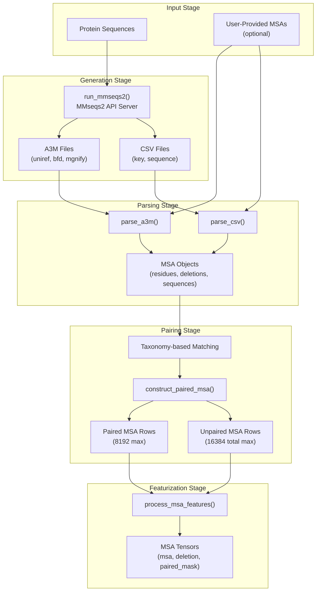
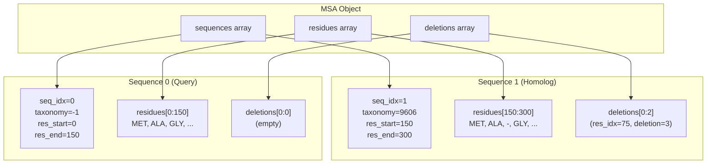
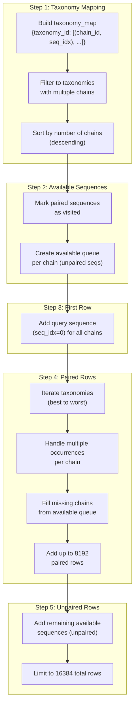
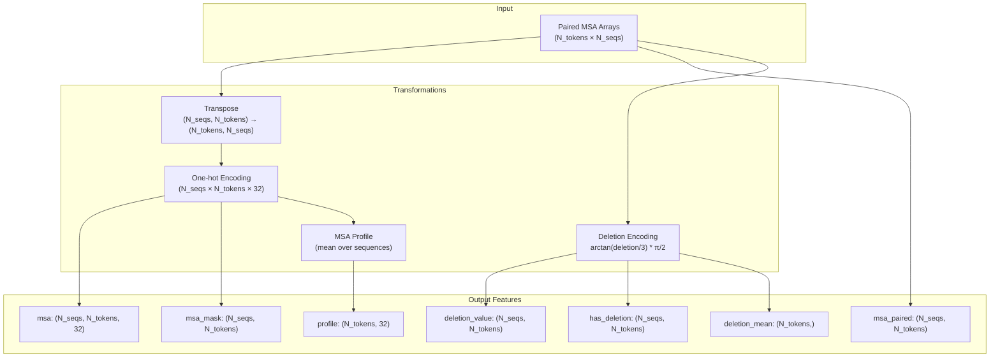
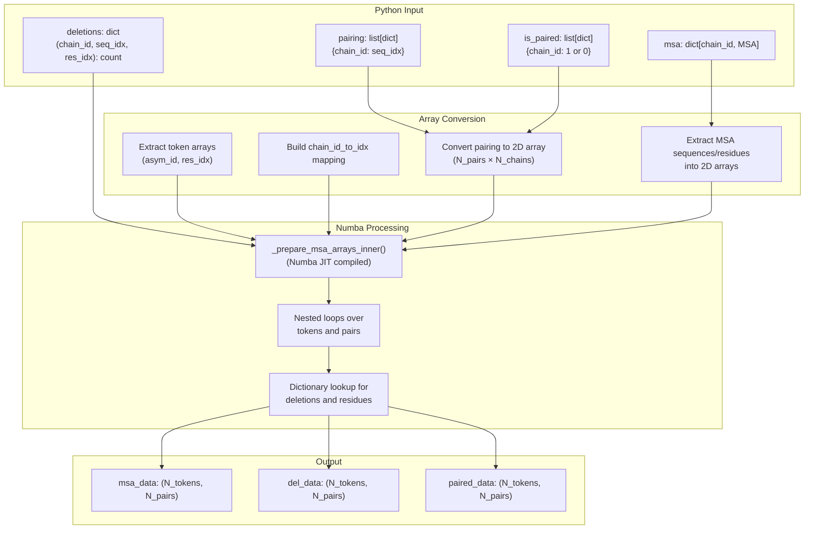

# MSA Processing

> **Relevant source files**
> * [examples/pocket.yaml](https://github.com/jwohlwend/boltz/blob/b1ebfc46/examples/pocket.yaml)
> * [scripts/process/msa.py](https://github.com/jwohlwend/boltz/blob/b1ebfc46/scripts/process/msa.py)
> * [src/boltz/data/feature/featurizer.py](https://github.com/jwohlwend/boltz/blob/b1ebfc46/src/boltz/data/feature/featurizer.py)
> * [src/boltz/data/feature/featurizerv2.py](https://github.com/jwohlwend/boltz/blob/b1ebfc46/src/boltz/data/feature/featurizerv2.py)
> * [src/boltz/data/filter/static/polymer.py](https://github.com/jwohlwend/boltz/blob/b1ebfc46/src/boltz/data/filter/static/polymer.py)
> * [src/boltz/data/parse/a3m.py](https://github.com/jwohlwend/boltz/blob/b1ebfc46/src/boltz/data/parse/a3m.py)

This page documents the Multiple Sequence Alignment (MSA) processing pipeline in Boltz, including MSA generation, taxonomy-based pairing algorithms, and the construction of paired/unpaired sequence features for the model.

MSAs provide evolutionary context that improves structure prediction accuracy. The Boltz system processes MSAs through several stages: generation via external tools, pairing of homologous sequences across chains, and conversion to model-ready feature tensors.

## MSA Processing Pipeline Overview

**MSA Processing Workflow**



Sources: [src/boltz/data/feature/featurizer.py L151-L334](https://github.com/jwohlwend/boltz/blob/b1ebfc46/src/boltz/data/feature/featurizer.py#L151-L334)

 [src/boltz/data/parse/a3m.py L11-L101](https://github.com/jwohlwend/boltz/blob/b1ebfc46/src/boltz/data/parse/a3m.py#L11-L101)

 [scripts/process/msa.py L35-L47](https://github.com/jwohlwend/boltz/blob/b1ebfc46/scripts/process/msa.py#L35-L47)

## MSA Data Structures

The Boltz system represents MSAs using structured NumPy arrays that efficiently encode sequence alignments, deletions, and metadata.

### MSA Schema Components

| Component | dtype | Fields | Purpose |
| --- | --- | --- | --- |
| `MSAResidue` | `np.dtype([('res_type', 'i8')])` | `res_type` | Residue type at each position (token ID) |
| `MSADeletion` | `np.dtype([('res_idx', 'i8'), ('deletion', 'i8')])` | `res_idx`, `deletion` | Deletion positions and counts |
| `MSASequence` | `np.dtype([...])` | `seq_idx`, `taxonomy`, `res_start`, `res_end`, `del_start`, `del_end` | Sequence metadata and array boundaries |

### MSA Class

The `MSA` dataclass aggregates these components and provides serialization:

```python
@dataclass(frozen=True)class MSA(NumpySerializable):    sequences: np.ndarray    # MSASequence dtype    deletions: np.ndarray    # MSADeletion dtype      residues: np.ndarray     # MSAResidue dtype
```

**MSA Storage Layout**



The `sequences` array contains metadata for each aligned sequence, with `res_start` and `res_end` indexing into the `residues` array, and `del_start` and `del_end` indexing into the `deletions` array. This flat representation enables efficient slicing and random access.

Sources: [src/boltz/data/types.py L449-L475](https://github.com/jwohlwend/boltz/blob/b1ebfc46/src/boltz/data/types.py#L449-L475)

 [src/boltz/data/parse/a3m.py L81-L93](https://github.com/jwohlwend/boltz/blob/b1ebfc46/src/boltz/data/parse/a3m.py#L81-L93)

## Taxonomy-Based MSA Pairing Algorithm

For multi-chain complexes, Boltz constructs a paired MSA where sequences from different chains that originate from the same organism are aligned in the same row. This provides co-evolutionary signal that improves interface prediction.

### Pairing Algorithm Overview

The `construct_paired_msa()` function implements the pairing logic:

**Taxonomy-Based Pairing Process**



### Pairing Logic Details

The algorithm maintains three key data structures:

1. **taxonomy_map**: Maps taxonomy IDs to sequences [src/boltz/data/feature/featurizer.py L190-L197](https://github.com/jwohlwend/boltz/blob/b1ebfc46/src/boltz/data/feature/featurizer.py#L190-L197)
2. **pairing**: List of dictionaries mapping chains to sequence indices [src/boltz/data/feature/featurizer.py L219-L223](https://github.com/jwohlwend/boltz/blob/b1ebfc46/src/boltz/data/feature/featurizer.py#L219-L223)
3. **is_paired**: List of dictionaries indicating pairing status [src/boltz/data/feature/featurizer.py L218-L222](https://github.com/jwohlwend/boltz/blob/b1ebfc46/src/boltz/data/feature/featurizer.py#L218-L222)

### Handling Multiple Occurrences

When a taxonomy has multiple sequences from the same chain, the algorithm creates multiple pairing rows by rolling over the sequence indices using modulo arithmetic:

```css
# From construct_paired_msa in featurizer.pyfor i in range(max_occurence):    row_pairing = {}    row_is_paired = {}    for c in chain_ids:        seq_idxs = group.get(c, [])        if len(seq_idxs) > 0:            row_pairing[c] = seq_idxs[i % len(seq_idxs)]            row_is_paired[c] = 1        ...
```

Sources: [src/boltz/data/feature/featurizer.py L151-L334](https://github.com/jwohlwend/boltz/blob/b1ebfc46/src/boltz/data/feature/featurizer.py#L151-L334)

 [src/boltz/data/feature/featurizerv2.py L214-L448](https://github.com/jwohlwend/boltz/blob/b1ebfc46/src/boltz/data/feature/featurizerv2.py#L214-L448)

## Dummy MSA Creation

When no MSA is available for a chain (e.g., for non-polymer tokens or when MSA generation is disabled), Boltz creates a dummy MSA containing only the query sequence.

### dummy_msa() Function

The `dummy_msa()` function creates a minimal valid MSA:

```python
def dummy_msa(residues: np.ndarray) -> MSA:    """Create a dummy MSA for a chain."""    residues = [res["res_type"] for res in residues]    deletions = []    sequences = [(0, -1, 0, len(residues), 0, 0)]    return MSA(        residues=np.array(residues, dtype=MSAResidue),        deletions=np.array(deletions, dtype=MSADeletion),        sequences=np.array(sequences, dtype=MSASequence),    )
```

During the pairing process, chains without MSAs are automatically assigned a dummy MSA constructed from their structure residues [src/boltz/data/feature/featurizer.py L181-L187](https://github.com/jwohlwend/boltz/blob/b1ebfc46/src/boltz/data/feature/featurizer.py#L181-L187)

Sources: [src/boltz/data/feature/featurizer.py L127-L148](https://github.com/jwohlwend/boltz/blob/b1ebfc46/src/boltz/data/feature/featurizer.py#L127-L148)

 [src/boltz/data/feature/featurizerv2.py L190-L211](https://github.com/jwohlwend/boltz/blob/b1ebfc46/src/boltz/data/feature/featurizerv2.py#L190-L211)

## MSA Feature Tensor Construction

The final step converts paired MSA data into model-ready tensors.

### Feature Computation

The pipeline performs several transformations, including one-hot encoding and deletion value normalization:

**MSA Feature Pipeline**



### Deletion Encoding

Deletions are encoded using an arctan transformation to bound the values:
`deletion = np.pi / 2 * np.arctan(deletion / 3)` [src/boltz/data/feature/featurizer.py L927](https://github.com/jwohlwend/boltz/blob/b1ebfc46/src/boltz/data/feature/featurizer.py#L927-L927)

Sources: [src/boltz/data/feature/featurizer.py L894-L966](https://github.com/jwohlwend/boltz/blob/b1ebfc46/src/boltz/data/feature/featurizer.py#L894-L966)

 [src/boltz/data/feature/featurizerv2.py L1098-L1160](https://github.com/jwohlwend/boltz/blob/b1ebfc46/src/boltz/data/feature/featurizerv2.py#L1098-L1160)

## Numba-Optimized MSA Array Preparation

To efficiently construct MSA feature arrays from pairing dictionaries, Boltz uses a Numba JIT-compiled inner function `_prepare_msa_arrays_inner`.

### prepare_msa_arrays() Function

The `prepare_msa_arrays()` function converts Python dictionaries into contiguous NumPy arrays suitable for Numba processing:

**Array Preparation Process**



The JIT compilation provides significant speedup for the nested loop over tokens and sequence pairs, which can involve millions of iterations for large MSAs.

Sources: [src/boltz/data/feature/featurizer.py L337-L458](https://github.com/jwohlwend/boltz/blob/b1ebfc46/src/boltz/data/feature/featurizer.py#L337-L458)

 [src/boltz/data/feature/featurizerv2.py L451-L572](https://github.com/jwohlwend/boltz/blob/b1ebfc46/src/boltz/data/feature/featurizerv2.py#L451-L572)

## Processing Pipeline Types

The system defines aggregate types for different processing stages, such as `Target`, `Input`, and `Tokenized`.

| Type | Purpose |
| --- | --- |
| `Target` | Raw parsed data from YAML/FASTA [src/boltz/data/types.py L641-L654](https://github.com/jwohlwend/boltz/blob/b1ebfc46/src/boltz/data/types.py#L641-L654) |
| `Input` | Processing-ready data including parsed MSAs [src/boltz/data/types.py L657-L670](https://github.com/jwohlwend/boltz/blob/b1ebfc46/src/boltz/data/types.py#L657-L670) |
| `Tokenized` | ML-ready data with tokenized representations [src/boltz/data/types.py L673-L708](https://github.com/jwohlwend/boltz/blob/b1ebfc46/src/boltz/data/types.py#L673-L708) |

Sources: [src/boltz/data/types.py L641-L708](https://github.com/jwohlwend/boltz/blob/b1ebfc46/src/boltz/data/types.py#L641-L708)