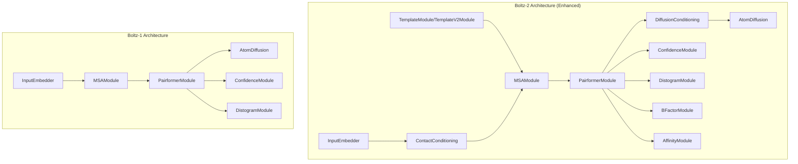
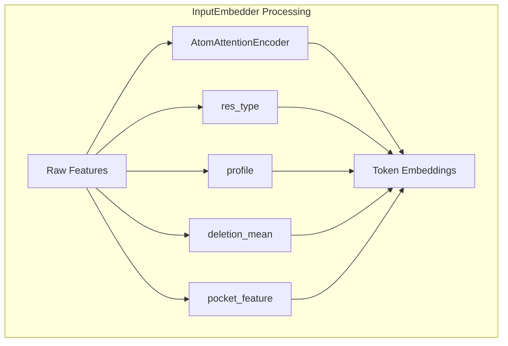
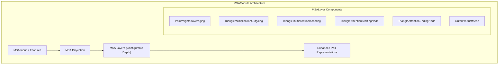
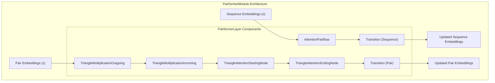
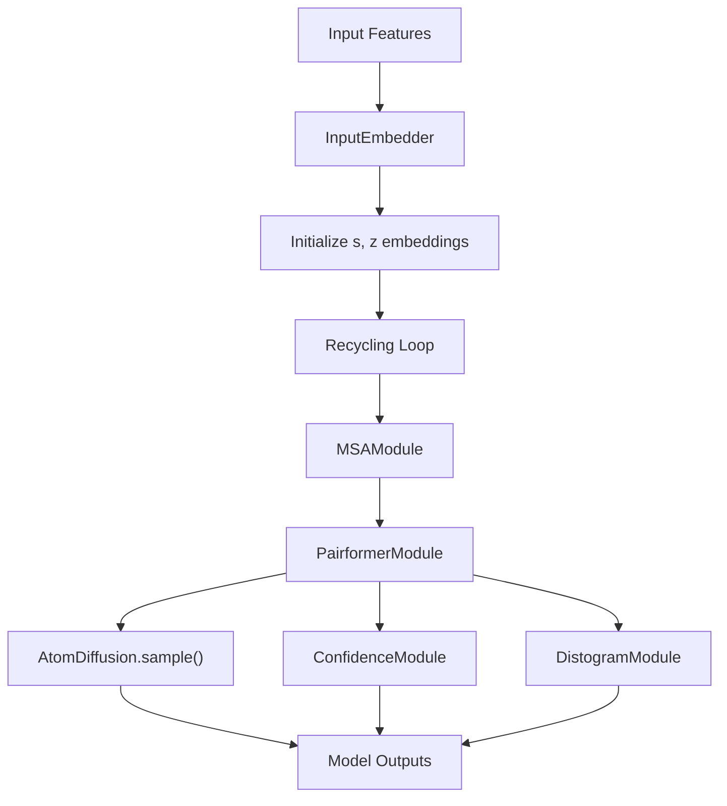
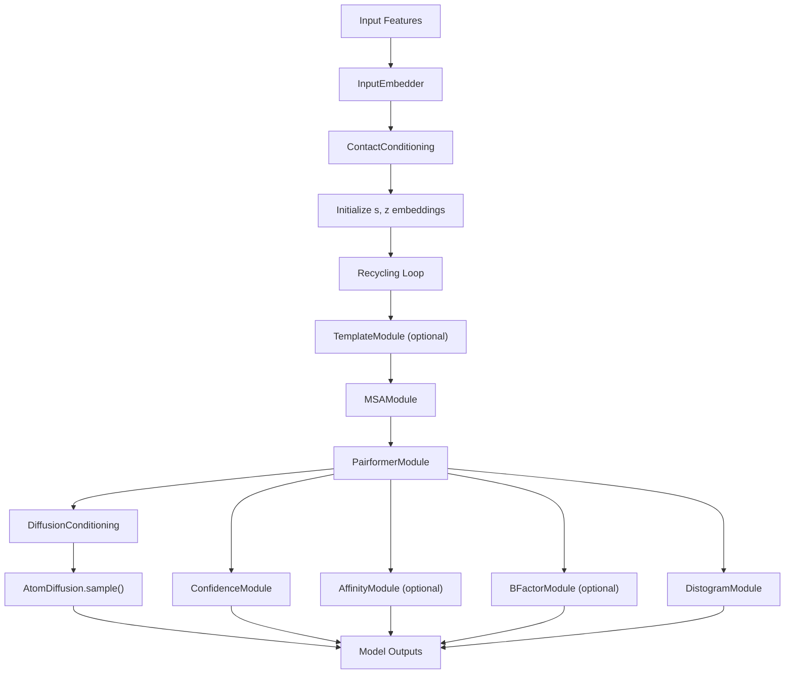

# Model Architecture

> **Relevant source files**
> * [src/boltz/data/const.py](https://github.com/jwohlwend/boltz/blob/b1ebfc46/src/boltz/data/const.py)
> * [src/boltz/model/models/boltz1.py](https://github.com/jwohlwend/boltz/blob/b1ebfc46/src/boltz/model/models/boltz1.py)
> * [src/boltz/model/models/boltz2.py](https://github.com/jwohlwend/boltz/blob/b1ebfc46/src/boltz/model/models/boltz2.py)
> * [src/boltz/model/modules/trunk.py](https://github.com/jwohlwend/boltz/blob/b1ebfc46/src/boltz/model/modules/trunk.py)
> * [src/boltz/model/modules/utils.py](https://github.com/jwohlwend/boltz/blob/b1ebfc46/src/boltz/model/modules/utils.py)

This document provides a comprehensive overview of the Boltz model architectures, focusing on the neural network design and data flow patterns. For information about training procedures, see [Training System](/jwohlwend/boltz/5-training-system). For details about the prediction pipeline usage, see [Prediction Pipeline](/jwohlwend/boltz/2-prediction-pipeline).

## Architecture Overview

The Boltz system implements two main model architectures: **Boltz-1** and **Boltz-2**. Both models follow a similar core design pattern but Boltz-2 includes significant enhancements for advanced structure prediction, confidence estimation, and binding affinity prediction.

### Boltz-1 vs Boltz-2 Comparison

**Sources:** [src/boltz/model/models/boltz1.py L40-L80](https://github.com/jwohlwend/boltz/blob/b1ebfc46/src/boltz/model/models/boltz1.py#L40-L80)

 [src/boltz/model/models/boltz2.py L41-L108](https://github.com/jwohlwend/boltz/blob/b1ebfc46/src/boltz/model/models/boltz2.py#L41-L108)

## Core Model Classes

The model architectures are implemented as PyTorch Lightning modules:

| Model Class | File Location | Primary Purpose |
| --- | --- | --- |
| `Boltz1` | [src/boltz/model/models/boltz1.py L40](https://github.com/jwohlwend/boltz/blob/b1ebfc46/src/boltz/model/models/boltz1.py#L40-L40) | Basic structure prediction with confidence estimation |
| `Boltz2` | [src/boltz/model/models/boltz2.py L41](https://github.com/jwohlwend/boltz/blob/b1ebfc46/src/boltz/model/models/boltz2.py#L41-L41) | Enhanced structure prediction with affinity, templates, and advanced features |

Both classes inherit from `LightningModule` and implement the standard PyTorch Lightning training/validation/prediction workflow. For details on Boltz-1 components, see [Boltz-1 Model](/jwohlwend/boltz/3.1-boltz-1-model). For Boltz-2 specific enhancements, see [Boltz-2 Model](/jwohlwend/boltz/3.2-boltz-2-model).

**Sources:** [src/boltz/model/models/boltz1.py L40](https://github.com/jwohlwend/boltz/blob/b1ebfc46/src/boltz/model/models/boltz1.py#L40-L40)

 [src/boltz/model/models/boltz2.py L41](https://github.com/jwohlwend/boltz/blob/b1ebfc46/src/boltz/model/models/boltz2.py#L41-L41)

## Input Processing Pipeline

### InputEmbedder Module

The `InputEmbedder` class processes raw molecular features into token-level embeddings that feed into the trunk modules. It utilizes an `AtomAttentionEncoder` to aggregate atomic features into residue/token representations.

The embedder concatenates atom-level features with residue-level features like `res_type` and `profile` to create comprehensive token representations [src/boltz/model/modules/trunk.py L98-L113](https://github.com/jwohlwend/boltz/blob/b1ebfc46/src/boltz/model/modules/trunk.py#L98-L113)

**Sources:** [src/boltz/model/modules/trunk.py L24-L114](https://github.com/jwohlwend/boltz/blob/b1ebfc46/src/boltz/model/modules/trunk.py#L24-L114)

### Boltz-2 Enhanced Input Processing

Boltz-2 includes additional input conditioning modules to support templates and constraints:

* **ContactConditioning**: Encodes distance-based contact information between molecular components [src/boltz/model/models/boltz2.py L204-L211](https://github.com/jwohlwend/boltz/blob/b1ebfc46/src/boltz/model/models/boltz2.py#L204-L211)
* **TemplateModule / TemplateV2Module**: Processes structural template information for improved prediction accuracy [src/boltz/model/models/boltz2.py L217-L235](https://github.com/jwohlwend/boltz/blob/b1ebfc46/src/boltz/model/models/boltz2.py#L217-L235)

**Sources:** [src/boltz/model/models/boltz2.py L204-L235](https://github.com/jwohlwend/boltz/blob/b1ebfc46/src/boltz/model/models/boltz2.py#L204-L235)

## Trunk Architecture

### MSAModule

The `MSAModule` processes multiple sequence alignment (MSA) information to enhance evolutionary context. It uses a series of `MSALayer` blocks containing triangular attention and multiplication mechanisms.

**Sources:** [src/boltz/model/modules/trunk.py L116-L205](https://github.com/jwohlwend/boltz/blob/b1ebfc46/src/boltz/model/modules/trunk.py#L116-L205)

 [src/boltz/model/modules/trunk.py L292-L421](https://github.com/jwohlwend/boltz/blob/b1ebfc46/src/boltz/model/modules/trunk.py#L292-L421)

### PairformerModule

The `PairformerModule` implements the core transformer-like processing for both sequence and pair representations. It updates the single representation `s` and pair representation `z` through iterative layers. For a deep dive into these layers, see [Attention and Transformer Layers](/jwohlwend/boltz/3.3-attention-and-transformer-layers).

**Sources:** [src/boltz/model/modules/trunk.py L424-L653](https://github.com/jwohlwend/boltz/blob/b1ebfc46/src/boltz/model/modules/trunk.py#L424-L653)

## Output Modules

### Structure Prediction

Both models use `AtomDiffusion` for structure prediction, implementing a generative diffusion approach to generate 3D coordinates. For details on noise schedules and sampling, see [Diffusion Process](/jwohlwend/boltz/3.4-diffusion-process).

* **Boltz-1**: Direct structure prediction from trunk representations [src/boltz/model/models/boltz1.py L213-L227](https://github.com/jwohlwend/boltz/blob/b1ebfc46/src/boltz/model/models/boltz1.py#L213-L227)
* **Boltz-2**: Enhanced with `DiffusionConditioning` module for improved guidance during the sampling process [src/boltz/model/models/boltz2.py L252-L285](https://github.com/jwohlwend/boltz/blob/b1ebfc46/src/boltz/model/models/boltz2.py#L252-L285)

**Sources:** [src/boltz/model/models/boltz1.py L213-L227](https://github.com/jwohlwend/boltz/blob/b1ebfc46/src/boltz/model/models/boltz1.py#L213-L227)

 [src/boltz/model/models/boltz2.py L252-L285](https://github.com/jwohlwend/boltz/blob/b1ebfc46/src/boltz/model/models/boltz2.py#L252-L285)

### Confidence Prediction

The `ConfidenceModule` predicts various confidence metrics like pLDDT and PAE. For details on score interpretation, see [Confidence Prediction](/jwohlwend/boltz/3.5-confidence-prediction).

* **pLDDT**: Per-residue confidence scores.
* **PAE**: Predicted Aligned Error between residue pairs.
* **PDE**: Predicted Distance Error.

**Sources:** [src/boltz/model/models/boltz1.py L234-L256](https://github.com/jwohlwend/boltz/blob/b1ebfc46/src/boltz/model/models/boltz1.py#L234-L256)

 [src/boltz/model/models/boltz2.py L304-L319](https://github.com/jwohlwend/boltz/blob/b1ebfc46/src/boltz/model/models/boltz2.py#L304-L319)

### Boltz-2 Exclusive Modules

#### AffinityModule

Predicts binding affinity between molecular components. It can be configured as a single module or an ensemble [src/boltz/model/models/boltz2.py L321-L349](https://github.com/jwohlwend/boltz/blob/b1ebfc46/src/boltz/model/models/boltz2.py#L321-L349)

 For details, see [Affinity Prediction](/jwohlwend/boltz/3.6-affinity-prediction).

#### BFactorModule

Predicts B-factor values for atomic flexibility estimation [src/boltz/model/models/boltz2.py L290-L292](https://github.com/jwohlwend/boltz/blob/b1ebfc46/src/boltz/model/models/boltz2.py#L290-L292)

#### Physical Guidance

Boltz-2 supports physical guidance and potentials to enforce constraints. For details, see [Physical Guidance and Potentials](/jwohlwend/boltz/3.7-physical-guidance-and-potentials).

**Sources:** [src/boltz/model/models/boltz2.py L290-L349](https://github.com/jwohlwend/boltz/blob/b1ebfc46/src/boltz/model/models/boltz2.py#L290-L349)

## Model Forward Pass

### Boltz-1 Forward Flow

**Sources:** [src/boltz/model/models/boltz1.py L272-L400](https://github.com/jwohlwend/boltz/blob/b1ebfc46/src/boltz/model/models/boltz1.py#L272-L400)

### Boltz-2 Forward Flow

**Sources:** [src/boltz/model/models/boltz2.py L401-L722](https://github.com/jwohlwend/boltz/blob/b1ebfc46/src/boltz/model/models/boltz2.py#L401-L722)

## Key Architectural Differences

| Feature | Boltz-1 | Boltz-2 |
| --- | --- | --- |
| Template Processing | ❌ | ✅ `TemplateModule`/`TemplateV2Module` |
| Contact Conditioning | ❌ | ✅ `ContactConditioning` |
| Diffusion Conditioning | ❌ | ✅ `DiffusionConditioning` |
| Affinity Prediction | ❌ | ✅ `AffinityModule` |
| B-Factor Prediction | ❌ | ✅ `BFactorModule` |
| Ensemble Affinity | ❌ | ✅ Optional dual `AffinityModule` |

**Sources:** [src/boltz/model/models/boltz1.py L43-L80](https://github.com/jwohlwend/boltz/blob/b1ebfc46/src/boltz/model/models/boltz1.py#L43-L80)

 [src/boltz/model/models/boltz2.py L44-L108](https://github.com/jwohlwend/boltz/blob/b1ebfc46/src/boltz/model/models/boltz2.py#L44-L108)