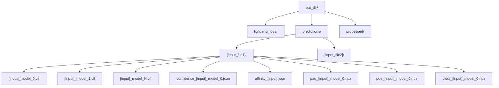
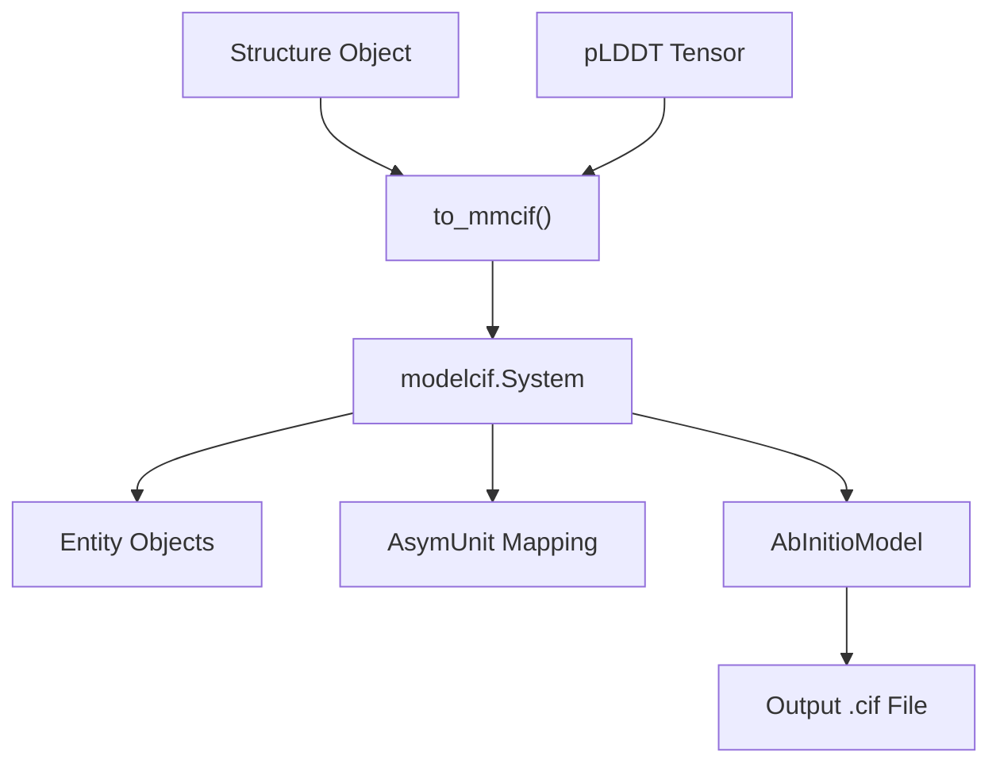
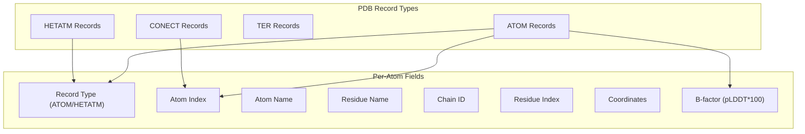
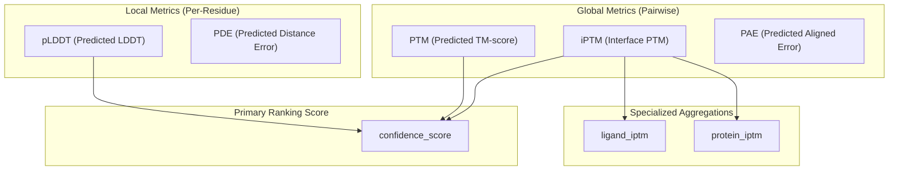
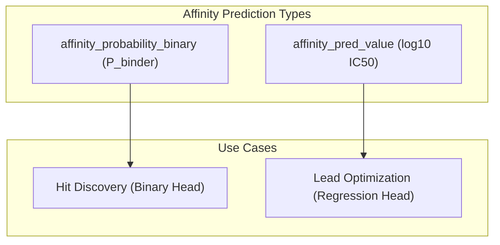
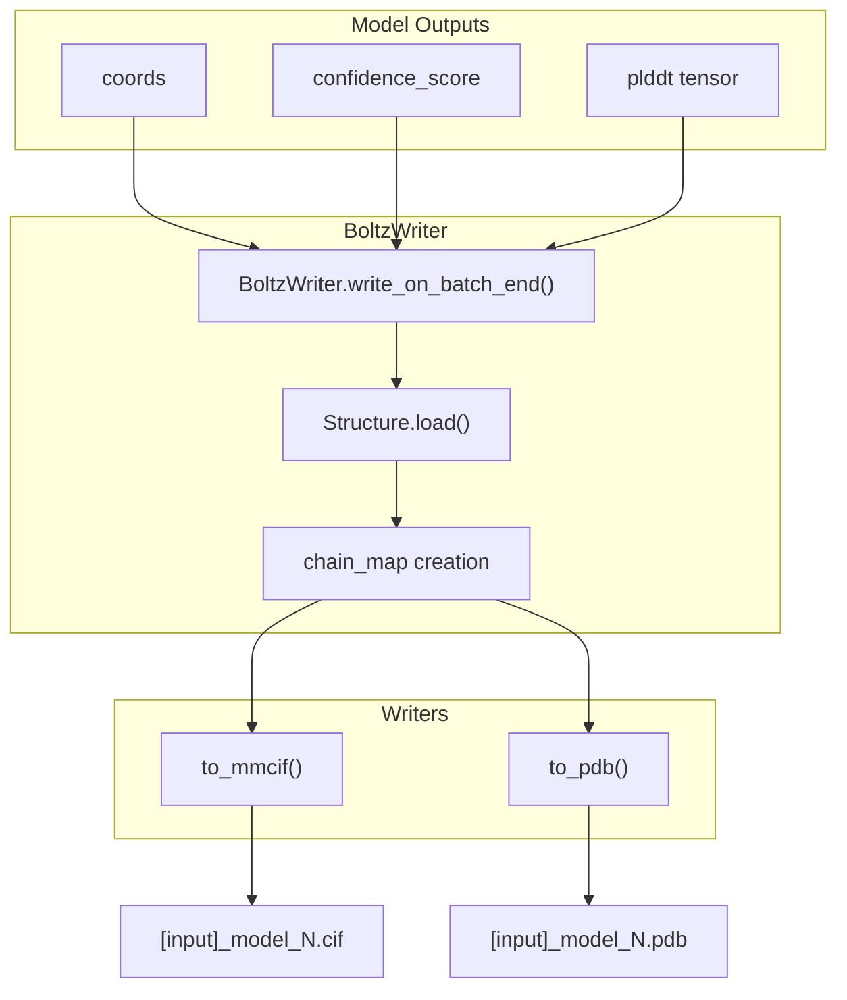

# Output Formats and Interpretation

> **Relevant source files**
> * [docs/prediction.md](https://github.com/jwohlwend/boltz/blob/b1ebfc46/docs/prediction.md?plain=1)
> * [src/boltz/data/parse/pdb.py](https://github.com/jwohlwend/boltz/blob/b1ebfc46/src/boltz/data/parse/pdb.py)
> * [src/boltz/data/write/mmcif.py](https://github.com/jwohlwend/boltz/blob/b1ebfc46/src/boltz/data/write/mmcif.py)
> * [src/boltz/data/write/pdb.py](https://github.com/jwohlwend/boltz/blob/b1ebfc46/src/boltz/data/write/pdb.py)
> * [src/boltz/data/write/utils.py](https://github.com/jwohlwend/boltz/blob/b1ebfc46/src/boltz/data/write/utils.py)
> * [src/boltz/data/write/writer.py](https://github.com/jwohlwend/boltz/blob/b1ebfc46/src/boltz/data/write/writer.py)
> * [src/boltz/model/modules/confidence_utils.py](https://github.com/jwohlwend/boltz/blob/b1ebfc46/src/boltz/model/modules/confidence_utils.py)

This page documents the output files generated by Boltz predictions, their formats, and how to interpret the various confidence and affinity metrics. This covers the final stage of the prediction pipeline where model outputs are written to disk and structured for downstream use.

For information about running predictions and configuring output options, see [Command-Line Interface](https://github.com/jwohlwend/boltz/blob/b1ebfc46/Command-Line Interface)

 For details about the model architectures that generate these predictions, see [Model Architecture](https://github.com/jwohlwend/boltz/blob/b1ebfc46/Model Architecture)

## Overview

After running `boltz predict`, the system generates a structured output directory containing:

1. **Structure files** - Predicted 3D coordinates in mmCIF or PDB format.
2. **Confidence metrics** - Per-residue and global quality scores in JSON and NPZ formats.
3. **Affinity predictions** - Binding strength predictions for protein-ligand complexes (Boltz-2 only).

Multiple samples are generated per prediction (default: 5 for affinity, 1 otherwise) and ranked by confidence score. All outputs are organized into subdirectories by input file name.

**Sources:** [docs/prediction.md L174-L196](https://github.com/jwohlwend/boltz/blob/b1ebfc46/docs/prediction.md?plain=1#L174-L196)

 [src/boltz/data/write/writer.py L73-L80](https://github.com/jwohlwend/boltz/blob/b1ebfc46/src/boltz/data/write/writer.py#L73-L80)

## Output Directory Structure

The prediction outputs follow a hierarchical organization:

| Directory | Purpose |
| --- | --- |
| `predictions/` | Contains subdirectories for each input file with structure and metric files. |
| `predictions/[input]/` | Individual prediction results, with multiple samples ranked by confidence. |
| `processed/` | Cached preprocessed data used during inference. |
| `lightning_logs/` | Training/evaluation logs (if applicable). |

The number of structure files (`_model_0.cif`, `_model_1.cif`, etc.) is controlled by the `--diffusion_samples` flag.

**Sources:** [docs/prediction.md L174-L196](https://github.com/jwohlwend/boltz/blob/b1ebfc46/docs/prediction.md?plain=1#L174-L196)

 [src/boltz/data/write/writer.py L150-L161](https://github.com/jwohlwend/boltz/blob/b1ebfc46/src/boltz/data/write/writer.py#L150-L161)

## Structure File Formats

### mmCIF Format

The default output format is mmCIF (Macromolecular Crystallographic Information File), generated by the `to_mmcif` function. This format provides rich metadata and is preferred for modern structural bioinformatics.

Key features of the mmCIF output:

* **Entity definitions** - Unique molecular entities with sequence information [src/boltz/data/write/mmcif.py L63-L97](https://github.com/jwohlwend/boltz/blob/b1ebfc46/src/boltz/data/write/mmcif.py#L63-L97)
* **Asymmetric units** - Chain instances mapped to entities [src/boltz/data/write/mmcif.py L104-L123](https://github.com/jwohlwend/boltz/blob/b1ebfc46/src/boltz/data/write/mmcif.py#L104-L123)
* **Atomic coordinates** - Full 3D coordinates derived from the diffusion process [src/boltz/data/write/mmcif.py L161-L162](https://github.com/jwohlwend/boltz/blob/b1ebfc46/src/boltz/data/write/mmcif.py#L161-L162)
* **pLDDT scores** - Embedded in the `_LocalPLDDT` record and B-factor field [src/boltz/data/write/mmcif.py L126-L130](https://github.com/jwohlwend/boltz/blob/b1ebfc46/src/boltz/data/write/mmcif.py#L126-L130)
* **Chemical component** - Residue types from standard dictionaries (PDB CCD) [src/boltz/data/write/mmcif.py L69-L83](https://github.com/jwohlwend/boltz/blob/b1ebfc46/src/boltz/data/write/mmcif.py#L69-L83)

The writer handles different molecule types appropriately:

* Proteins: `ihm.LPeptideAlphabet` [src/boltz/data/write/mmcif.py L70](https://github.com/jwohlwend/boltz/blob/b1ebfc46/src/boltz/data/write/mmcif.py#L70-L70)
* DNA: `ihm.DNAAlphabet` [src/boltz/data/write/mmcif.py L73](https://github.com/jwohlwend/boltz/blob/b1ebfc46/src/boltz/data/write/mmcif.py#L73-L73)
* RNA: `ihm.RNAAlphabet` [src/boltz/data/write/mmcif.py L76](https://github.com/jwohlwend/boltz/blob/b1ebfc46/src/boltz/data/write/mmcif.py#L76-L76)
* Ligands: `ihm.NonPolymerChemComp` or `ihm.SaccharideChemComp` [src/boltz/data/write/mmcif.py L80-L83](https://github.com/jwohlwend/boltz/blob/b1ebfc46/src/boltz/data/write/mmcif.py#L80-L83)

**Sources:** [src/boltz/data/write/mmcif.py L17-L306](https://github.com/jwohlwend/boltz/blob/b1ebfc46/src/boltz/data/write/mmcif.py#L17-L306)

### PDB Format

PDB format can be selected with `--output_format pdb`. While widely supported, it lacks some metadata present in mmCIF.

Key characteristics:

* **Fixed-width columnar format** - 80 characters per line [src/boltz/data/write/pdb.py L171](https://github.com/jwohlwend/boltz/blob/b1ebfc46/src/boltz/data/write/pdb.py#L171-L171)
* **pLDDT in B-factor** - Confidence scores scaled to 0-100 [src/boltz/data/write/pdb.py L108-L111](https://github.com/jwohlwend/boltz/blob/b1ebfc46/src/boltz/data/write/pdb.py#L108-L111)
* **CONECT records** - Bond connectivity for ligands and inter-residue bonds [src/boltz/data/write/pdb.py L155-L167](https://github.com/jwohlwend/boltz/blob/b1ebfc46/src/boltz/data/write/pdb.py#L155-L167)
* **TER records** - Mark chain boundaries [src/boltz/data/write/pdb.py L146-L150](https://github.com/jwohlwend/boltz/blob/b1ebfc46/src/boltz/data/write/pdb.py#L146-L150)

The `to_pdb` function handles both Boltz-1 and Boltz-2 atom naming conventions through the `boltz2` flag [src/boltz/data/write/pdb.py L72-L90](https://github.com/jwohlwend/boltz/blob/b1ebfc46/src/boltz/data/write/pdb.py#L72-L90)

**Sources:** [src/boltz/data/write/pdb.py L11-L172](https://github.com/jwohlwend/boltz/blob/b1ebfc46/src/boltz/data/write/pdb.py#L11-L172)

## Confidence Metrics

### JSON Confidence File

Each sample includes a `confidence_[input]_model_N.json` file containing aggregated quality metrics.

**Sources:** [docs/prediction.md L198-L225](https://github.com/jwohlwend/boltz/blob/b1ebfc46/docs/prediction.md?plain=1#L198-L225)

 [src/boltz/data/write/writer.py L184-L210](https://github.com/jwohlwend/boltz/blob/b1ebfc46/src/boltz/data/write/writer.py#L184-L210)

### Confidence Score Types

| Metric | Range | Interpretation |
| --- | --- | --- |
| `confidence_score` | [0, 1] | Higher = better overall quality. Used for **ranking samples**. |
| `plddt` | [0, 1] | Higher = more accurate local structure. |
| `ptm` | [0, 1] | Higher = better global fold. |
| `iptm` | [0, 1] | Higher = better interface prediction. |
| `pde` | Angstroms | Lower = more confident distances. |
| `ligand_iptm` | [0, 1] | Protein-ligand interface quality. |
| `protein_iptm` | [0, 1] | Protein-protein interface quality. |

**Score Interpretation Guidelines:**

* **pLDDT > 90**: Very high confidence.
* **pLDDT 70-90**: High confidence.
* **PTM/iPTM > 0.8**: High confidence prediction.

**Sources:** [docs/prediction.md L198-L227](https://github.com/jwohlwend/boltz/blob/b1ebfc46/docs/prediction.md?plain=1#L198-L227)

 [src/boltz/model/modules/confidence_utils.py L57-L181](https://github.com/jwohlwend/boltz/blob/b1ebfc46/src/boltz/model/modules/confidence_utils.py#L57-L181)

### NPZ Metric Files

For detailed analysis, per-token metrics are saved as NumPy arrays:

| File | Content | Shape | Units |
| --- | --- | --- | --- |
| `plddt_[input]_model_N.npz` | Per-token pLDDT scores | `(num_tokens,)` | [0, 1] |
| `pae_[input]_model_N.npz` | Predicted Aligned Error matrix | `(num_tokens, num_tokens)` | Angstroms |
| `pde_[input]_model_N.npz` | Predicted Distance Error matrix | `(num_tokens, num_tokens)` | Angstroms |

**Sources:** [docs/prediction.md L186-L189](https://github.com/jwohlwend/boltz/blob/b1ebfc46/docs/prediction.md?plain=1#L186-L189)

 [src/boltz/data/write/writer.py L212-L230](https://github.com/jwohlwend/boltz/blob/b1ebfc46/src/boltz/data/write/writer.py#L212-L230)

## Affinity Predictions (Boltz-2)

When the `properties` field includes `affinity`, Boltz-2 generates an `affinity_[input].json` file.

### Interpreting Affinity Values

#### affinity_pred_value (Regression)

Reports binding affinity as **log₁₀(IC50)** where IC50 is in **micromolar (μM)**.

* **-3**: 1 nM (Strong binder)
* **0**: 1 μM (Moderate binder)
* **2**: 100 μM (Weak binder/Decoy)

**Sources:** [docs/prediction.md L244-L249](https://github.com/jwohlwend/boltz/blob/b1ebfc46/docs/prediction.md?plain=1#L244-L249)

 [src/boltz/data/write/writer.py L232-L246](https://github.com/jwohlwend/boltz/blob/b1ebfc46/src/boltz/data/write/writer.py#L232-L246)

#### affinity_probability_binary (Classification)

Predicts the **probability that a ligand is a binder** (vs. a decoy), ranging from 0 to 1.

* **> 0.8**: High confidence binder.
* **< 0.5**: Likely decoy.

**Sources:** [docs/prediction.md L240-L243](https://github.com/jwohlwend/boltz/blob/b1ebfc46/docs/prediction.md?plain=1#L240-L243)

 [README.md L52-L53](https://github.com/jwohlwend/boltz/blob/b1ebfc46/README.md?plain=1#L52-L53)

## Output Generation Pipeline

The following diagram shows how model predictions are transformed into output files via `BoltzWriter`.

**Sources:** [src/boltz/data/write/writer.py L49-L181](https://github.com/jwohlwend/boltz/blob/b1ebfc46/src/boltz/data/write/writer.py#L49-L181)

 [src/boltz/data/write/mmcif.py L17-L21](https://github.com/jwohlwend/boltz/blob/b1ebfc46/src/boltz/data/write/mmcif.py#L17-L21)

 [src/boltz/data/write/pdb.py L11-L15](https://github.com/jwohlwend/boltz/blob/b1ebfc46/src/boltz/data/write/pdb.py#L11-L15)

## Sample Ranking

Samples are ranked using the `confidence_score` [src/boltz/data/write/writer.py L74-L76](https://github.com/jwohlwend/boltz/blob/b1ebfc46/src/boltz/data/write/writer.py#L74-L76)

1. **Calculate Rank**: `torch.argsort` is applied to the `confidence_score` in descending order.
2. **Assign Rank**: An `idx_to_rank` mapping is created to associate internal batch indices with their quality rank [src/boltz/data/write/writer.py L76](https://github.com/jwohlwend/boltz/blob/b1ebfc46/src/boltz/data/write/writer.py#L76-L76)
3. **Filename**: The resulting files are named `[id]_model_[rank]`, where `model_0` is the highest confidence prediction [src/boltz/data/write/writer.py L159](https://github.com/jwohlwend/boltz/blob/b1ebfc46/src/boltz/data/write/writer.py#L159-L159)

**Sources:** [src/boltz/data/write/writer.py L74-L159](https://github.com/jwohlwend/boltz/blob/b1ebfc46/src/boltz/data/write/writer.py#L74-L159)